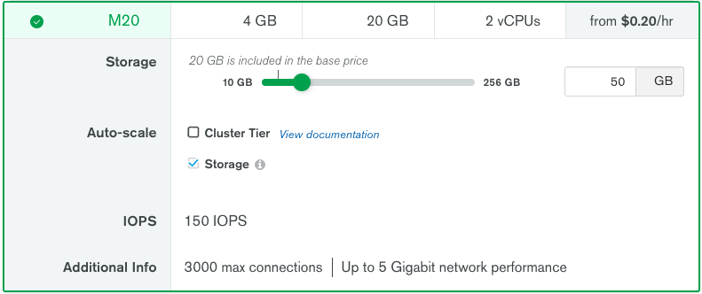
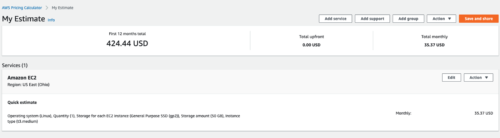
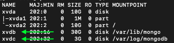
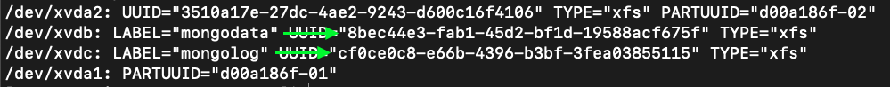

You’re probably hosting your MongoDB on a reliable cloud service provider say [Atlas](cloud.mongodb.com) for instance because you really want to focus on your idea and delegate all the subtle key management areas such as networking, storage, access, etc.

It all looks good initially until your small idea starts turning into a business and the cost starts skyrocketing. Even if that is not the case, this post will still give you a general overview of the technical complexities involved (and bucks saved!) if you were to migrate to a self-hosted solution.

BTW, how much savings are we talking about? Let’s do a quick comparison between an **Atlas** instance and a self-hosted MongoDB on **AWS**.

**Atlas (~$166/month)**


$0.23/hour based on the above-selected requirements (~ [cloud.mongodb.com](cloud.mongodb.com))

<br><br>**AWS (~$36/month)**


$0.0416/hour for the instance and additional pricing based on the EBS type and storage (~ [calculator.aws](calculator.aws))

> It is almost 4.5x savings just in terms of the infrastructure!

Now that you know the major why(s) and are still reading this post, without further ado, let’s dive into the tech.

<hr />

# Outline
1. Setting up the infrastructure
2. Setting up MongoDB
3. Bulk migration
4. Delta-sync to bridge the connection switch latency (not applicable to stale clusters)

Since the entire content can be a bit exhausting in one place, I’m going to divide this into 2 related posts.

<br><br>

# 1. Setting up the Infrastructure
I’m going to mention below the guide for setting up an instance running **RedHat Enterprise Linux 8** on AWS. This is because MongoDB generally performs better with the xfs file-system. [Here is an article to understand it better.](https://scalegrid.io/blog/xfs-vs-ext4-comparing-mongodb-performance-on-aws-ec2/)

## Spin up an EC2 Instance
I’ve used a `t3.small` instance that comes with **2 vCPUs** and **2Gb of RAM** albeit you can select any instance of your choice.
> It is recommended that your DB should have access to at least **1GB of RAM** and **2 real cores** as that directly affects the performance during caching & concurrency mechanisms as handled by the default engine [**WiredTiger**](https://docs.mongodb.com/manual/core/wiredtiger/). You can read more about the [**production notes related to the RAM and CPU requirements here**](https://docs.mongodb.com/manual/administration/production-notes/#allocate-sufficient-ram-and-cpu).

*Configuration Overview:*
- OS: **Redhat Enterprise Linux 8 (x64 intel-based)**
- Instance Type: **t3.small**
- Storage: **10GB**(os) + **30GB**(data) + **3GB**(logs) of **EBS** i.e. 3 separate volumes

I’m assuming that you’re familiar with creating a VM on AWS.

Now, once the instance is in running state, assign an **Elastic IP** to it and then simply do a remote login into the machine.
> We'll need the **Elastic IP** to setup public hostname for the instance
```bash
$ ssh -i <PEM_FILE> ec2-user@<ELASTIC_IP>
```

## Mount Additional Volumes
We have added 2 additional EBS volumes other than the Root FS for Data and Logs which are yet to be mounted (*Remember the 30Gb and 3Gb?*). You can list the volume blocks using,
```bash
$ sudo lsblk
```

The additional volumes will be listed right after the root block (refer to the arrows)



In the image above, you can see that the additional volumes are named
1. **xvdb** (30Gb space to store data)
2. **xvdc** (3Gb space to store logs)

Now, let’s create the file-systems in those volumes.
```bash
$ sudo mkfs.xfs -L mongodata /dev/xvdb
$ sudo mkfs.xfs -L mongologs /dev/xvdc
```
> `-L` is an alias option for setting the **volume label**

And then mount the volumes.
```bash
$ sudo mount -t xfs /dev/xvdb /var/lib/mongo
$ sudo mount -t xfs /dev/xvdc /var/log/mongodb
```

In order for these changes to reflect, the system must be rebooted. Hence, now we also need the partition persistence so that in case of an unintentional reboot we don’t lose the Database storage.

We can achieve this by specifying the mount rules in the fstab file. [You can read more about it here](https://geek-university.com/linux/etc-fstab-file/).

Before that let's copy the UUID of the above partitions(*because they are unique and won't change over a system restart*)
```bash
$ sudo blkid
```



Copy the UUIDs listed for **/dev/xvdb** and **/dev/xvdc**. Refer to the **“LABEL”** for block identification

Now open the `/etc/fstab` file and paste the configuration in the following format.
```bash
UUID=<COPIED_UUID_FOR_DATA> /var/lib/mongo xfs defaults,nofail 0 0
UUID=<COPIED_UUID_FOR_LOGS> /var/log/mongodb xfs defaults,nofail 0 0
```

## Update Hostname
The hostname will be used to identify your database server on the network. You can either use the above assigned **Elastic IP** or Domain name (if available). Open the `/etc/hostname` file and append the entry. For e.g.
```bash
ip-xx.us-east-2.compute.internal **<ELASTIC_IP> <DOMAIN_1> <DOMAIN_2>** ...
```

## Update the Process Limits (Optional)
This is optionally required in order to control the maximum number of acceptable connections while keeping the system stable.
Open the `/etc/security/limits.conf` file and add the following entries.
```bash
* soft nofile 64000
* hard nofile 64000
* soft nproc 32000
* hard nproc 32000
```

Now that all of the infra related prerequisites are sorted, **reboot** the instance, and let’s proceed to MongoDB installation.

<br><br><hr /><br><br>

# 1. Setting up MongoDB
## Add the Repo Source
Create a file `/etc/yum.repos.d/mongodb-org.4.2.repo` and add the following package repository details.
```bash
[mongodb-org-4.2]
name=MongoDB Repository
baseurl=https://repo.mongodb.org/yum/redhat/$releasever/mongodb-org/4.2/x86_64/
gpgcheck=1
enabled=1
gpgkey=https://www.mongodb.org/static/pgp/server-4.2.asc
```

Now let’s install MongoDB.
```bash
$ sudo yum -y install mongodb-org
```

## Create directories and setup permissions
MongoDB by default uses the following paths to store the data and the internal logs:

>**/var/lib/mongo** → Data<br>**/var/log/mongodb** → Logs

**Create the directories**
```bash
$ sudo mkdir /var/lib/mongo
$ sudo mkdir /var/log/mongodb
```

**Change user & group permissions**
```bash
$ sudo chown mongod:mongod /var/lib/mongo
$ sudo chown mongod:mongod /var/log/mongod
```

## Create an Admin User
The **mongod daemon/service** must be first running before we proceed to create a user.
Let’s use the default config(stored in `/etc/mongod.conf`) for now and start the daemon process.

```bash
$ sudo -u mongod mongod -f /etc/mongod.conf
```
The above command will start the mongod daemon in fork mode (default).

Now, let’s login to the server and create our first admin user.

**Open a mongo shell**
```bash
$ mongo
```

**Use the "admin" database to create the root-admin**
```bash
> use admin
```

**Create the admin user**
```bash
> db.createUser({user: "admin", pwd: "password", roles: [{role: "root", db: "admin"}]})
```

**Create a regular user**
```bash
> db.createUser({user: "normal_user", pwd: "password", roles: [{role: "readWriteAnyDatabase", db: "admin"}]})
```

**Shutdown the server for now. We'll restart again with the modified config**
```bash
> db.shutDownServer()
```

## Setting up Authentication
Here, we’ll enable the database authentication and modify the bind-address for our server to be accessible in the public domain.
Open `/etc/mongod.conf` and make the below changes.

```bash
# network interfaces
net:
  port: 27017
  bindIp: 0.0.0.0 # accessible on the network address
security:
  authorization: enabled # creds will be required for making db operations
```

Save the config and **restart** the server.
```bash
$ sudo -u mongod mongod -f /etc/mongod.conf
```

## Test Login
You can verify if the credentials work using,
```bash
$ mongo -u admin -p password
```

That is it about the initial setup! Please stay tuned for my next related post on the detailed migration process and tips on keeping the DB production-ready.

<br><br>
P.S. Thanks to [Piyush Kumar](https://twitter.com/MrEnvoy17) for helping curate this post!
