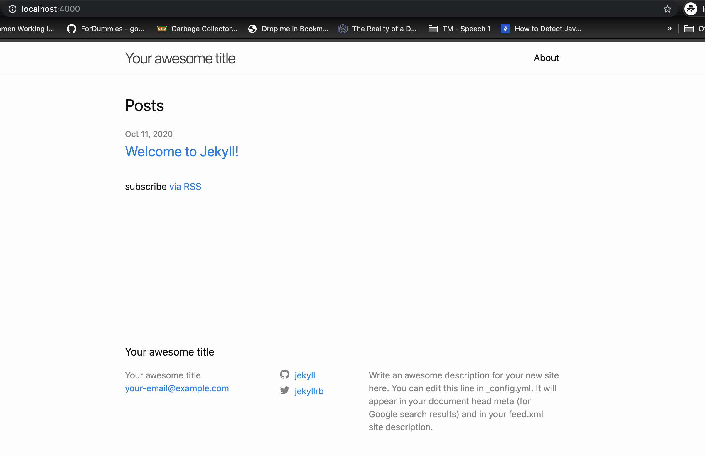
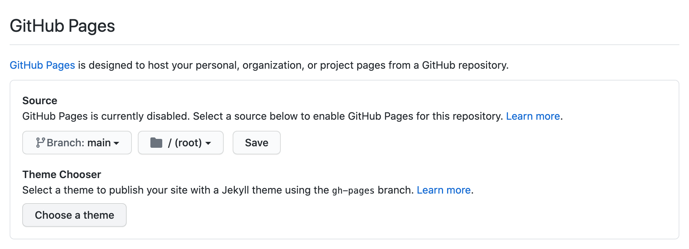
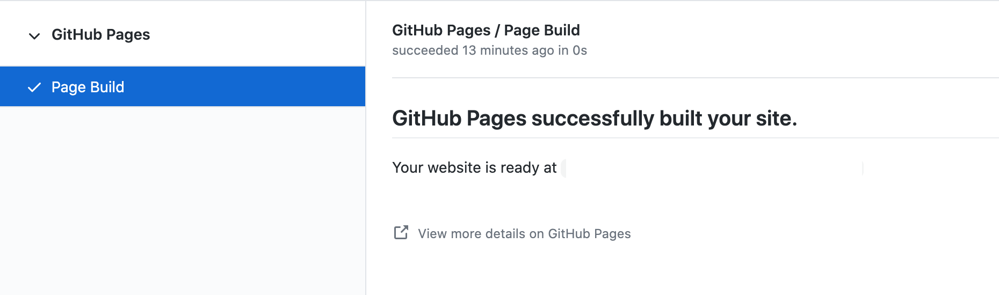

A blog let a person express his/her own thoughts and everyone craves to have his/her blog. Creating a blog is quite simple as of today. Open source softwares such as [wordpress](https://wordpress.com/), [jekyll](https://jekyllrb.com/), [hugo](https://gohugo.io/) can help you create & setup your blog. In this post, we are going to see about Jekyll and how to host it in Github for free.

## Create a brand new Jekyll blog
Install Jekyll using the instructions provided [here](https://jekyllrb.com/docs/installation/). You mainly need `ruby`, `ruby gems`, `gcc`, `make` as pre-requisite. Run the below commands to get a new blog up and running.
```sh
gem install jekyll bundler
jekyll new my-new-blog
cd my-new-blog
bundle exec jekyll serve
```
That's it. You can navigate to [`http://localhost:8080`](http://localhost:8080) and see your blog up and running like this



## Customizing the blog
As you see, the blog is bare minimum and the default values mentioned in the config file (`_config.yml`) are used. You can use the `_config.yml` file to add new plugins, provide metadata about the blog, add your social media profiles, modify themes etc. 

### Plugins
Some well known plugins to name a few are,
- [jekyll-sitemap](https://github.com/jekyll/jekyll-sitemap) - Plugin that generates sitemap for the blog
- [jekyll-admin](https://github.com/jekyll/jekyll-admin) - Plugin that provides an admin console to write the post
- [jekyll-seo-tag](https://github.com/jekyll/jekyll-seo-tag) - Plugin that adds metadata tags for search engines and social networks to better index and display your site's content.

You can know about other useful plugins [here](https://planetjekyll.github.io/plugins/top).

### Themes
[Minima](https://github.com/jekyll/minima) is the default theme for Jekyll. There are many [other](https://jekyll-themes.com/free/) themes that you can use too. It is possible to [customise](https://github.com/jekyll/minima#customizing-templates) the minima theme by adding your own css and html. Adding support for [comments](https://github.com/jekyll/minima#enabling-comments-via-disqus) using disqus is in-built. Also there is provision to enable [Google Analytics](https://github.com/jekyll/minima#enabling-google-analytics).

### Liquid templating
It need not be that all the contents in the blog has to be static. You can add dynamic content using [Liquid](https://shopify.github.io/liquid/) templating. Jekyll provides tag and filter option on [top of liquid](https://jekyllrb.com/docs/liquid/).

### Using custom domain name for the blog

You can specify your custom domain by adding a file called `CNAME` in the git repo as mentioned [here](https://docs.github.com/en/free-pro-team@latest/github/working-with-github-pages/about-custom-domains-and-github-pages).

## Hosting & deploying the blog with Github pages
Using your github account, create a new repository. Push the contents of the jekyll blog created above to the new repository. Go to the github project settings page, generally available in the url
`https://github.com/<github-id>/my-new-blog/settings`.
In the settings page, under the `Github pages` section, specify the branch to use for the github source. This can be the `main` branch or some other branch in the repository.



As soon as the github page is enabled on a branch, github automatically creates actions to build the jeyll blog, on a new commit to the branch.



## Advantages of using Jekyll & Github pages
- Open source
- Free hosting by Github, though there is some restriction as mentioned [here](https://docs.github.com/en/free-pro-team@latest/github/working-with-github-pages/about-github-pages#usage-limits). But the restriction would be more than enough for personal websites and for getting started with a blog
- You don't need to be a html or css expert to get started. The blog posts are written with markdown. One can even use online markdown editor such as [Dillinger](http://dillinger.io/).
- It is faster as there is no database and the content is mostly static
- You can use your own domain name or use the free github.io subdomain
- Free SSL support
- Version control for your blog, out of the box since the blog is on Github. Easy collabration(new blog posts or site changes) using github pull requests.
- You can use Github actions and even update your site content dynamically. The jekyll blog need not be dynamic after all. For example, you can run a python script in a github action as a cron and update the pages in your blog daily/hourly
- Plugin ecosystem is awesome. You can add [plugins](https://jekyllrb.com/docs/plugins/) or you can even write your own plugins, and get additional functionalities to your blog.

## When not to use Jekyll
- If you are not familiar with git or a person who is not a developer, setting up and customising jekyll may be a bit tough for you. You can look at wordpress or blogger, where all the things are get done using UI. 

- You don't know much about blogging and looking for a ready-made solution, jekyll may not be a right fit. 
It is always nice to have someone, hold your back. Lets get started with blogging using Jekyll & Github pages.

Happy blogging!!