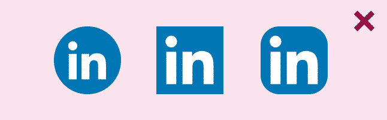

I am here to tell you that Facebook, Google, Twitter, or LinkedIn aren’t going to be happy when they find out that you changed their icon color to green. But, hey at least you didn’t distort the logo.

Hello and welcome to another segment of me telling you things that you need to know but will ignore at some point. Let’s get started.

Social Login and Social Sharing are everywhere. Some people even combine it with with their User Registration. There’s no surprise that on every website you go to, you’ll see either well designed social icons or just plain ugliness. We can’t blame them, they want their icons to be unique and eye catching.

_Beauty!_

But, the universe is full of holes inside an “A” whom sometimes destroy a thing of beauty.

_Just. Stop!_

Then there’s the “I use my own brand color” kind of people.

_So, what’s happening here? What’s the orange f? Does that stands for forangebook? \*badum tsss\* I’ll see myself out._

Changing the branding color is a big no no for them. You’ll be surprised how strict those social branding guidelines can be. Yet, we still violate them.

One thing we need to realize is, we don’t own these icons. The companies still own them. So, for your convenience I searched the interwebs to gather most of the things you need to remember for social network branding guidelines.

Let’s start with the most used social network, [Facebook and their “ f ” logo](https://en.facebookbrand.com/guidelines/brand). They’re pretty straightforward, as long as you don’t modify the “ f ” logo’s design and color, you’re good to go. To simplify this more; don’t make the facebook logo look like it’s been scratched by a chicken and made it bleed too much that it turns red.

_Quick, somebody call 911!_

[Twitter branding](https://about.twitter.com/press/twitter-brand-policy) is a little bit complicated. Probably because they had multiple drastic changes in their logo design.

 

  Nonetheless, it’s simple.

- Don’t use their old logo (because, let’s face it, it’s ugly).
- Don’t use a speech bubble (because that’s so 1995)
- Don’t rotate the logo (because the bird might get dizzy)
- Don’t surround with other birds or creatures (he’s a lonebird)
- And the most obvious one, the color. (Use **#55ACEE**)

On Google+ (yes “ + “ not “plus“), they prefer that you don’t change or remake their icon. But if you must, you can style it to match your design, as long as you don’t...

- Change the color (Use **#dd4b39**)
- Change the font of the “g” and reposition the “+”
- Reposition the icon (it must be centred)

If you’re using the icon with the title, You should use “Google” without the plus (word and sign), because… well… that’s redundant.

LinkedIn is kind of ridiculous with their [branding guidelines](https://brand.linkedin.com/en-us). They still have the same drill with no distorting or changing the color and so forth. But there’s one thing you won’t expect, you cannot change the radius or the box.  

 

_We’re all going to LinkedIn Jail!_

Keep it to a minimal radius, like 2px. That means no circle, square, iOS style rounded icons — hold the phone, did LinkedIn just violate their own branding guidelines? Tsk tsk, LinkedIn. Breaking your own rules, eh?

What about the other 30+ social icons? Well, by now you’ve probably seen the pattern here. No? Well, let me break it down for you.

- Don’t distort, remake, or change the style of the logo
- Don’t rotate the logo
- Don’t change the color
- Always use the most recent logo

But, who am I to tell you what to do? Just do what makes you happy and hope to god they don’t catch you. Keep in mind too that these branding guidelines are part of your user experience and affect your users impression of the site.

Let me know in the comments if there’s a specific guideline that I miss.
