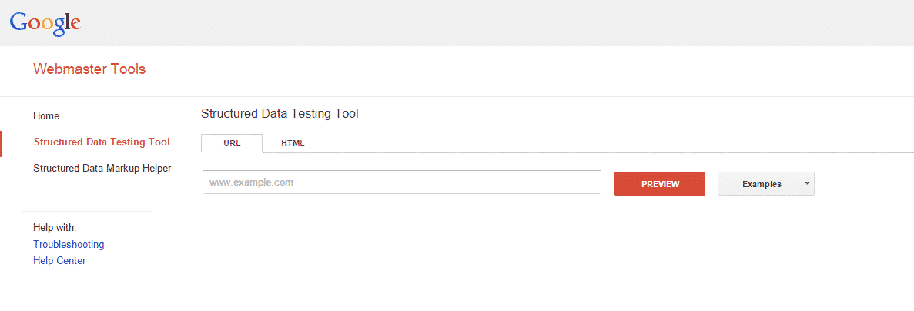
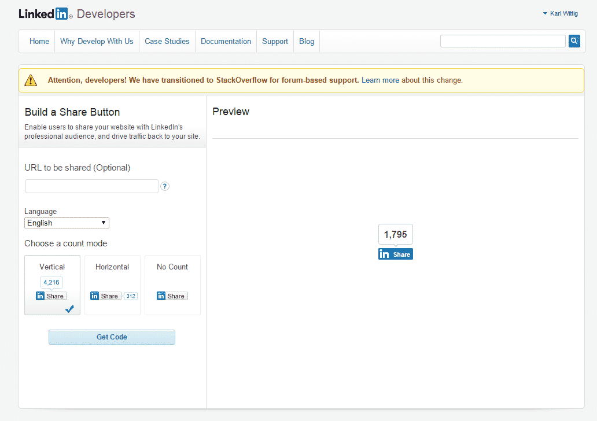

Social Sharing is an extremely powerful tool to expand your user base and product recognition, customizing and implementing this to be efficient on your site can be quiet difficult. Most of the most relevant Social Providers have setup testing and troubleshooting tools that can help to identify where you have gone astray. Below is a brief overview of some useful tools that have been setup to assist with implementing custom Social Sharing options.

**Facebook Open Graph Object Debugger**

Setting up custom sharing with Facebook uses Facebook Open Graph meta tags, which are cached on Facebooks end and can lead to some confusion when making updates to your customizations. In order to identify the cached details that are being used for your implementation Facebook provides the [Open Graph Debugger tool](https://developers.facebook.com/tools/debug/). All you need to do is input your sites URL and click on Debug.

This will then crawl your page and display some useful information on the currently scraped details and warnings and error messages. It also give you the option at this point to refresh this scrapped data with any changes that you have made to our existing cached details.

**Google Structured Data Testing Tool**

Google uses a combination of a few different methods in order to define the customized sharing options:

- Structured Data Markup- HTML markup detailed on [http://schema.org/](http://schema.org/).
- Open Graph Tags- Turn your page into a rich data object, commonly used to customize Facebook sharing details. Information on the markup is available on [http://ogp.me/](http://ogp.me/)
- Title or Meta Description- HTML attributes that provide details on the site.
- Googles best guess- If none of the above are included, Google will crawl your page and try to interpret the most suitable details to include in the share.

The [structured data testing tool](http://www.google.com/webmasters/tools/richsnippets) allows you to view what Google has interpreted from your webpage. Start by entering the URL of the page that you are sharing and click on preview.

You will be able to view the scrapped data as well as a listing of the meta tags that have been included on the page.

**LinkedIn Share Generator Tool**

LinkedIn also uses Open Graph Tags to determine the content that will be shared with your sharing interface. You can view the relevant tags and details [here](https://developer.linkedin.com/documents/setting-display-tags-shares).

You can view the details that will be shared by generating out the sharing button on LinkedIn's [build a share button tool](https://docs.microsoft.com/en-us/linkedin/consumer/integrations/self-serve/plugins/share-plugin).

Insert the URL in the "URL to be shared field" and click on Get Code. This will generate a sample share icon in the preview section.

To test the share functionality click on the generated icon to display the share interface as determined by the provided URL.

**Twitter Button Generator Tool**

Twitter also uses multiple systems to determine the content that will be tweeted by the tweet buttons. The most commonly used meta tags, which allow you to set any of the available customizable fields in your tweet.

To test the tweet you can use Twitters [button generator](https://about.twitter.com/resources/buttons). Select the "Share a link" option under "Choose a button".

Input your site URL in the "share URL" field, This will cause the Tweet button under "Preview and code" to be updated.

Click on the generated button to see a sample of the Tweet that has be defined by your URL.
