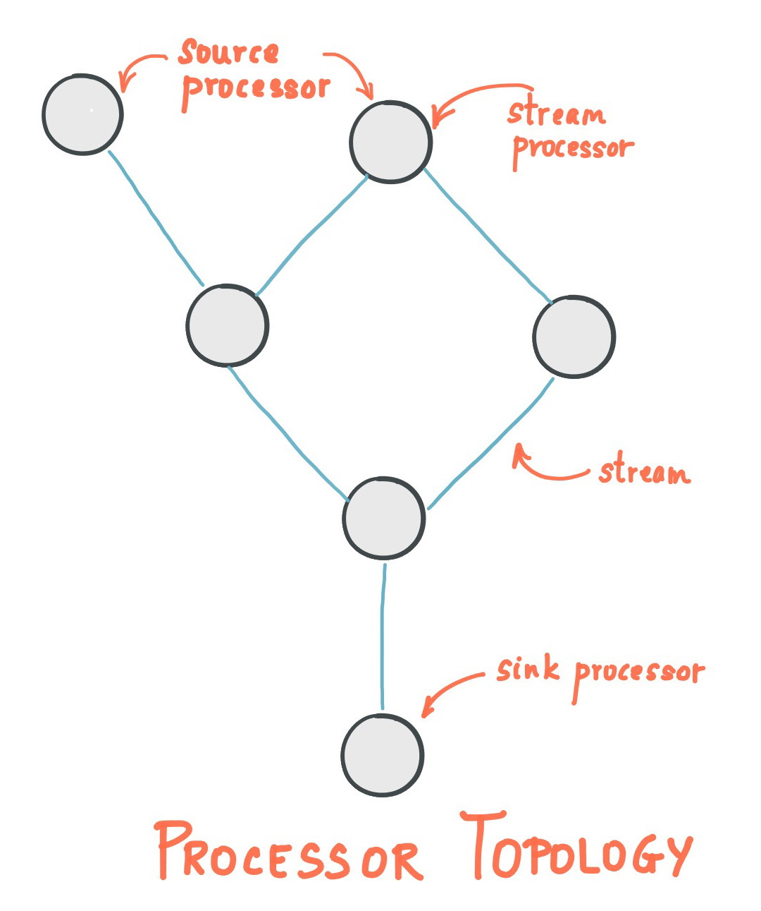

Kafka Streams is a Java library developed to help applications that do stream processing built on Kafka. To learn about Kafka Streams, you need to have a basic idea about Kafka to understand better.  If you’ve worked with Kafka before, Kafka Streams is going to be easy to understand; otherwise, you can look up some basic tutorials online to get going with this article. 

Let us get started with some highlights of Kafka Streams:
* Low Barrier to Entry:  Quickly write and run a small-scale POC on a single instance. You only need to run multiple instances of the application on various machines to scale up to high-volume production workloads.
* Lightweight and straightforward client library:  Can be easily embedded in any Java application and integrated with any existing packaging, deployment, and operational tools.
* No external dependencies on systems other than Apache Kafka itself
* Fault-tolerant local state: Enables fast and efficient stateful operations like windowed joins and aggregations
* Supports exactly-once processing: Each record will be processed once and only once, even when there is a failure.
* One-record-at-a-time processing to achieve millisecond processing latency supports event-time-based windowing operations with out-of-order arrival of records.

## Key Concepts:
**Stream**:  An ordered, replayable, and fault-tolerant sequence of immutable data records, where each data record is defined as a key-value pair.

**Stream Processor**:  A node in the processor topology represents a processing step to transform data in streams by receiving one input record at a time from its source in the topology, applying any operation to it, and may subsequently produce one or more output records to its sinks.
There are two individual processors in the topology:
* **Source Processor**: A source processor is a special type of stream processor that does not have any upstream processors. It produces an input stream to its topology from one or multiple Kafka topics by consuming records from these topics and forwarding them to its down-stream processors.
* **Sink Processor**: A sink processor is a special type of stream processor that does not have down-stream processors. It sends any received records from its up-stream processors to a specified Kafka topic.



* **Kstream**: KStream is nothing but that, a Kafka Stream. It’s a never-ending flow of data in a stream. Each piece of data — a record or a fact — is a collection of key-value pairs. Data records in a record stream are always interpreted as an "INSERT".

* **KTable**: A KTable is just an abstraction of the stream, where only the latest value is kept. Data records in a record stream are always interpreted as an "UPDATE".

There is actually a close relationship between streams and tables, the so-called [stream-table duality](https://www.confluent.io/blog/introducing-kafka-streams-stream-processing-made-simple/).

Let's Start with the Setup using Scala instead of Java. The Kafka Streams DSL for Scala library is a wrapper over the existing Java APIs for Kafka Streams DSL.

To Setup things, we need to create a `KafkaStreams` Instance. It needs a topology and configuration (`java.util.Properties`). We also need a input topic and output topic. Lets look through a simple example of sending data from an input topic to an output topic using the Streams API

You can create a topic using the below commands (need to have Kafka pre installed)

```shell
kafka-topics --create --zookeeper localhost:2181 --replication-factor 1 --partitions 1 --topic inputTopic
kafka-topics --create --zookeeper localhost:2181 --replication-factor 1 --partitions 1 --topic outputTopic
```

```scala
val config: Properties = {
    val properties = new Properties()
    properties.put(StreamsConfig.APPLICATION_ID_CONFIG, "your-application")
    properties.put(StreamsConfig.BOOTSTRAP_SERVERS_CONFIG, "localhost:9092")
    properties.put(ConsumerConfig.AUTO_OFFSET_RESET_CONFIG, "latest")
    properties.put(StreamsConfig.PROCESSING_GUARANTEE_CONFIG, StreamsConfig.EXACTLY_ONCE)
    properties.put(StreamsConfig.DEFAULT_KEY_SERDE_CLASS_CONFIG, Serdes.String())
    properties.put(StreamsConfig.DEFAULT_VALUE_SERDE_CLASS_CONFIG, Serdes.String())
    properties
    }
```

StreamsBuilder provide the high-level Kafka Streams DSL to specify a Kafka Streams topology.

```scala
val builder: StreamsBuilder = new StreamsBuilder
```

Creates a KStream from the specified topics.
```scala
val inputStream: KStream[String,String] = builder.stream(inputTopic, Consumed.`with`(Serdes.String(), Serdes.String()))
```

Store the input stream to the output topic.
```scala
inputStream.to(outputTopic)(producedFromSerde(Serdes.String(),Serdes.String())
```

Starts the Streams Application
```scala
val kEventStream = new KafkaStreams(builder.build(), config)
kEventStream.start()
sys.ShutdownHookThread {
      kEventStream.close(10, TimeUnit.SECONDS)
    }
```

You can send data to the input topic using 

```shell
kafka-console-producer --broker-list localhost:9092 --topic inputTopic
```

And can fetch the data from the output topic using

```shell
kafka-console-consumer --bootstrap-server localhost:9092 --topic outputTopic --from-beginning
```

You can add the necessary dependencies in your build file for sbt or pom file for maven. Below is an example for build.sbt.
```sbt
// Kafka
libraryDependencies += "org.apache.kafka" %% "kafka-streams-scala" % "2.0.0"
libraryDependencies += "javax.ws.rs" % "javax.ws.rs-api" % "2.1" artifacts( Artifact("javax.ws.rs-api", "jar", "jar")) // this is a workaround. There is an upstream dependency that causes trouble in SBT builds.
```

Let us modify the code a little bit to try out a WordCount example:
The code splits the sentences into words and groups by word as a key and the number of occurences or count as value and is being sent to the output topic by converting the KTable to KStream.

```scala
val textLines: KStream[String, String] = builder.stream[String, String](inputTopic)
val wordCounts: KTable[String, Long] = textLines
		.flatMapValues(textLine => textLine.toLowerCase.split("\\W+"))
		.groupBy((_, word) => word)
		.count()(materializedFromSerde(Serdes.String(),Serdes.Long()))
	wordCounts.toStream.to(outputTopic)(producedFromSerde(Serdes.String(),Serdes.Long())
```

With the above process, we can now implement a simple streaming application or a word count application using Kafka Streams in Scala. 
Checkout the [documentation](https://kafka.apache.org/documentation/streams/) in their website for more applications!