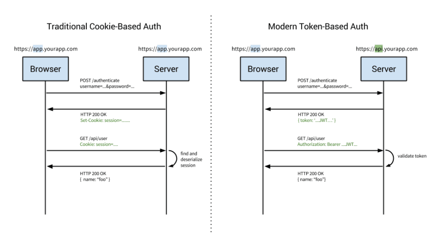

### HTTP (HyperText Transfer Protocol)

HTTP is a protocol for communication between the client and the server. HTTP is stateless, which means each request doesn't know of any previous actions. For example, when a user logs in, and then navigate through the app, the server will not know that we just logged in without session or token authentication.

### Session Authentication

In session authentication, the server is responsible for creating a session for the particular user when the user log's in, after that the id of the session is stored in a cookie on the user browser. For every request sent by the user, the cookie will be sent too, where the server can compare the session id from the cookie with the session information stored on the server so the user identity is verified.

### Token Authentication

In token authentication, the server creates a JSON Web Token (JWT) and sends the token to the client. The JSON Web Token usually is stored in a local storage or in the cookie, and it is included in every request made by the user. The server will validate the JSON Web Token. The JSON Web Token authentication is a more modern approach used in newer web applications and for mobile devices. The user state is not stored on the server with this approach instead it is stored in the token.

### Scalability 

Generally, the JSON Web Token scales much better with the size of the application because it is stateless, there is no need user information to be stored, on the other side sessions can use a lot of the server resources if the application has a lot of traffic.

### Security

The JSON Web Token usually is either stored in local storage or cookies, and JavaScript has the access to the storage, this simply means that JSON Web Tokens might be vulnerable to XSS (Cross-site Scripting), that's why very sensitive data should not be stored in the Local Storage. I case when the JSON Web Tokens are stored in the cookies are vulnerable to CSRF (Cross-site Request Forgery) attacks. One way to prevent the CRSF attack is to be sure that the cookie is accessible by only your domain. The JWT also should be with short expiration times and HTTPS/SSL should be used for safe client and server transmission.

### Which is better?

While sessions and JSON Web Tokens are both viable options, in some situations one is better to be used over the other. For smaller and medium websites, when we got just user login session authentication is usually good. For larger web sites and applications, when we need to handle a lot of requests, JSON Web Token is much better because of scaling.