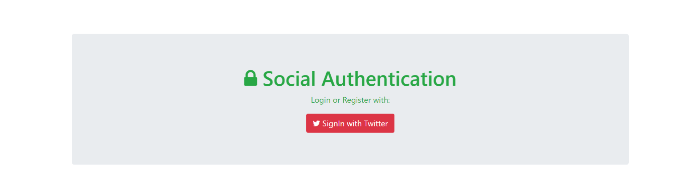
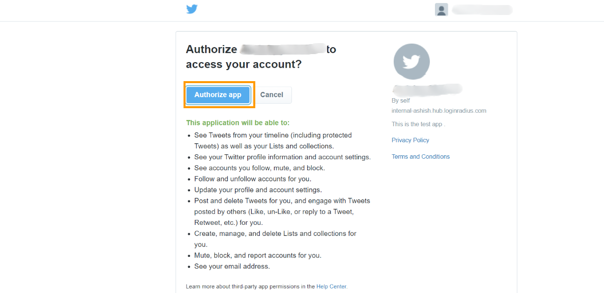
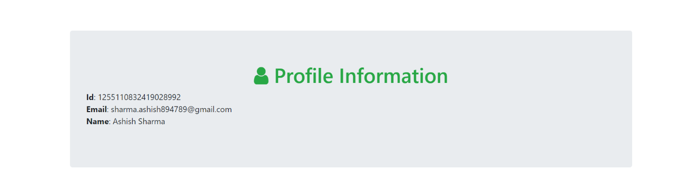

In this blog, we’ll be implementing authentication via Twitter in a Golang web application. For this, we’ll be using Goth, a social authentication middleware for Golang.

Pre-requisites: 

*   Basic knowledge of HTML/Golang
*   Golang should be installed in your system

**Firstly**, We need to create a new Twitter App using its [Application Management](https://apps.twitter.com/). Twitter does not seem to work nicely with it if "localhost" is given in the callback URL field. To overcome this limitation, you could use the special loopback address or **"127.0.0.1"** in place of **"localhost"**.

 

Step 1. First, create a directory structure as below for your Go Application :


```
TwitterAuthenticationGoth
-templates
--index.html
--success.html
-main.go
```


Step 2. Add the following code in **index.html** for creating **LoginUI**:


```html
<!doctype html>
<html>
<head>
    <title>Twitter SignIn</title>
    <link rel="stylesheet" href="https://stackpath.bootstrapcdn.com/bootstrap/4.4.1/css/bootstrap.min.css"> <!-- load bulma css -->
    <link rel="stylesheet" href="https://stackpath.bootstrapcdn.com/font-awesome/4.7.0/css/font-awesome.min.css"> <!-- load fontawesome -->
    <style>
        body        { padding-top:70px; }
    </style>
</head>
<body>
<div class="container">
    <div class="jumbotron text-center text-success">
        <h1><span class="fa fa-lock"></span> Social Authentication</h1>
        <p>Login or Register with:</p>
        <a href="/auth/twitter" class="btn btn-danger"><span class="fa fa-twitter"></span> SignIn with Twitter</a>
    </div>
</div>
</body>
</html> 
```


Step 3 Add the following code in **success.html** for creating **ProfileUI**:


```html
<!doctype html>
<html>
  <head>
    <title>Twitter SignIn</title>
    <link rel="stylesheet" href="https://stackpath.bootstrapcdn.com/bootstrap/4.4.1/css/bootstrap.min.css"> <!-- load bulma css -->
    <link rel="stylesheet" href="https://stackpath.bootstrapcdn.com/font-awesome/4.7.0/css/font-awesome.min.css"> <!-- load fontawesome -->
      <style>
          body        { padding-top:70px; }
      </style>
  </head>
  <body>
    <div class="container">
      <div class="jumbotron">
          <h1 class="text-success  text-center"><span class="fa fa-user"></span> Profile Information</h1>
          <div class="row">
            <div class="col-sm-6">
                <div class="well">
                        <p>
                            <strong>Id</strong>: {{.UserID}}<br>
                            <strong>Email</strong>: {{.Email}}<br>
                            <strong>Name</strong>: {{.Name}}
                        </p>
                </div>
            </div>
        </div>
      </div>
    </div>
  </body>
</html>
```


Step 4. Add the following code in **main.go** for importing **Goth** and other packages :


```go
import (
    "fmt"
    "html/template"
    "log"
    "net/http"
    "sort"

    "github.com/gorilla/pat"
    "github.com/markbates/goth"
    "github.com/markbates/goth/gothic"
    "github.com/markbates/goth/providers/twitter"
)
```


Now we are ready to implement Twitter Authentication in our app

Step 5. Setup the twitter configuration by adding the following code in **main.go** :

 


```go
goth.UseProviders(
        twitter.New("TWITTER_KEY", "TWITTER_SECRET", "http://127.0.0.1:3000/auth/twitter/callback"),

    )
```


Step 6. For adding all routes and functionality you just need to add following code in **main.go** :


```go
 type ProviderIndex struct {
     Providers[] string
     ProvidersMap map[string] string
 }

 func main() {
     goth.UseProviders(
         twitter.New("TWITTER_KEY", "TWITTER_SECRET", "http://127.0.0.1:3000/auth/twitter/callback"),
         // If you'd like to use authenticate instead of authorize in Twitter provider, use this instead.
         // twitter.NewAuthenticate(os.Getenv("TWITTER_KEY"), os.Getenv("TWITTER_SECRET"), "http://localhost:3000/auth/twitter/callback"),
     )

     m: = make(map[string] string)
     m["twitter"] = "Twitter"

     var keys[] string
     for k: = range m {
         keys = append(keys, k)
     }
     sort.Strings(keys)

     providerIndex: = & ProviderIndex {
         Providers: keys,
         ProvidersMap: m
     }

     p: = pat.New()
     p.Get("/auth/{provider}/callback", func(res http.ResponseWriter, req * http.Request) {

         user, err: = gothic.CompleteUserAuth(res, req)
         if err != nil {
             fmt.Fprintln(res, err)
             return
         }
         t, _: = template.ParseFiles("templates/success.html")
         t.Execute(res, user)
     })

     p.Get("/logout/{provider}", func(res http.ResponseWriter, req * http.Request) {
         gothic.Logout(res, req)
         res.Header().Set("Location", "/")
         res.WriteHeader(http.StatusTemporaryRedirect)
     })

     p.Get("/auth/{provider}", func(res http.ResponseWriter, req * http.Request) {
         // try to get the user without re-authenticating
         if gothUser, err: = gothic.CompleteUserAuth(res, req);
         err == nil {
             t, _: = template.ParseFiles("templates/success.html")
             t.Execute(res, gothUser)
         } else {
             gothic.BeginAuthHandler(res, req)
         }
     })

     p.Get("/", func(res http.ResponseWriter, req * http.Request) {
         t, _: = template.ParseFiles("templates/index.html")
         t.Execute(res, providerIndex)
     })
     log.Println("listening on localhost:3000")
     log.Fatal(http.ListenAndServe(":3000", p))
 }
```


Now you just need to run the project by using the following command and try logging by using the Twitter button.

Step 7. Run the project :


```
 go run main.go
```


Step 8. Visit the browser with the URL **[http://127.0.0.1:3000](http://127.0.0.1:3000/)**.





We need to click on **Authorize button**, which will redirect us to google login page  





After login with our twitter credentials, it will redirect back to our application and on the success page, we can see the details of the logged-in user and can save this detail in the database for future use also.





As we have seen it is fairly easy to build a twitter social authentication system with Go  and Goth, You can found the complete code used in this tutorial on our[ Github Repo](https://github.com/LoginRadius/engineering-blog-samples/tree/master/GoLang/TwitterAuthenticationGoth)
