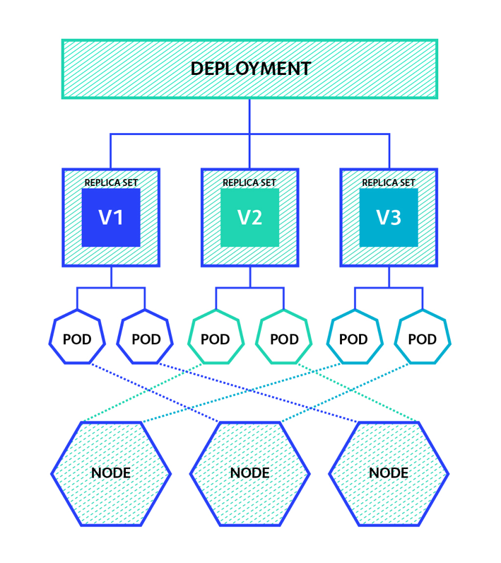

### Introduction

This blog targets the way modern applications are deployed and consumed. It introduces the importance of [Kubernetes](https://kubernetes.io/) which is a container Orchestration tool on a basic level and how it is making the job of Developers more simpler.

### What is Kubernetes

Kubernetes (also known as k8s) is a container orchestration tool which is widely used to deploy and update application without any downtime. It enables auto-scaling of resources in case of increase/decrease in requests to the server and also provides an intelligent management, allocation of resources and services which saves a lot of money for us.  


### Why Kubernetes?

 - With the rise in the number of internet users, it is expected that applications should not have any downtime for maintenance and update. 

 - Also each organization wants their deployments to scale according to the needs of users i.e if more user's request are coming then more CPU and Memory should be automatically allocated to the deployment otherwise the server will crash.
 
 - Furthermore no one wants to pay more for CPU and Memory on cloud services if there is no such requirements everytime. So there should be some kind of intelligent system that effectively allocated and manages the CPU and Memory utilization as per need.
 
 This is where kubernetes comes into picture. It handles all the above requirements effectively and reduces a lot of burden from the developer's shoulders.
 


### Technical Aspect

Kubernetes is an open-source container orchestration tool which was developed by Google in 2014. It is designed as a highly available cluster of computers that are connected to work as a single unit. This level of abstraction allows us to deploy application without thinking much about the machines on which application would run on. *Kubernetes role is to automate the distribution of application containers on computer clusters in an efficient way* (**NOTE**: If you are not familiar with application containers then read about it [here](https://docs.docker.com/get-started/overview/)). 

A typical computer cluster in kubernetes consists of:

- **Node**: Where we run our applications
- **Master**: Used to coordinate the cluster.
```
Master is responsible for managing the cluster. The master nodes will coordinate all the activity happening in your 
cluster like scheduling applications, maintaining their desired state, scaling applications and rolling new updates. 
Whereas a Node is a VM or a physical computer that is used as a worker machine in a Kubernetes cluster to 
actually run the application 
```


*A master node contain processes that continuously watches the deployment for any CPU or Memory requirement and smartly allocated it in the form of new pods to auto-scale the application which handles the huge amount of request coming to the server.*

Most of the modern cloud services like Amazon Web Service(AWS), Microsoft Azure and Google Cloud comes with an automatic support for Kubernetes to provide ease in deployment and maintenance of application containers.

A Kubernetes cluster can be deployed on either physical or virtual machines. A software named Minikube can be installed on your local machines that creates a VM on your local machine and deploys a simple cluster containing only one node. Minikube provides a CLI through which we can execute commands & simulate a small-scale kubernetes cluster.



#### Some of the basic kubernetes CLI commands are:
- **kubectl get nodes** - It gets the total number of working nodes available in the k8s cluster.
- **kubectl get pods** - It returns the total number of Running pods present in the cluster.
- **kubectl create deployment {DEPLOYMENT_NAME} --image={IMAGE_NAME}**  - It creates a new deployment on given cluster. We need to specify a deployment name to the deployment and the image from which the deployment should be made.
- **kubectl logs {POD_NAME}** - It prints the logs for a certain pod specified using pod name. Logs are very useful for debugging the application.
- **kubectl cluster-info** - It fetches all the metadata related to the cluster. 
- **kubectl delete pod {POD_NAME}** - It deletes the deployed pods specified using the pod name.

### Conclusion: 
There are many benefits of learning Kubernetes as it releases a lot of stress of deployment from the developer's shoulders. It helps in auto-scaling, intelligent utilization of available resources and enables low downtime for maintenance. Without k8s a lot of human effort and money is gone into these things but with the help of k8s everything can be automated.

Since K8s is a very big technology, it is impossible to wrap all things in just one blog. To simplify things, I will be publishing more blogs in near future related to **k8s Deployments, ReplicaSets, Services, Ingress Controller, Master and Worker Processes, Kubectl** etc. Stay connected and keep learning.
