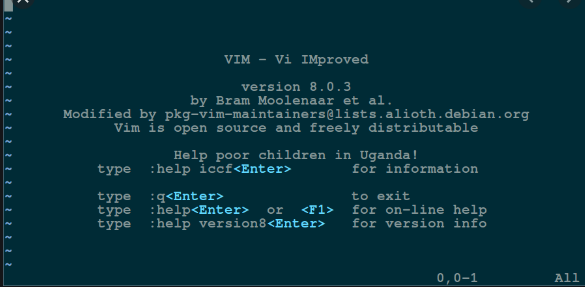
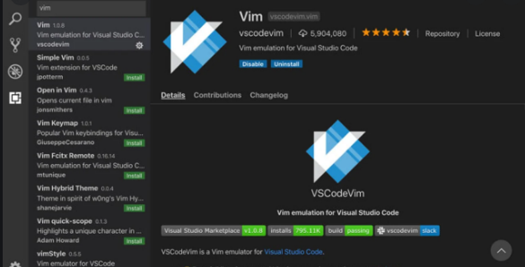
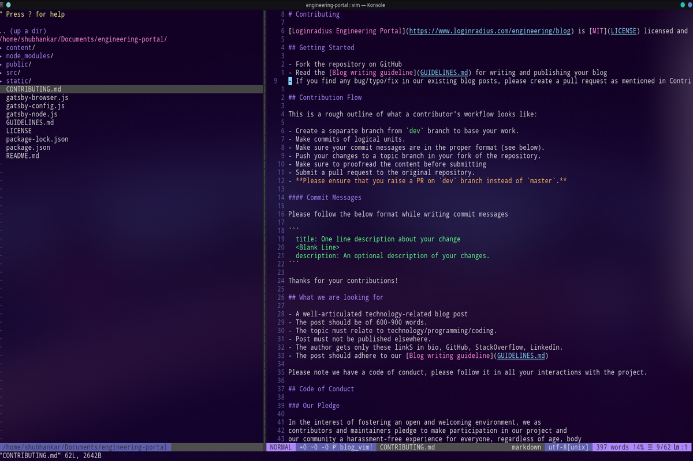

## Vim - Getting started
Before VsCode, Sublime Text, Atom or any other modern text editor, humankind was blessed by Bill Joy who created **Vi** in 1976. Vi was designed to work on terminals and with the very uncommon characteristic of working in a **modal fashion**.

**Vim** (**V**i **IM**proved) is the latest and most celebrated reincarnation of Vi which supports both text and graphical interfaces and is supported on every platform known.

#### Why the big Fuss?
Remember I said Modal fashion, well it's these modes **( Normal, Insert and Visual)**  in Vim which makes it such a powerful text editor. These **modes give you a completely different level of control and fluency when editing code.**

Also, It is **extremely customizable** and you can adapt it to your way of coding and your way of doing things.
To give you a taste of vim , below are a few commands frequently used to code at lightning speed:

 - hjkl : move the cursor around to left, down, up, and right respectively.
 - 7j : move 7 lines down.
 - w : move a word forward
 - ctrl + f : move down a page
 - ctrl + b : move up a page
 - gg : move to the top of the document
 - G : move to the bottomost of the document
 - dw : delete a word
 - d6w : delete 6 words
 - dt> : delete till  `>`
 - di] : delete everything inside `[ ]`
 - dd : delete whole line
 - 4dd : delete 4 lines
 - yy : yank a line ( yank is copy )
 - cc : change a line ( change is delete and go in insert mode )
 - cap : change a paragraph
 - `.` : repeat last command
 - f' : find first occurance of `'`
 - f'ci'hello : _find the next  `'` then change everything inside `'` for `hello`

The list goes on 

 So basically we have standard keybindings like d for delete, c for change, f for find etc. and we can pair them with numbers to repeat that action n number of times. Moreover doubling a command like so `yy` makes the command operate on the entire line.


So to sum up,
>Vim is for **programmers who want to raise their game**. In the hands of an expert, It shreds text at the speed of thought.

 #### Cool, how do I get started?
 Well, there is a learning curve, but it's worth it. Although this steep curve is exaggerated in the online world and the **quitting vim joke** is getting very old ( It's:q btw ).

 Install Vim `sudo apt-get vim or pacman -S vim` for Linux user and type `vim <filename>` in your terminal. Press `i` to go to insert mode. Type some gibberish. Press `:wq` to save and quit . `:q!` to quit without saving.

 First of all, don't get disheartened when you see VIM for the first time, it's known to make a **horrible first impression.** We'll learn to customize it later in the blog.

 


 To get started, get your hands dirty on **vimtutor** . It's a 20-30 minute vim tutorial which teaches you all the basics. Just type `vimtutor` in your terminal (in a machine where you have vim installed) to open it.

**Try  [Vim Adventures](https://vim-adventures.com/)**. An interactive game that teaches you vim skills in a step by step manner and lets you unlock new abilities after you've proved your worth with the previous ones.

 Just get started with it . **Learn as you go** . You can always refer to the [Vim CheatSheet](https://vim.rtorr.com/) to get better. Practice makes a man perfect. Watch screencasts if that's helpful (was helpful to me).

#### How do i customize my Vim ?

The best way to configure your Vim is through `.vimrc` file, which is hidden inside your home directory. Open a terminal and type `vim ~/.vimrc` to open your vimrc file using vim. Cool huh? Using vim to configure vim ..no? Nevermind!
Here you can define your keybindings, set themes, install plugins etc.
Here is an example of a custom keybinding
`map <C-n> :NERDTreeToggle<CR>
`
You can find tons of tutorials on what keybindings to use and how to use them.
The easiest way to download and manage plugins for vim is by using a plugin manager. There are quite a few [vim-pathogen](https://github.com/tpope/vim-pathogen) , [Vundle.vim](https://github.com/VundleVim/Vundle.vim) , [Vim-plug](https://github.com/junegunn/vim-plug) etc.
Vim-plug being my favourite. Installations and usage for each plugin manager can be found in their respective repositories.

I personally like to call all my plugins in a separate file and link that file to my vimrc. Paste this line in your vimrc at the top if you want to do the same `source ~/.vim/plugin/plugins.vim
`
 In your plugins.vim file you can install different plugins like this:-
 ```
 call plug#begin('~/.vim/plugged')

Plug 'scrooloose/nerdtree'
Plug 'moll/vim-node'
Plug 'yegappan/mru'

call plug#end()
```
The first and last lines are for vim-plug to know what plugins are to be installed. The lines beginning with `Plug` is to install that particular plugin.

Now just reload .vimrc (or quit vim and re-enter) and `:PlugInstall` to install plugins.

#### What are some good plugins?
Glad you asked because Vim is no fun without plugins made by the awesome open source community.
Here are some good plugins you should definitely install. Just search these on GitHub in case you wanna know more about them or their usage.

 - scrooloose/nerdtree
 - alvan/vim-closetag
 - vim-scripts/vim-auto-save
 - airblade/vim-gitgutter
 - ervandew/supertab
 - vim-airline/vim-airline
 - SirVer/ultisnips
 - honza/vim-snippets
 - dense-analysis/ale
 - tpope/vim-repeat
 - ap/vim-css-color
 - jiangmiao/auto-pairs
 - tmhedberg/matchit
 - kana/vim-textobj-user
 - vim-scripts/tComment
 - Valloric/YouCompleteMe', { 'do': './install.py --tern-completer' }
 - prettier/vim-prettier', { 'do': 'yarn install' }
 - jeffkreeftmeijer/vim-numbertoggle
 - elzr/vim-json
 - tpope/vim-markdown
 - pangloss/vim-javascript
 - mxw/vim-jsx
 - jparise/vim-graphql
 - leafgarland/typescript-vim
 - vim-syntastic/syntastic
 - ntpeters/vim-better-whitespace

Pheww!!..
So you see there's a plugin for anything and everything. These plugins are more than enough to make vim a full-blown IDE.

#### Summing up !!
VIM makes you write code in the speed of thoughts. Just get started, and the rest will follow. Steal your friend's vimrc or find one on the internet (there are tons of them) if you dont want to make one of your own.

If you want to slowly blend in into the world of vim then use some vim plugin for your text editor. All popular text editors have a vim plugin ( [Here's one for VsCode ](https://marketplace.visualstudio.com/items?itemName=vscodevim.vim))
Here you go, best of both worlds! When you're comfortable enough, go for that complete switch.



Here's how my vim setup looks.



Now go give it a try. I wish you luck!!
