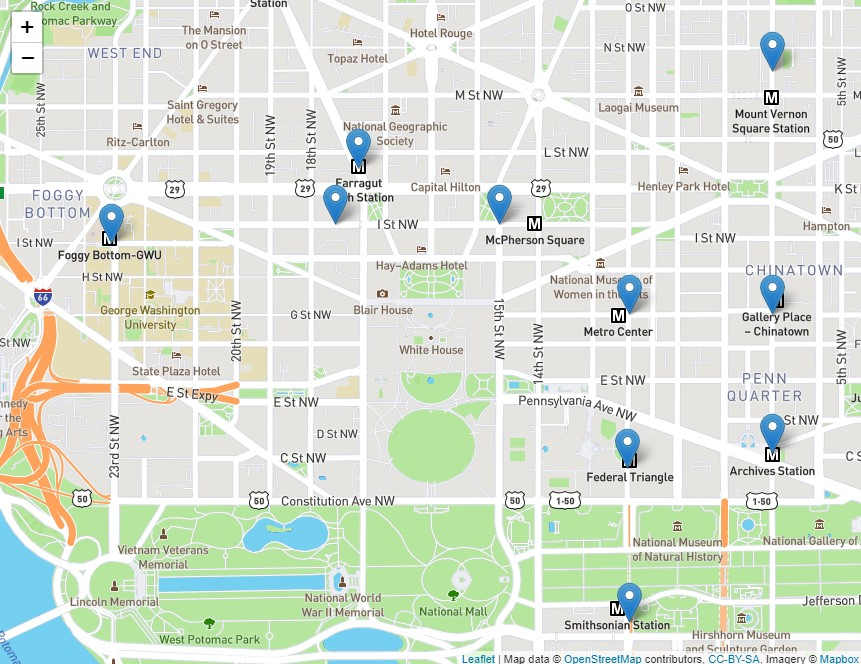
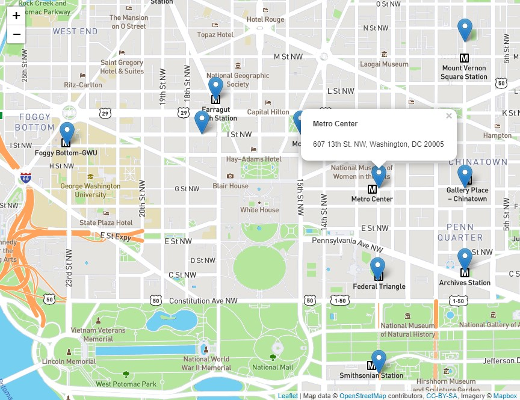
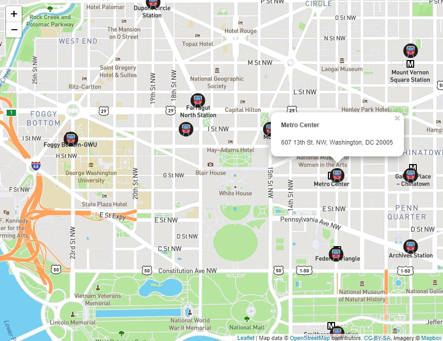
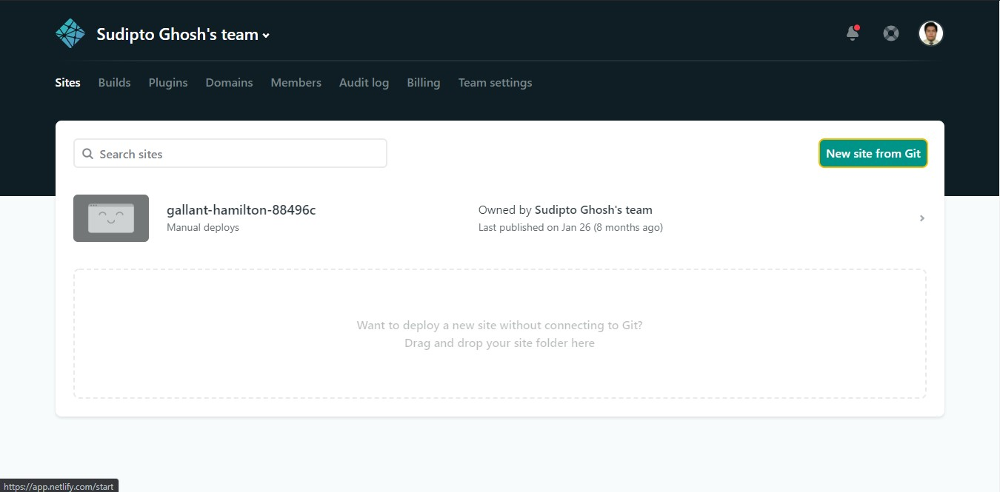
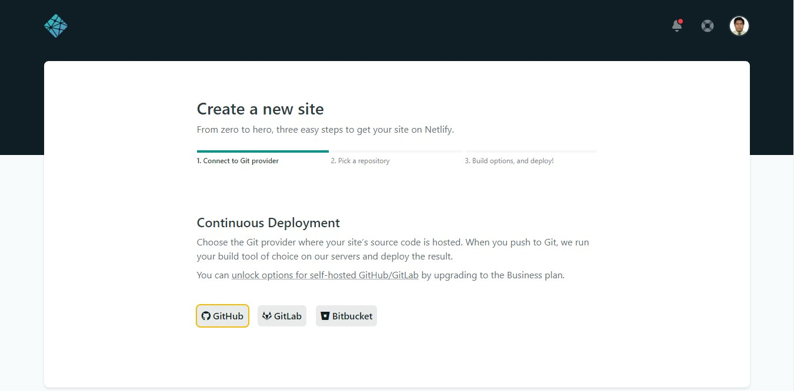
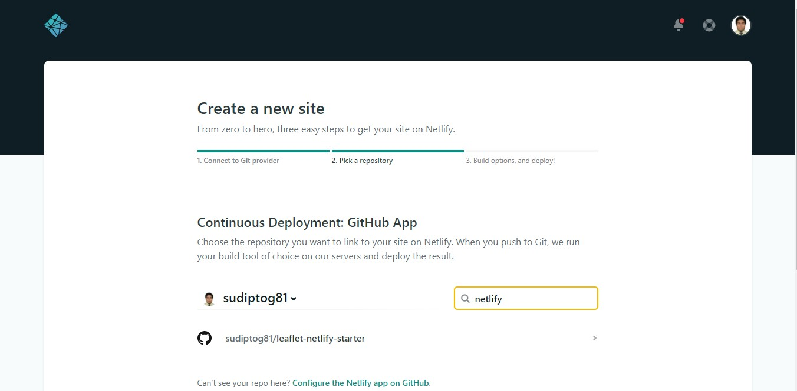
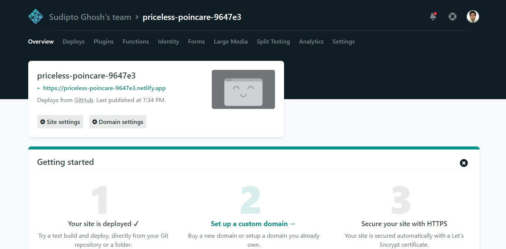

## Motivation

Maps are an effective, intuitive way to understand data in some use-cases. Interactive web maps can help us visualize the data better and derive better insights.

Different map visualizations can highlight different aspects of a dataset. Heatmaps, Choropleth maps and Clustering maps are frequently used for this purpose.

In this blog, I shall go over using a powerful JavaScript library to build a web map and deploy it on Netlify.

## Using Leaflet

The Leaflet is a great library for implementing interactive web maps as it provides many UI features, like smooth canvas panning, zooming, mouse events, and all the involved work in animations, which one would otherwise have to implement from scratch.

> Leaflet is the leading open-source JavaScript library for mobile-friendly interactive maps. Weighing just about 39 KB of JS, it has all the mapping features most developers ever need.
>
> _source: leafletjs.com_


We can include Leaflet in our application by including the CSS stylesheet and the JS file from the unpkg CDN. Let's start building the application by starting with the following code at the project root. Create a file named `index.html` and put the following markup in it. The map shall be rendered in `div#mapid`.

```html
<!--index.html-->
<!DOCTYPE html>
<html lang="en">

  <head>
    <meta charset="UTF-8">
    <meta name="viewport" content="width=device-width, initial-scale=1.0">
    <title>MapViz</title>
    <link rel="stylesheet" href="https://unpkg.com/leaflet/dist/leaflet.css" />
    <style>
      #mapid {
        position: fixed;
        width: 100%;
        height: 100%;
        top: 0;
        left: 0;
      }
    </style>
  </head>

  <body>
    <div id="mapid"></div>
    <script defer src="https://unpkg.com/leaflet/dist/leaflet.js"></script>
  </body>

</html>
```

Now, we gather a link to the GeoJSON file for metro stations in Washington D.C., that we shall be visualizing, from the [MapBox documentation](https://docs.mapbox.com/help/glossary/geojson/). It should look similar to the following:

```
https://docs.mapbox.com/help/data/stations.geojson
```


Create a new JavaScript file named `script.js` in the same directory as the HTML file. Include this file in the web page by adding the following line to it.

```html
<!--index.html-->
  ...
  <body>
    ...
    <script defer src="https://unpkg.com/leaflet/dist/leaflet.js"></script>
    <script src="script.js"></script>
  </body>
  ...
```

In `script.js`, we can use the Fetch API to make an AJAX request and get the data as a response to a `GET` request using promises and take a look at what we are dealing with.

```js
// script.js
let data = {};
const dataUrl = 'https://cors-anywhere.herokuapp.com/https://docs.mapbox.com/help/data/stations.geojson';

fetch(dataUrl)
  .then(response => response.json())
  .then(data => console.log(data))
  .catch(err => console.error(err));
```

We can take a look at the data in the Developer Console. We observe that it is a JavaScript object. The various properties associated with the data can be viewed by checking the individual features.

```js
{
  "type": "FeatureCollection",
  "features": [
    ...
    {
      "geometry": {
        "type": "Point",
        "coordinates": [-76.9750541388, 38.8410857803]
      },
      "type": "Feature",
      "properties": {
        "description": "Southern Ave",
        "marker-symbol": "rail-metro",
        "title": "Southern Ave",
        "url": "http://www.wmata.com/rider_tools/pids/showpid.cfm?station_id=107",
        "lines": ["Green"],
        "address": "1411 Southern Avenue, Temple Hills, MD 20748"
      }
    },
    ...
  ]
}
```


Before we begin adding the layers to our map, we need to instantiate a Leaflet `map` object with the DOM ID of the map container and center it on our point of interest at a specified initial zoom level.

```js
const map = L.map('mapid').setView([38.8977, -77.0365], 15);
```

As we need a base map (the base layer) for our map, we can use one that is provided by Mapbox. In order to use that, you need a Mapbox API access token that you can create on [their portal](https://account.mapbox.com/).

The following snippet instantiates a `tileLayer` object and adds it to our map:

```js
L.tileLayer('https://api.mapbox.com/styles/v1/{id}/tiles/{z}/{x}/{y}?access_token={accessToken}', {
  attribution: 'Map data &copy; <a href="https://www.openstreetmap.org/">OpenStreetMap</a> contributors, <a href="https://creativecommons.org/licenses/by-sa/2.0/">CC-BY-SA</a>, Imagery © <a href="https://www.mapbox.com/">Mapbox</a>',
  maxZoom: 18,
  id: 'mapbox/streets-v11',
  tileSize: 512,
  zoomOffset: -1,
  accessToken: 'your_mapbox_api_access_token'
}).addTo(map);
```

We can use the following snippet to parse the GeoJSON and add it to the map.

```js
L.geoJSON(data).addTo(map);
```

Replace the code in `script.js` with the following, and refresh the web page:

```js
let data = {};
const dataUrl = 'https://cors-anywhere.herokuapp.com/https://docs.mapbox.com/help/data/stations.geojson';

const map = L.map('mapid').setView([38.8977, -77.0365], 15);

L.tileLayer('https://api.mapbox.com/styles/v1/{id}/tiles/{z}/{x}/{y}?access_token={accessToken}', {
  attribution: 'Map data &copy; <a href="https://www.openstreetmap.org/">OpenStreetMap</a> contributors, <a href="https://creativecommons.org/licenses/by-sa/2.0/">CC-BY-SA</a>, Imagery © <a href="https://www.mapbox.com/">Mapbox</a>',
  maxZoom: 18,
  id: 'mapbox/streets-v11',
  tileSize: 512,
  zoomOffset: -1,
  accessToken: 'your_mapbox_api_access_token'
}).addTo(map);

fetch(dataUrl)
  .then(response => response.json())
  .then(data => {
    L.geoJSON(data).addTo(map);
  })
  .catch(err => console.error(err));
```

As the dataset contains `Point` features, markers will be added at the respective coordinates. Our web page will now look like the following:



We can show tooltips upon clicking on the markers by modifying the code as follows, to include some custom HTML using the properties in the feature, in the popup:

```js
// script.js
  ...
  fetch(dataUrl)
  .then(response => response.json())
  .then(data => {
    L.geoJSON(data, {
      onEachFeature: function (feature, layer) {
        layer.bindPopup(
          '<h4>'
          + feature.properties.title
          + '</h4>'
          + '<p>' 
          +  feature.properties.address
          + '</p>'
        );
      }
    }).addTo(map);
  })
  .catch(err => console.error(err));
  ...
```

Uupon clicking any marker, we will now see the following popup:



We can also customize the marker icon using the `pointToLayer` option of the `geoJSON` constructor as follows:

```js
// scripts.js
  ...
  L.geoJSON(data, {
      pointToLayer: function (feature, coords) {
        return L.marker(coords, {
          icon: new L.Icon({
            iconSize: [30, 30],
            iconAnchor: [15, 15],
            popupAnchor: [1, -24],
            iconUrl: 'https://cdn.iconscout.com/icon/free/png-256/metro-subway-underground-train-railway-engine-emoj-symbol-30744.png'
          })
        });
      },
      onEachFeature: function (feature, layer) {
        layer.bindPopup(
          '<h4>'
          + feature.properties.title
          + '</h4>'
          + '<p>'
          + feature.properties.address
          + '</p>'
        );
      }
    }).addTo(map);
    ...
```

Our updated web page will now look like the following:



Now, we can move on to deploy this web page on Netlify.

## Deploying on Netlify

Netlify is an awesome platform to host your web applications. It also offers many other features such as serverless functions.


Once you have pushed your web page to a Git repository, hosted either on GitHub, GitLab or BitBucket, navigate to [Netlify](https://app.netlify.com) and click on the **New Site from Git** button.



Next, select your Git provider and your repository:







Go ahead with the defaults, and now your site shall be published on Netlify, and all future pushes should result in a Netlify deployment:



Nice! Now we have a web map, even though a very basic one, live! Check out the [Leaflet documentation](https://leafletjs.com/reference.html) for more!

## Source Code

Demonstration: [https://priceless-poincare-9647e3.netlify.app/](https://priceless-poincare-9647e3.netlify.app/)

GitHub: [https://github.com/sudiptog81/leaflet-netlify-starter](https://github.com/sudiptog81/leaflet-netlify-starter)
