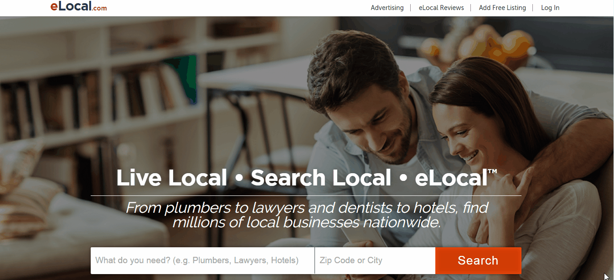

In my previous article, I listed [best citation sites in Canada](https://www.loginradius.com/blog/fuel/2017/01/top-25-citation-sites-canada/) and I am glad I did. I got a good response from our marketer community and businesses. I think that the article surely have helped them to enlist their businesses!

Now, as I can see things rolling ahead, I would like to speak about the best citation sites in the USA. I hope this pays off well too.

Now, before moving to the list, let’s brush up our knowledge with the term “citation”.

### What is a citation?

A citation site or business listing or directory can be termed as the process where you can enlist your business details like your company name, website, contact details and address. People can easily search your websites while they search for services related to what you offer. Moreover, local citation improves search engine rankings. Well, make sure that you choose the right site to list your business. It should be a high quality citation site.

### Benefits of citation

- Local SEO gets fueled.
- People can easily search services and businesses that they look for.
- Many major search engines have citation as a key factor in ranking algorithm.

### Ingredients for citation

- Business Description
- Business category
- Business keywords
- Contact Person Details
- Contact Details: Business email and Phone number
- Zip Code
- Proper Business address
- Registered email account

Now, here is a list of the best local citation sites of USA for 2017 which could generate leads, improve search engine rankings, and at the end, will spin more money for you.

Top Citation Sites of USA for 2017 :

### **1\. Manta: [http://www.manta.com/](http://www.manta.com/)**

- Domain Authority Score  : 84
- Page Authority                 : 87
- Domain Age                     : 13 Years
- Alexa Rank                      : 3,527
- Listing                              : Free

Manta is one of the most trusted local business listing websites. It boasts millions of visitors who are searching for comprehensive database for individual businesses every month.

Adding business to Manta is very easy. You will find an “Add Business” button on the right top of the screen. All that you have to do is to click on the same and add details of your business. After filling the form completely, you will receive a verification link on the registered email. Click on that link and get verified to complete the submission. Here is a small video for more help.

### **2\. Hotfrog:  [https://www.hotfrog.com/](https://www.hotfrog.com/)**

- Domain Authority Score  : 77
- Page Authority                 : 61
- Domain Age                     : 13.9 Years
- Alexa Rank : 57,883
- Listing : Both Free and Paid

Hotfrog is a place to get your business noticed for what you are specialized in. The huge amount of the traffic received by the website ensures your business a grand exposure.

By simply clicking to the “Add your business” button that is both on the right top and on the middle of the screen, you can add your business to one of the most searchable lists. Here’s the video to help you go through the process.

### **3\. Brownbook : [http://www.brownbook.net/](http://www.brownbook.net/)**

- Domain Authority Score  : 62
- Page Authority                 : 68
- Domain Age                     : 9.6 Years
- Alexa Rank                      : 77,838
- Listing                              : Free

Brownbook is an easy and free local citation website. You can submit your business website by clicking on “Add a business” button at the right top. A form will appear on your screen that you need to fill and at last click on the submit button. A link is sent to the registered email address that you need to verify for completing the listing.

### **4\. MerchantCircle: [http://www.merchantcircle.com/](http://www.merchantcircle.com/)**

- Domain Authority Score  : 82
- Page Authority                 : 85
- Domain Age                      : 12.4 Years
- Alexa Rank                       : 45,171
- Listing                               : Free and Paid

Merchantcircle makes it easy for worldwide users to search a database of a business. It helps in managing reputation, online presence and getting higher ranking in search engines. The submission is both free and paid.

For submitting your business, you need to click on”Join now” button at the right top. After that, fill the details including your business name then click on the submit button. For better results, you can go with the paid version.

### **5\. Superpages: [http://www.superpages.com/](http://www.superpages.com/)**

- Domain Authority Score  : 79
- Page Authority                 : 60
- Domain Age                     : 6 Years
- Alexa Rank                       : 21,433
- Listing                               : Free

Superpages is one of the top online resources that helps users to find a business nearby. It helps millions of customers monthly.

Listing business on Superpages is very easy. Click on to “Free Advertising” at bottom of the web screen. Then add your business contact number. After that enter click on to “find my business”  button to process further. After completing the form, you will get an account activation link on your professional email that you need to verify to complete business listing process.

### **6\. Ezlocal:  [http://ezlocal.com/](http://ezlocal.com/)**

- Domain Authority Score  : 50
- Page Authority                 : 52
- Domain Age                      : 12.10 Years
- Alexa Rank                       : 1,22,465
- Listing                               : Free

ezlocal is also a free business listing website for adding organizations, shops, institutions and other local businesses. The website will help you in generating high-quality leads.

First go to “Claim my business” section and then click on “new listing” _(Though I find it weird, why the site doesn’t provide the “create new listing” option right at front)_ and then submit all the information about your business then click the continue button to get the live link.

### **7\. Citysquares: [http://citysquares.com/](http://citysquares.com/)**

- Domain Authority Score  : 56
- Page Authority                 : 63
- Domain Age                     : 11.5 Years
- Alexa Rank                       : 1,49,037
- Listing                               : Both Free and Paid

Citysquares provides an opportunity for businesses to reach out local customers through a profile on the densely trafficked website. They can run a marketing campaign, display videos, advertise business and a lot more.

For adding your business to citysquare, got to “Add your business” section that is at bottom of the webpage. Click on the button and you will find a form. Complete it with all the required information that is must for business listing.

### **8\. eLocal: [http://www.elocal.com/](http://www.elocal.com/)**

- Domain Authority Score  : 55
- Page Authority                 : 38
- Domain Age                     :  19.3 Years
- Alexa Rank                       : 1,95,595
- Listing                               : Free

One can easily find from a plumber to a lawyer at eLocal. The website is classified into multiple categories making it easy to find and add your business to the place it best suits.

The process is same as the previous ones. You can find “Add free listing” button at the right top of the website. After clicking on the button, you have to go through three different steps to complete your business listing.

### **9\. eBusinesspages: [http://www.ebusinesspages.com/](http://www.ebusinesspages.com/)**

- Domain Authority Score  : 47
- Page Authority                 : 42
- Domain Age                     : 16.2 Years
- Alexa Rank                       : 2,32,919
- Listing                               : Free

eBusinesspages is a place where one can submit his business for free and can drive a huge amount of quality leads. After adding your business page, you will get a live link. By clicking on this link you can edit and descriptions and categories to your business.

### **10\. FindUs Local: [www.finduslocal.com](http://www.finduslocal.com)**

- Domain Authority Score  : 37
- Page Authority                 : 47
- Domain Age                     : 6.11 Years
- Alexa Rank                       : 2,93,270
- Listing                               : Both Free and Paid

FindUs Local is considered as one of the best business listing websites for USA. One can find desirable business info by just knowing the phone number. You can also find reviews and comments about the business here.

After adding your business to the list, you need to verify the email that has been sent to your registered email address. You need to click on the link to complete the submission process.

### **11\. California Business Directory: [http://california-webbusiness.com/](http://california-webbusiness.com/)**

- Domain Authority Score  : 27
- Page Authority                 : 1
- Domain Age                     : 5.8 Years
- Alexa Rank                       : 16,47,575
- Listing                               : Free

Finding a business using this directory is very simple. The businesses are beautifully classified into many categories and sections. This makes it easy for a user to find a local business nearby. You can also add videos and images on this directory to get more user attention.

### **12\. Jayde: [http://www.jayde.com/](http://www.jayde.com/)**

- Domain Authority Score  : 55
- Page Authority                 : 62
- Domain Age                     : 20.4 Years
- Alexa Rank                       : 1,32,078
- Listing                               : Free

Founded in 1996, Jayde is one of the largest B2B search engine and of course, one of the oldest citation website. With around 277,660 distinct categories, Jayde makes sure your business gets listed at the right place among the right audience.

The submission process on Jayde is quite easy and easily described in the short video below :

### **13\. Tupalo: [http://tupalo.com/](http://tupalo.com/)**

- Domain Authority Score  : 58
- Page Authority                 : 63
- Domain Age                     : 10.5 Years
- Alexa Rank                       : 1,47,673
- Listing                               : Free

Tupalo drives millions of customers from around the world. You just need to sign up first to list down your business. A link is sent to your email asking for further details about your business. You need to fill it and click on the submit button to complete the listing process.

### **14\. Cylex: [cylex-usa.com](http://cylex-usa.com)**

- Domain Authority Score  : 48
- Page Authority                 : 36
- Domain Age                     : 8.11 Years
- Alexa Rank                       : 1,11,365
- Listing                               : Free and Paid

The online business directory Cylex, helps you connect with your customers. Listing to the website is free, but the website also provides premium entry feature to promote businesses for better exposure. Here’s the quick video on how you can also submit your business here.

### **15\. Lacartes: [http://www.lacartes.com/](http://www.lacartes.com/)**

- Domain Authority Score  : 45
- Page Authority                 : 55
- Domain Age                     : 11.5 Years
- Alexa Rank                       : 1,30,504
- Listing                               : Free

This high authority citation website brings together various tools for businesses to add their listing and sell their products. Listing to the site is absolutely free and requires you to sign up to create your business profile. For more details, check out this video.

### **16\. Infignos: [http://www.infignos.com/](http://www.infignos.com/)**

- Domain Authority Score  : 38
- Page Authority                 : 44
- Domain Age                     : 15 Years
- Alexa Rank                      : 5,96,217
- Listing                               : Free

From apparel to professional business services, no matter which of the niche do you belong to, Infignos is the right place to get your business listed. With around 2000 categories provided by this citation site, you can be sure that your business reaches to the right audience. To get help with how you can submit your business here, check out this short video.

### **17\. Tuugo: [http://www.tuugo.us/](http://www.tuugo.us/)**

- Domain Authority Score  : 33
- Page Authority                 : 42
- Domain Age                      : 6.10 Years
- Alexa Rank                       : 2,18,536
- Listing                               : Free

Tuugo is a high authority citation website of USA that aims to build a huge community of businesses and customers. Adding your business to this site is free and requires you to sign up to go further. Here is the quick video that can help you out.

### **18\. Citiservi: [http://www.citiservi.com/](http://www.citiservi.com/)**

- Domain Authority Score  : 33
- Page Authority                 : 34
- Domain Age                     : 9.5 Years
- Alexa Rank                       : 7,65,425
- Listing                               : Free and Paid

Citiservi is a huge business listing website in USA. Adding your business to this citation website is free and hassle free. To get the complete step by step guide to register your business here, check out this short video.

### **19\. Cityfos: [http://www.cityfos.com/](http://www.cityfos.com/)**

- Domain Authority Score  : 30
- Page Authority                 : 33
- Domain Age                     : 5.9 Years
- Alexa Rank                       : 1,99,880
- Listing                               : Free and Paid

Witnessing 1.2 million visitors every month, Cityfos is no doubt a great website to list down your business. The leading local service directory, Cityfos allows you to add your business to the relevant category without spending a single penny. The website also provides additional features to the premium users.

### **20\. Mysheriff: [http://www.mysheriff.net/](http://www.mysheriff.net/)**

- Domain Authority Score  : 31
- Page Authority                 : 41
- Domain Age                     : 7.10 Years
- Alexa Rank                       : 3,06,113
- Listing                               : Free

Getting your business listed on mysheriff is quite easy. To add your business, first find your business if it has already been listed, if it is not, you will find the option to add your business. Click on the same and follow the required process.

### **21\. Ablocal: [https://ablocal.com/](https://ablocal.com/)**

- Domain Authority Score  : 60
- Page Authority                 : 43
- Domain Age                      : 6.1 Years
- Alexa Rank                       : 6,28,820
- Listing                               : Free

The neat and clean interface makes it very easy for business to get themselves listed on ablocal. Citing your business here is absolutely free and below is the quick guide through the process.

### **22\. Salespider: [http://www.salespider.com/](http://www.salespider.com/)**

- Domain Authority Score  : 57
- Page Authority                 : 47
- Domain Age                     : 12 Years
- Alexa Rank                       : 52,469
- Listing                               : Free

Salespider is one of the best global business directories. The businesses that are listed in this are getting lots of traffic to your website. Salespider has approximately 2 million members and the number is growing every day.

To add your business, open the website and you will find a business adding a section at the right top corner. Provide all the needed information and join the team to boost leads and sales.

### **23\. Knowem : [http://knowem.com/](http://knowem.com/)**

- Domain Authority Score  : 58
- Page Authority                 : 65
- Domain Age                     : 8.7 Years
- Alexa Rank                      : 80,091
- Listing                              : Free

Knowem allows users to search a business over 500 social media networks. The website will help businesses to reach out to more and relevant customers.

For submission, you need to create an account first with your official email address. After creating the account, a link is sent to your email. By clicking that link and filling all the details, you can list your business at Knowem.

### **24\. Showmelocal: [http://www.showmelocal.com/](http://www.showmelocal.com/)**

- Domain Authority Score  : 53
- Page Authority                 : 61
- Domain Age                     : 10.6 Years
- Alexa Rank                       : 80,229
- Listing                               : Free

If you are planning for offering some special offers, job posting or improving your business’ online presence, Showmelocal is a great place for you. The website allows users to post reviews and comments about the business. There are over 19 million registered businesses at showmelocal. So don’t miss a chance, list your business in this great directory.

### **25\. Yellowbot: [http://www.yellowbot.com/](http://www.yellowbot.com/)**

- Domain Authority Score  : 64
- Page Authority                 : 70
- Domain Age                     : 11.9 Years
- Alexa Rank                       : 1,05,895
- Listing                                : Free

Yellowbot is a local search website where one can find a nearby business or service among thousands. All the business are rated according to the customers’ reviews to make sure users always find the best.

You need to sign-up first before submitting your business. After signing up, you can add your business details and click on the submit button for final listing.

### **26\. n49: [https://www.n49.com/](https://www.n49.com/)**

- Domain Authority Score  : 38
- Page Authority                 : 46
- Domain Age                     : 17 Years
- Alexa Rank                       : 1,44,089
- Listing                               : Free

n49 is a free business listing website. Once you submit your business, n49 team will review your listing and after verifying your business, they send a live link of your submission to your registered email address.

### **27\. Myhuckleberry: [http://myhuckleberry.com/](http://myhuckleberry.com/)**

- Domain Authority Score  : 44
- Page Authority                 : 37
- Domain Age                     : 11Years
- Alexa Rank                      : 2,09,553
- Listing                              : Free

Myhuckleberry is a free business listing website where the user can find information about any business and company globally. It has its own search engine algorithms.

Go to “Start your free listing” section and register yourself with a business email address. Search for your business and if it is not found, create your listing by clicking “create a new business” listing.

### **28\. List Company: [http://list-company.com/](http://list-company.com/)**

- Domain Authority Score  : 33
- Page Authority                 : 36
- Domain Age                     : 8.6 Years
- Alexa Rank                       : 2,23,982
- Listing                               : Free

List Company is an awesome business listing website. The list of companies is widely classified into different categories and locations.

Adding your company to this awesome list is quite easy and quick. Just need to add business details by clicking on “Add my company” section and you will get the live link for your business.

### **29\. Zizics: [http://zizics.com/](http://zizics.com/)**

- Domain Authority Score  : 33
- Page Authority                 : 31
- Domain Age                     : 7.10 Years
- Alexa Rank                       : 1,93,455
- Listing                               : Free

The process of submitting business to Zizics is very simple. As soon as you are done with the form, your business will be listed instantly on Zizics.

Above is the list which was tested by me thoroughly. During the process I opted out the sites which were not working or were down.  Now I would also like to add other sites which are specific to particular niches **_(And that’s why I couldn’t practically implement them)_** but will help you out.

They are listed in the format : Website(DA, PA, Alexa, Category)

1. [Yelp](http://www.yelp.com/) (93, 95, 289, Food, travel, automobile)
2. [Booking](http://www.booking.com/) (92, 94, 97, Travel)
3. [Foursquare](https://foursquare.com)  (93, 94, 2014, Food, entertainment, shopping)
4. [Angieslist](https://www.angieslist.com/)  (87, 89, 6462, Home, Healthcare)
5. [Citysearch](http://www.citysearch.com/)  (82, 86, 58853, Food, entertainment, shopping)
6. [Opentable](https://www.opentable.com/)  (87, 89, 2898, Food)
7. [Priceline](https://www.priceline.com/)  (78, 82, 1479, Hotel)
8. [Weddingwire](https://www.weddingwire.com/)  (87,90, 14140, Wedding)
9. [Wikia](http://www.wikia.com/)  (76, 78, 84, Media & Entertainment)
10. [Hotels](https://www.hotels.com) (85, 88, 773, Hotel)
11. [Kayak](https://www.kayak.com/)  (82, 86, 973, Hotel)
12. [Yell](https://www.yell.com/)  (81, 84, 9474, B2C)
13. [Mojopages](https://www.mojopages.com)  (58, 65, 584429, B2C)
14. [Homeadvisor](http://www.homeadvisor.com/)  (81,84, 7765, B2C)
15. [Avvo](https://www.avvo.com)  (81, 84, 10924, Legal Services)
16. [Kudzu](http://www.kudzu.com/)  (73, 78, 119493, B2C)
17. [Local](http://www.local.com/)  (66, 72, 11045, B2C)
18. [Botw](https://local.botw.org/)  (67, 58, 128631, B2C)
19. [Metromix](http://chicago.metromix.com/)  (70, 75,  260910, B2C)
20. [Chamberofcommerce](https://www.chamberofcommerce.com)  (67, 73, 100903, B2C)
21. [Caring](https://www.caring.com/)  (69, 74, 35611, Homecare, Healthcare)
22. [Discoverourtown](http://www.discoverourtown.com/)  (53, 60, 386737, Travel & Tourism)
23. [Apartmentratings](http://www.apartmentratings.com/)  (57, 64, 32722, Residential)
24. [Macraesbluebook](http://www.macraesbluebook.com/) (49, 58, 215932, B2C)
25. [Wellness](http://www.wellness.com/) (55, 62, 66180, Healthcare)
26. [Partypop](http://www.partypop.com/)  (48, 56, 728533, Event Management)
27. [Boulevards](http://www.boulevards.com/)  (49, 8, 1889387, B2C)
28. [Ziphip](http://www.ziphip.com/)  (28, 31, 3630524, B2C)
29. [Homeownerscircle](http://homeownerscircle.com/)  (25, 36, 963864, B2C)

I hope you too reap benefits with its practice. May your business improve its online presence, outreach more customers, and generate maximum revenue. Please comment below to share your experience, enrich the list or any other suggestions.
