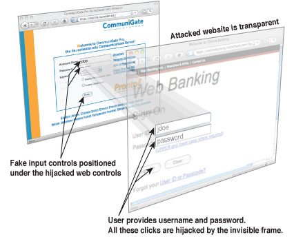

---
 title: "Clickjacking attacks and how to prevent them"
 date: "2021-08-29"
 coverImage: "clickjacking.png"
 author: "Akaash Saxena"
 description: Introduction tos Clickjacking attack and how you can protect your web application by applying different approaches
 tags: ["Clickjacking", "Security", "Malicious"]
 ---

Clickjacking is a type of digital attack where the attacker implements visual tricks to make the victim click on the interface that implements action on another website. This article shows you how the attack works and what you can do to prevent it

# What is Clickjacking?

A clickjacking attack is used to trick an unsuspecting website visitor into doing some different action than what the user intends to (e.g. putting credentials in some other website than the one intended).
 
Such attacks can be done easily performed by hiding the target page’s UI beneath the visible UI (also called *tool page*) in such a way that the victim may end up clicking on the target website. This is the reason this attack is sometimes also called *UI Redressing* . One of the most common examples of this can be found on malicious websites where you click and an ad page loads or gets redirected to a different page.


# How Clickjacking is done?

There are several methods to deploy clickjacking attacks, all of which have a common theme of redressing the target website’s UI in a way to exploit unsuspecting victims, here are some of the ways it’s done:- By using an iframe (transparent overlay) over the malicious page and loading the tool page inside iframe. The malicious page containing the visual element confuses victim into clicking. For example, a graphic element on the download button of a page. The user clicks on the download symbol but due to the overlay, they click on a UI element on the tool page.

- **By using an invisible iframe** :- The attacker creates an invisible iframe (transparent overlay) over the malicious target page and load the *tool page* in that overlay. For example, consider using a free movie streaming website. Oftentimes, the attacker may have hidden the target website under the play button UI, upon clicking on the button you may be redirected to another website.

  

- **By using a pixel iframe** :- Attacker may use a 1x1 pixel iframe which is tethered to victim’s cursor, if they click anywhere they end uploading whatever is positioned in this iframe.

A full list of clickjacking techniques can be found on [W3C (World Wide Web consortium) security page](https://www.w3.org/Security/wiki/Clickjacking_Threats)


# Preventing Clickjacking attacks

Prevention against such attacks lies primarily in the hands of website owners whose websites may be used as a *tool page*. Here we share some ways to make sure that your web assets cannot be used in a clickjacking attack:

 ## Content-Security-Policy: frame-ancestors

Content-Security-Policy (CSP) is an HTTP response header. Primarily designed to protect against Cross-site Scripting (XSS) attacks, it also includes a **frame-ancestors** directive. This directive controls how pages can be embedded by websites by defining the parent pages which are allowed to embed the page. 

 Embedding control covers following tags: <frame>,<iframe>,<embed>,<object> and <applet>.

 > Note: Content-Security-Policy may only be used directly as a response header, it cannot be used with `meta` tags. The best option is to configure your webserver to automatically include it on every page it serves. For that `frame-ancestors` directive is used.
   
 ```Content-Security-Policy: frame-ancestors 'self' ‘\*.loginradius.com’;```
   
 ## X Frame Options
   
X-Frame-Options (XFO) is an HTTP response header. This response header is a an obsolete version of the frame-ancestors directive. X-Frame-Options, however, may only be used as an HTTP header, and not be used as part of meta tags. Just like in the case of CSP frame-ancestors, you may configure your webserver to automatically include it with every page. X Frame Option can only be used once, if used more than once one header overrides the other. Here’s an example of `X Frame Options` header:
   
 ```X-Frame-Options: allow-from https://www.loginradius.com/ ```
   
 ## Framebusting
   
Framebusting (also known as frame breaking or frame killing) is a client-side technique. Unlike previous two there is no modifications done to HTTP headers and instead an addition is done to web page HTML code. This method protects against clickjack attack pretty well and even has backward compatibility with legacy browsers (such as IE6). However, unlike methods discussed before, it is not as reliable as HTTP header options and in some cases may be circumvented (for example, in Internet Explorer 8 by loading the content into <iframe security=restricted>).

   A good general frame buster script to use was published on Codemagi in 2010 and is still valid:
   
 ```
 <style id="antiClickjack">body{display:none !important;}</style>
 <script type="text/javascript">
 if (self === top) {
 var antiClickjack = document.getElementById("antiClickjack");
 antiClickjack.parentNode.removeChild(antiClickjack);
 } else {
 top.location = self.location;
 }
 </script>
 ```
 # Conclusion
 
This article introduces what is a clickjacking attack and stesps to protect your web application from getting used as a way of clickjacking attack. As the primary concern of security defense is not to be bypassed, the best approach is to combine those approaches so that if one fails, say, due to lack of browser support, the other may succeed.
