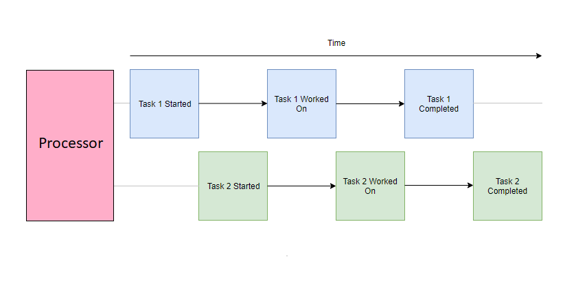
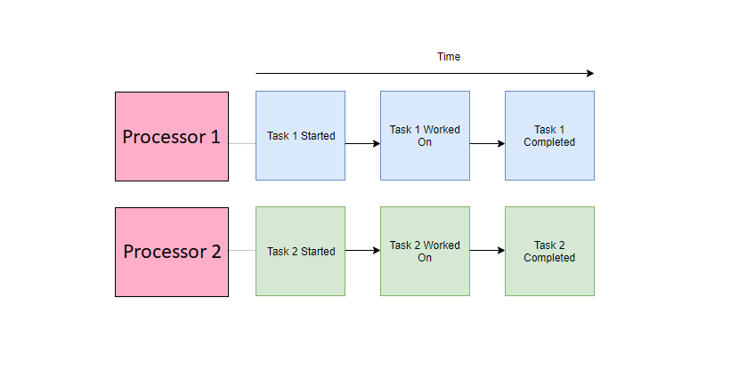

Whenever we talk about asynchronous programming in JavaScript, there is sometimes some confusion in how it can be asynchronous if it is single-threaded. To answer this properly, I think it's a good thing to first have an understanding of the difference between concurrency and parallelism; two terms that are commonly brought up with multithreading.

### Concurrency

Concurrency describes the ability for independent parts of a program to run in an arbitrary order, without affecting the outcome. A concurrent application can execute multiple tasks over an overlapping period. This means that while we can start new tasks before the previous one is complete, we are not able to perform work on each task at the same time.

You can think of a concurrent execution model as a single chef preparing a meal. Any chef worth their salt can work on multiple dishes (or multiple parts of a dish) at once. They might chop the vegetables for their stir-fry while the rice is steamed in the rice cooker, or leave the vegetables to fry in the pan while they clean up their workspace. In this scenario, the chef can perform multiple tasks at once, however, at any given time, he is only able to work on a particular unit of work at a given time. 

You might point out that in this example scenario, the chef can perform other actions while something like the rice is steaming, which is technically work still being done. However, the concurrency in this scenario only applies to the context of the chef, who is not actively working on the rice as it is being steamed.

Similarly, the JavaScript Event Loop allows your scripts (the chef) to hand off tasks like HTTP requests and timeouts to the browser Web API (rice cooker), allowing the script to execute other portions of code while waiting for a response. Once the Web API task is complete, it is pushed back into the call stack of the Event Loop. While the Web API acts as a separate thread where certain tasks can be completed outside the scope of the main thread, your actual JavaScript code is still executed on a single thread, concurrently.

### Parallelism

Parallelism describes the ability for independent parts of a program to be physically executed at the same time. A parallel application can distribute its tasks to independent processors (such as different cores or threads of a CPU) to be executed simultaneously. 

You can think of a parallel execution model as multiple chefs individually each preparing a meal. These individual chefs may be preparing their dishes in a concurrent manner (like the above), or a sequential one; either way, the result is that rather than producing a single meal, the kitchen has prepared multiple meals over a unit of time.

Modern browsers allow you to program parallelly by using Web Workers. These spawn separate threads to execute JavaScript independently from the main thread.

### Parallelism is better?

So we've established that multiple chefs can get a kitchen to produce multiple dishes in the same amount of time as a single dish from a kitchen with a single chef. Modern hardware almost always has multiple threads, so why isn't all code run in parallel? If it takes 1 chef 10 minutes to prepare 1 stir-fry, and 5 chefs 10 minutes to prepare 5 stir-fries, can 5 chefs produce 1 stir-fry in 2 minutes? This is where parallel computation can get difficult. 

Tasks can be sped up by distributing the workload onto multiple threads. However, this requires the workload to be split up in a way that can be independently worked on effectively. Think of how 5 chefs would prepare a single stir fry together:

- For tasks like chopping up vegetables, spreading the workload would be simple.
- Tasks requiring the composition of ingredients would be a bottleneck, no matter how fast an individual can finish his prep of ingredients, they would have to wait until the other ingredients are ready before it can start. Certain tasks would not need all the chefs, the rest would either stand idly by or be dismissed to do other tasks. Requisitioning and dismissing chefs cost time and money, it may not be efficient to only call them up when they are needed.
- Have you tried managing 5 people? Planning would take additional time as each member of the team would need to be told their instructions along with any clarifications they might need. Extra time would be spent communicating between each chef as they prepared each portion of the recipe.

Similarly, on the computing side, programming parallel solutions are generally harder to implement and debug. Depending on the task, they can sometimes even perform worse than serially run counterparts due to the various costs of overhead (transferring data between threads, creating and destroying threads, synchronization of work, etc.).

### Conclusion

To conclude this post, neither are inherently superior to the other. Both execution models are useful tools in producing efficient and reliable solutions and are in many cases used together. Hope this helps to clear up the differences between the two, or if not, at least provided a mildly entertaining analogy to illustrate each.
