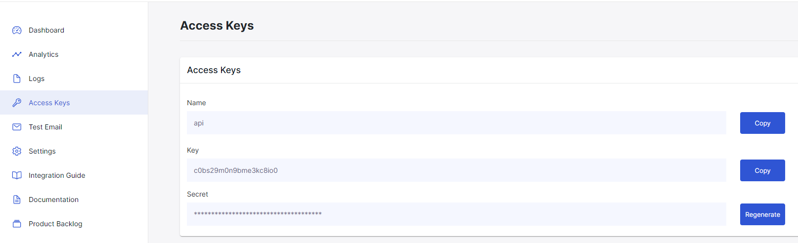
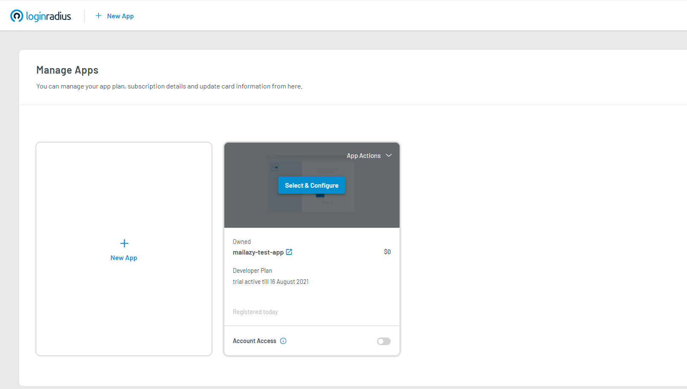
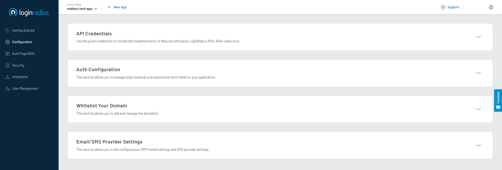
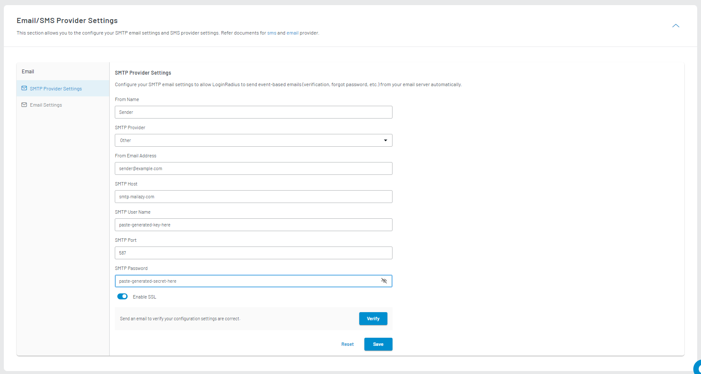
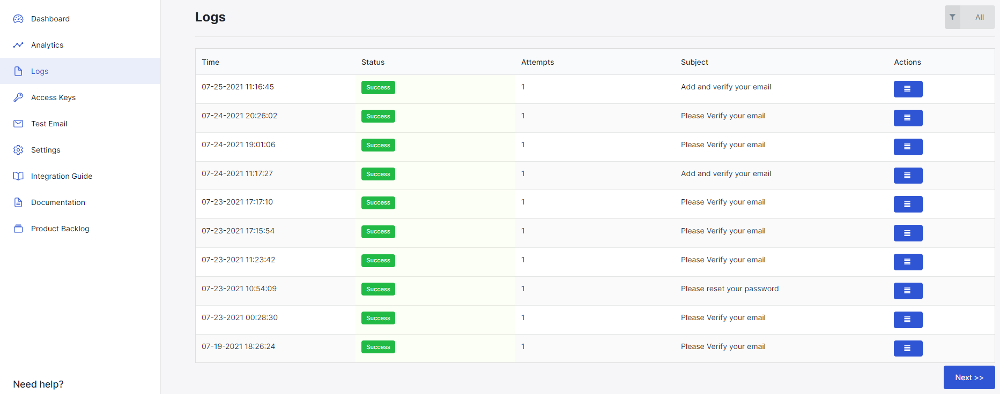

A necessary part of handling users in an application is sending them email. For example, when a user signs up for your app, they should be sent an email to verify their account. LoginRadius handles email for you out of the box, but you can easily change this up to use Mailazy as your email provider.

LoginRadius allows you to configure your own SMTP email provider so you can manage, monitor, and troubleshoot your email communications.

### Prerequisites

* You must have a configured [Mailazy](https://mailazy.com) account. 

### Configure Mailazy

**Step 1:** Sign Up for [LoginRadius Developer Account](https://accounts.loginradius.com/auth.aspx?action=register) account.

**Step 2:** Log in to your [Mailazy](https://app.mailazy.com) account or [sign up](https://app.mailazy.com/signup) for an account if you don’t have one. Go to Access Keys and create Access Keys, Skip if you already have generated access keys.

**Step 3:** Enable and Configure Mailazy as your Email Provider
Navigate to LoginRadius [Dashboard > Click Select & Configure > Configuration](https://dashboard.loginradius.com/configuration).

**Step 4:** Expand Email/SMS Provider Settings 
 1. Select SMTP Provider Settings and select `other` in SMTP Provider dropdown, Type From Name, From Address.
 2. Type SMTP Host value `smtp.mailazy.com` and SMTP Port value `587` .
 3. Paste generated API Key in SMTP User Name and API Secret in SMTP Password.
 4. Enable SSL.

You can send a test email using the Verify button on the same page of the LoginRadius dashboard. If you don't receive an email after a few minutes, check your Mailazy dashboard logs for any failures.

**Step 5:** Check Your Mailazy Account

The [Logs](https://app.mailazy.com/logs) page in Mailazy will now display all emails which have been sent to your users and the delivery status of each message.

**Step 6:** Done!

That's it, you've now got Mailazy set up as your LoginRadius email provider!

### Wrapping Up
There's so much more to authentication today than just entering a username and password. Fortunately we've now got ways to make authentication and identity more secure for both users and companies, all with the added benefit of it being more convenient in many cases. This is made possible with features like social login, passwordless authentication, single sign-on, and multi factor auth. These features can be difficult to implement from scratch, but LoginRadius makes it really easy and seamless. In fact, it's often possible to have authentication set up in an application in under 10 minutes with LoginRadius.

