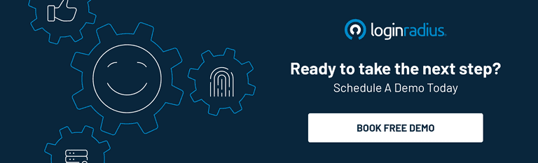

In the present era, people have become more reliant on technology, especially social media. Many people use different devices and platforms to remain connected with their office work and friends. Furthermore, people nowadays can also access their social and work accounts anytime and anywhere as long as they remember their login details and authenticate themselves to the system.

## Continuous Authentication - What is it

Continuous authentication can be regarded as a confirmation process directed at rendering identity verification and cybersecurity safeguard on an open-ended basis. This process estimates the likelihood that the discrete network users are the ones who they claim to be throughout an entire session. However, the method of continuous authentication is fairly new.

Previously, we had static authentication, where the individuals just had to enter their login credentials in the system to log on to any application. The system then evaluates the entered credentials and matches those credential stuffing in the database. If the credentials match the details in the database, the system grants access to the users by successfully authenticating their credentials. However, this static content authentication has become less secure in the present times, where online frauds have become more technological.

In 2018 alone, almost [57% of Canadian internet users](https://www150.statcan.gc.ca/n1/pub/89-28-0001/2018001/article/00015-eng.htm) experienced some form of a cybersecurity incident. Fast forward to pandemic-induced work-from-home months; 3 out of 10 organizations in Canada faced increased cybersecurity attacks. These increased online frauds have called for a more secure authentication process.

This is where continuous authentication comes into the limelight. It has brought a novel perspective to network protection, and the response it has earned continues to illustrate the significance organizations append to their network security these days.

Apart from this, continuous authentication can assist an organization in defending itself from online swindlers. They attempt to take over the online session right after when the user has finished using them. This continuous authentication further assists in securing a network from [phishing](https://www.loginradius.com/blog/start-with-identity/2018/02/phishing-for-identity/) and stuffing threats.

## How Continuous Authentication Operates

Continuous user authentication operates based on user behavior and tries to authenticate a user based on that and has always remained an indispensable element of cybersecurity.

However, with the advent of time, this authentication has grown rapidly from employing a complex password to password-less authentication for user access using methods like facial recognition, biometric authentication, and many more authentication scores.

In the present times, it may seem like all these methods are also not sufficient due to the upsurging in cybercrimes, and the session imposters have become far more advanced. However, the developers have started employing continuous authentication in the network to make these methods more secure.

There are numerous means that the system uses for continuous authentication. Mentioned below are some of the most common verification types that continuous authentication employs for its hassle-free operation.

**1. Biometric authentication**

Biometric authentication is deemed as the most secured authentication method that a system uses. Mentioned here are some of the advantages of biometric authentication:

- Physiological features can be efficiently analyzed to authorized characteristics accumulated in a database.
- Physical access can also be controlled on various entrances with the help of biometric authentication.
- Biometric authentication can also be utilized and incorporated in two-factor authentication.

An instance of the importance of continuous authentication using behavioral biometrics can be a situation when a user puts a two-factor authentication in their system, contemplating that this is the most secured level of authentication that they can use to protect their system.

However, this two-factor authentication can also be easily hacked by the session imposters, and this is the reason why numerous reputed companies and government agencies utilize continuous authentication for a more secured network.

Biometric authentication technology is utilized by numerous organizations, government, military, and other important departments that are in need of continuous authentication for protecting their networks. Some of the most common biometric and continuous authentications comprise:

- **Physical movement**

In this kind of continuous authentication, the system can easily track the bodily movement of a user, like how a person uses their mouse pointers, the velocity of the mouse cursor, and many other factors to authenticate a user.

An example of this kind of continuous authentication can be large multinational companies that employ this authentication to track the movement of their employees.

- **Facial recognition**

In this kind, the system saves the face of the user in the database and hence, will require facial recognition every time the user wishes to use the system interface.

- **Behavioural attributes**

Behavioral patterns are a kind of continuous authentication method where the system identifies some behavioral traits like typing speed, finger pressure on the mouse, etc., for authenticating them.

- **Voice recognition**

This process is the most helpful in the case of banks or any other organization that has a lot of over-the-call interaction. This method of authentication verifies users based on their voice.

**2. Authentication with passwords**

Passwords are considered one of the most prevalent ways of continuous authentication. These are a combination of letters, numbers, strings or any special character that a person uses to protect their network. It is extremely important to [create strong passwords](https://www.loginradius.com/blog/start-with-identity/2021/01/how-to-choose-a-secure-password/) that use all the above-mentioned combinations to give additional security to your network. However, nowadays, these passwords have become more prone to various phishing acts as they can be easily hacked by cybercriminals.

The main reason for passwords losing their effectiveness is due to the fact that many people employ similar passwords for all their accounts as they think they would not be able to remember a different password for every online account. Using similar passwords can easily help imposters hack into a system. Hence, it is advisable that people must use strong and different passwords for all their online accounts to prevent themselves from all fraudulent activities.

**3. Authentication based on certificate**

In this method, the system uses digital certificates to identify its users. A digital certificate can be defined as a digital document that works as a consumer’s license to the system. It carries a key that holds the consumer’s digital signature and is only issued by a certification official. This certification-based authentication system is a more secure way of signing in to a system.

The use of certificate-based continuous authentication can be seen in software development companies where there is a more threat to data and its privacy.

## All About LoginRadius' Continuous Authentication Solution

If you are perplexed in choosing an authentication system for your networks, you can choose LoginRadius' authentication options without batting an eyelid. The continuous authentication solutions provided by LoginRadius comprises of various methods to cater to the needs of various enterprise and users that are stated below:

- **Smart login**

In this smart login continuous authentication method provided by LoginRadius, consumers or enterprises can easily log in with a smart net server without actually logging-in to a domain for additional security.

- **One-touch login**

The consumer is not required to enter the password every time they log on to a system with this method, subduing the threat from entering passwords multiple times.

- **Multi-factor authentication**

[Multi-factor authentication](https://www.loginradius.com/blog/start-with-identity/2019/06/what-is-multi-factor-authentication/) allows users to add various layers of protection to their data. This method requires additional authentication other than a password, including a mobile code, captcha verification, fingerprint, etc.

- **Social login**

In this method, individuals can sign up for their work or social media accounts from a third-party website rather than logging it from their system to protect them from cybercriminals.

All these **authentication methods are provided by LoginRadius make the login and authentication** process more effortless for your users and further assist you in creating a more solid client base and keeping your data safe and secured. The technology of authentication is constantly changing and evolving.

## Conclusion

Many businesses have progressed ahead of password-based authentication and embraced the technology of continuous authentication to intensify the client experience on their network and keep their data secured. [Access management](https://www.loginradius.com/blog/start-with-identity/2021/01/what-is-iam/) has become easier, and also the need for remembering complex passcodes has diminished with this method. Moreover, continuous authentication systems like biometrics further prevent a data breach in the form of cybercrime.

