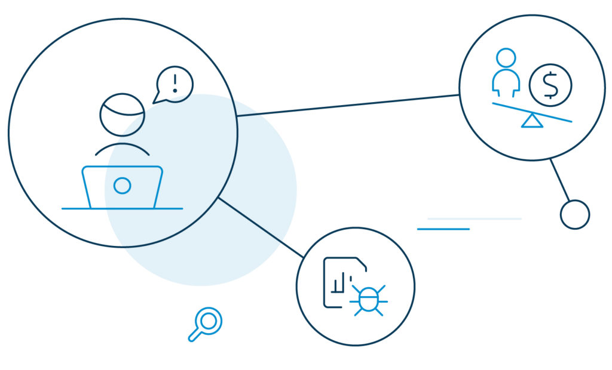

With the COVID-19 pandemic forcing employees to stay indoors, how do you protect your business from a Corporate Account Takeover (CATO) fraud?

The use of stolen workforce identity by cybercriminals has been a popular hacking tactic for many years now. With the current world crisis, it is even easier to exploit coronavirus fears and steal corporate information, especially financial and medical data (which is very sensitive at the moment).

So, what do you do?

Well, as scary as it may sound, there are capabilities around corporate account takeover risk detection that can help organizations fight back.

But first, let’s get to the core.

## What is Corporate Account Takeover

A corporate account takeover (CATO) is a kind of enterprise identity theft where unauthorized users steal employee passwords and other credentials to gain access to highly sensitive information within the organization.

The media, finance, hospitality, retail, supply chain, gaming, travel, and hospitality industry are the hotspots for cybercriminals to devise their corporate account takeover attack.

Here is how the scam works.

The attacker may use phishing tactics, like approaching an employee to discuss an account-related error and then requesting login credentials to fix the issue.

They use the [credentials to hack into the account](https://www.loginradius.com/blog/2019/09/prevent-credential-stuffing-attacks/) and exploit the financial stability and reputation of the account holder – in this case, the employee and the business at large.

Corporate account takeover attacks are becoming more sophisticated and consequential with time and are costing millions of dollars every year.

According to the 2020 Global Identity and Fraud Report by Experian, 57% of enterprises report higher fraud losses due to account takeover.

## Types of organization mainly targeted by account takeover (ATO) attacks

- **Media and Entertainment Industry**: Lately, there is a thriving parasitic ecosystem on the verge of overpowering the [music and video streaming](https://www.infosecurity-magazine.com/blogs/rise-account-takeover-media-1-1-1-1/) industry. Criminals work on a pretty straightforward model here by stealing login credentials from premium customers and selling them at a lower price for illegal access.
- **Financial Industry**: Account takeover attacks also [threaten bank security](https://securityboulevard.com/2019/12/digital-banks-targeted-in-account-takeover-scams/), insurance companies, and other financial institutions. Fraudsters steal victim's credentials or use phishing techniques to trick banks and gain complete control of millions of accounts.
- **Hospitality Industry**: The [hospitality industry](https://www.loginradius.com/blog/2020/03/improve-customer-experience-hospitality-industry/) is a popular and easy target for fraudsters to deploy account takeover strategies. Hackers often seal reward balances and exploit them, resulting in the loss of loyal customers and damage to the brand's reputation.
- **Sports Industry**: The [sports industry](https://www.loginradius.com/blog/2018/11/improving-customer-fan-experience-sports-entertainment-industry/) is a lucrative business. With sensitive information, athlete negotiation figures, medical records, strategy documents, and intellectual property, fraudsters are on the lookout for loopholes to steal those assets.
- **Retail Industry**: Account takeover is a complex challenge for the [retail industry](https://www.loginradius.com/blog/2018/11/improving-customer-experience-in-the-retail-e-commerce-industry/) too. Fraudsters make money from such attacks in a number of ways. Examples include ordering goods with the hacked account, purchasing gift cards, redeeming rewards points, and worst, selling compromised accounts on the dark web.
- **Gaming Industry**: The [gaming platform](https://www.loginradius.com/blog/2020/01/improving-customer-experience-in-the-gaming-industry/) has always been on the account takeover radar. Cybercriminals steal in-game payment information and make illegal purchases. They use [stolen account information](https://www.pymnts.com/fraud-prevention/2019/deep-dive-video-game-fraud/) to pull off phishing scams by luring other players into opening links with free character or in-game currency.

## Business Impact of Corporate Account Takeover

Corporate account takeover is a big deal. It is one of the most damaging cyber threats that businesses and customers face today.

These attacks are difficult to detect as criminals hack into accounts with legitimate credentials. By and large, these attacks hurt businesses’ reputation, scare customers, and can even end up with companies having to pay a heavy penalty.

For instance, if the violation is booked under the EU’s GDPR, a fine as much as 4 percent of global annual turnover may be levied.

**Some recent account takeover attacks:**

1. [J.Crew data breach](https://www.scmagazine.com/home/security-news/j-crew-says-year-old-breach-exposed-customer-account-info/): In March 2020, J.Crew informed its customers that an unauthorized third-party accessed their accounts nearly a year ago.
2. [New Marriott data breach](https://www.loginradius.com/blog/2020/04/marriott-data-breach-2020/): In March 2020, Marriott International announced another data breach that approximately affected 5.2 million guests.
3. [Decathlon left data breach](https://www.computerweekly.com/news/252479101/Sports-retailer-Decathlon-left-employee-data-exposed): In February 2020, sports retailer Decathlon accidentally exposed more than 123 million employee data on an unsecured ElasticSearch server.

## 7 Common Attacks That Lead To Corporate Account Takeover

Not [all cyber attacks](https://www.loginradius.com/blog/2019/10/cybersecurity-attacks-business/) are highly technical. In fact, the majority of them use simple tricks to deceive users into sharing their login credentials. Here are a few authentication attacks that may end up with a corporate account takeover.

### 1\. Phishing Attack

Perhaps the most common of all attacks, the bad guys during phishing attacks pose themselves as legit organizations and ask for personally identifiable information (PII) from the individual or company.

The goal is to trick the recipient (over a phone call, email, or text messages) into taking action, like opening a link or downloading an attachment with malicious code.

PII is any data that can be used to identify an individual. For example, name, geographic location, SSN, IP address, passport number, etc.

**Tips to detect a phishing attack**

- Emails starting with generic greetings like “hi there” instead of the recipient’s name.
- Emails that ask you to complete an action almost immediately. For example, your account will be blocked if you do not provide a set of details.
- Emails that do not take you to a page it claims to, and the URL does not begin with HTTPS.

### 2\. Brute Force Attack

Fraudsters conduct this type of corporate account takeover to target large businesses. They use automated bots to systematically check and identify valid credentials to crack password codes and log in to compromised accounts.

**Tips to detect brute force attack**

- Surprisingly high login attempts on a single account.
- Failed testing attempts with multiple account ids and passwords.
- An exponential rise in account locks.
- More and more cases of hijacked accounts.

### 3\. Credential Stuffing

If your employees have been using the same password for multiple accounts, consider it a treat for cybercriminals. [Credential stuffing happens](https://www.loginradius.com/blog/2019/09/prevent-credential-stuffing-attacks/) when the attacker uses bot attacks to verify login credentials instead of manually testing credentials one-by-one.

**Tips to detect credential stuffing**

- High rise in login attempts and failed login counts.
- Irregular traffic volumes.
- High use of non-existing user names during authentication.
- Abnormal bounce rate on the authentication page.

### 4\. Man-in-the-middle attack

The man-in-the-middle attack is a kind of cyber eavesdropping where the attacker intercepts communication between two entities and manipulates the transfer of data in real-time.

For example, the attacker will exploit the real-time processing of transactions between a bank and its customer by diverting the customer to a fraudulent account.

**Tips to detect man-in-the-middle attack**

- TCP and HTTP signatures during user sessions do not match.
- Evil twin Wi-Fi networks like IkeaFreeWiFi and IkeaWiFiJoin in the same location.
- Login pages that look fake.
- Software update pop-ups that look illegitimate.
- Suspicious SSIDs.

### 5\. Password spraying

Password spraying is also a kind of brute force attack where the attacker feeds in a large database of usernames and password combinations in the hope that a few of those will work.

It can be a dictionary attack where fraudsters enter the [most commonly-used passwords](https://www.loginradius.com/blog/2019/12/worst-passwords-list-2019/) to hack into accounts. A lot of people still use the same password for multiple sites.

**Tips to detect password spraying attack**

- Login attempts from non-existent users.
- Significant increase in account lockouts.
- High login failure rate.
- Repeated login attempts from the same URL.

### 6\. Social Engineering

Social engineering is a kind of corporate account takeover attack where the cybercriminal manipulates an employee into giving away login credentials or access into sensitive information.

Fraudsters conduct social engineering in stages. First, they gather information about the intended victim. Then, they plan to launch and execute an attack by exploiting the victim’s weakness. Finally, they use the acquired data to conduct the attack.

**Tips to detect social engineering attack**

- Unsolicited emails requesting payment information.
- Asking for OTP following a two-factor authentication.
- Suspicious chat boxes popping up.

### 7\. Session Hijacking

As the name suggests, session hijacking happens when the attacker takes complete control of a user session. Note that a session starts when you log in to a service like your banking app and ends when you log out of it.

A successful session hijacking results in giving the attacker access to multiple gateways like financial and customer records and to other applications with intellectual properties.

**Tips to detect session hijacking**

- Unusual frequency in the Received Signal Strength (RSS).

## Best Business Practices to Prevent Corporate Account Takeover

Start with building a strong relationship with your employees. Make them understand what security measures they need to implement to safeguard their accounts and prevent unauthorized access to corporate data.

Here are a few standard practices that you can follow:

- Flag emails that are too similar to your corporate email account.
- Register all domains that resemble your actual corporate domain.
- Add [MFA/2FA authentication](https://www.loginradius.com/multi-factor-authentication/) to verify the payment location, if it has been changed.
- Block unauthorized access attempts with authentication factors like biometric identifiers.
- Use phone, email, or any other verification factor to confirm fund transfer requests.
- Install spam filters in all systems across your organization.
- Install security updates as and when available.
- Perform security scans every month and note unexpected changes and unusual pop-ups.
- Educate employees not to use publicly available access points.
- Educate employees not to open unidentified attachments and emails.
- Train employees on how to identify suspicious emails.

## How LoginRadius Eliminates Account Takeover Attacks for Enterprise Customers?

Customer-facing enterprises deal with large volumes of data every day. And it is their responsibility to protect them.

LoginRadius is a cloud-based [customer identity and access management](https://www.loginradius.com/blog/2019/06/customer-identity-and-access-management/) (CIAM) platform that gets the much needed extra layer of protection for enterprises to protect customer data. The CIAM solution detects malicious activity before it can cause any harm to organizational reputation.

Check out how LoginRadius prevents corporate account takeover attacks for enterprises:

### Passwordless Authentication or Instant Login

To remove the risk of passwords altogether, LoginRadius offers [passwordless authentication](https://www.loginradius.com/blog/2019/10/passwordless-authentication-the-future-of-identity-and-security/) or instant login.

Customers can either login using a magic link or via an OTP delivered to their registered email address or phone number. The best part, this method does not require registration or any preassigned credentials to log in.

### Multi-Factor Authentication

The secure identity and access management provider also offers two-factor or [multi-factor authentication](https://www.loginradius.com/blog/2019/06/what-is-multi-factor-authentication/) (2FA/MFA). This feature provides an extra layer of security to ensure that the right customer gets access to the correct account.

For example, the customer is required to enter an OTP or answer a security question, even after filling in the login credentials.

### Risk-based Authentication

This standard CIAM system also offers risk-based authentication (RBA).  This feature verifies a customer's identity by adding a new layer of protection in real-time if any unusual login pattern is identified.

For example, an access attempt with a different login device, or from a suspicious geographic location to prevent the risk of a corporate account takeover.

### Security and Compliance

Both the [EU's GDPR and California's CCPA](https://www.loginradius.com/blog/2019/09/ccpa-vs-gdpr-the-compliance-war/) are examples of global standards that rule the flow of customer data and keep them safe. Most western countries follow similar regulations, and others are catching up.

LoginRadius is compliant with the majority of the global standards and you can even tailor it to meet the regulatory requirements depending on the industry and country of business.

### Consent Management

At LoginRadius, consent management is another feature that is offered along [with privacy compliance](https://www.loginradius.com/gdpr-and-privacy/). It manages customer's consent about data collection, storage, and communication. Customers can alter existing permissions and apply new ones according to their will.

### Data Management

LoginRadius also prevents corporate account takeover attacks with [customer data management](https://www.loginradius.com/data-governance/). It provides an overview of individual profiles from its admin console and tracks their activities.

Enterprises can manage millions of customers and perform manual actions on behalf of customers, like provisioning new accounts and triggering verification emails.

## Conclusion

Corporate account takeover can translate into millions of dollars in losses, damaged brand image, and customer trust. As an enterprise, you and your employees are responsible for keeping finances and data safe.

Stay informed about evolving threats, understand the warning signs, and practice responses to suspected takeovers.

