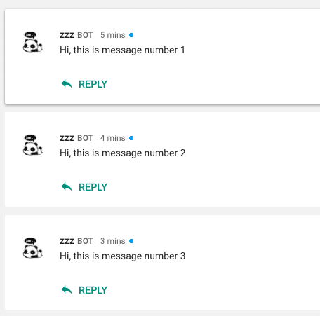

Time Required: 20 minutes.  
Technologies: Express, Node.js, JavaScript.  
Prerequisites:

- Basic knowledge of Express, Node.js, and JavaScript.
- Node.js and npm are installed.

This tutorial will go over how to build a bot that will respond to pings (i.e. @<bot-name>), and send messages to a chat room. On a high level, the bot will run on an express server, and receive pings via an HTTP endpoint. Responses to pings will be sent synchronously through a payload in the HTTP response, while bot-initiated messages will be sent asynchronously using the Google Hangout Chat API.

##### **Outline**

1. Environment setup.
2. Get bot to respond to pings.
3. Send bot-initiated messages.
4. Deploy.

##### **Environment Setup**

Create a new project with the file ‘app.js’.  
Open command line/terminal, and navigate to your project directory. Run ‘npm init’, and press enter until package.json is created. Next, install the following dependencies:

- express: `npm install express --save`
- body-parser:  `npm install body-parser --save`
- googleapis: `npm install googleapis --save`
- unirest:  `npm install unirest --save`

In ‘app.js’, let’s setup our server:

```js
const express = require("express")
const bodyParser = require("body-parser")
const { google } = require("googleapis")

const app = express()

app.use(
  bodyParser.urlencoded({
    extended: false,
  })
)

app.use(bodyParser.json())

app.listen(8100, function () {
  console.log("App listening on port 8100.")
})
```

Running ‘node app.js’ will now create a local server on port 8100.

##### **Responding to Pings**

The bot will respond to pings through a HTTP POST endpoint. Create one with express:

```js
app.post("/", function (req, res) {
  console.log("someone pinged @")

  if (req.body.type === "MESSAGE") {
    return res.json({
      text: "sleeping...",
    })
  }
})
```

The bot will respond with the text: ‘sleeping…’.

Synchronously responding to messages simply requires us to return a response to Google. The downside to this is the 30 second time limit before Google no longer accepts responses to the request. For instance, this would be a problem if you were building some kind of reminder app; the bot wouldn't be able to synchronously respond after 30 seconds. This is where async responses come in.

##### **Bot-initiated Messages**

To show this, we will have our bot post to a chat room every 1 minute.

Sending async messages to Google API requires a Service Account for authentication. Once authenticated, we can make a POST request to a Google API URL that will create a message.

So first, create a Google Service Account following these [steps](https://developers.google.com/hangouts/chat/how-tos/service-accounts). Take the downloaded JSON file and put it in the root directory of your project. Here, we renamed it to googlekeys.json:

```js
const gkeys = require("./googlekeys.json")
```

We will be making POST requests using Unirest:

```js
const unirest = require("unirest")
```

Now generate a JWT that will be used in our POST request:

```js
function getJWT() {
  return new Promise(function (resolve, reject) {
    let jwtClient = new google.auth.JWT(
      gkeys.client_email,
      null,
      gkeys.private_key,
      ["https://www.googleapis.com/auth/chat.bot"]
    )

    jwtClient.authorize(function (err, tokens) {
      if (err) {
        console.log("Error create JWT hangoutchat")
        reject(err)
      } else {
        resolve(tokens.access_token)
      }
    })
  })
}
```

Here is our function for posting messages. ROOM-ID can be found in the URL of the hangout chat room page i.e.: `https://chat.google.com/u/0/room/{ROOM-ID}`

```js
function postMessage(count) {
  return new Promise(function(resolve, reject) {
      getJWT().then(function(token) {
          unirest.post('https://chat.googleapis.com/v1/spaces/' + {ROOM-ID} + '/messages')
              .headers({
                  "Content-Type": "application/json",
                  "Authorization": "Bearer " + token
              })
              .send(JSON.stringify({
                  'text': 'Hello! This is message number ' + count,
              }))
              .end(function(res) {
                  resolve();
              });
      }).catch(function(err) {
          reject(err);
      });
  });
}
```

Finally, add the code that will repeat our post every minute.

```js
const timer = require("timers")

app.listen(8100, function () {
  console.log("App listening on port 8100.")

  let count = 0
  timer.setInterval(function () {
    postMessage((count += 1))
  }, 60000)
})
```

##### **Deploy**

Expose your local server to public (we used [ngrok](https://ngrok.com/)).

Login to [developer console](https://console.developers.google.com). Create a new project, and enable Hangout Chat API. Under configuration, set:

- status: live
- bot name (this is how you will add and ping the bot)
- avatar
- description
- functionality: rooms
- connection settings - bot URL: <your ngrok HTTPS url>
- permission: everyone in your domain

Restart your local server, and that’s it! Make sure you have your bot added to the chat room, and you can ping it by sending @<bot-name>. The bot will also post to the chat room every minute.

There are a lot of different ways to further extend this bot, such as setting reminders/notifications, making to-do lists, displaying server logs, and interacting with API’s.




