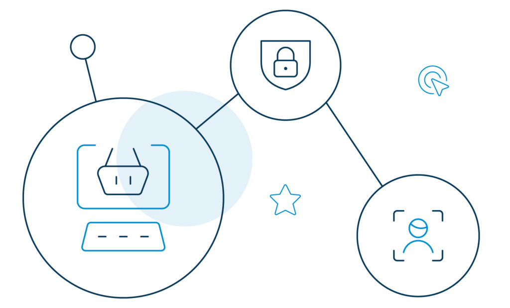

As we try to adjust our lives around the coronavirus pandemic, customer experience in the retail industry witnesses a drastic change.

The ongoing apocalypse is altering the way brands sell their products. The retail industry is adjusting according to the shifting technology to earn new customers and maintain their existing customer base.

Well, it seems like an exciting phase has already begun in the retail market.  More and more companies are [leveraging excellent customer experiences](https://www.loginradius.com/customer-experience-solutions/) to attract maximum profit.

After all, it is only through happy customers that retailers can establish a competitive advantage over others. Now, the question is, how can businesses drive customer experience in the retail industry?

Let's find out.

## Reshaping Customer Experience in Retail 

A perfect customer experience strategy not only depends on the product, store, and shoppers, but also on how businesses align the mentioned entities smartly. They need to incorporate customer experience across different retail genres.

Let's explore the popular genres one-by-one.

### **Food and Grocery Retail**

Competing for [customer loyalty](https://www.foodnavigator-usa.com/Article/2020/04/22/Investing-in-the-Future-of-Food-DTC-sales-meet-consumer-demand-build-loyalty) is a tough job for food and grocery retailers. After all, most of them offer the same product.

For example, if customers are looking for readymade pizza dough, they will have multiple brands to choose from.

So, how do retailers sustain in the competition?

For starters, they need to understand the fact that shoppers aren't loyal to the products but the overall shopping experience. In this case, pizza dough – because they are basically all the same. If you can offer a "feel-good" experience at your retail store, people will keep coming back for more.

Hold on! There's a hiccup, though.

The buying preferences, behaviors, and expectations in the food and grocery industry vary from person to person. Brands that are looking to sustain and flourish amid the competition need to meet the growing demand of this dynamic environment.

### **Local Retail**

People still perceive local stores as the best value provider for their time and money. Hence, making some tempting changes can go a long way and create a big impact.

However, there is no need to revolutionize how local stores work entirely. Making shoppers a fan of in-store experiences is enough to get them coming back.

Another way to enhance the customer experience in the local retail industry is by surprising shoppers with a gift. When you give people something for free, they are naturally obligated to do something in return — simple philosophy.

Also, try to give your customers the luxury of personalized experiences. In the homogenous world that we live in, if you can personally interact with them on how to use your product and explain the distinction between similar products –that's a win!

### **Departmental Stores and Supermarkets**

Do departmental stores and supermarkets have any scope of competing with the e-commerce market? The answer is yes, provided they can show what sets them apart.

They need to win customers with the best possible [customer-centric approach](https://www.forbes.com/sites/callyrussell/2020/04/30/the-secret-to-retail-success-post-coronavirus-adopting-a-consumer-centric-approach/). In practice, this could mean if a customer asks for greek yogurt, they should be led to the yogurt aisle, instead of just informing them about where it is.

Also, stores should focus on quality over quantity. From the quality of the products to the "Thanks for shopping. See us again soon!" customer farewell card, all touchpoints must meet the required set of standards.

All-in-all, give your customers emotional shopping experience. Make them eager to come back soon.

Moving on, let's find out a few ways how [brands can enhance customer experiences](https://www.loginradius.com/blog/2020/04/omnichannel-customer-experience/) and benefit from them.

## How Retail Companies Can Benefit From Customer Experience

The retail industry is brutally competitive. It takes more than offering the right product at the right price to deliver amazing customer experiences. As already discussed, brands also need to treat customers with respect and trigger them on an emotional level.

What more does it take to amplify customer experience in the retail industry? Here are a few ways of how retail companies benefit from customer experiences.

### **Boost customer engagement.**

Heard of the [Just Walk Out](https://www.justwalkout.com/) by Amazon? Yes, the technology that allows shoppers to enter a store, pick whatever they want, and leave without going through the checkout process.

Now, that's an excellent example of how frictionless retail can boost customer engagement.

Work is already in progress. Retailers are leveraging RFID scanning to their advantage to offer fast and error-free billing, together with AI.

### **Build customer loyalty and retention.**

When it comes to customer experience in the retail industry, compared to [brick-and-mortar stores,](https://investorplace.com/2020/05/betting-on-retail-stocks-at-the-end-of-the-brick-and-mortar-world/) the online shopping environment has a lot to offer.

There is one downside, though - and it is the inability to touch and feel the products before making a decision. Retailers need to break even to rebuild customer loyalty. They need to bring the convenience of online shopping to brick and mortar stores and make in-store experiences as smooth and easy as possible.

The good news is that initiatives like smaller format stores, auto-checkout, online ordering (while inside the store), and mobile app offers are in action to lure shoppers back into physical stores.

### **Enhance customer lifetime value.**

The ease of personalization helps a great deal in increasing the lifetime of a customer with your brand. Therefore, come up with easier ways for your shoppers to locate their favorite products. Make them feel like you understand their pain points, and it is your responsibility to solve their issues.

Speaking of the online format, it will involve features like showcasing product recommendations based on previous purchases, or curating a personalized homepage altogether.

In a brick-and-mortar store, personalization will mean installing digital fitting rooms and creating recreational areas to sit down and rest for a while. In a way, it will also add up to the amount of time customers spend with your brand.

### **Improve sales conversion with Single Sign-On.**

One major aspect of driving a seamless online experience is curating a customer-focused journey for your shoppers. The first thing that comes to mind during online sales is allowing customers to check-in and checkout gracefully.

Creating a frictionless experience with [single sign-on (SSO) registration](https://www.loginradius.com/blog/2019/05/what-is-single-sign-on/) will allow customers to interact with your brand with a single set of credentials, eliminating the need to create multiple accounts.

Furthermore, it will be easier for brands to consolidate all customer data (purchase history, shipping, and billing data) into a single database.

## The role of LoginRadius to protect customer data for online retail business

LoginRadius is a [customer identity and access management](https://www.loginradius.com/blog/2019/06/customer-identity-and-access-management/) tool that offers a seamless and secure way to access customer information - in your case, shoppers' data.

From the online retail point of view, LoginRadius offers a number of perks like simplifying the customer registration process, creating unified customer profiles and larger databases, reducing application-related complexities, streamlining customer purchase and interaction data, and [ensuring security compliances](https://www.loginradius.com/blog/2020/03/how-loginradius-helps-enterprises-stay-ccpa-compliant-in-2020/).

Let's dig further into the identity platform to find out more about how it [helps retailers protect shoppers' data](https://www.loginradius.com/blog/2020/04/loginradius-ciam-retail-ecommerce-business/).

**Passwordless login**: In the retail industry, registering or logging in without a password calls for customer retention and loyalty. By enabling the one-touch login feature, [customers can log in](https://www.loginradius.com/blog/2019/10/passwordless-authentication-the-future-of-identity-and-security/) with a magic link or OTP sent to their mobile number or email id.

**Progressive profiling**: Through [progressive profiling](https://www.loginradius.com/progressive-profiling/), retailers can collect information about customers with the help of dynamic web forms at different stages during the purchase journey.

**360-degree view**: Retailers can enjoy a complete view of their customer demographics. It will help them understand customer behavior and build better relationships by tweaking their approaches accordingly.

**Social sign-on**: This form of one-click authentication via the [customer's social media accounts](https://www.loginradius.com/social-login/) reduces the associated hassles of remembering user ids and complex passwords.

**Security and compliance**: LoginRadius adds additional layers of protection with two-factor or [multi-factor authentication](https://www.loginradius.com/blog/2019/06/what-is-multi-factor-authentication/). Not to forget, real-time fraud analysis and data management to prevent hacking attempts. The platform is also compliant with international security standards like the [GDPR and CCPA](https://www.loginradius.com/blog/2019/09/ccpa-vs-gdpr-the-compliance-war/).

## Conclusion

Rivalry in the retail industry has always been a big deal. Amidst online players and physical stores competing with one another to keep shoppers on the hook, the line between the two entities is gradually blurring.

It is only a matter of time that customer experience in the retail industry will win the war, and nothing else will matter.

