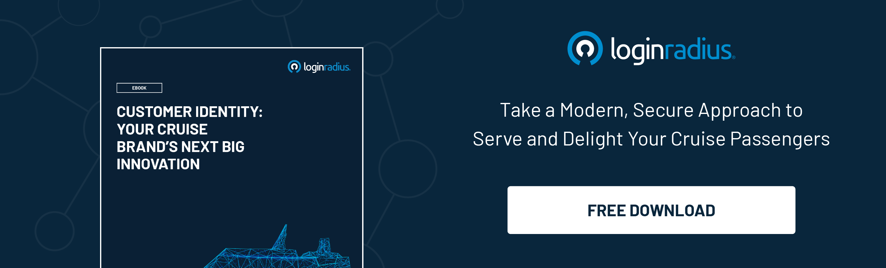

I’m looking forward to my first ocean cruise … someday. Living in Vancouver, I can see the enormous ships docked at Canada Place or heading out to sea across English Bay.

I’ve always been more of an adventure traveler, making my own itinerary, researching out-of-the-way spots. The logistics were part of the fun.

But now that I’m a mom, I fantasize about spending a week in one place without having to make any arrangements, ask for directions, or even take out my credit card. (If indie rock star Jonathan Coulton and his 1,848 closest friends are there playing tabletop games, so much the better.)

Cruise lines are well-known for their innovation in creating enormous ships and fun stuff to do on them. Some of the big players are also doing interesting things around [customer experience](https://www.loginradius.com/resource/customer-identity-your-cruise-brands-next-big-innovation/), both digital and onboard.

MSC Meraviglia and Royal Caribbean are simplifying embarkation so you don’t have to stand in line. Instead, you can upload all your travel documents and download boarding information ahead of time with online check-in ([Telegraph](https://www.telegraph.co.uk/travel/cruises/articles/cruise-ship-technology-innovation/)).

Onboard, cruise brands are using technology to provide better service than you would get from humans alone. The Ocean Medallion from Carnival carries your guest ID, which connects to your encrypted customer profile in the cloud. You can wear it as a pendant or bracelet—Bluetooth Low Energy and NFC mean no swiping required. The Ocean Medallion automatically unlocks your cabin door as you approach, pays for drinks and merch, and locates your travel companions. Fifteen fewer things to worry about? Sign me up!

The Ocean Medallion also connects with the Ocean Compass, which acts like a digital concierge delivered on devices all over the ship. So the interactive screens and even the staff people learn your favourite drink and whether you prefer Broadway shows or dance lessons ([Wired](https://www.wired.com/2017/01/carnival-ocean-medallion-wearable/)).

Innovations like these are certainly attention-getting. But what travelers like me don’t see is the infrastructure that makes them possible: a customer identity solution.

**Online check-in, smart wearables, and interactive screens all depend on a secure and centralized location for [customer profile data](https://www.loginradius.com/customer-profiling/).**

And finally, we explain how a customer identity and access management (CIAM) platform meets those challenges and makes customer experience innovations possible.

