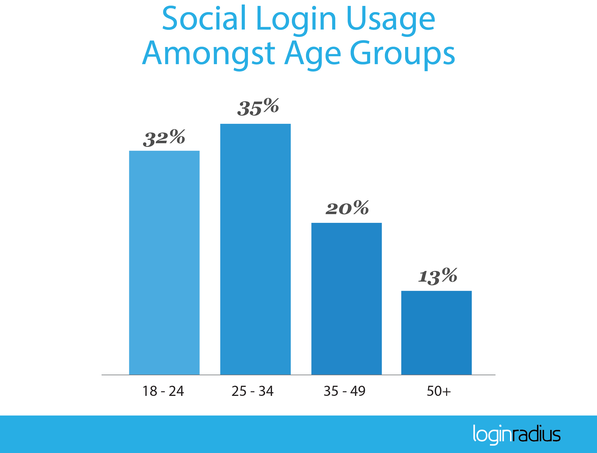
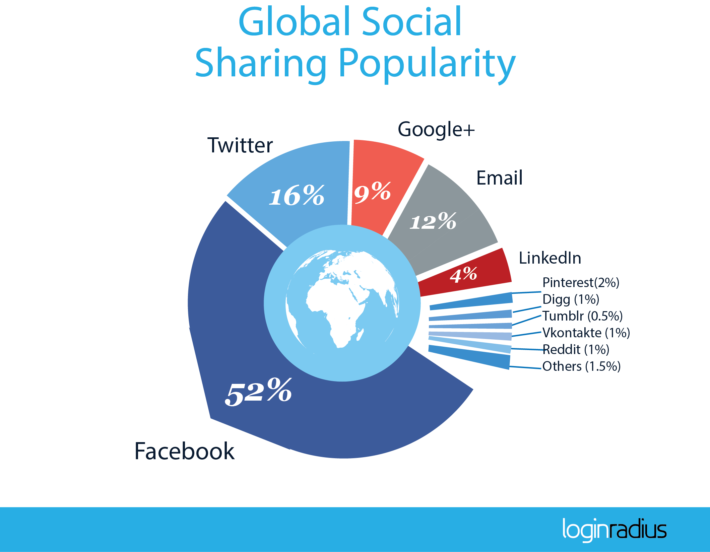

In an expansive [article for Harvard Business Review](https://hbr.org/2013/09/the-truth-about-customer-experience), McKinsey and Company analysts have described Customer Experience as “cumulative experiences across multiple touch points and in multiple channels over time.” But if somebody asks for a mathematical definition of something as psychological as Customer Experience, one could blurt out: “Customer Experience is the integral from the beginning to the end of the customer-business relationship of the integral of individual user experiences across all touch points.” Why someone would ask for a mathematical definition is a discussion for another day.

You can choose the definition you like (we bet you will go with the McKinsey guys) but the point here is about what customers want and what satisfies them. Often the seemingly simpler things matter the most, particularly when these things figure quite a number of times. For instance, let’s say you provide the means for your customers to sign in using their social identities. Owing to obvious constraints, you can only provide for direct links to login with two or three social identities. If your customers choice of identity doesn’t figure in your top two or three list, they are forced to go to another page to look for their choice of identity. It’s a simple thing made difficult because of the lack of knowledge of what your customers preferences are.

To know what your customers like and prefer only makes things simpler and clearer. Customer preferences don’t just alter minor things but can also influence long term strategy. Analysis of customer preferences is critical to businesses.

But don’t worry. We got you covered.

The LoginRadius Analytics team analyzed customer behavior data from over 160,000 websites, powered by our [Customer Identity Management (CIM) platform](https://www.loginradius.com/), and compiled analysis about what customers preferences are and how those preferences vary with specific demographic characteristics. Our Customer Identity Preference Trends Report for Q1 2016 is now available for download [here](https://www.loginradius.com/resource/customer-identity-preference-trends-2016/). And while you download the report, we will give you a sneak peek into what customers generally want.

Once again, Facebook held its forte and emerged as the most preferred social identity for logging into websites. Google+ followed in second place but with a much smaller share in the social identity space. About 94% customers use their Facebook or Google+ identities to sign into websites which is mammoth number telling you these two networks should be the top on your list.

But if your target audience is above 35 years, you will have to think again because only a third of all the customers who used their [social identity to sign into websites](https://www.loginradius.com/social-login/) were aged above 35 years. If that is not all, Social Login from desktop computers (both Windows and Mac) ran up to a mammoth 80% of all which should tell you that if you are targeting mobile, it should be the mobile app.

Facebook did lose some ground to Google+ in Q1 2016 but not by an amount that would worry the social giant. Nevertheless, Google+ will be heartened by its performance. Sharing, however, is a different story and not one that the search giant would be really happy about. More than half of the social content on the Web is hosted on Facebook while, like in Q4 2015, Twitter comes in second with 16%. Email is not be discounted again as it has notched up the third place and is expected to go strong in the coming quarters too.

Some more critical insights provided by the analysis are:

- - In Q1 2016, females trumped males in the use of Social Login by 14%.

- - Among mobile platforms too, iOS run devices lead the way pipping Android.

- About 92% websites still prefer providing Facebook as one of the options for Social Login leading the favourites list since 2013.
