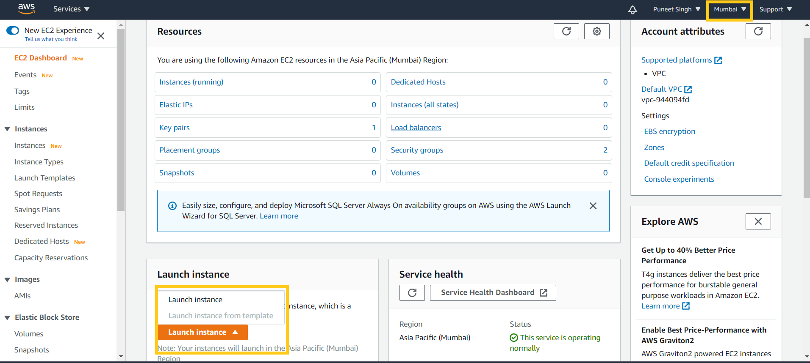
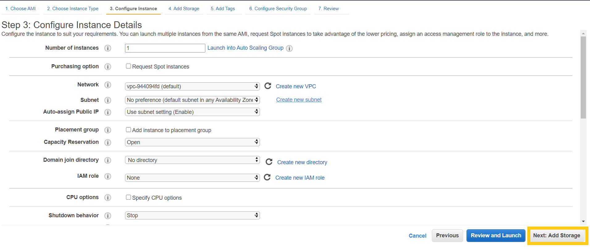
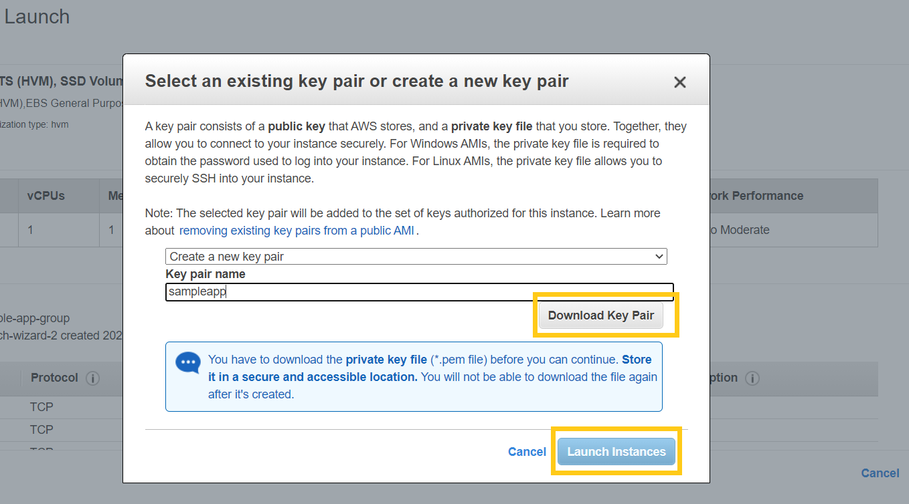

AWS EC2 is a virtual computing environment (known as instances) to develop and deploy applications. To create an EC2 instance in AWS, we need an active Amazon Web Services account.

## EC2 Dashboard

First, let's login into our AWS account. Once login, we will land on the Management Console page, we can see all the AWS services.

There is a drop-down on the top left corner, which is one more option to search and browse all the services provided by AWS. You can find `EC2` under the `Compute` category.

Once we click on `EC2` you will be redirected to the **EC2 Dashboard**. It shows the information related to all the EC2 resources for a specific Region in our account.

> Note: If we change the region from the top right corner of the dashboard, it will show the selected region's information. In the below snapshot, we have selected `Mumbai` region.

There is a button `Launch Instance` to create a new instance in the selected region on the dashboard's bottom section.

## How to launch an EC2 Instance

After clicking the Launch button, we need to select the Amazon Machine Image (AMI) it includes the operating system and applications required to launch an instance. Here we will select the Ubuntu Server 20.04 LTS as shown in the below snapshot.

The next step is to choose the type of instance we need. AWS provides many types of instances based on different use cases with various CPU combinations, memory, storage, and networking capacity. We will here select the `t2.micro instance`, which is a free tier eligible instance.

> while writing this tutorial, Amazon provides 750 hours per month of free usage on the t2.micro instance. It makes it very affordable to run small/sample applications for an initial period.

On the Instance Configuration Details Page, we have options to run more than one instance at once, and there are other configurations regarding roles and access management. We will skip all this and click on the `Next: Add Storage` button.

We can increase or decrease the size of instance storage while creating it; the free tier is eligible upto 30GB; if you need more storage, it will be billed according to [Elastic Block Store (EBS) Pricing](https://aws.amazon.com/ebs/pricing/)

On the next screen, we can add tags to our instance and storage; these tags are key-value pair which are very useful to add properties to our resources, especially when we have multiple instances.

We can define the firewall rules in a security group attached to our instance. With the help of these rules, we can control the traffic to our instance.

Once we are done with firewall rules, we can review the complete detail of our new instance on a single page, and here we can click `Launch` button to launch the instance.

When we click `Launch`, it will open a pop-up that will require you to select a pre-existing public-private key-pair or create one to connect to our instance securely. Once you select/download the key, you will be able to launch the instance.

It will take approximately 5-10 min to launch the instance. Once launched, You can see the list of your running instances by clicking on the `Instances` button on the left menu.

## Conclusion

As you can see, it is effortless to create a free tier AWS instance to deploy your application. In the upcoming article, we will show you how to deploy an application on the EC2 instance and the best practices.
