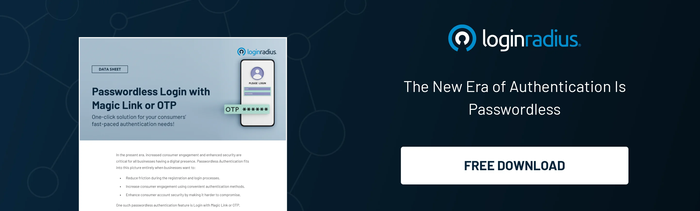
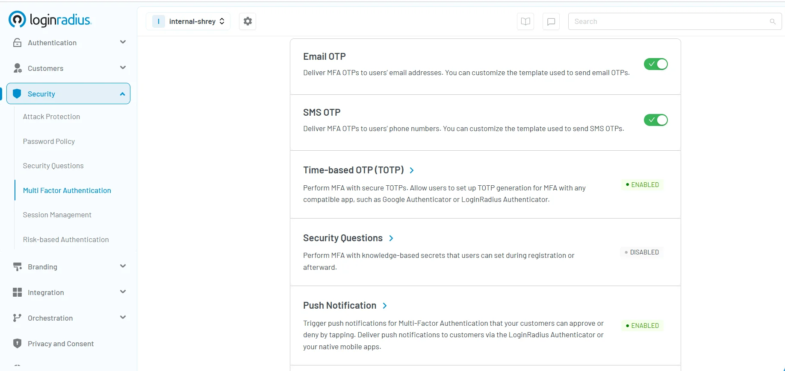

## Introduction

A time-based one-time password (TOTP) is a secure, temporary code used for user authentication. It's part of a family of [one-time passwords (OTPs)](https://www.loginradius.com/blog/identity/what-is-otp-authentication/) and is generated using a combination of the current time and a shared secret key. Because the TOTP changes every 30 or 60 seconds, it offers a significant advantage over static passwords. 

In the landscape of cybersecurity, TOTP serves as a dynamic layer of protection, mitigating the risks associated with reused or stolen credentials. This mechanism is often integrated with mobile apps like Google Authenticator, [LoginRadius Authenticator](https://www.loginradius.com/updates/2024/08/31/loginradius-authenticator-app-release-1-1-0/), or Authy—collectively known as Time-based One-Time Password (TOTP) authenticators.

## How Does TOTP Work?

Understanding how Time-Based One-Time Passwords (TOTP) work requires a look into their underlying cryptographic mechanism. 

At its core, the TOTP algorithm generates a temporary, time-sensitive code by combining a shared secret key with the current timestamp. This is a secure and standardized method defined by RFC 6238, and it's widely adopted in modern CIAM solutions like [LoginRadius](https://www.loginradius.com/docs/user-management/data-management/about-loginradius-tokens/?q=token+authentication).

### Here’s how TOTP works step-by-step:

#### 1. Secret Key Generation and Distribution

During initial user enrollment, the server generates a unique shared secret key for the user. This key is securely distributed—typically through a QR code that the user scans using a TOTP-compatible authenticator app (e.g., Google Authenticator, Authy, or LoginRadius Authenticator). This ensures both the server and the user’s device store the same [cryptographic key](https://www.loginradius.com/docs/api/v2/customer-identity-api/passkey/?q=cryptographic+key).

#### 2. Time-Based Counter Calculation

The current Unix time is divided into fixed time intervals—usually 30 seconds—to generate a moving counter. This time window ensures that a new password is generated periodically and expires quickly, minimizing its reuse potential. 

#### 3. HMAC-Based Hashing 

The server and the client (authenticator app) each compute a hash by combining the shared secret key with the time-based counter using a cryptographic hash function like HMAC-SHA1, though HMAC-SHA256 and HMAC-SHA512 are also supported for enhanced security, as per the LoginRadius platform. 

#### 4. Token Generation (Truncation and Modulo)

A portion of the hash is extracted using dynamic truncation, and the result is reduced using modulo operation to generate a 6 or 8-digit TOTP token (with 6 digits being the most common). This is the code shown to the user on their authenticator app like Authy or Google Authenticator. \

#### 5. Verification by the Server

When the user enters the TOTP during login, the server performs the same hashing process using the shared secret and its own clock. If the entered TOTP password matches the expected value within the allowable time window, the authentication is approved.

## How Are OTPs Generated?

One-Time Passwords (OTPs) are dynamic codes used to authenticate users securely. Among various OTP generation methods, Time-Based One-Time Passwords (TOTP) stand out for their reliance on time as a critical factor, ensuring both security and usability.​

### Core Components of TOTP Generation

The TOTP algorithm, standardized in RFC 6238, utilizes the following elements:​

1. **Shared Secret Key:** A unique, randomly generated key shared between the client and server. This key is typically encoded in Base32 format and securely stored on both ends. It's often provisioned to the user via a QR code, which can be scanned using authenticator applications like Google Authenticator, LoginRadius Authenticator, or Authy.​ 

2. **Current Timestamp:** The current Unix time (number of seconds since January 1, 1970) is used. This timestamp is divided by a predefined time step (commonly 30 seconds) to produce a moving factor, ensuring that the OTP changes at regular intervals.

3. **Hashing Function:** The algorithm employs a cryptographic hash function, typically HMAC-SHA1, though HMAC-SHA256 and HMAC-SHA512 are also supported for enhanced security. The hash function combines the shared secret key and the time-based moving factor to produce a hash value.​

You can check our [multipurpose email token generation API guide](https://www.loginradius.com/docs/api/v2/customer-identity-api/account/multipurpose-token-and-sms-otp-generation-api/multipurpose-email-token-generation-api/) for further details on email. 

## Advantages of Time-Based One-Time Passwords (TOTP)

In today’s digital environment, where cyber threats grow more sophisticated by the day, traditional password-based systems are no longer sufficient. 

The time based one time password (TOTP) model introduces a highly secure and practical second layer of verification that dramatically reduces the risk of unauthorized access. Here's a detailed look at why TOTP stands out in modern identity and access management:

### 1. Enhanced Security Through Ephemeral Codes

One of the core strengths of TOTP is its reliance on short-lived codes. These OTPs typically expire within 30 to 60 seconds, making them virtually useless to attackers even if intercepted. Unlike static passwords, which can be reused if compromised, a TOTP password becomes invalid almost immediately after it’s generated. This time-sensitivity ensures that any stolen credentials are unlikely to be exploited.

Additionally, the use of cryptographic hash functions (like HMAC-SHA1 or HMAC-SHA256) combined with time-based counters makes these tokens highly resistant to tampering or replay attacks. This approach is especially critical in the face of modern threats like token theft, which has affected even major players.

Explore how TOTP helps mitigate such risks, as seen in [recent high-profile security incidents](https://www.loginradius.com/blog/identity/okta-token-theft-cloudflare-security/).

### 2. Strong Resistance to Phishing Attacks

TOTP dramatically reduces the risk posed by phishing. Since the codes are generated locally on the user's device and expire rapidly, an attacker would need to use the stolen TOTP token within seconds—an extremely narrow window of opportunity.

Even if a user were tricked into entering a TOTP on a fake login page, the time-bound nature of the code limits its value, especially if the platform implements additional layers like rate-limiting or contextual checks. 

Apart from this, combining TOTP with [phishing-resistant MFA](https://www.loginradius.com/blog/identity/phishing-resistant-mfa-login-mobile-apps/) could further reinforce overall security posture. 

### 3. Offline Functionality for Greater Flexibility

Unlike SMS-based verification or email OTPs, TOTP does not require an active network connection. Once a user has set up their TOTP authenticator, the app can generate valid codes offline using the time-based one-time password algorithm. 

This is particularly beneficial for users in remote or low-connectivity areas, as well as for organizations with mobile or on-field teams who require consistent, secure access on the go.

### 4. Seamless Integration Across Platforms

TOTP can be easily integrated into existing systems using industry-standard libraries and APIs. Most modern IAM platforms, including LoginRadius, offer built-in support for TOTP as part of their [multi-factor authentication](https://www.loginradius.com/docs/security/user-security/overview/?q=totp+mfa) stack. 

This means minimal overhead for development teams and rapid deployment timelines. Moreover, because it’s based on an open standard (RFC 6238), TOTP is compatible with a wide array of authenticator apps, further simplifying user onboarding.

### 5. User-Friendly Experience

From a user perspective, TOTP authentication is simple and intuitive. Once a shared secret is established (typically via a QR code), users can begin generating OTPs immediately through apps like Google Authenticator or Microsoft Authenticator. 

No need for SMS delivery, no waiting periods—just launch the app and enter the code. This streamlined experience fosters higher adoption rates and reduces friction in the login process.

### 6. Scalable and Cost-Effective

For organizations, TOTP offers a high return on investment. There’s no need for additional hardware (unlike hardware tokens) or dependency on telecom infrastructure (like SMS). 

Most implementations only require basic provisioning infrastructure and can scale to millions of users without significant cost increases. This makes TOTP a perfect fit for SaaS platforms, e-commerce businesses, fintech applications, and enterprises alike.

### 7. Compatibility with Regulatory Standards

Using TOTP helps meet compliance requirements across many regulatory frameworks, including [PCI DSS](https://www.loginradius.com/compliance-list/pci-dss-compliant/), HIPAA, and [GDPR](https://www.loginradius.com/compliance-list/gdpr-compliant/). Because it enhances identity verification with minimal user burden, it serves as a strong candidate for enforcing secure access policies that align with global security mandates.

## Common Mistakes to Avoid When Implementing TOTP Authentication

While time-based one-time password (TOTP) authentication is a powerful tool for enhancing login security, its effectiveness can be severely compromised by implementation flaws. These missteps not only create vulnerabilities but also degrade the user experience, undermining trust in your platform. Below are common TOTP implementation pitfalls—and how to avoid them:

### 1. Poor Clock Synchronization

The cornerstone of TOTP is time-based code generation. Both the server and the user’s TOTP authenticator app generate OTPs based on the current time, segmented into intervals (typically 30 seconds). A mismatch in system clocks—even by a few seconds—can result in valid codes being rejected.

#### How to Avoid It:

* Use Network Time Protocol (NTP) servers to ensure precise synchronization. 

* Implement a time window or tolerance (e.g., allowing for ±1 time step) to account for minor discrepancies. 

* Periodically verify time accuracy across all servers handling TOTP validation. 

### 2. Inadequate Secret Key Security

The secret key shared between server and client is foundational to the TOTP algorithm. If exposed, an attacker could independently generate valid TOTP tokens, bypassing security controls altogether. 

#### How to Avoid It

* Store secrets in secure environments, such as encrypted databases, hardware security modules (HSMs), or cloud-native key management systems. 

* Avoid logging or transmitting keys in plain text. 

* Restrict access to secret keys based on the principle of least privilege (PoLP). 

### 3. Lack of Fallback Authentication Options

TOTP requires users to have access to a specific device. If that device is lost, damaged, or reset without backup, the user could be completely locked out.

#### How to Avoid It

* Offer backup codes during the TOTP setup process—single-use codes that can be stored securely by the user. 

* Provide alternative verification methods such as email or SMS OTPs, security questions, or biometric options. 

* Include a recovery process that’s secure but not overly cumbersome. 

### 4. Poor User Onboarding and UX Design

If users aren't properly guided during setup, they may misconfigure their TOTP authentication, leading to failed logins and frustration. This can reduce adoption and trigger support overhead.

#### How to Avoid It

* Design a clear, step-by-step onboarding flow with visuals and tooltips. 

* Use inline validation to confirm the first generated TOTP works correctly before completing setup. 

* Offer in-app education or FAQs explaining how to transfer or reset TOTP on a new device. 

### 5. Absence of Rate Limiting and Anti-Brute Force Measures

Without proper controls, attackers can attempt thousands of OTP combinations in a short time. Since TOTP codes are typically six digits, the possibility of brute-force attempts becomes real if there’s no throttle.

#### How to Avoid It

* Enforce rate limits on the number of failed TOTP attempts per user/IP per time window. 

* Lock accounts temporarily or require CAPTCHA verification after repeated failures. 

* Monitor login behavior for anomalies and integrate alerts for unusual activity. 

### 6. Neglecting Session Management and Expiration Policies

Some implementations fail to refresh sessions appropriately after TOTP is validated. This can lead to extended session hijacking risks or misalignment with policy standards.

#### How to Avoid It

* Ensure successful TOTP verification leads to token/session issuance with secure expiration windows. 

* Invalidate sessions/tokens appropriately when users sign out, change credentials, or fail recovery processes.

## OTP vs TOTP vs HOTP

Understanding the difference between OTP, TOTP, and HOTP is essential for selecting the right method:

* **OTP:** A broad category; any password used once. 

* **HOTP (HMAC-based OTP):** Changes with every event (like a login attempt). 

* **TOTP:** Changes with time. 

<table>
  <tr>
   <td>
<strong>Feature</strong>
   </td>
   <td><strong>HOTP</strong>
   </td>
   <td><strong>TOTP</strong>
   </td>
  </tr>
  <tr>
   <td>Trigger
   </td>
   <td>Event-based
   </td>
   <td>Time-based
   </td>
  </tr>
  <tr>
   <td>Expiry
   </td>
   <td>Does not expire
   </td>
   <td>Expires (e.g., 30 sec)
   </td>
  </tr>
  <tr>
   <td>Synchronization
   </td>
   <td>Not required
   </td>
   <td>Time synchronization needed
   </td>
  </tr>
</table>

## Common TOTP Use Cases

TOTP is widely used across industries due to its flexibility:

* **Banking apps:** To verify logins and transactions. 

* **Enterprise applications:** Securing remote access. 

* **Healthcare systems:** Protecting patient data. 

* **E-commerce:** Authenticating purchases. 

* **Cloud platforms:** Adding a second layer to cloud service logins. 

## Implementing TOTP: Best Practices

### 1. Secure Key Management

* Use secure key storage solutions such as HSMs or encrypted containers. 

* Limit access to secret keys. 

* Rotate keys periodically and handle expired credentials properly. 

### 2. Ensure Accurate Time Synchronization

* Use NTP servers to maintain consistent system time. 

* Introduce time drift tolerance within your TOTP algorithm to accommodate minor deviations. 

### 3. Educate Users Effectively

* Offer clear setup instructions. 

* Provide fallback authentication options like backup codes or biometric validation.

## Challenges and Considerations in TOTP Implementation

While Time-Based One-Time Password (TOTP) is a reliable and secure method of multi-factor authentication, its implementation is not without challenges. Below are common considerations to be aware of—and how solutions like LoginRadius make overcoming them simpler.

### 1. Device Dependency

TOTP authentication relies on the user's physical device—typically a smartphone or a hardware token—to generate OTPs. If the device is lost, damaged, or reset, users can be locked out of their accounts. Without a fallback or recovery method in place, this creates a poor user experience and potential service disruption.

**Mitigation Tip:** Always provide backup codes or secondary authentication methods (like email or SMS OTP), and ensure your platform supports secure device re-enrollment flows.

### 2. Potential for Phishing

Although TOTP significantly reduces the risk of password-based attacks, it’s still vulnerable to advanced phishing tactics. In real-time phishing scenarios, users might be tricked into providing valid OTPs to malicious actors.

**Mitigation Tip:** Combine TOTP with risk-based authentication or context-aware triggers, and invest in educating users on how to identify and avoid phishing attempts.

### 3. Integration Complexity

Integrating TOTP into legacy systems can be technically challenging. It may require reworking existing authentication flows or investing in new infrastructure, especially for enterprises with fragmented identity management.

**Mitigation Tip:** Use a CIAM platform like **LoginRadius**, which provides built-in TOTP support through an intuitive admin console and REST APIs—enabling phased rollouts without disrupting existing systems.

### See How Easy it is with LoginRadius

Look how easy and seamless it is to [set up TOTP in the LoginRadius Console](https://console.loginradius.com/security/multi-factor-authentication). With just a few clicks, you can enable TOTP as part of your multi-factor authentication (MFA) strategy. Users can configure TOTP with any standard app like Google Authenticator or the LoginRadius Authenticator, allowing for secure, scalable deployment across your user base.

## Future Trends in TOTP

As threat landscapes evolve and user expectations shift, Time-Based One-Time Passwords (TOTP) are also undergoing innovation to remain effective and user-friendly. Here are some key trends shaping the future of TOTP in modern authentication frameworks:

### Hardware TOTP Tokens

In highly regulated industries such as finance, defense, and healthcare, mobile devices may not be allowed due to strict security policies. Here, physical hardware TOTP tokens—like RSA SecurID or YubiKeys—serve as tamper-resistant alternatives. 

These devices generate TOTP codes without network dependency and can be centrally provisioned and audited. As security demands rise, the resurgence of dedicated hardware tokens provides a secure, offline-compatible solution for high-assurance environments.

### AI-Powered Authentication

Artificial Intelligence (AI) and machine learning are beginning to play a larger role in [adaptive authentication](https://www.loginradius.com/blog/engineering/what-is-adaptive-authentication/). Future CIAM platforms may use AI to intelligently trigger TOTP authentication only when risk signals are detected—such as login attempts from unusual locations, unknown devices, or inconsistent behavior patterns. 

This context-aware approach ensures a balance between user experience and security. For example, trusted behavior may bypass TOTP prompts entirely, while higher-risk events initiate step-up authentication using TOTP or push-based MFA.

## Summary

The time based one time password approach has proven itself as a secure, efficient, and user-friendly way to improve authentication systems. Leveraging the TOTP algorithm, this method resists phishing, works offline, and easily integrates into MFA solutions. Its adaptability across industries makes it a leading choice in the current landscape of cyber security.

By implementing best practices, complying with regulations, and addressing potential challenges, organizations can fully leverage the potential of TOTP in securing modern digital environments. 

If you’re looking for hassle-free authentication solutions, you can [reach us](https://www.loginradius.com/contact-us?utm_source=blog&utm_medium=web&utm_campaign=advantages-of-totp) to know more about LoginRadius’ authentication solutions. 

## FAQs

### 1. What is TOTP in cyber security? 

**A.** TOTP is a method for generating temporary, time-sensitive authentication codes, helping to prevent unauthorized access and enhance system security.

### 2. What is TOTP authentication? 
**A.** TOTP authentication involves verifying users with temporary codes generated based on the current time and a shared secret.

### 3. How does the TOTP algorithm work?  
**A.** It uses a cryptographic hash (like HMAC-SHA1) to combine the current timestamp with a secret key, producing a unique TOTP code.

### 4. Is TOTP secure? 
**A.** Yes, especially when implemented correctly. Its short validity window and independence from internet connectivity make it resilient to many attack vectors.