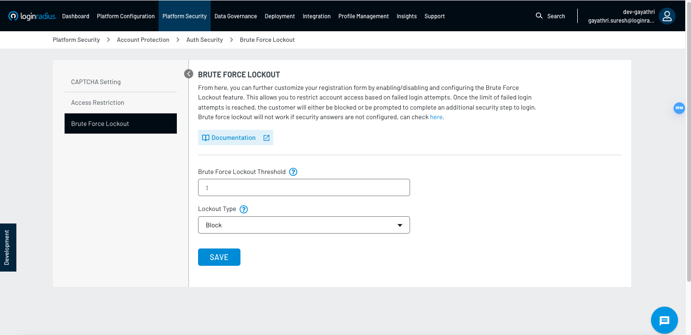
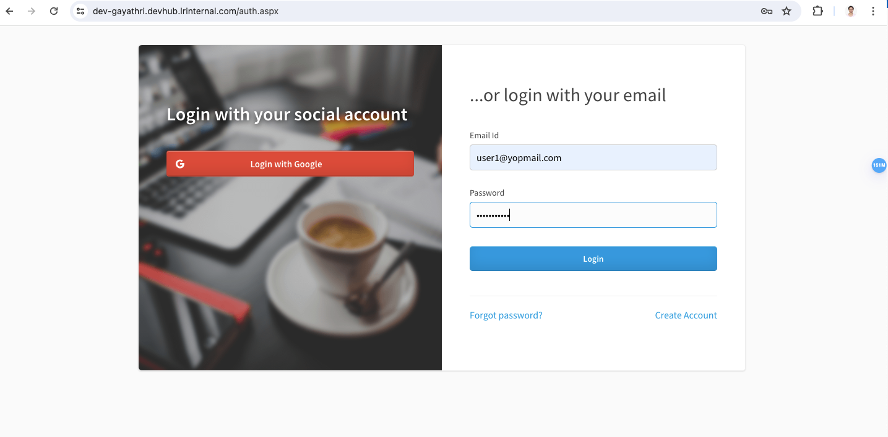
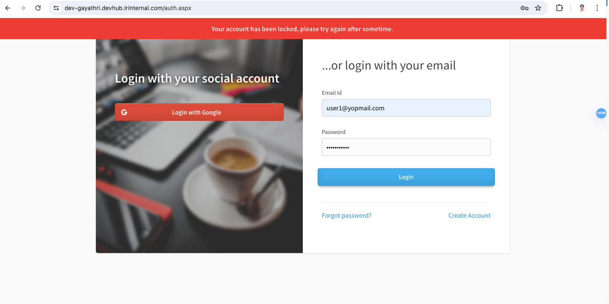
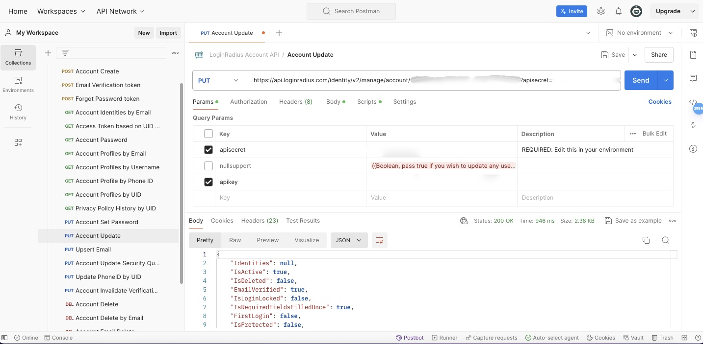

First, let's understand some basic terminology.

## Basic Terminology

1. **Brute-force attack:** A method where every possible combination of characters or values is systematically tried to gain unauthorized access to a system, application, or data.

2. **Brute-force lock:** Brute-force lock is a type of account lock made to prevent a bruteforce attack.

3. **Brute-force lockout:** Brute-force lockout is a security mechanism that blocks access after a certain number of failed authentication attempts to prevent unauthorized access through repeated trial and error.

4. **CAPTCHA (Completely Automated Public Turing test to tell Computers and Humans Apart):** CAPTCHA is a method used to determine whether a user is human or not by presenting a challenge that is easy for humans to solve but difficult for bots.

5. **Multi-Factor Authentication (MFA):** MFA is a security method that requires multiple forms of identification to grant access, typically combining something the user knows, has, and is.

In LoginRadius, you can implement brute-force lockout using APIs.

> To implement brute-force lockout, please create register in the [_LoginRadius Admin Console_](https://admin-console.loginradius.com/dashboard).

Let's go through the API implementation of brute-force lockout and user unlock

## API Implementation for Brute-froce Lockout

### Creating a Basic Application
1. To implement brute-force lockout using API, create a simple app with the login and registration features.
2. This can be done by using _[Admin Console](https://admin-console.loginradius.com/deployment/idx)_.
3. Navigate through _[Deployment > Identity Experience Framework](https://devadmin-console.lrinternal.com/deployment/idx)_.
4. Using theme, customization, preview, implement options, you can design the required application.
5. You can also customize the predefined templates if needed.

> You can view the created app using the link _[https://`<app-name>`.hub.loginradius.com/auth.aspx](https://`<app-name>`.hub.loginradius.com/auth.aspx)_ in the _implement_ section of the _Identity Experience Framework_ or from the preview section.

### Brute-force Lockout

#### Enabling

In LoginRadius, the brute-force lockout feature can be enabled from the _[Admin Console](https://admin-console.loginradius.com/platform-security/account-protection/auth-security/brute-force-lockout)_.

[](assets/admin_bfl_page.png)

#### Testing

1. Register with a new user, and login with the correct user email and password. It is observed that the user is redirected to the profile page after authentication.

[](assets/loginpage_with_data.png)
<br>
[](assets/successful_login.png)

2. Now, logout and try to login with incorrect credentials.
3. If the password is incorrect successively till the lockout threshold, the account gets locked. 
4. Therefore, brute-force lockout is achieved.

[](assets/incorrect_pwd.png)

> In the _[Admin Console](https://admin-console.loginradius.com/platform-security/account-protection/auth-security/brute-force-lockout)_, you can set the _brute-force lockout threshold, lockout type, and suspend effective period_. 

### Lockout Types in LoginRadius
LoginRadius supports the following lockout types: 

1. __Suspend__: Suspends further login attempts after multiple failed tries for a certain amount of time, deterring automated attacks and enhancing system security by limiting access from suspicious sources.

2. __CAPTCHA__: 
    - A security measure used to unlock a locked account on entering valid credentials by presenting a challenge to solve. 
    - This challenge is often very easy for humans to solve but difficult for the bots.

    > _Refer [CAPTCHA](#captcha) in miscellaneous section to learn more_.

3. __Security Questions__: A personalized query set up by the user to verify identity to unlock a locked account with valid credentials.
4. __Block__: Restricts login attempts from a specific source (email id or username) after multiple failed tries, enhancing security against unauthorized access.

### Unlocking an Aaccount Locked through Brute-force Lockout

You can unlock the locked user account in two ways, using:

1. Account Update API from the LoginRadius Account API collection.
2. Auth Unlock Account by Access Token from the LoginRadius Authentication API collection.

> For more understanding on _Auth Unlock Account_, refer [Auth Security Configuration](https://www.loginradius.com/docs/api/v2/admin-console/platform-security/auth-security-configuration/)

#### Account Update API from the LoginRadius Account API Collection

Calling the Account Update API with the provided enpoint, using the given method, providing the _apisecret_ and _apikey_, and formatting the given body will unlock the account.

1. Endpoint: https://api.loginradius.com/identity/v2/manage/account/{uid}
2. Method: PUT
3. Parameters: apisecret, apikey
4. Body:

```
{
   ...
  "FirstName": "Test",
  "MiddleName": null,
   ...
}
```

5. Response:

```
{
    ...
    "LoginLockedType": "None",
    "Email": [
        {
            "Type": "Primary",
            "Value": "user1@yopmail.com"
        }
    ],
    ...
}
```

<br>

[](assets/unlocked_account_update.jpeg)

## Conclusion

- Unlocking user accounts previously locked due to brute force lockout using LoginRadius APIs demonstrates the platform's efficiency in account management and security enhancement.

- Moving forward, leveraging LoginRadius's robust security features ensures uninterrupted user access while fortifying your system against unauthorized access attempts.

## Miscellaneous

### CAPTCHA
LoginRadius supports the following type of CAPTCHAs: 

- reCAPTCHA V2: Users solve challenges like clicking on images or entering text to prove they're human.
- reCAPTCHA V3: Operates in the background, assessing user behavior to assign a risk score without user interaction.
- hCAPTCHA: Similar to reCAPTCHA, offers bot protection with privacy focus.
- QQ Tencent CAPTCHA: A CAPTCHA service by Tencent, commonly used in China for verifying human users.

### Multi-Factor Authentication (MFA): 
- _LoginRadius_ offers multiple security features, one of which is Multi-Factor Authentication. 
- This feature can be enabled from the _[Admin Console](https://admin-console.loginradius.com/dashboard)_ to add an additional layer of security.
- There is a set of predefined MFA types provided by LoginRadius, which can further be enabled as necessary.

_To understand more about LoginRadius APIs, refer the [API docs](https://www.loginradius.com/docs/api/v2/getting-started/introduction/)_.

