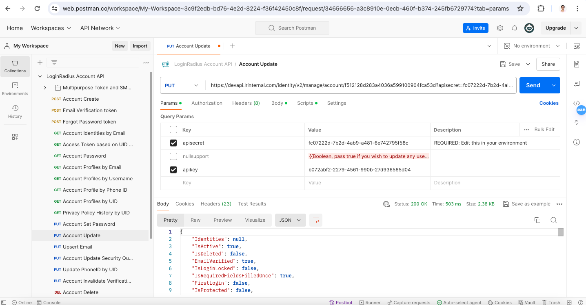

# Brute force lockout and unlock

---

## Contents
- [Basic Terminologies](#basic-terminologies)
- [API Implementation](#api-implementation)
    - [Creating a Basic Application](#creating-a-basic-application)
    - [Brute force lockout implementation](#brute-force-lockout-implementation)
    - [Unlocking an account locked through brute force lockout](#unlocking-an-account-locked-through-brute-force-lockout)
        - [Account Update API from the LoginRadius Account API collections](#account-update-api-from-the-loginradius-account-api-collections)
        - [Auth Unlock Account by Access Token from the LoginRadius Authentication API collections](#auth-unlock-account-by-access-token-from-the-loginradius-authentication-api-collections)
- [Conclusion](#conclusion)
- [Miscellaneous](#miscellaneous)

---

## Basic Terminologies
**Brute force attack:**
- A method where every possible combination of characters or values is systematically tried to gain unauthorized access to a system, application, or data.

**Brute force lock:**
- Brute force lock is a type of account lock made to prevent a bruteforce attack.

**Brute force lockout:**
- Brute force lockout is a security mechanism that blocks access after a certain number of failed authentication attempts to prevent unauthorized access through repeated trial and error.

**Multi-Factor Authentication (MFA):**
-  MFA is a security method that requires multiple forms of identification to grant access, typically combining something the user knows, has, and is.

In _LoginRadius_, the brute force lockout can be implemented in two ways, using:
1. APIs
2. Workflows

> To implement brute force lockout in either of the above-mentioned ways, the user should own an admin account in the _LoginRadius Admin Console_.

In this blog, we'll go through the API implementation of brute force lockout and user unlock

---

## API implementation
### Creating a Basic Application
1. In order to achieve brute force lockout using API, we need create a simple app with the login and registration features.
2. This can be done by using the _Admin Console_.
3. Navigate through ***Deployment->Identity Experience Framework***.
4. Using theme, customization, preview, implement options, we can design the required application.
5. If additional customization is required, the user can customize the predefined templates using the customize option, and then configure it as per the requirement.
> The created app can be accessed using the link [https://`<app-name>`.devhub.lrinternal.com/auth.aspx](https://`<app-name>`.devhub.lrinternal.com/auth.aspx) in the _implement_ section of the _Identity Experience Framework_ or can be accessed from the preview section.
### Brute force lockout implementation
Brute force lockout can be achieved by following these steps: 
1. Register with a new user, and login with the correct user email and password. It is observed that the user is redirected to the profile page after authentication.
<br>
[](assets/loginpage_with_data.png)
<br>
[](assets/successful_login.png)
<br>

2. Now, logout and try to login with incorrect credentials.
3. If the password is incorrect successively till the lockout threshold, the account gets locked. 
4. Therefore, brute force lockout is achieved.
<br>
[](assets/incorrect_pwd.png)
<br>

> In the _Admin Console_, we can set the _brute force lockout threshold, lockout type, and suspend effective period_. _LoginRadius_ supports _suspend, captcha, security question, and block type lockout_. 


### Unlocking an account locked through Brute force lockout
The locked user account can be unlocked in two ways, using: 
1. Account Update API from the LoginRadius Account API collections.
2. Auth Unlock Account by Access Token from the LoginRadius Authentication API collections.

> For more understanding on _Auth Unlock Account_, refer [Auth Security Configuration](https://www.loginradius.com/docs/api/v2/admin-console/platform-security/auth-security-configuration/)

#### Account Update API from the LoginRadius Account API collections
- Calling the Account Update API with the provided enpoint, using the given method, providing the apisecret, and apikey formatting the given body will unlock the account.
1.<u>Endpoint:</u> https://devapi.lrinternal.com/identity/v2/manage/account/{uid}
2.<u>Method:</u> PUT
3.<u>Parameters:</u> apisecret, apikey
4.<u>Body:</u> 
```
{
   ...
  "FirstName": "Test",
  "MiddleName": null,
   ...
}
```

5.<u>Response:</u> 
```
{
    ...
    "LoginLockedType": "None",
    "Email": [
        {
            "Type": "Primary",
            "Value": "user1@yopmail.com"
        }
    ],
    ...
}
```

<br>

[](assets/unlocked_account_update.png)

---

## Conclusion
- Unlocking user accounts previously locked due to brute force lockout using LoginRadius APIs demonstrates the platform's efficiency in account management and security enhancement. 
- Moving forward, leveraging LoginRadius's robust security features ensures uninterrupted user access while fortifying our system against unauthorized access attempts.

---

## Miscellaneous
- LoginRadius offers multiple types of security features, one of which is Multi-Factor Authentication. 
- This feature can be enabled from the _Admin Console_ to add an additional layer of security.
- There are a set of predefined MFA types provided by LoginRadius, which can further be enabled as per the requirement.

<br>

<u>_To understand more about _LoginRadius_ APIs, refer the [API docs](https://www.loginradius.com/docs/api/v2/getting-started/introduction/)_</u>.

