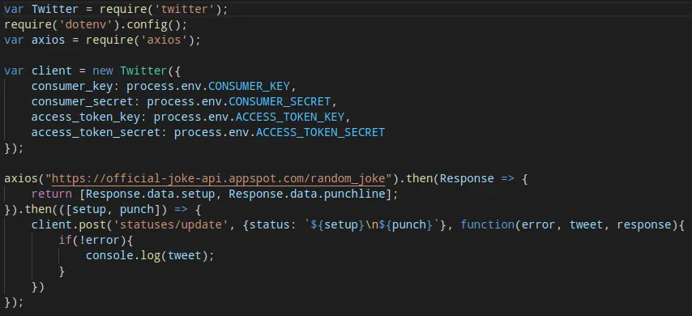

## Build a Twitter Bot with NodeJs

Hey there! In this blog post, we will build a twitter bot that let us tweet using the command line directly. 

> [Node](https://nodejs.org/en/download/) and [npm](https://www.npmjs.com/) (or, yarn) must be installed on your system. 

## Let's Start 🎉

We will use **[twitter](https://github.com/desmondmorris/node-twitter)** - a client library for the Twitter REST and Streaming APIs. This npm package will make the whole process of building the bot a whole lot easier and faster. 

### 1. Apply for a Twitter Developer Account 

To be able to access Twitter API, you need a Twitter Developer Account. Apply for it [here](https://developer.twitter.com/en/apply-for-access). Click on *Apply for a Developer Account*.


It will ask you to log in. Select appropriate settings after logging in. It will also generate **keys** and **secret tokens** like Consumer Key, Consumer Secret, Access Token Key, Access Token Secret. Copy and save them somewhere for future use. 

### 2. Setup Project

Make a project folder with any name of your choice. Run `npm init` to initialize the project. This will generate a `package.json` file in your directory. Alternatively, you can run `npm init -y` to setup your project with default settings.

> `package.json` holds all the dependencies of a project.

Since our project will be dependent on **twitter** client library, it's time we install this dependency in our project. Run `npm install twitter` to include this in your `package.json` .

### 3. Setup Files

Now we will start with the actual coding part. At the moment, your project folder will have a `node_modules` folder, a `package.json` file, and a `package-lock.json` file. If you have gone with the default options while running `npm init`, then `index.js` is the file we will be working upon.

Open `index.js`. To be able to use the **twitter** library, which we have installed, you need to include it in `index.js`. 

`var Twitter = require('twitter');`

Also, remember the **keys** and **tokens** you got from Twitter Developer Portal? It's time we use them. 

```js
var client = new Twitter({
	consumer_key: process.env.CONSUMER_KEY,
	consumer_secret: process.env.CONSUMER_SECRET,
	access_token_key: process.env.ACCESS_TOKEN_KEY,
	access_token_secret: process.env.ACCESS_TOKEN_SECRET
});
```

**Do not add your Consumer or Access Token keys or secrets directly in the `index.js`.** These should be managed accordingly using *environment variables*.

> We will use `dotenv` library to manage our environment variables in NodeJS.  Run `npm install dotenv` and follow [these](https://www.npmjs.com/package/dotenv#usage) instructions. Your `.env` will look something like this.

```js
CONSUMER_KEY=........................................
CONSUMER_SECRET=.....................................
ACCESS_TOKEN_KEY=....................................
ACCESS_TOKEN_SECRET=.................................
```

### 4. Start Coding 🎯

I will use [Official Joke API](https://github.com/15Dkatz/official_joke_api) to automatically fetch content for my tweet. You can visit the repository and learn more about the endpoints. But the only [endpoint](https://github.com/15Dkatz/official_joke_api#grab-a-random-joke) we will work with is [random_joke](https://official-joke-api.appspot.com/random_joke). Click on this, and you will receive a JSON response with fields id, type, setup, and punchline. The fields we are concerned with are setup and punchline. 

We will use [axios](https://github.com/axios/axios) for calling the API endpoint. Run `npm install axios` and add `var axios = require('axios');` in `index.js`.

Now everything has been laid out. We need to connect the dots. The Official Joke API will return a JSON response. We will grab the required data, i.e., the setup and the punchline from it. And then make use of [client.post](https://github.com/desmondmorris/node-twitter/tree/master/examples#tweet) functionality of **twitter** package.

```js
axios("https://official-joke-api.appspot.com/random_joke").then(Response => {
	return [Response.data.setup, Response.data.punchline];
}).then(([setup, punch]) => {
	client.post('statuses/update', {status: `${setup}\n${punch}`}, function(error, tweet, response){
		if(!error){
			console.log(tweet);
		}
	})
});
```
Now run `node index.js` on the terminal and see the output. 
If everything went well, you would see a *tweet* response, otherwise an *error* message. The successful message would look something like [this](https://developer.twitter.com/en/docs/twitter-api/v1/tweets/post-and-engage/api-reference/post-statuses-update#example-response).

At this point, your index.js should look like this.



### Congratulations! 🎊

That's it! You have created your first Twitter Bot, which tweets content after directly calling it from an API. You might take a look at the [repository](https://github.com/LoginRadius/engineering-blog-samples/tree/master/NodeJs/TwitterBot) if you encountered any errors. Here, I have used different APIs to fetch content and tweet. Moreover, I have added a script that will search posts with a particular hashtag and like them. 

> **While pushing your code to GitHub, make sure to add `.gitignore` file and include `node_modules` and `.env` in it.**

## Further Reading

> The world is yours to explore.

And the dev world is based entirely on exploring technologies and frameworks. Play with this **twitter** library and see what interesting stuff can be built with it. Maybe, search tweets with a particular hashtag and like them? Or maybe, retweet tweets of any particular user? You are free to use your imagination and coding skills to explore more and more. If `axios` and `dotenv` are new to you, then go ahead and read their documentation. Get hold of the concepts of environment variables. And come up with your own cool Twitter Bot.

> Keep in mind Twitter's [Developer Policy & Terms](https://developer.twitter.com/en/developer-terms) and [Twitter Terms & Conditions](https://twitter.com/en/tos). These should not be violated in whatever project you are building.
