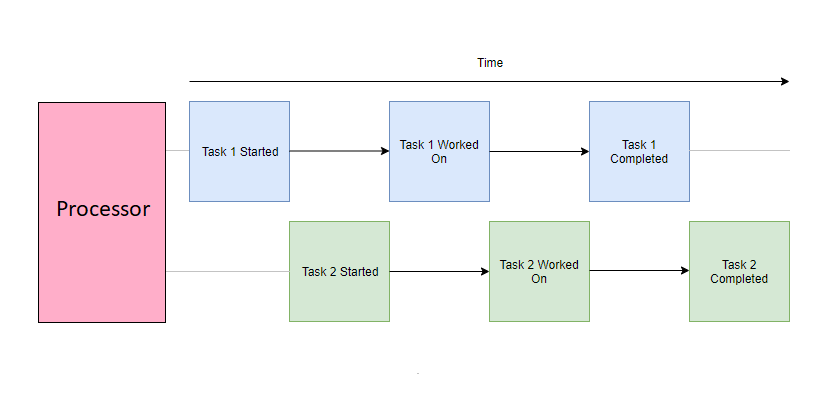
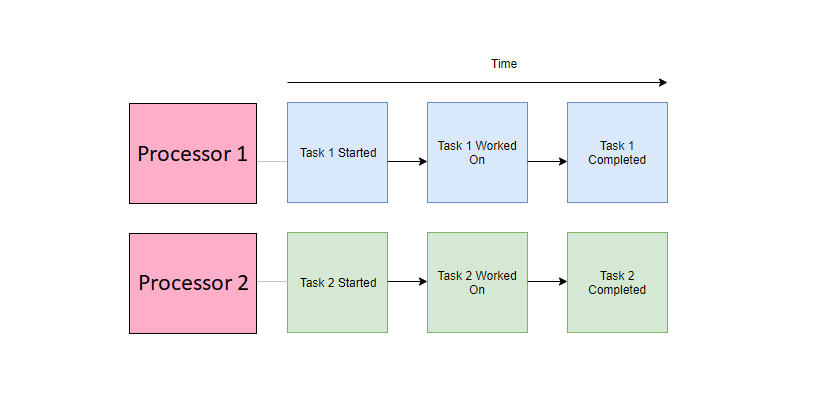

Whenever we talk about asynchronous programming in JavaScript, there is sometimes confusion in how it can be asynchronous if it is single-threaded. To answer this correctly, I think it's a good thing first to understand the difference between concurrency and parallelism, two terms that are commonly brought up with multithreading.

## Concurrency

Concurrency describes independent parts of a program to run in an arbitrary order without affecting the outcome. A concurrent application can execute multiple tasks over an overlapping period. This means that while we can start new tasks before the previous one is complete, we cannot perform work on each task simultaneously.

You can think of a concurrent execution model as a single chef preparing a meal. Any chef worth their salt can work on multiple dishes (or various parts of a dish) at once. They might chop the vegetables for their stir-fry while the rice is steamed in the rice cooker or leave the vegetables to fry in the pan while cleaning up their workspace. In this scenario, the chef can perform multiple tasks at once; however, at any given time, he is only able to work on a particular unit of work at a given time. 

You might point out that the chef can perform other actions in this example scenario while something like the rice is steaming, which is technically work still being done. However, the concurrency in this scenario only applies to the chef's context, who is not actively working on the rice as it is being steamed.

Similarly, the [JavaScript Event Loop](https://www.loginradius.com/blog/engineering/understanding-event-loop/) allows your scripts (the chef) to hand off tasks like HTTP requests and timeouts to the browser Web API (rice cooker), allowing the script to execute other code portions while waiting for a response. Once the Web API task is complete, it is pushed back into the Event Loop call stack. While the Web API acts as a separate thread where it can complete certain tasks outside the main thread's scope, your actual JavaScript code is still executed on a single thread concurrently.

## Parallelism

Parallelism describes the ability for independent parts of a program to be physically executed at the same time. A parallel application can distribute its tasks to independent processors (such as different cores or threads of a CPU) to be executed simultaneously. 

You can think of a parallel execution model as multiple chefs individually each preparing a meal. These individual chefs may be preparing their dishes in a concurrent manner (like the above) or a sequential one; either way, the result is that rather than producing a single meal, the kitchen has prepared multiple meals over a unit of time.

Modern browsers allow you to program parallelly by using Web Workers. These spawn separate threads to execute [JavaScript independently from the main thread](https://www.loginradius.com/blog/engineering/adding-multi-threading-to-javascript-using-web-workers/).

## Concurrency or Parallelism which one is better?

So we've established that multiple chefs can get a kitchen to produce multiple dishes in the same amount of time as a single dish from a kitchen with a single chef. Modern hardware almost always has multiple threads, so why isn't all code run in parallel? If it takes one chef 10 minutes to prepare one stir-fry and five chefs 10 minutes to prepare five stir-fries, can five chefs produce one stir-fry in 2 minutes? This is where parallel computation can get difficult. 

Tasks can speed up by distributing the workload onto multiple threads. However, this requires splitting up the workload in a way that can work independently and effectively. Think of how five chefs would prepare a single stir fry together:

- For tasks like chopping up vegetables, spreading the workload would be simple.
- Tasks requiring the composition of ingredients would be a bottleneck. No matter how fast an individual can finish his prep of ingredients, they would have to wait until the other ingredients are ready before they can start. Certain tasks would not need all the chefs, and the rest would either stand idly by or be dismissed for doing other tasks. Requisitioning and dismissing chefs cost time and money. It may not be efficient only to call them up when they are needed.
- Have you tried managing five people? Planning would take additional time as each team member should have clear instructions and any clarifications. They might need to spend extra time communicating with each chef as they prepared each portion of the recipe.

Similarly, on the computing side, parallel programming solutions are generally harder to implement and debug. Depending on the task, they can sometimes even perform worse than serially run counterparts due to the various costs of overhead (transferring data between threads, creating and destroying threads, synchronization of work, etc.).

### Conclusion

To conclude this post, neither are inherently superior to the other. Both execution models are useful tools for producing efficient and reliable solutions and are used together in many cases. I hope this helps to clear up the differences between the two, or if not, at least provided a mildly entertaining analogy to illustrate each.
