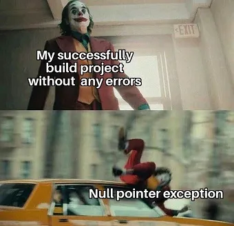
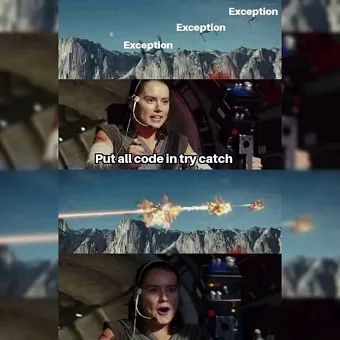

C# and the .NET CLR use exceptions to show that an error condition has arisen during program execution. C# programs are under constant threat of running into some sort of problem. As a program’s complexity grows, the probability that something odd would happen during its execution also gets higher.
 
In this blog, we will go through the basics of Exception and Exception handling. We will also look at how we can achieve exception handling using try, catch, and finally blocks and how to create your own custom exceptions.
 
 ## Exception
The errors which we are getting at the run time of the application is called an exception. 
 
If any exception is coming into our application then the application is abnormally terminated. The Application is not considered as a good application if any exception is coming and it is not handled. 
 
Every time when we are developing an application and it got successfully build without any errors. Then this happens
 

 
For that, it is good practice to use exception handling.
 
### Common .NET Exceptions :
Below are the common .NET exceptions which we can see on a regular basis of coding.
 
**System.NullReferenceException** – Occurs when calling a method on a null object reference
 
**System.IndexOutOfRangeException** – Occurs attempting to access an array element that does not exist
 
**System.IO.IOException** – Used around many file I/O type operations
 
**System.OutOfMemoryException** – Occurs when the app runs out of memory
 
**System.InvalidCastException** – Occurs when you try to cast an object to a type that it can’t be cast to
 
**System.InvalidOperationException** - Occurs when a method call is invalid for the object's current state 
 
**System.ArgumentException** - Occurs when one of the arguments provided to a method is not valid
 
## Exception Handling
 
The process of handling any run time error is called exception handling. The exception handling is performed to maintain the normal flow of the application. 
 
In C# we can achieve this using the below techniques:
 
### Try,Catch & Finally blocks
 
This is a very basic Exception handling technique in which try, catch, and finally, blocks are used.
 
**try block:** In this block the code is written which may cause the exception. If any exception is thrown then the corresponding catch block is executed.
 
**catch block:** In this block the exception is caught which means if an exception is thrown from the try block then we write the code to handle or log it.
 
**finally block:** In this block we write the certain code which we want to execute if an exception is thrown or not. For example: disposing of an object or closing the database connection.
 
Exception Handling after using try, catch blocks
 

 
**Note:** Multiple finally blocks are not allowed. Also, the finally block cannot have the return, continue, or break keywords. It doesn't let control leave the finally block.
 
In C#, both catch and finally blocks are optional. The try block can exist either with one or more catch blocks or a finally block or with both catch and finally blocks. The try block without a catch or finally block will give a compile-time error.
 
If there is no exception occurred inside the try block, the control directly transfers to the finally block. We can say that the statements inside the finally block are executed always.
 
``` C#
try
{
// Code which can cause an exception.
}
catch(Type x)
{
// Code for handling the exception
}
finally
{
//Any cleanup code
}
```
### Multiple Catch blocks
We can use the multiple catch blocks when we are not sure which type of exception will be thrown by the code. So that will help to catch the multiple types of exceptions.
 
```C#
try{
// Code which can cause an exception.
}
catch(ArithmeticException ex)
{
// Code for handling the exception
}
catch(IndexOutOfRangeException ex)
{
// Code for handling the exception
}
finally{
//Any cleanup code
}
```
### Catch multiple exceptions in the single catch block
We can use the generic exception class as well to catch all types of exception in that case we have to write the catch block as below:
 
```C#
try{
// Code which can cause an exception.
}
catch(Exception ex)
{
// Code for handling the exception
}
finally{
//Any cleanup code
}
```
**Note:** Multiple catch blocks with the same exception type are not allowed. A catch block with the base Exception type must be the last block.
 
### Exception Filters
In C# 6.0 a new feature is introduced to handle the exception which is called the Exception Filters. This feature will allow you to handle more specific exceptions in catch blocks so that you can write the code specific to the exception condition.
 
Like before C# 6.0 We had to catch any exception and handle it. Now in C# 6.0, we can handle the exception specific to the condition.
 
```C#
try
{
// Code which can cause an exception.
}
catch(Type x) when(
    //some condition
)
{
// Code for handling the exception
}
catch(Type x) when (
    //some condition
)
{
 
}
finally
{
//Any cleanup code
}
 
```
### Nested try-catch
 
C# allows nested try-catch blocks. When using nested try-catch blocks, an exception will be caught in the first matching catch block that follows the try block where an exception occurred.
 
```C#
static void Main(string[] args)
{
    int divider = 0;
 
    try
    {
        try
        {
            var result = 1/divider;
        }
        catch(Exception ex)
        {
            Console.WriteLine("Inner catch block");
        }
    }
    catch(Exception ex)
    {
        Console.WriteLine("Outer catch block");
    }
    
}
```
 
An inner catch block will be executed in the above example because it is the first catch block that handles all exception types.
 
If there is not an inner catch block that matches with raised exception type, then the control will flow to the outer catch block until it finds an appropriate exception filter.
 
### Throw an Exception
 
C# allows throwing an exception. The `throw` keyword is used for that purpose. One of the benefits of throwing an exception can be when a problem occurs in the middle of the complicated method execution because handling that situation in that complicated method would make that method even more complex. Then we should throw an exception and let the catch block to handle it.
 
The throw keyword can only be used with the Exception object except for the catch block. It will be discussed in the next section.
 
```C#
try
{
    //throw exception
    throw new Exception();
}
catch (Exception ex)
{
    //some code to hadle the exception
}
```
**Note**: The throw keyword is used to throw or create the new exception. If the throw keyword is used and if there is any catch block then the catch block will be executed next.
 
### Rethrow an Exception
 
When an exception is caught in the catch block, we can do some operations and then re-throw the exception. Rethrow an exception means calling the `throw` keyword without an exception object inside a catch block.
 
Here is the point to note that if we follow the below approach to rethrow the exception then the proper stack trace will not be maintained means it will not point out that actually where the exception occurred it will show in the stack trace the line number from which the exception is rethrown.
 
```C#
try
{
    // Code which can cause an exception.
}
catch (Exception ex)
{
    throw ex;//Exception is rethrown with the exception object
}
```
Now if we follow the below approach then the proper stack trace will be maintained with maintaining the exact line number where the exception actually occurred.
 
```C#
try
{
    // Code which can cause an exception.
}
catch (Exception ex)
{
    throw;//Exception is rethrown with the exception object
}
```
 
### User-defined Exceptions
 
User-defined exceptions are those exceptions that are not defined by the programming language. In C# we can create our own custom exceptions(User-defined exceptions)
 
C# exceptions are defined as classes, just like any other C# object. All exceptions are inherited from a base System.Exception class. There are many common exceptions that you can use within your own code.
 
Creating your own C# custom exceptions is helpful only when you are going to catch that specific type of exception and handle it differently.
 
```C#
    class Program
    {
        static void Main(string[] args)
        {
            try
            {
                //throw user defined exception
                throw new CustomException("Custom exception thrown");
            }
            catch (Exception ex)
            {
                Console.WriteLine("Exception caught here" + ex.ToString());
            }
        }
    }
    class CustomException : Exception
    {
        //User-defined exception which inherits base class Exception
        public CustomException(string message)
        {
            Console.WriteLine("User defined exception");
        }
    }
```
 
## Exception Handling Best Practices
 
### Log Exception
 
It is considered a good practice to log all the exception which are coming into our application. The main benefit of logging exceptions that we can know exactly what are the conditions on which the code is failing instead of asking from the user that what inputs he has provided we can log all the required information and use that data to solve the error.
 
In many cases, we just ignore the catch block by writing nothing in it. There are some .NET libraries available for logging purposes like NLog, Serilog, etc.
 
We can log exception into the catch block. Every exception is coming into our application is crucial as they are critical to finding the problems in the code.
 
```C#
try
{
   //Some code
}
catch (Exception ex)
{
   //Log Exception here!!!
   Log.Error(ex); // log the inputs provided by the user or any specific condition
}
```
 
### First Chance & Second Chance Exception
 
The first chance exception is mainly designed for debugging purposes. Like whenever an exception occurs it first goes to the debugger giving the first chance to you and then to the program/application. If that exception is unhandled in the program/application then it gets back to the debugger giving a second chance to you to do something with your code before and after the application itself decides to do.
 
It gives you visibility into every .NET exception being thrown.
 
We can enable the first chance exception in the Visual Studio by going into the 
Debug > Windows > Exception Settings > check next to "Common Language Runtime Exceptions"
 
You can also select the exceptions you want the debugger to break automatically in the above setting.
 
## Conclusion
In this blog, we learned about the basics of Exception, Exception Handling, and some best practices of exception handling. Use of the exception handling with its best practices in the application will help the application to run smoother and without any bad user experience.
 
 
 

