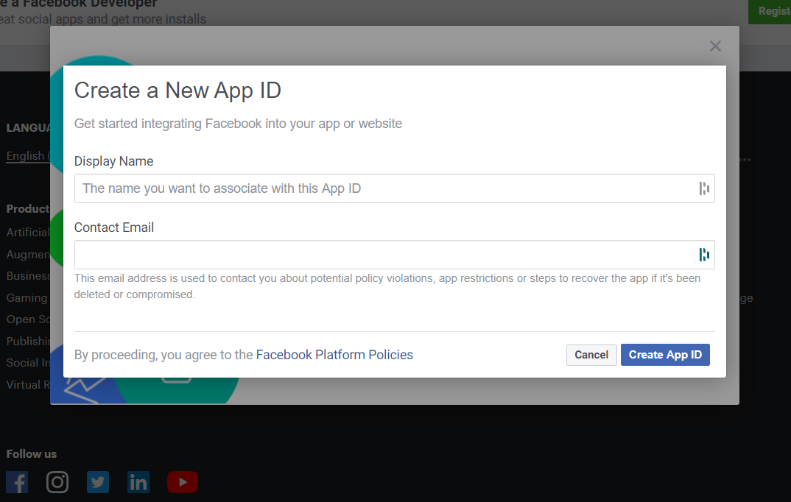
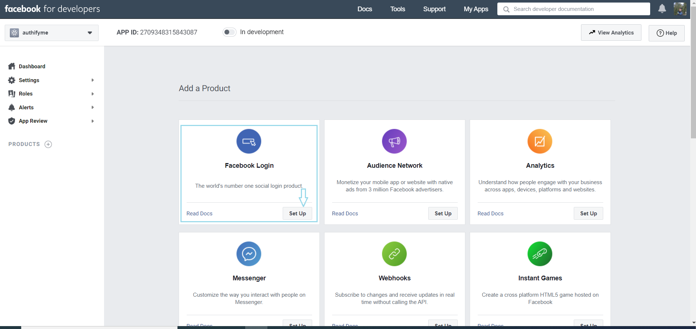
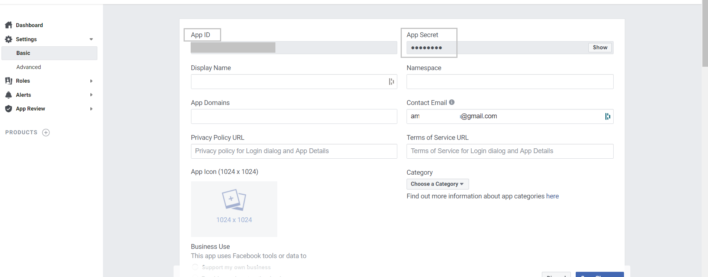
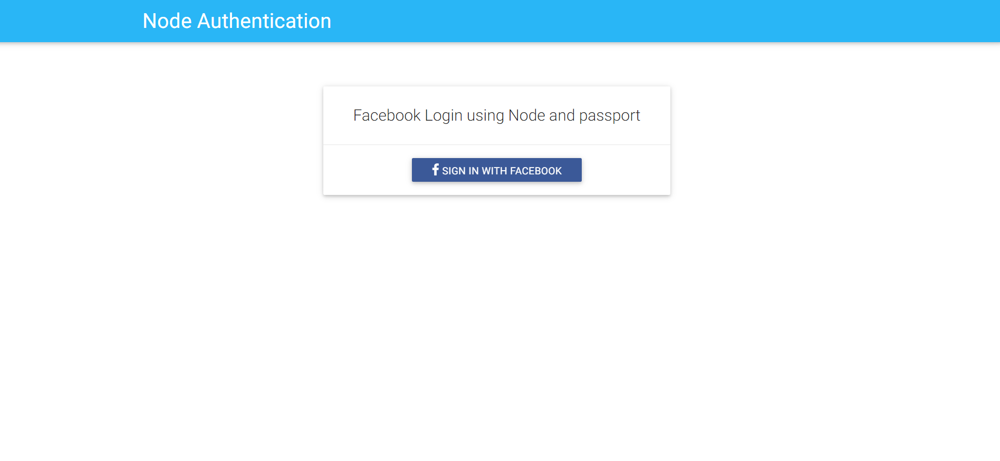
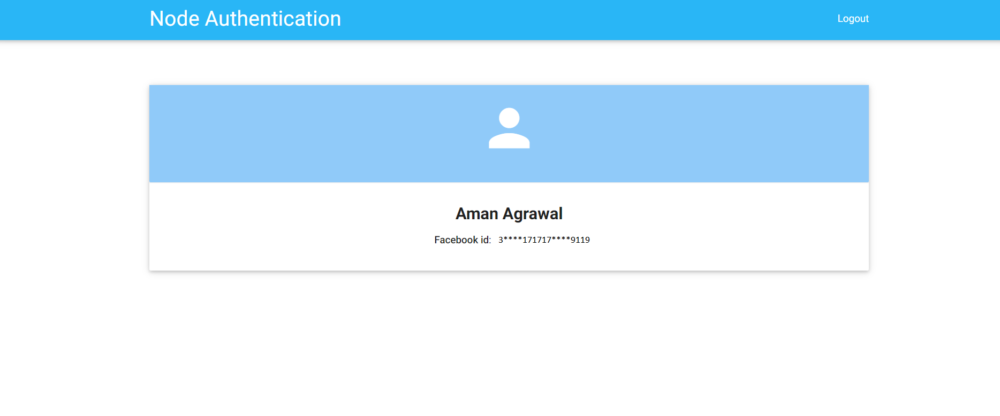

Social login is the need for simplifying your registration process and increasing the conversion rates. Here we will be implementing **Facebook Login**  using NodeJS and [Passport](http://www.passportjs.org/). 

Passport is authentication middleware for Node, which authenticates requests and delegates all other functionality to the application. Considering the unique application requirements, passport has stuck to authentication mechanisms known as strategies. In the blog, we will be implementing a similar strategy for Login with Facebook.


## Pre -Requisites: 

 1. Basic Knowledge of NodeJS 
 2. Node JS should be installed on your system. 

## Steps to configure 
1. Creating Facebook `APP_ID` and `APP_SECRET`

  - Go to http://developers.facebook.com and login with your Facebook account. 
  - Once you have registered, click on the `create app` link and you will need to enter the details in the following pop-up



  - After creating an app you need to add the product of Facebook, here we are going to use **Facebook Login** 



  - After adding up the product you can now choose to have 'web' and while setting up the URL, you can simply write `http://localhost:3000`
  - After this go to tab 'MyApps' and select the **App name**. Select the 'Basic` from *settings* options in the sidebar as shown below. You can now copy your secret and ID from here

  


2. Now enough, let's move to code, First of all, create a directory named `facebook-node-authentication`
```
mkdir facebook-node-authentication
```

3. Move to the directory `facebook-node-authentication/`

```
  cd facebook-node-authentication
```
4. In the root create a file `package.json` and copy the following code 

The dependencies, we are going to use in the projects are 

 - `express` : Node web framework
 - `express-session` Session managment of express
 - `passport` Authentication middleware for NodeJS 
 - `passport-facebook` Facebook Plugin for passport
 - `ejs` - Templating engine

```json
{
  "name": "facebook_login_node",
  "version": "1.0.0",
  "description": "\"Basic application for setting up Facebook logij using node and passport\"",
  "main": "index.js",
  "scripts": {
    "test": "echo \"Error: no test specified\" && exit 1",
    "start": "node server.js"
  },
  "author": "",
  "license": "ISC",
  "dependencies": {
    "ejs": "^3.1.2",
    "express": "^4.17.1",
    "express-session": "^1.17.1",
    "passport": "^0.4.1",
    "passport-facebook": "^3.0.0"
  }
}
```
 

5. After this run the following command in the terminal
```
 npm install
```

6. Now create a file named `server.js` and paste the following code  

```javaScript

const express = require('express');
const app = express();
const session = require('express-session');
const passport = require('passport');
const FacebookStrategy = require('passport-facebook').Strategy;
const routes = require('./routes.js');
const config = require('./config')

app.set('view engine', 'ejs');

app.use(session({
  resave: false,
  saveUninitialized: true,
  secret: 'SECRET'
}));

app.use(passport.initialize());
app.use(passport.session());

passport.serializeUser(function (user, cb) {
  cb(null, user);
});

passport.deserializeUser(function (obj, cb) {
  cb(null, obj);
});

passport.use(new FacebookStrategy({
    clientID: config.facebookAuth.clientID,
    clientSecret: config.facebookAuth.clientSecret,
    callbackURL: config.facebookAuth.callbackURL
  }, function (accessToken, refreshToken, profile, done) {
    return done(null, profile);
  }
));

app.use('/', routes);

const port = 3000;

app.listen(port, () => {
  console.log('App listening on port ' + port);
});

```

7. Now create a file named `route.js ` in the root directory and paste the following code 

```javaScript
const passport = require('passport');
const express = require('express');
var router = express.Router();

router.get('/', function (req, res) {
  res.render('pages/index.ejs'); // load the index.ejs file
});

router.get('/profile', isLoggedIn, function (req, res) {
  res.render('pages/profile.ejs', {
    user: req.user // get the user out of session and pass to template
  });
});

router.get('/error', isLoggedIn, function (req, res) {
  res.render('pages/error.ejs');
});

router.get('/auth/facebook', passport.authenticate('facebook', {
  scope: ['public_profile', 'email']
}));

router.get('/auth/facebook/callback',
  passport.authenticate('facebook', {
    successRedirect: '/profile',
    failureRedirect: '/error'
  }));

router.get('/logout', function (req, res) {
  req.logout();
  res.redirect('/');
});

function isLoggedIn(req, res, next) {
  if (req.isAuthenticated())
    return next();
  res.redirect('/');
}

module.exports = router;
```
7. Create a directory `views` and under this create a directory named `pages`. Under this folder create two pages named `profile.ejs` and `index.ejs`

```html
// index.ejs
<!doctype html>
<html>

<head>
  <title>Facebook Node Authentication</title>
  <link href="https://fonts.googleapis.com/icon?family=Material+Icons" rel="stylesheet">
  <link rel="stylesheet" href="https://maxcdn.bootstrapcdn.com/font-awesome/4.7.0/css/font-awesome.min.css">
  <link rel="stylesheet" type="text/css"
    href="https://cdnjs.cloudflare.com/ajax/libs/materialize/0.97.5/css/materialize.min.css">
  <style>
    .facebook {
      background-color: #3b5998 !important;
      color: #fff !important;
    }
    .fa-facebook-f:before,
    .fa-facebook:before {
      content: "\f09a";
    }
  </style>
</head>

<body>
  <nav class="light-blue lighten-1" role="navigation">
    <div class="nav-wrapper container">
      <a id="logo-container" href="#" class="brand-logo">Node Authentication</a>
    </div>
  </nav>
  <div class="section no-pad-bot" id="index-banner">
    <div class="container">
      <br><br>
      <div class="row center">
        <div class="col s6 offset-s3">
          <div class="card">
            <div class="card-content">
              <span class="card-title">Facebook Login using Node and passport</span>
            </div>
            <div class="card-action">
              <a href="/auth/facebook" class="waves-effect waves-light btn social facebook">
                <i class="fa fa-facebook"></i> Sign in with facebook
              </a>
            </div>
          </div>
        </div>
      </div>
    </div>
  </div>
</body>

</html>
```


```html
<!- profile.ejs->
<!doctype html>
<html>

<head>  
  <title>Facebook Node Authentication</title>
  <link href="https://fonts.googleapis.com/icon?family=Material+Icons" rel="stylesheet">
  <link rel="stylesheet" type="text/css"
    href="https://cdnjs.cloudflare.com/ajax/libs/materialize/0.97.5/css/materialize.min.css">
  <style>
    .card:hover {
      box-shadow: 0 10px 20px rgba(0, 0, 0, 0.19), 0 6px 6px rgba(0, 0, 0, 0.23);
      margin-bottom: 54px;
    }
  </style>
</head>

<body>
  <nav class="light-blue lighten-1" role="navigation">
    <div class="nav-wrapper container">
      <a id="logo-container" href="#" class="brand-logo">Node Authentication</a>
      <a href="/logout" class="right">Logout</a>
    </div>
  </nav>
  <div class="section no-pad-bot" id="index-banner">
    <div class="container">
      <br><br>
      <div class="row center">
        <div class="col s12">
          <div class="card">
            <div class="card-content blue lighten-3">
              <span class="card-title white-text"><strong><i class="large material-icons">person</i>
                </strong></span>
            </div>
            <div class="card-action">
              <h5><b><%= user.displayName %></b></h5>
              <p><strong>Facebook id</strong>: <%= user.id %></p>
            </div>
          </div>
        </div>
      </div>
    </div>
  </div>
</body>

</html>
```
8. Finally, when you are done with the above code you can now write all your app details gathered in *step 1* to `config.js` file created in the root directory

```JS
module.exports = {
	'facebookAuth': {
		'clientID':  '<APP_ID>', // your App ID
		'clientSecret':  '<APP_SECRET>', // your App Secret
		'callbackURL':  'http://localhost:3000/auth/facebook/callback'
	}
}
```
9. Let's have a final check with the repository, aftre follwoing all the steps in the same pordr the directory structure of your code will look like below:  

  ```
  // Final directory structure
  facebook-node-authentication/
    --|node_modules
    --|views/
      |--|pages/
      |----|error.ejs
      |----|profile.ejs
      |----|index.ejs
    --|config.js
    --|package.json
    --|package-lock.json
    --|routes.js
    --|server.js
  ```

10. Now run the server by executing below command in the directory `facebook-node-authentication/ `

```
npm start
```
8. Visit the browser with the URL `http://localhost:3000`


  

  
  


 You can found the complete code used in this tutorial on our [Github Repo](https://github.com/LoginRadius/engineering-blog-samples/tree/master/NodeJs/FacebookAuthenticationPassport)