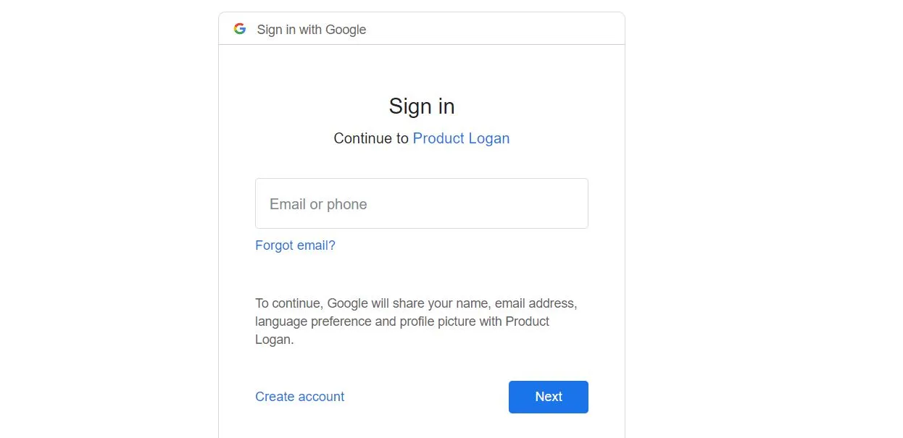

In this blog, we’ll be implementing authentication via Google in a Go web application. For this, we’ll be using [Goth](https://github.com/markbates/goth) - Multi-Provider Authentication Package for Go

## Before You Get Started
This tutorial assumes you have:

*   Basic knowledge of HTML/CSS
*   A basic understanding of Go Language
*   Latest GoLang version installed on your system

### Step 1: Create a Google client ID and client secret

We can create a  client ID and client secret using its [Google API Console](https://console.developers.google.com/). You need to follow below steps once you open Google API Console

- From the project drop-down, select an existing project, or create a new one by selecting Create a new project
- In the sidebar under "APIs & Services", select Credentials
- In the Credentials tab, select the Create credentials drop-down list, and choose OAuth client ID.
- Under Application type, select Web application.
- In Authorized redirect URI use `http://localhost:3000/auth/google/callback`
- Press the Create button and copy the generated client ID and client secret

**Note:** If Google doesn't support `http://localhost:3000`, then use `http://127.0.0.1:3000`

### Step 2: Initialize a Go project using Go modules

First in an empty folder run the below command

```
go mod init googleauth
```

`go mod init` creates a new go.mod file and automatically imports dependencies when you will run go program

### Step 3: Writing golang server code to accept web requests

Create a file **main.go** in the root folder of your app and add the following code: 

A small description for packages used in below code
- **gorilla/pat:**  A lightweight HTTP router for Go
- **markbates/goth:**  Multi-Provider Authentication Package for Go
- **gorilla/sessions:**  To save information from google in session and use it on the success page
- **markbates/goth/providers/google:**  Google authentication provider by Goth
- **html/template:** Go package to parse Html files


```Go
package main

import (
  "fmt"
  "html/template"
  "net/http"
  

  "log"

  "github.com/gorilla/pat"
  "github.com/markbates/goth"
  "github.com/markbates/goth/gothic"
  "github.com/markbates/goth/providers/google"
  "github.com/gorilla/sessions"
)


func main() {
  
  key := "Secret-session-key"  // Replace with your SESSION_SECRET or similar
  maxAge := 86400 * 30  // 30 days
  isProd := false       // Set to true when serving over https

  store := sessions.NewCookieStore([]byte(key))
  store.MaxAge(maxAge)
  store.Options.Path = "/"
  store.Options.HttpOnly = true   // HttpOnly should always be enabled
  store.Options.Secure = isProd

  gothic.Store = store

  goth.UseProviders(
    google.New("our-google-client-id", "our-google-client-secret", "http://localhost:3000/auth/google/callback", "email", "profile"),
  )

  p := pat.New()
  p.Get("/auth/{provider}/callback", func(res http.ResponseWriter, req *http.Request) {

    user, err := gothic.CompleteUserAuth(res, req)
    if err != nil {
      fmt.Fprintln(res, err)
      return
    }
    t, _ := template.ParseFiles("templates/success.html")
    t.Execute(res, user)
  })

  p.Get("/auth/{provider}", func(res http.ResponseWriter, req *http.Request) {
    gothic.BeginAuthHandler(res, req)
  })

  p.Get("/", func(res http.ResponseWriter, req *http.Request) {
    t, _ := template.ParseFiles("templates/index.html")
    t.Execute(res, false)
  })
  log.Println("listening on localhost:3000")
  log.Fatal(http.ListenAndServe(":3000", p))
}

```
**Note:** The callback URL in `google.New` should be the same as used in the google app configuration.

If it is hard to understand the code, Here is the description of all the routes used in the code mentioned above

- **"/":**  The root route will render the index.html page
- **/auth/{provider}:**  When you click on SignIn button it will hit this route and `gothic.BeginAuthHandler` will redirect you to google authentication URL
- **/auth/{provider}/callback:**  Once you have authenticated Google will send all the user details on this callback URL, and goth will save the info in session also which can be used in other routes also if needed


### Step 4: Creating a Login and Profile page

Create an html file under path **templates/index.html**, it will render into a nice looking social login page:

```html 
<!-- templates/index.html -->
<!doctype html>
<html>
<head>
    <title>Google SignIn</title>
    <link rel="stylesheet" href="https://stackpath.bootstrapcdn.com/bootstrap/4.4.1/css/bootstrap.min.css"> <!-- load bulma css -->
    <link rel="stylesheet" href="https://stackpath.bootstrapcdn.com/font-awesome/4.7.0/css/font-awesome.min.css"> <!-- load fontawesome -->
    <style>
        body        { padding-top:70px; }
    </style>
</head>
<body>
<div class="container">
    <div class="jumbotron text-center text-success">
        <h1><span class="fa fa-lock"></span> Social Authentication</h1>
        <p>Login or Register with:</p>
        <a href="/auth/google" class="btn btn-danger"><span class="fa fa-google"></span> SignIn with Google</a>
    </div>
</div>
</body>
</html> 
```

After it we will create an Html file under path **templates/success.html**, it will be used to show the user profile information we will get after authenticated by google

```html 
<!-- templates/success.html -->
<!doctype html>
<html>
  <head>
    <title>Google SignIn</title>
    <link rel="stylesheet" href="https://stackpath.bootstrapcdn.com/bootstrap/4.4.1/css/bootstrap.min.css"> <!-- load bulma css -->
    <link rel="stylesheet" href="https://stackpath.bootstrapcdn.com/font-awesome/4.7.0/css/font-awesome.min.css"> <!-- load fontawesome -->
      <style>
          body        { padding-top:70px; }
      </style>
  </head>
  <body>
    <div class="container">
      <div class="jumbotron">
          <h1 class="text-success  text-center"><span class="fa fa-user"></span> Profile Information</h1>
          <div class="row">
            <div class="col-sm-6">
                <div class="well">
                        <p>
                            <strong>Id</strong>: {{.UserID}}<br>
                            <strong>Email</strong>: {{.Email}}<br>
                            <strong>Name</strong>: {{.Name}}
                        </p>
                </div>
            </div>
        </div>
      </div>
    </div>
  </body>
</html>
```
**Note:** Here we are also using bootstrap and font-awesome css to make our web pages look good. 


We have finished building our social login page, let's run the application by below command


```
go run main.go
```

Once our server is running, we can see our social login page on `http://localhost:3000/`


We need to click on **SignIn with Google button**, which will redirect us to the google login page.



After login with our google credentials, it will redirect back to our application and on the success page, we can see the details of the logged-in user and can save this detail in a database for future use also.


As we have seen it is fairly easy to build a google social authentication system with Go language and Goth package, You can found the complete code used in this tutorial on our [Github Repo](https://github.com/LoginRadius/engineering-blog-samples/tree/master/GoLang/GoogleAuthenticationGoth)