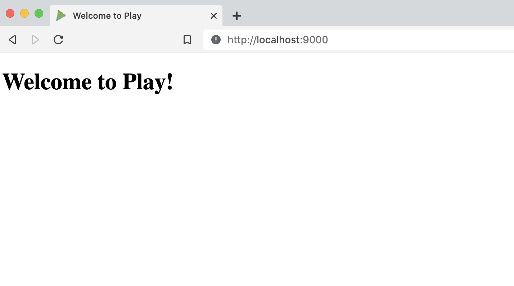
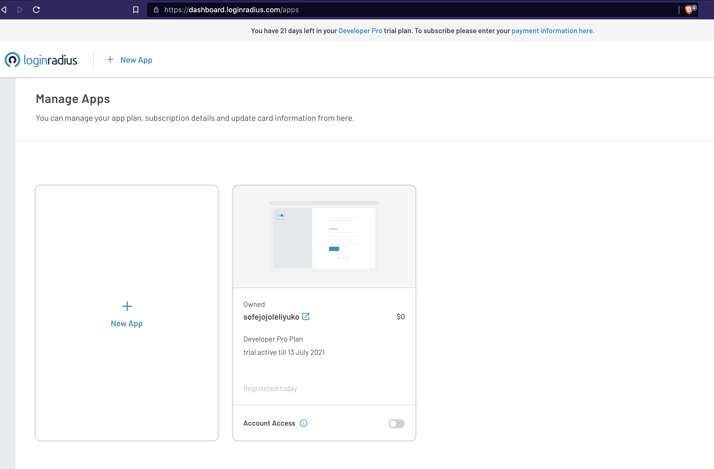
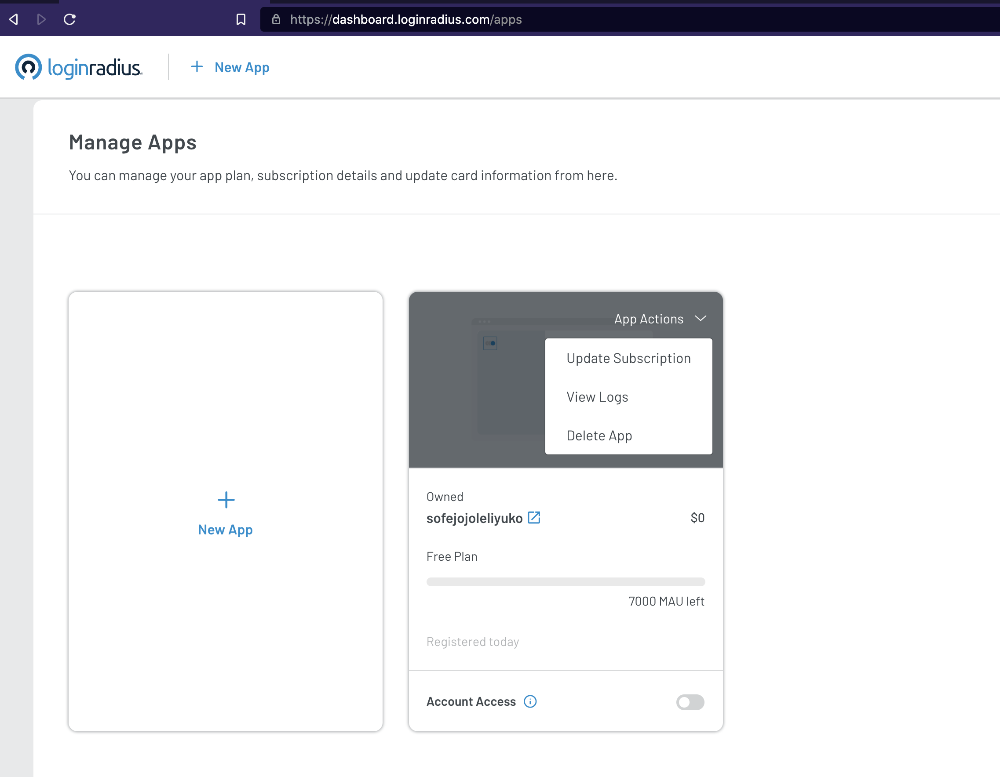
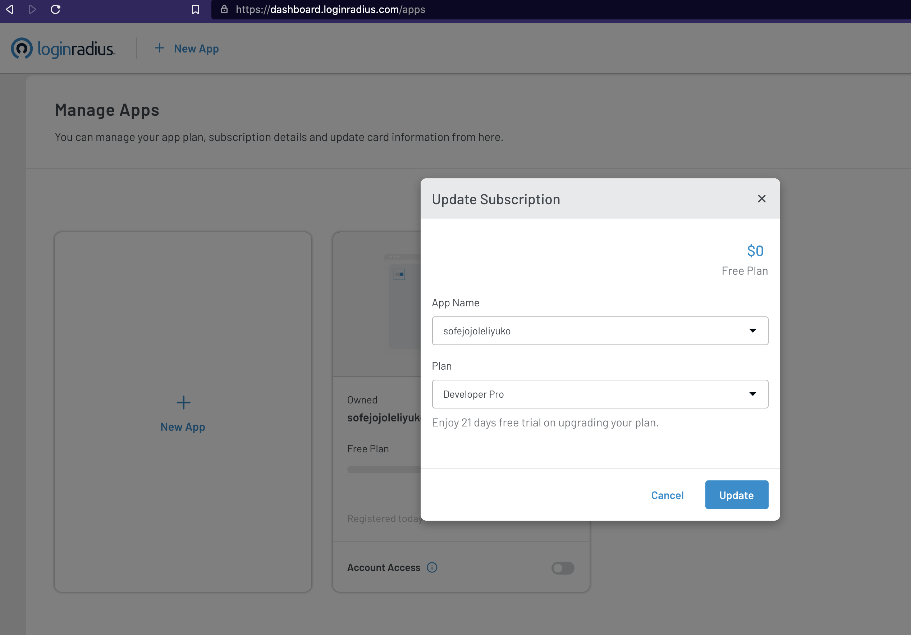
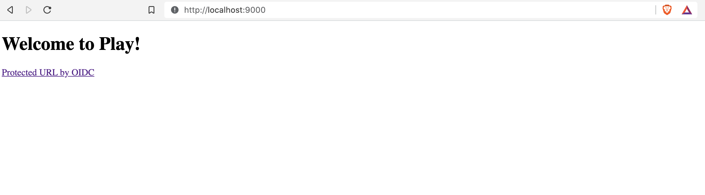
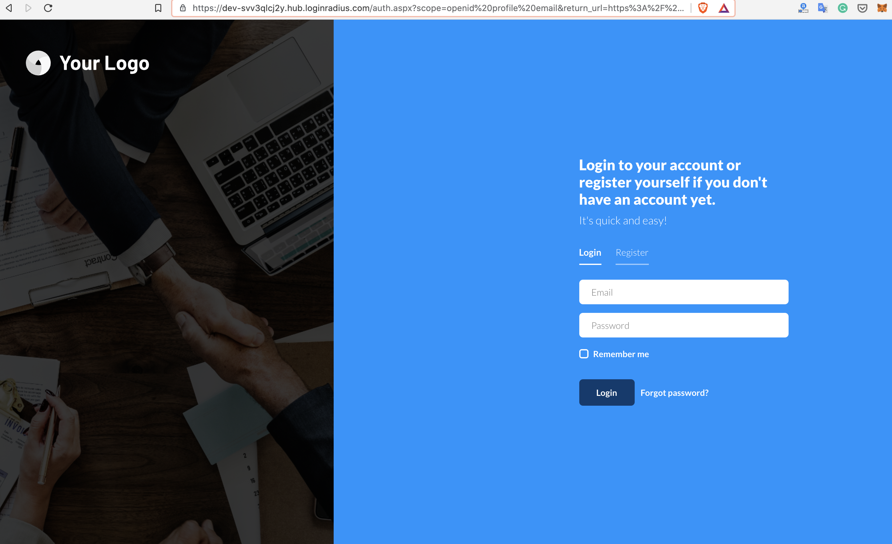
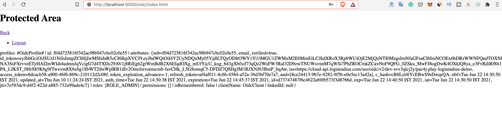

In this blog post, I will write a step-by-step tutorial to add Authentication to the Play Framework Application with OIDC and LoginRadius. I will be using [pac4j](http://www.pac4j.org/) and it's [play-pac4j](https://github.com/pac4j/play-pac4j) integration in this tutorial. Before jumping into the tutorial, let's learn about few concepts. 

## What is OpenID Connect (OIDC) Protocol?

OIDC is an authentication protocol that allows users to verify their identity when they are trying to access a protected HTTPS endpoint. OIDC is an evolutionary development of ideas implemented earlier in OAuth and OpenID.

OpenID Connect allows clients to request and receive information about authenticated sessions and end-users. It allows all types of clients, including 
- Web-based
- Mobile
- Javascript clients etc...

You can find out more details about [OIDC here](https://openid.net/connect/)

## What is Play Framework?

Play Framework is an open-source web application framework that follows the model–view–controller architectural pattern. It is written in Scala and usable from other programming languages that are compiled to JVM Bytecode.

It makes it easy to build web applications with Java & Scala. Play is based on a lightweight, stateless, web-friendly architecture. Built on Akka, Play provides predictable and minimal resource consumption (CPU, memory, threads) for highly-scalable applications.

## What is pac4j?

[pac4j](http://www.pac4j.org/) is an easy and powerful security engine for Java to authenticate users, get their profiles and manage authorizations in order to secure web applications and web services.

It provides a comprehensive set of concepts and components. It is based on Java and available under the Apache 2 license. It is available for most frameworks/tools and supports most authentication/authorization mechanisms.

pac4j is supported with most of the Java frameworks like
- Spring Web MVC 
- Spring Boot 
- Spring Security (Spring Boot) 
- Play 2.x 
- Vertx Spark Java 
- Javalin  
- Dropwizard 
- Lagom 
- Akka HTTP & many more...

## Getting started

There are multiple options you can get started with the Play framework. 
- You can create a new Play project by downloading the [starter project here](https://playframework.com/download#starters)
- Create a new Play application using `sbt`.

For this tutorial, I will be using creating a new play project using `sbt`.

### Install sbt on Mac OS
```console
brew install sbt
```
You can find [Installation steps for Windows and Linux](https://www.scala-sbt.org/release/docs/Setup.html) here.


### Prerequisites 

For this tutorial, I will be using 
- Java 11
- sbt - 1.5.3
- play-pac4j - 11.0.0-PLAY2.8
- pac4j-oidc - 5.1.0

## Create New Play Project

Create a new java play project using the following command
```console
sbt new playframework/play-java-seed.g8
```

The above command will prompt you to fill in the project `name` and project package structure in `organization` as shown below.

```console
[info] welcome to sbt 1.5.3 (Oracle Corporation Java 11.0.2)
[info] set current project to new (in build file:/private/var/folders/_9/rcqwq2vx1cl_1sc4xdhb5_5c0000gn/T/sbt_661d1bf7/new/)

This template generates a Play Java project

name [play-java-seed]: loginradius-play-oidc
organization [com.example]: com.loginradius.developer

Template applied in /Users/vishnuchilamakuru/self/longinradius/./loginradius-play-oidc
```

## Run Play Project

Now that the project is created with a base template. You can test it by running the project using the following command from `loginradius-play-oidc` folder.

```console
sbt run
```

Now visit `http://localhost:9000`, and it should look like this.




## Integrate pac4j with Play Project


### 1. Add pac4j dependencies to `build.sbt`

Add pac4j dependencies, Java 11 as required, and target version to compile the project in `build.sbt`.

```Scala
name := """loginradius-play-oidc"""
organization := "com.loginradius.developer"

version := "1.0-SNAPSHOT"

lazy val root = (project in file(".")).enablePlugins(PlayJava)

scalaVersion := "2.13.6"

initialize := {
  val _ = initialize.value // run the previous initialization
  val required = "11"
  val current  = sys.props("java.specification.version")
  assert(current == required, s"Unsupported JDK: java.specification.version $current != $required")
}

scalacOptions += "-target:jvm-11"

javacOptions ++= Seq("-source", "11", "-target", "11")


libraryDependencies ++= Seq(
  guice,
  ehcache,
  "org.pac4j" %% "play-pac4j" % "11.0.0-PLAY2.8",
  "org.pac4j" % "pac4j-oidc" % "5.1.0",
  "com.typesafe.play" % "play-cache_2.13" % "2.8.8",
  "com.fasterxml.jackson.module" %% "jackson-module-scala" % "2.12.3"
)
```

### 2. Create Security Module

Create `app/modules/SecurityModule.java`. This class configures OIDC, sets up a secure HttpActionAdapter, and registers callback and logout controllers.

- SecurityModule.java

```Java
package modules;

import com.google.inject.AbstractModule;

import com.nimbusds.oauth2.sdk.ParseException;
import com.nimbusds.oauth2.sdk.auth.ClientAuthenticationMethod;
import com.nimbusds.openid.connect.sdk.op.OIDCProviderMetadata;
import com.typesafe.config.Config;
import net.minidev.json.JSONObject;
import org.pac4j.core.authorization.authorizer.RequireAnyRoleAuthorizer;
import org.pac4j.core.client.Clients;
import org.pac4j.core.context.session.SessionStore;
import org.pac4j.oidc.client.OidcClient;
import org.pac4j.oidc.config.OidcConfiguration;
import org.pac4j.play.CallbackController;
import org.pac4j.play.LogoutController;
import org.pac4j.play.http.PlayHttpActionAdapter;
import org.pac4j.play.store.PlayCacheSessionStore;
import play.Environment;

import java.util.Optional;

public class SecurityModule extends AbstractModule {

    private final Config configuration;

    public SecurityModule(final Environment environment, final Config configuration) {
        this.configuration = configuration;
    }

    @Override
    protected void configure() {

        bind(SessionStore.class).to(PlayCacheSessionStore.class);

        final OidcConfiguration oidcConfiguration = new OidcConfiguration();
        oidcConfiguration.setDiscoveryURI(configuration.getString("oidc.discoveryUri"));
        oidcConfiguration.setClientId(configuration.getString("oidc.clientId"));
        oidcConfiguration.setSecret(configuration.getString("oidc.clientSecret"));
        oidcConfiguration.setClientAuthenticationMethod(ClientAuthenticationMethod.CLIENT_SECRET_BASIC);

        addProviderMetadata(oidcConfiguration);

        final OidcClient oidcClient = new OidcClient(oidcConfiguration);
        oidcClient.addAuthorizationGenerator((ctx, session, profile) -> {
            profile.addRole("ROLE_ADMIN");
            return Optional.of(profile);
        });

        final String baseUrl = configuration.getString("baseUrl");
        final Clients clients = new Clients(baseUrl + "/callback",  oidcClient);

        final org.pac4j.core.config.Config config = new org.pac4j.core.config.Config(clients);
        config.addAuthorizer("admin", new RequireAnyRoleAuthorizer("ROLE_ADMIN"));
        config.setHttpActionAdapter(PlayHttpActionAdapter.INSTANCE);
        bind(org.pac4j.core.config.Config.class).toInstance(config);

        // callback
        final CallbackController callbackController = new CallbackController();
        callbackController.setDefaultUrl("/");
        bind(CallbackController.class).toInstance(callbackController);

        // logout
        final LogoutController logoutController = new LogoutController();
        logoutController.setDefaultUrl("/?defaulturlafterlogout");
        bind(LogoutController.class).toInstance(logoutController);

    }

    private void addProviderMetadata(OidcConfiguration oidcConfiguration) {
        JSONObject jsonObj = new JSONObject();
        jsonObj.appendField("token_endpoint", configuration.getString("oidc.tokenUri"));
        final OIDCProviderMetadata providerMetaData;
        try {
            providerMetaData = OIDCProviderMetadata.parse(jsonObj);
            oidcConfiguration.setProviderMetadata(providerMetaData);
        } catch (ParseException e) {
            e.printStackTrace();
        }
    }
}

```

### 3. Create Secured Endpoint in Controller

In `app/controllers/HomeController.java` add the following methods
- A method that is secured by the OIDC client
- A method to show the profile information returned from LoginRadius(or any identity provider) on successful login.
- A method to get profile information

After adding the above methods `HomeController.java` looks like this.

```Java
package controllers;

import com.google.inject.Inject;
import org.pac4j.core.context.session.SessionStore;
import org.pac4j.core.profile.ProfileManager;
import org.pac4j.core.profile.UserProfile;
import org.pac4j.play.context.PlayContextFactory;
import org.pac4j.play.java.Secure;
import org.pac4j.play.store.PlayCacheSessionStore;
import play.mvc.*;

import java.util.ArrayList;
import java.util.List;

/**
 * This controller contains an action to handle HTTP requests
 * to the application's home page.
 */
public class HomeController extends Controller {

    /**
     * An action that renders an HTML page with a welcome message.
     * The configuration in the <code>routes</code> file means that
     * this method will be called when the application receives a
     * <code>GET</code> request with a path of <code>/</code>.
     */
    public Result index() {
        return ok(views.html.index.render());
    }

    @Secure(clients = "OidcClient")
    public Result oidcIndex(Http.Request req) {
        return protectedIndex(req);
    }

    public Result protectedIndex(Http.Request req) {
        return ok(views.html.protectedindex.render(getProfiles(req)));
    }

    @Inject
    private SessionStore sessionStore;

    private List<UserProfile> getProfiles(Http.Request req) {
        final ProfileManager profileManager = new ProfileManager(PlayContextFactory.INSTANCE.newContext(req), sessionStore);
        final List<UserProfile> profiles = new ArrayList<>();
        if (profileManager.getProfile().isPresent()) {
            profiles.add(profileManager.getProfile().get());
        }
        return profiles;
    }

}


```

### 4. Create Views

- Update `app/views/index.scala.html` as follows to add the link protected by OIDC authentication.

```Html
@()

@main("Welcome to Play") {
  <h1>Welcome to Play!</h1>

  <a href="oidc/index.html">Protected URL by OIDC</a>
}

```

- Add `app/views/protectedindex.scala.html` with the following content below. This page will be shown after Successful Login using OIDC in LoginRadius.

```Html
@(profileList: java.util.List[org.pac4j.core.profile.UserProfile])
@import scala.collection.JavaConverters._
@profiles() = { @profileList.toList }
<h1>Protected Area</h1>
<a href="..">Back</a>
<ul>
    <li><a href="/logout?url=/?forcepostlogouturl">Logout</a></li>
</ul>

<p>
    profiles: @profiles
</p>

```

### 5. Configure Routes

Now we already added methods in `HomeController.java` and configured callback, logout controllers in `SecurityModule.java`. Let's configure the routes to map to these methods in `conf/routes`.

- `conf/routes` will look like this.

```Scala
# Routes
# This file defines all application routes (Higher priority routes first)
# ~~~~

# An example controller showing a sample home page
GET     /                           controllers.HomeController.index
GET     /oidc/index.html            controllers.HomeController.oidcIndex(request: Request)
GET     /protected/index.html       controllers.HomeController.protectedIndex(request: Request)
GET     /callback                   @org.pac4j.play.CallbackController.callback(request: Request)
POST    /callback                   @org.pac4j.play.CallbackController.callback(request: Request)
GET     /logout                     @org.pac4j.play.LogoutController.logout(request: Request)


# Map static resources from the /public folder to the /assets URL path
GET     /assets/*file               controllers.Assets.versioned(path="/public", file: Asset)


```

### 6. Add Application Configuration variables

Finally, configure the variables mentioned in `SecurityModule.java` in `conf/application.conf` as follows.

```Scala
play {
  modules {
    enabled += modules.SecurityModule
  }
}

baseUrl = "http://localhost:9000"

oidc.discoveryUri = "https://cloud-api.loginradius.com/sso/oidc/v2/{loginradius-site-name}/{loginradius-app-name}/.well-known/openid-configuration"
oidc.clientId = "{clientId}"
oidc.clientSecret = "{clientSecret}"
oidc.tokenUri = "https://cloud-api.loginradius.com/sso/oidc/v2/{loginradius-site-name}/token"
```

## Create an OIDC app in LoginRadius

Login to your LoginRadius account or [signup here](https://www.loginradius.com/) if you don't have one. 

Once you log in you can see by default, one application will be created for you. Otherwise, you can create a new application here from the following screen by clicking `New App`.



 
I will be using the existing application itself for this demo as I am using a free plan. In the free plan, you can create only one application (no need for card details).

Upgrade your application subscription to the `Developer Pro` Plan to configure OIDC. (`Developer Pro` Plan is available with 21 days trial).








Now click on `Select & Configure` on your application and navigate to the `Integration` Section and Configure `Open ID` configuration. You can find step-by-step details to [configure OIDC](https://www.loginradius.com/developers/) here.

Once you configure these `conf/application.conf` will look something like this.

```Scala
# This is the main configuration file for the application.
# https://www.playframework.com/documentation/latest/ConfigFile

play {
  modules {
    enabled += modules.SecurityModule
  }
}

baseUrl = "http://localhost:9000"

oidc.discoveryUri = "https://cloud-api.loginradius.com/sso/oidc/v2/dev-svv3qlcj2y/pac4j-play-loginradius-demo/.well-known/openid-configuration"
oidc.clientId = "8ce24413-9b7e-4282-9f5b-e0e5ec13a42a"
oidc.clientSecret = "c9c61f6e-325f-40d6-89fd-696d17f970eb"
oidc.tokenUri = "https://cloud-api.loginradius.com/sso/oidc/v2/dev-svv3qlcj2y/token"
# Site Name - dev-svv3qlcj2y
# App Name - pac4j-play-loginradius-demo

```

## Time to test complete Integration

Let's run our application using `sbt clean run` and visit `http://localhost:9000`. The Home page will look like this.

### Home Page



### LoginRadius Auth Page (IDX)

Now click on the `protected url by OIDC` link on the home page that will redirect you to the LoginRadius Auth Page (IDX), which you configured.



### Redirect to Protected Index Page

On successful login from the above step, you will be redirected to the `protectedindex.scala.html` page.




### Logout Action

[play-pac4j](https://github.com/pac4j/play-pac4j) provides out of the box `LogoutController` which can be used to handle logout flows. It has `logout` functionality which has the logout logic implementation to clear the session. Below is the sample `logout` functionality from `org.pac4j.play.LogoutController` play-pac4j module.

```Java

    public CompletionStage<Result> logout(final Http.Request request) {

        final HttpActionAdapter bestAdapter = FindBest.httpActionAdapter(null, config, PlayHttpActionAdapter.INSTANCE);
        final LogoutLogic bestLogic = FindBest.logoutLogic(logoutLogic, config, DefaultLogoutLogic.INSTANCE);

        final WebContext context = FindBest.webContextFactory(null, config, PlayContextFactory.INSTANCE).newContext(request);

        return CompletableFuture.supplyAsync(() -> (Result) bestLogic.perform(context, sessionStore, config, bestAdapter, this.defaultUrl,
                this.logoutUrlPattern, this.localLogout, this.destroySession, this.centralLogout), ec.current());
    }

```

So to use this LogoutController, we just need to initialize it and define logout route for the same in our `routes`. We already initialized LoginController in `SecurityModule.java`.

#### a. Initialize LogoutController 
- You can configure default url which application needs to redirect after `logout` action.

```Java
    // logout
    final LogoutController logoutController = new LogoutController();
    logoutController.setDefaultUrl("/?defaulturlafterlogout");
    bind(LogoutController.class).toInstance(logoutController);

```

#### b. Define Route for LogoutController
- We already configured `/logout` Route using `LogoutController` in `conf/routes`.

```Scala
GET     /logout                     @org.pac4j.play.LogoutController.logout(request: Request)
```

On Clicking `logout` in our application, the session will be cleared and you will be redirected to the Home page based on our configuration. 

## Source Code

You can see the full source code for the application developed in this tutorial on [GitHub](https://github.com/vishnuchilamakuru/loginradius-play-oidc-example).

