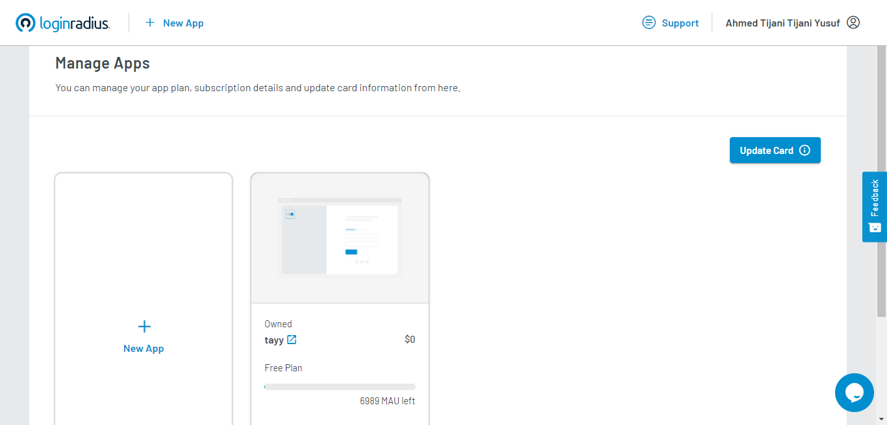
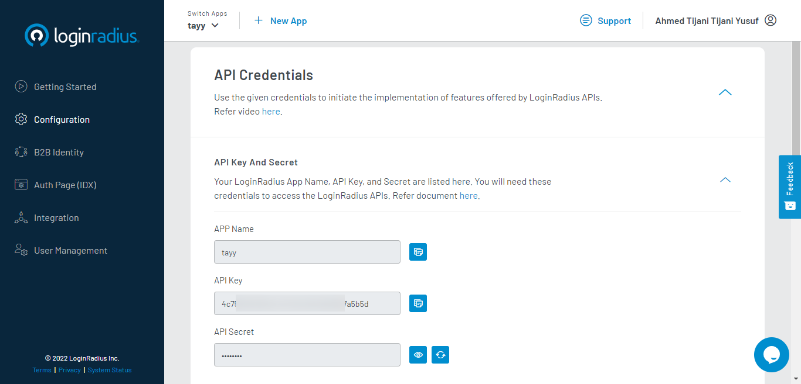
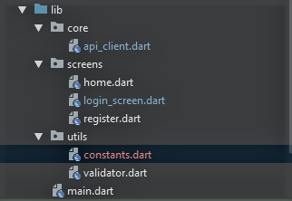

## Introduction

User authentication is the process of validating a user's identity to ensure that they are who they claim to be. Implementing user authentication in your application is critical to prevent unauthorized users from accessing sensitive information.

This tutorial focuses on implementing user authentication and registration in Flutter applications using the [LoginRadius API](https://www.loginradius.com/developers/).

## Prerequisites

If you wish to follow along with this tutorial, you must have the following set up:

- [Sign up for a free LoginRadius developer account](https://accounts.loginradius.com/auth.aspx?action=register)
- Any IDE that has [Flutter SDK](https://docs.flutter.dev/get-started/install) installed (i.e., [Android Studio](https://developer.android.com/studio), [VSCode](https://code.visualstudio.com/))
- A basic understanding of [Dart](https://dart.dev/) and [Flutter](https://flutter.dev/)

This tutorial is verified with Flutter v2.5.1 and Android Studio v3.5.

## Getting Started with LoginRadius

### What is LoginRadius?

LoginRadius is a cloud-based, SaaS Customer Identity and Access Management (CIAM) platform that provides developers and businesses simplified and robust features for managing customer identity, privacy, and access. LoginRadius offers high-level, secure, and well-documented APIs for integrating User Authentication and Single Sign-on (SSO) into your application.

### Why use LoginRadius?

LoginRadius offers:

- A scalable infrastructure
- Built-in security measures to improve user account security and safe user data management
- Advanced login options such as Social SSO and Passwordless Login to improve the user experience
- SDKs and well-documented APIs for seamless integration into your application

So, with everything out of the way, let's get started.

## Setting Up LoginRadius for Your Application

After creating an account with LoginRadius, it sets up a free app for you. This is the app in which you would integrate the LoginRadius API with Flutter. Here my app name is “tayy”.



Next, you need to obtain your LoginRadius API credentials. To do so, [login to your Dashboard](https://dashboard.loginradius.com/login) and navigate to the `Configuration` tab in the sidebar menu. You will find your API credentials under the `API Key and Secret` section. Copy and store your **APP Name**, **API Key**, and **API Secret** somewhere safe and easily accessible.



## Integrating LoginRadius API with Your Flutter Application.

### Step 1: Create a New Flutter project

Create a new Flutter project and navigate to the folder of the application by running the following commands in your terminal:

```dart
flutter create loginradius_example
cd loginradius_example
```

### Step 2: Install Dependencies

Next, you need to install the `dio` package as a dependency in our project. The `dio` package is a powerful HTTP client used for making network requests.

Run the following command to get the newest version of the `dio` package in your project.

```
flutter pub add dio
```

Then, install the dependency by running `flutter pub get` in your terminal.

### Project Structure

The project is being structured in this order:



- Core (contains a class that handles network requests)
- Screens (the UI of our app)
- Utils (helper components)

### Step 3: Setting up the API Client Class

Create a new dart file named `api_client.dart` and import the `dio` package into the file, as follows:

```dart
import 'package:dio/dio.dart';
```

Now let’s create a class named `ApiClient` and initialize the `Dio` object in it. The `ApiClient` class will contain several methods for making network requests based on your features, including User Registration, User Login, Get User Profile Data, and User Logout.

```dart
import 'package:dio/dio.dart';

class ApiClient {
   final Dio _dio = Dio();

    Future<Response> registerUser() async {
        //IMPLEMENT USER REGISTRATION
    }

    Future<Response> login() async {
        //IMPLEMENT USER LOGIN
    }

    Future<Response> getUserProfileData() async {
        //GET USER PROFILE DATA
    }

    Future<Response> logout() async {
        //IMPLEMENT USER LOGOUT
     }
}
```

### Step 4: Implement User Registration

Before implementing the user registration functionality, you must first [obtain the user registration endpoint URL from the LoginRadius API Docs](https://www.loginradius.com/developers/).

After retrieving the endpoint URL, you need to send a POST request to the endpoint using the `Dio` package by passing in:

- the `apiKey` you obtained earlier as a query parameter;
- the `userData` as the request body; and,
- the `SOTT` key as a header, as shown below.

> You can [generate your Secure One Time Token (SOTT) key here](https://www.loginradius.com/developers/).

```dart
class ApiClient {
       //...
       Future<Response> registerUser(Map<String, dynamic>? userData) async {
        try {
          Response response = await _dio.post(
              'https://api.loginradius.com/identity/v2/auth/register',  //ENDPONT URL
              data: userData, //REQUEST BODY
              queryParameters: {'apikey': 'YOUR_API_KEY'},  //QUERY PARAMETERS
              options: Options(headers: {'X-LoginRadius-Sott': 'YOUR_SOTT_KEY', //HEADERS
          }));
          //returns the successful json object
          return response.data;
        } on DioError catch (e) {
          //returns the error object if there is
          return e.response!.data;
        }
      }
    }
```

### Step 5: Implement User Login

The below code snippet shows how you’ll send a POST request to the [LoginRadius login endpoint](https://www.loginradius.com/developers/) URL `https://api.loginradius.com/identity/v2/auth/login`, passing in your `apiKey` as a query parameter and the `email` and `password` of the user as the request body.

```dart
class ApiClient {
       //...
       Future<Response> login(String email, String password) async {
        try {
          Response response = await _dio.post(
            'https://api.loginradius.com/identity/v2/auth/login',
            data: {
              'email': email,
              'password': password
            },
            queryParameters: {'apikey': 'YOUR_API_KEY'},
          );
          //returns the successful user data json object
          return response.data;
        } on DioError catch (e) {
          //returns the error object if any
          return e.response!.data;
        }
      }
    }
```

### Step 6: Get User Profile Data

To [retrieve the user profile details](https://www.loginradius.com/developers/), send a `GET` request to the Read Profile Endpoint URL `https://api.loginradius.com/identity/v2/auth/account`, passing in your `apiKey` as a query parameter and the user's access token as the header.

> The user’s access token is gotten from the successful response object of the User Login endpoint.

```dart
class ApiClient {
       //...

       Future<Response> getUserProfileData(String accesstoken) async {
        try {
          Response response = await _dio.get(
            'https://api.loginradius.com/identity/v2/auth/account',
            queryParameters: {'apikey': 'YOUR_API_KEY'},
            options: Options(
              headers: {
                'Authorization': 'Bearer ${YOUR_ACCESS_TOKEN}',
              },
            ),
          );
          return response.data;
        } on DioError catch (e) {
          return e.response!.data;
        }
    }
```

### Step 7: Implement User Logout

Finally, to [implement the user logout functionality](https://www.loginradius.com/developers/), you would send a `GET` request to the Invalidate User Access Token endpoint URL `https://api.loginradius.com/identity/v2/auth/access_token/InValidate`. This API call invalidates the user's active access token, requiring them to re-authenticate if they want to access their data.

```dart
class ApiClient {
       //...

      Future<Response> logout(String accessToken) async {
        try {
          Response response = await _dio.get(
            'https://api.loginradius.com/identity/v2/auth/access_token/InValidate',
            queryParameters: {'apikey': ApiSecret.apiKey},
            options: Options(
              headers: {'Authorization': 'Bearer $accessToken'},
            ),
          );
          return response.data;
        } on DioError catch (e) {
          return e.response!.data;
        }
      }
    }
```

That concludes the `ApiClient` class. Next, you'll build the UI for your Flutter application, making use of the methods you just created in the `ApiClient` class.

### Building the UI

Your Flutter application will consist of four screens, which include:

- Registration Screen
- Login Screen
- Home Screen

Let’s begin by building the Registration Screen.

### Registration Screen

The `RegistrationScreen` has two `TextFormField` widgets that serve as our `email` and `password` fields, as well as an `ElevatedButton` to handle event submission, as shown in the code snippet below from the `register.dart` file.

```dart
 //...
    @override
    Widget build(BuildContext context) {
      Scaffold(
          backgroundColor: Colors.blueGrey[200],
          body: Form(
            key: _formKey,
            child: SizedBox(
              width: size.width,
              height: size.height,
              child: Align(
                alignment: Alignment.center,
                child: Container(
                  width: size.width * 0.85,
                  padding: const EdgeInsets.symmetric(horizontal: 20, vertical: 30),
                  decoration: BoxDecoration(
                    color: Colors.white,
                    borderRadius: BorderRadius.circular(20),
                  ),
                  child: SingleChildScrollView(
                    child: Column(
                      crossAxisAlignment: CrossAxisAlignment.start,
                      children: <Widget>[
                        const Center(
                          child: Text(
                            "Register",
                            style: TextStyle(
                              fontSize: 30,
                              fontWeight: FontWeight.bold,
                            ),
                          ),
                        ),
                        SizedBox(height: size.height * 0.05),
                        TextFormField(
                          validator: (value) =>
                              Validator.validateEmail(value ?? ""),
                          controller: emailController,
                          keyboardType: TextInputType.emailAddress,
                          decoration: InputDecoration(
                            hintText: "Email",
                            isDense: true,
                            border: OutlineInputBorder(
                              borderRadius: BorderRadius.circular(10),
                            ),
                          ),
                        ),
                        SizedBox(height: size.height * 0.03),
                        TextFormField(
                          obscureText: _showPassword,
                          validator: (value) =>
                              Validator.validatePassword(value ?? ""),
                          controller: passwordController,
                          keyboardType: TextInputType.visiblePassword,
                          decoration: InputDecoration(
                            hintText: "Password",
                            isDense: true,
                            border: OutlineInputBorder(
                              borderRadius: BorderRadius.circular(10),
                            ),
                          ),
                        ),
                        SizedBox(height: size.height * 0.06),
                        Row(
                          mainAxisAlignment: MainAxisAlignment.center,
                          children: [
                            Expanded(
                              child: ElevatedButton(
                                onPressed: _handleRegister,
                                style: ElevatedButton.styleFrom(
                                    primary: Colors.indigo,
                                    shape: RoundedRectangleBorder(
                                        borderRadius: BorderRadius.circular(10)),
                                    padding: const EdgeInsets.symmetric(
                                        horizontal: 40, vertical: 15)),
                                child: const Text(
                                  "Register",
                                  style: TextStyle(
                                    fontSize: 20,
                                    fontWeight: FontWeight.bold,
                                  ),
                                ),
                              ),
                            ),
                          ],
                        ),
                      ],
                    ),
                  ),
                ),
              ),
            ),
          ),
        );
    }
    //...
```

In the `onPressed` callback of the `ElevatedButton` widget, you'll handle the validation of your form data.

If the form is validated, you pass your `userData` to the `registerUser` method from the `ApiClient` class for processing.

If the response is an error, you show a snackbar with the error message. Otherwise, the user is redirected to the Login Screen.

> In the following example, you've provided only a few user attributes as `userData`. To view the complete list of user attributes, please look at [the body parameters of the User Registration API here](https://www.loginradius.com/developers/).

```dart
Future<void> _handleRegister() async {
    if (_formKey.currentState!.validate()) {
    //show snackbar to indicate loading
     ScaffoldMessenger.of(context).showSnackBar(SnackBar(
        content: const Text('Processing Data'),
        backgroundColor: Colors.green.shade300,
      ));

   //the user data to be sent
    Map<String, dynamic> userData = {
      "Email": [
        {
          "Type": "Primary",
          "Value": emailController.text,
        }
      ],
      "Password": passwordController.text,
      "About": 'I am a new user :smile:',
      "FirstName": "Test",
      "LastName": "Account",
      "BirthDate": "10-12-1985",
      "Gender": "M",
    };

    //get response from ApiClient
    dynamic res = await _apiClient.registerUser(userData);
    ScaffoldMessenger.of(context).hideCurrentSnackBar();

    //checks if there is no error in the response body.
    //if error is not present, navigate the users to Login Screen.
    if (res['ErrorCode'] == null) {
      Navigator.push(context,
          MaterialPageRoute(builder: (context) => const LoginScreen()));
    } else {
     //if error is present, display a snackbar showing the error messsage
      ScaffoldMessenger.of(context).showSnackBar(SnackBar(
        content: Text('Error: ${res['Message']}'),
        backgroundColor: Colors.red.shade300,
      ));
    }
  }
}
```

### Login Screen

The `LoginScreen` UI code is similar to the `RegistrationScreen` in that it also has two `TextFormField` widgets that serve as our `email` and `password` fields, as well as an `ElevatedButton` to handle event submission. So, for the sake of brevity, I’ll be leaving out the `LoginScreen` UI code and focusing mainly on the code to be written in the `ElevatedButton` onPressed callback in the `login_screen.dart` file.

```dart
//...
    //...
       Future<void> loginUsers() async {
        if (_formKey.currentState!.validate()) {
          //show snackbar to indicate loading
          ScaffoldMessenger.of(context).showSnackBar(SnackBar(
            content: const Text('Processing Data'),
            backgroundColor: Colors.green.shade300,
          ));

          //get response from ApiClient
          dynamic res = await _apiClient.login(
            emailController.text,
            passwordController.text,
          );
          ScaffoldMessenger.of(context).hideCurrentSnackBar();

          //if there is no error, get the user's accesstoken and pass it to HomeScreen
          if (res['ErrorCode'] == null) {
            String accessToken = res['access_token'];
            Navigator.push(
                context,
                MaterialPageRoute(
                    builder: (context) => HomeScreen(accesstoken: accessToken)));
          } else {
          //if an error occurs, show snackbar with error message
          ScaffoldMessenger.of(context).showSnackBar(SnackBar(
            content: Text('Error: ${res['Message']}'),
            backgroundColor: Colors.red.shade300,
          ));
          }
        }
      }
    //...
```

The code snippet above is a method that first validates the form before passing the `email` and `password` values to the `login` method from the `ApiClient` class for handling.

If the response is successful, you obtain the user’s `access_token` from the response data and pass it over to the `HomeScreen`. Otherwise, you display a snackbar with the error message that occurred.

Then, you pass the `loginUsers` method you created above to the `onPressed` property of the `ElevatedButton` widget in the `LoginScreen`, as shown below.

```dart
    ElevatedButton(
        onPressed: loginUsers, //<--
        style: ElevatedButton.styleFrom(
        primary: Colors.indigo,
        shape: RoundedRectangleBorder(
               borderRadius: BorderRadius.circular(10)),
               padding: const EdgeInsets.symmetric(
                        horizontal: 40, vertical: 15)),
        child: const Text("Login",
            style: TextStyle(
                fontSize: 20,
                fontWeight: FontWeight.bold,
            ),
           ),
         ),
       ),
```

Next, you need to provide a screen that reveals the user's profile data when they successfully log in, and the `HomeScreen` is there to do so.

### Home Screen

The `HomeScreen` displays the user’s profile details using a `FutureBuilder` widget that accepts a future `getUserData`.

```dart
      Future<Map<String, dynamic>> getUserData() async {
        dynamic userRes;
        userRes = await _apiClient.getUserProfileData(widget.accesstoken);
        return userRes;
      }
```

The `getUserData` method above is used to retrieve details of a user by passing in the `access_token` obtained earlier from the `LoginScreen` to the `ApiClient` `getUserProfileData` method.

To display the result of your `getUserData` method on our screen, use a `FutureBuilder` widget. The code snippet below shows how to use the `FutureBuilder` to get the results of the `getUserData` future in the `home.dart` file.

```dart
    class HomeScreen extends StatefulWidget {
      final String accesstoken;
      const HomeScreen({Key? key, required this.accesstoken}) : super(key: key);
      @override
      State<HomeScreen> createState() => _HomeScreenState();
    }
    class _HomeScreenState extends State<HomeScreen> {
      //instance of ApiClient class
      final ApiClient _apiClient = ApiClient();

      //get user data from ApiClient
      Future<Map<String, dynamic>> getUserData() async {
        dynamic userRes;
        userRes = await _apiClient.getUserProfileData(widget.accesstoken);
        return userRes;
      }
      @override
      Widget build(BuildContext context) {
        var size = MediaQuery.of(context).size;
        return Scaffold(
          backgroundColor: Colors.white,
          body: SizedBox(
              width: size.width,
              height: size.height,
              child: FutureBuilder<Map<String, dynamic>>(
                future: getUserData(), //<---
                builder: (context, snapshot) {
                  if (snapshot.hasData) {
                    if (snapshot.connectionState == ConnectionState.waiting) {
                      return Container(
                        height: size.height,
                        width: size.width,
                        color: Colors.blueGrey,
                        child: const Center(
                          child: CircularProgressIndicator(),
                        ),
                      );
                    }
                    //get results from snapshot
                    String fullName = snapshot.data!['FullName'];
                    String firstName = snapshot.data!['FirstName'];
                    String lastName = snapshot.data!['LastName'];
                    String birthDate = snapshot.data!['BirthDate'];
                    String email = snapshot.data!['Email'][0]['Value'];
                    String gender = snapshot.data!['Gender'];
                    return Container(
                      width: size.width,
                      height: size.height,
                      color: Colors.blueGrey.shade400,
                      child: SingleChildScrollView(
                        physics: const BouncingScrollPhysics(),
                     //...
                //...
```

Finally, let's add the logout feature.

Add an `ElevatedButton` widget to the `HomeScreen`.

```dart
     TextButton(
        onPressed: (){},
        style: TextButton.styleFrom(
        backgroundColor: Colors.redAccent.shade700,
        shape: RoundedRectangleBorder(
               borderRadius: BorderRadius.circular(5)),
               padding: const EdgeInsets.symmetric(
                    vertical: 15, horizontal: 25)),
        child: const Text('Logout',
          style: TextStyle(color: Colors.white),           ),
        ),
     ),
```

On pressing the button, you'll call the `logout` method on the `ApiClient` class and pass in the `access_token` value, and then you route the user to the `LoginScreen`.

```dart
     TextButton(
        onPressed: () async {
          await _apiClient.logout(widget.accesstoken);
          Navigator.pushReplacement(
            context, MaterialPageRoute(builder: (context) => const LoginScreen()));
        },
        style: TextButton.styleFrom(
        backgroundColor: Colors.redAccent.shade700,
        shape: RoundedRectangleBorder(
               borderRadius: BorderRadius.circular(5)),
               padding: const EdgeInsets.symmetric(
                    vertical: 15, horizontal: 25)),
        child: const Text('Logout',
             style: TextStyle(color: Colors.white),
          ),
     ),
```


## Conclusion

LoginRadius provides high-level, secure, and well-documented APIs to ease the implementation of authentication and user identity management. This tutorial has discussed LoginRadius's benefits and how to use the LoginRadius APIs to handle user authentication and registration in a Flutter application.

The complete [source code of the demo application is available on GitHub](https://github.com/LoginRadius/engineering-blog-samples/tree/master/Flutter/Flutter_Auth_Guide).

You can also [check out more features of the LoginRadius API here](https://www.loginradius.com/developers/).
