# How to Implement JWT authentication in Deno
## Introduction
It is essential to protect your APIs to get the most out of security, and **Json Web Token** (JWT) authentication allows you to protect your APIs so that an unauthorized person will not have access.

In this tutorial, we shall learn how to handle JWT authentication in Deno by building todo CRUD APIs and protecting the APIs using JWT.
## Prerequisites
This is a hands-on-tutorial to follow along, to get the most out of it, ensure you have:
* Any code editor of your choice.
* Basic knowledge of JavaScript/TypeCsript.
* Basic knowledge of MongoDB.
* Postman or Insomia installed.

## What is Deno
[Deno](https://deno.land/) is a modern runtime environment for  JavaScript/TypeScript, and WebAssembly that uses the Google V8 engine and is developed in Rust language; it is simple and safe. It implements Web platform standards and provides web platform capabilities.
Deno’s features are intended to enhance Node.js’s capabilities. It’s secure by default, with no access to files, networks, or the environment except explicitly enabled, and it supports both JavaScript and TypeScript out of the box.

## Why use Deno
Deno is a well-thought-out modular system; apart from its simplicity and high security, there are so many other reasons to use Deno:
* Outside of an async function, you can use await.
* No setting is required for TypeScript to work.
* There are no dependencies, and it ships as a single executable.
* A dependency inspector and a code formatter are built-in.
* Packages in Deno are decentralized.

## What is Json Web Token
JSON Web Token, which is popularly called JWT, is an open standard that offers a concise and self-contained method for securely communicating data between parties as a JSON object. It holds information in an easy-to-access format for both developers and computers; the tokens' compact size makes them simple to send through URL, POST parameter, or HTTP header. It allows two parties — a client and a server — to share security information. A secret or public/private key pair is used to digitally sign the information in a JWT. 
Authentication is the primary use of JWTs. JWT is assigned to a user after they sign in to an application, and with the assigned JWT, a user can make a request to other routes.

## Install Deno 
Without too many shenanigans, let's get started by installing Deno!
Deno installation in windows isn't as smooth sailing as on Mac or Linux. Unlike in Node.js where you run a command on your terminal, Deno in window can be installed either by using PowerShell, scoop (a command-line installer) or chocolatey (a package manager), visit [install here](https://deno.land/manual/getting_started/installation) for the guide on how to install Deno.

To install Deno with Powershell, open your PowerShell and run the following command:
```
iwr https://deno.land/x/install/install.ps1 -useb | iex
```
Relax while Deno is being installed; when completed, exit PowerShell and close and reopen a terminal. The new PATH is activated by closing and reopening the terminal. Now that we have Deno installed, let's check the version of Deno we installed.

To check the version of your installed Deno, run: `deno -V`.

## Project Setup
With installation out of the way, let us set up our project. Create a folder **DenoAPI_JWT_Auth**, you can call it any name of your choice; in your folder, create an **app.ts** file and a  folder **src**, inside your **src** folder, create the following folders: **controllers**, **database**, **middlewares**, **routes**, **schema**, and **utils**.
Your project directory should look like this:

**DenoAPI_JWT_Auth**
│
└─**src**
│   └───controllers
│   │ 
│   └───database
│   │ 
│   └───middlewares
│   │ 
│   └───routes
│   │
│   └───schema
│   │ 
│   └───utils
└─**app.ts**

## Create Oak Server
Next is to create our Oak server; Oak is a Deno middleware system that provides a router middleware for HTTP servers. Go to your **app.ts** file, import Application from the Deno Oak URL, create an instance of the application, define your port and call a middleware.

**app.ts**

```
import { Application } from "https://deno.land/x/oak/mod.ts";

const app = new Application();
const PORT = 8080;

   app.use((ctx, next) => {
       ctx.response.body = 'Welcome';
        next();
       });

console.log(`Application is listening on port: ${PORT}`);

await app.listen({port:PORT});
```
Let's quickly run our server: to run the server, use `deno run --allow-net app.ts`, Deno will always request permission to use your network, **--allow-net** gives Deno permission to all network calls.

You should see `Application is listening on port: 8080`

Now, in your **routes** folder, create a file **allRoutes.ts**, and set up your router by importing **Router** from the oak url, then create an instance of the router and export the default router.

**routes.allRoutes.ts**
```
import { Router } from "https://deno.land/x/oak/mod.ts";

const router = new Router();

export default router;
```
Moving on, we need to modify our **app.ts** file, so go to **app.ts** and import the router. Let app use **router.routes()** and **router.allowedMethods()** methods, then remove the middleware so it doesn't overshadow the imported routes. The **allowedMethods()** tells Deno to include all routes by our router.

**app.ts**
```
import { Application } from "https://deno.land/x/oak/mod.ts";
import router from "./src/routes/allRoutes.ts";

const app = new Application();
const PORT = 8080;

app.use(router.routes());
app.use(router.allowedMethods());

console.log(`Application is listening on port: ${PORT}`);

await app.listen({port:PORT});
```
You can run your app again with the same command: `deno run --allow-net app.ts`

## Create User Data
Now, we need to create our user data, but before that, let's connect our application to MongoDB database.
Go to your **database** folder, create a file **connectBD.ts**, import MongoClient from the Deno MongoDB URL, create an instance of MongoClient, connect your database and export default.

**database.connectDB.ts**
```
import { MongoClient } from "https://deno.land/x/mongo@v0.30.0/mod.ts";

  const client = new MongoClient();

  await client.connect({
    db: 'deno_auth',
    tls: true,
    servers: [
      {
        host: 'your-mongo-db-host',
        port: 27017,
      },
    ],
    credential: {
      username: 'dbUserName',
      password: 'dbPassword',
      mechanism: 'SCRAM-SHA-1',
      db: "admin",
    },
 })

 console.log("Database connected!");
 const db = client.database("deno_auth");

 export default db;
 
```

With that out of our way, let us create an interface for our database; in your **schema** folder, create a file **user.ts** import objectId from deno MongoDB URL, then define your schema and export it.

**schema.user.ts**
```
import {ObjectId} from "https://deno.land/x/mongo@v0.30.0/mod.ts";

export interface UserSchema {
    _id: ObjectId;
    username: string;
    password: string;
  }
```
Moving on, let's play with some logic; go to your **controllers** folder, create a file **users.ts**, in the file import your database and UserSchema; one well-known fact is that it's not a good practice to store your password in plain text for security reason, let's also import bcrypt from deno bcrypt URL to hash our password. So, create a function **signup** that takes username and password; we take the user' details from the request body, hash the password and save them to our database.


**controllers.users.ts**
```
import db from "../database/connectBD.ts";
import * as bcrypt from "https://deno.land/x/bcrypt/mod.ts";
import { UserSchema } from "../schema/user.ts";

const Users = db.collection<UserSchema>("users");

export const signup = async({request, response}:{request:any;response:any}) => {
    const {username, password} = await request.body().value;
    const salt = await bcrypt.genSalt(8);
    const hashedPassword = await bcrypt.hash(password, salt);

    const _id = await Users.insertOne({
        username,
        password:hashedPassword
      });
      response.status =201;
      response.body = {message: "User created", userId:_id, user:username}
      
};
```
Now, head over to the **allRoutes.ts** file in your **routes** folder, import the **signup** function from the controller and create a post route for **signup**.

**routes.allRoutes.ts**
```
import { Router } from "https://deno.land/x/oak/mod.ts";
import {signup} from "../controllers/users.ts";

const router = new Router();

//User routes
router.post("/api/signup", signup)

export default router;
```
  
## Create Authenticate User route
Next is for us to create an authentication route that authenticates our user route, the latest version of deno does not allow a string as a secret key but a cryptokey generated from a [Web Crypto API](https://developer.mozilla.org/en-US/docs/Web/API/SubtleCrypto/generateKey) with the generatekey() method of the [SubtleCrypto](https://developer.mozilla.org/en-US/docs/Web/API/SubtleCrypto) interface.
So, head over to your **utils** folder, create a file **apiKey.ts**,  and in the file, generate your key and export it.

**utils.apiKey.ts**
```
export const key = await crypto.subtle.generateKey(
    { name: "HMAC", hash: "SHA-512" },
    true,
    ["sign", "verify"],
  );
```
Now that we have successfully created our key, we can create a user authentication route so that every user that logs in will get authenticated. Head over to your **user.ts** file in your controller, import the API key, create a **signin** function and write some validation logic to validate that the user actually exists in our database. If validation is successful, we create a token to authenticate the user. 

# Using JWT to Autheticate our User
Now, let's import Deno JWT (djwt) **create** function from the URL to create our token. When a user logs in, we take the id, and username, pass the payload into the JWT **create** function, generate a token and use the token to authenticate the user.

**controllers.users.ts**
```
import db from "../database/connectDB.ts";
import * as bcrypt from "https://deno.land/x/bcrypt/mod.ts";
import { UserSchema } from "../schema/user.ts";
import { create } from "https://deno.land/x/djwt@v2.4/mod.ts";
import { key } from "../utils/apiKey.ts";

const Users = db.collection<UserSchema>("users");

    //create a user
    export const signup = async({request, response}:{request:any;response:any}) => {
    const {username, password} = await request.body().value;
    const salt = await bcrypt.genSalt(8);
    const hashedPassword = await bcrypt.hash(password, salt);

    const _id = await Users.insertOne({
        username,
        password:hashedPassword
      });
      response.status =201;
      response.body = {message: "User created", userId:_id, user:username}     
};

   //signin a user
    export const signin = async ({request, response}:{request:any; response:any}) => {

    const body = await request.body();
    const {username, password} = await body.value;

    const user = await Users.findOne({username});

    if(!user) {
        response.body = 404;
        response.body = {message: `user "${username}" not found`};
        return;
    }
    const confirmPassword = await bcrypt.compare(password, user.password);
    if(!confirmPassword){
        response.body = 404;
        response.body = {message: "Incorrect password"};
        return;
    }
    
    //authenticate a user
    const payload = {
        id: user._id,
        name: username
    };
    const jwt =  await create({ alg: "HS512", typ: "JWT" }, { payload }, key);

    if(jwt) {
        response.status = 200;
        response.body = {
            userId: user._id,
            username: user.username,
            token: jwt,
        }
     } else {
        response.status = 500;
        response.body = {
            message: "internal server error"
        }
    }
        return;
    }
```

So far, we have made great progress; the next thing is to import our **signin** function in the routes and create a post request for it.

**routes.allRoutes.ts**
```
import { Router } from "https://deno.land/x/oak/mod.ts";
import {signup, signin} from "../controllers/users.ts";

const router = new Router();

//User routes
router.post("/api/signup", signup)
      .post("/api/signin", signin);
      

export default router;
```
Congratulations for coming this far! We are through with the authentication route. Now, we can register a user, sign in and authenticate the user. 

We need to create our todo CRUD API and protect the routes so that a random person will not be able to access our route except authenticated.

Go to your **schema** folder, and create a file **task.ts**; in the file, create your tasks interface and export it.
  
## Create Todo route

**schema.task.ts**
```
export interface TaskSchema {
    name: string;
    isCompleted: boolean;
  } 
```

After successfully creating the task interface, we will move to our controller, create a file **tasks.ts**, and import the database, schema and object Id. Then write the logic for our todo CRUD API.

**controllers.tasks.ts**
```
import db from "../database/connectDB.ts";
import { TaskSchema } from "../schema/task.ts";
import {ObjectId} from "https://deno.land/x/mongo@v0.30.0/mod.ts";

const tasks = db.collection<TaskSchema>("tasks");

export const create = async({request, response}:{request:any;response:any}) => {
    const {name, isCompleted} = await request.body().value;

    const _id = await tasks.insertOne({
        name,
        isCompleted
      });
      response.body = {message: "Task created!!", id:_id, name:name, Completed:isCompleted}
    };

    export const getTasks = async ({response}:{response:any}) => {
    const allTasks = await tasks.find({}).toArray();

    response.status = 200;
    response.body = {tasks:allTasks};
  };

    export const getById = async ({
    params,
    response
   }:{
    params:{taskId:string};
    response:any;
  }) => {
    const taskId = params.taskId;
    const task = await tasks.findOne({_id:new ObjectId(taskId)});

    if(!task){
        response.body = {message: `no task with Id: ${taskId}`};
        return;
}
    response.status = 200;
    response.body = {task: task}
};

export const updateById = async ({
    params,
    request,
    response
}:{
    params:{taskId:string};
    request:any;
    response:any;
}) => {
    const taskId = params.taskId;
    const {name, isCompleted} = await request.body().value;
    const task = await tasks.updateOne({_id:new ObjectId(taskId)},
    {$set:{name:name, isCompleted:isCompleted}});

    response.status = 200;
    response.body = {message:"Updated task", task:task};
};

export const deleteTask = async ({
    params,
    response,
}:{
    params:{taskId:string};
    response:any;
}) => {
    const taskId = params.taskId;
    const task = await tasks.deleteOne({_id:new ObjectId(taskId)});
    response.status = 200;
    response.body = {message:"Deleted task", task:task};
};
```

With that out of the way, we need to create our todo CRUD routes. So head over to the **allRoutes.ts** and import the CRUD functions from the task controllers, then create the routes for our todo.

**routes.allRoutes.ts**
```
import { Router } from "https://deno.land/x/oak/mod.ts";
import {signup, signin} from "../controllers/users.ts";
import {create, getTasks, getById, updateById, deleteTask} from "../controllers/tasks.ts";

const router = new Router();

//User routes
router.post("/api/signup", signup)
      .post("/api/signin", signin);

//Task routes
router.post("/api/tasks", create)
      .get("/api/tasks", getTasks)
      .get("/api/tasks/:taskId", getById)
      .patch("/api/tasks/:taskId", updateById)
      .delete("/api/tasks/:taskId", deleteTask);

export default router;
```

## Protect Todo Route
We need to protect our todo routes so that an unauthorized person will not be able to access them. To protect the todo routes, go to your **middlewares** folder, create a file **isAuthorized.ts**, import the **verify** function from deno JWT URL, import **Context** from deno, import the secret key we created and create the **authorized** function. The authorize function checks if a user has a JWT token, grant the user access if he does, and deny him access if otherwise.

**middlewares.isAuthorized.ts**
```
import { verify } from "https://deno.land/x/djwt@v2.4/mod.ts";
import { key } from "../utils/apiKey.ts";
import { Context } from "https://deno.land/x/oak/mod.ts";

export const authourized = async (ctx: Context, next:any) => {
    try{   
    const headers: Headers = ctx.request.headers;
    const authorization = headers.get('Authorization');
    if(!authorization) {
        ctx.response.status = 401;
        return;
    }
    const jwt = authorization.split(' ')[1];

    if(!jwt) {
        ctx.response.status = 401;
        return;
    }
    const payload = await verify(jwt, key);

    if(!payload){
    throw new Error("!payload")
    }
     await next();
     
     } catch (error) {
        ctx.response.status = 401;
        ctx.response.body ={message: "You are not authorized to access this route"}
        return;
    }
};
```
To protect our todo routes, we import the authorized middleware function from the **isAuthorized.ts** middleware file and pass the middleware into the todo routes to protect them from unauthorized people.

**routes.allRoutes.ts**
```
import { Router } from "https://deno.land/x/oak/mod.ts";
import {signup, signin} from "../controllers/users.ts";
import {create, getTasks, getById, updateById, deleteTask} from "../controllers/tasks.ts";
import { authourized } from "../middlewares/isAuthorized.ts";

const router = new Router();

//User routes
router.post("/api/signup", signup)
      .post("/api/signin", signin);

//Task routes
router.post("/api/tasks", authourized, create)
      .get("/api/tasks", authourized, getTasks)
      .get("/api/tasks/:taskId", authourized, getById)
      .patch("/api/tasks/:taskId", authourized, updateById)
      .delete("/api/tasks/:taskId", authourized, deleteTask);

export default router;
```

Awesome!!! our application is ready, but wait! don't get too excited yet, relax let's test the application :)

Below is what our final project directory looks like:

**DenoAPI_JWT_Auth**
│
└─**src**
│   └───controllers
│   │      └───users.ts
│   │      └───tasks.ts
│   │
│   └───database
│   │      └───connectDB.ts
│   │         
│   └───middlewares
│   │      └───isAuthorized.ts
│   │         
│   └───routes
│   │      └───allRoutes.ts
│   │
│   └───schema
│   │      └───user.ts
│   │      └───task.ts
│   │ 
│   └───utils
│   │      └───apiKey.ts
│   │         
└─**app.ts**

## Test Application
Now that our application is ready, we need to test the various routes to ensure they are working. To test the routes, run your server again with `deno run --allow-net app.ts`.

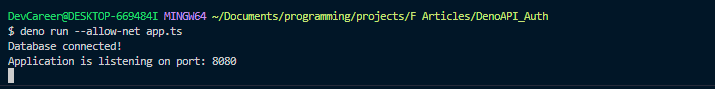

Great! I have my app running on port:8080; we can now head to the postman to test our routes..

**Sign up route:** 


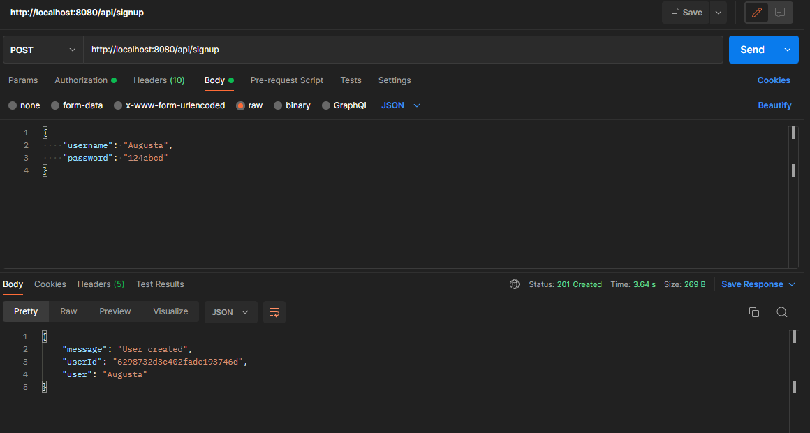

**Sign in route:**
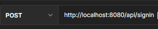

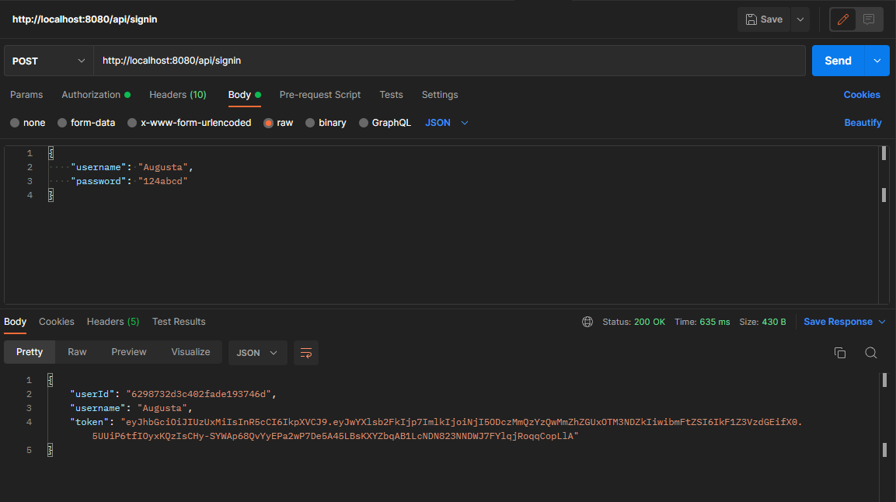

Amazing!!! Now that we have signed up and authenticated a user, the returned token, which shows that the user has been authenticated can be used to access our todo CRUD APIs.

**Accessing our todo  routes:**
First, let's try accessing our todo routes without the token...

**Create task route:**


As you can see, when we tried to create a task, we got a message `You are not authorized to access this route` because it was done by a random person without a token.

Now, let's also try accessing the delete by Id route without the token...

**Delete task route:**
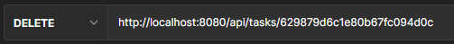

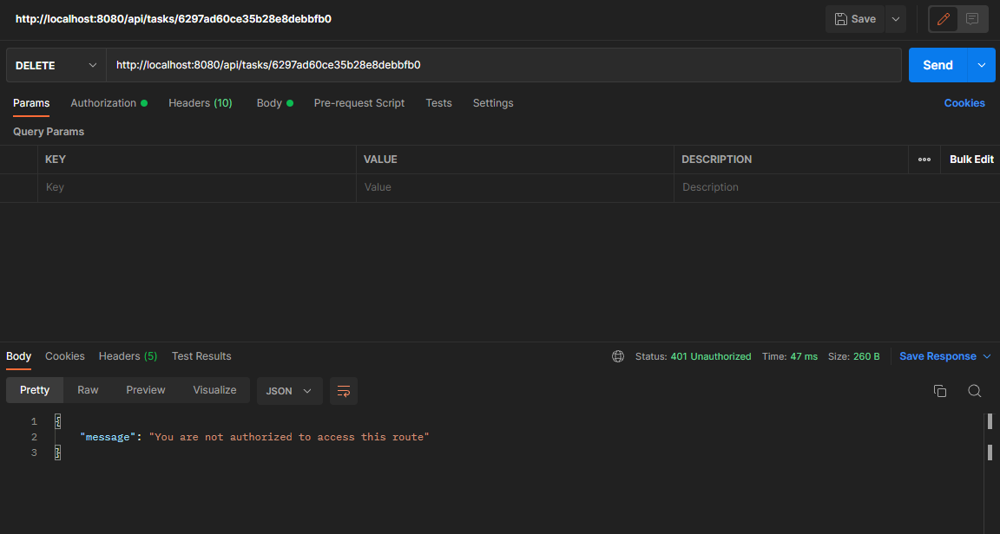

Obviously, our todo CRUD APIs have been protected, and the only way a user can access them is by getting authenticated. Now let's login a user again, and use the returned token to access our todo routes.

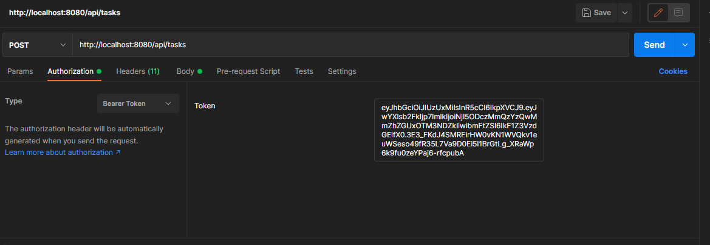

So, we have logged a user in and put the returned Bearer's token in the authorization header; we can access our todo APIs now because, with the bearer's token, we are authorized to access the todo APIs.

**Create task route:**
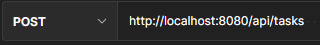

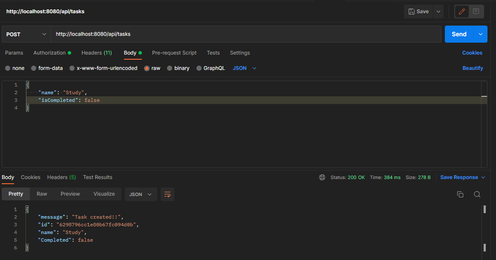

**Get all tasks route:**
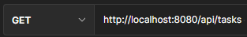

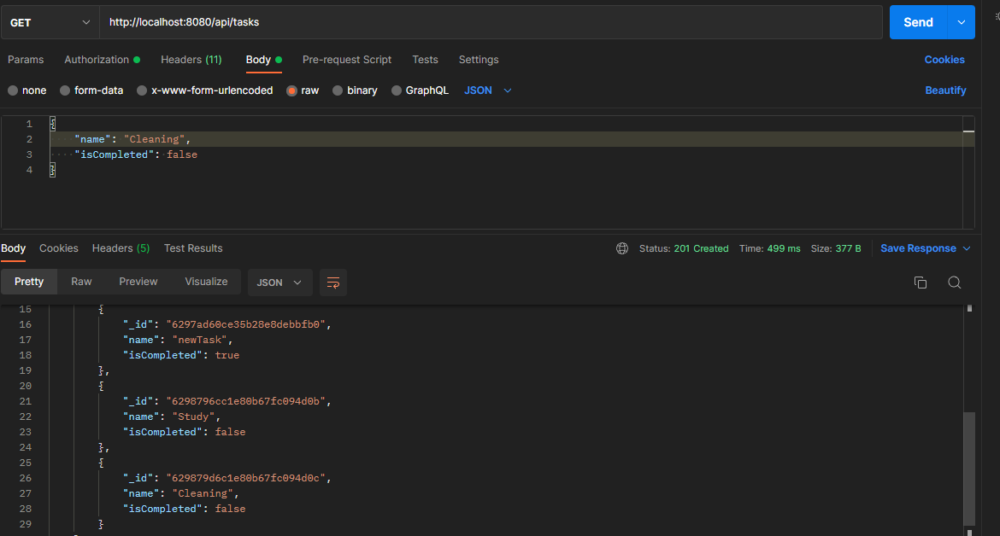

**Get task by Id route:**


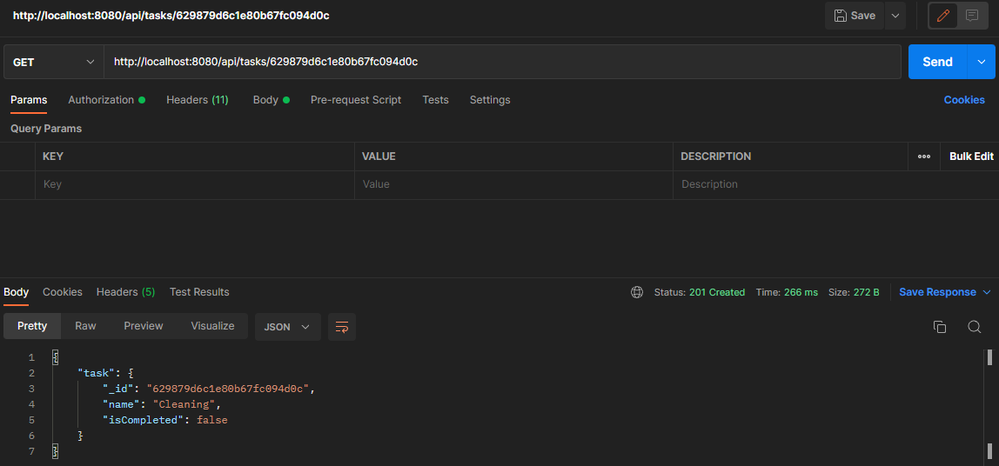

Feel free to test the other routes to see how things works.

## Conclusion
In this tutorial, we built a todo CRUD API and protected the routes from unauthorized people using Json Web Token(JWT). The learners learnt how to create an Oak server in deno, connect MongoDB, implement JWT authentication, as well as create and authenticate CRUD routes in a Deno application. The code for this tutorial is available [here](https://github.com/icode247/auth-with-deno) on Github. Feel free to clone and extend features of the application.