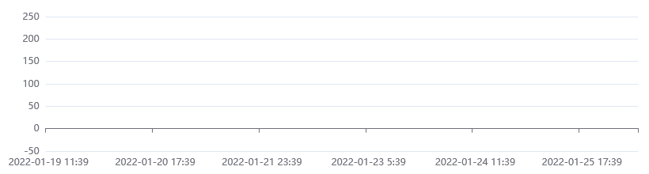

When your webapp has a large amount of data to visualize, you don't want your users to wait 10 seconds before they see something.

One technique that is often overlooked is HTTP streaming. It's broadly supported, works well, and doesn't require any fancy libraries.

We're going to go through how we can use HTTP streaming in our applications and what to take into account when we do so.

## Introduction

When building web applications, we typically have a REST API with GET endpoints that do something like this:

1. Parse the request (URL, query params, etc..)
2. Query data from a database
3. Convert the database results into JSON
4. Send the JSON response back

The API will typically wait for each step to complete before going on to the next one and by step 4, the database result and the JSON objects are all in memory before the request is handled and everything can be cleaned up.

This works and there is nothing wrong with it (KISS right?) as long as the result of your database query is small and quickly available.

But let's say you want to render a chart with 10k data points. Querying will not be as smooth anymore.
The simple way will work, but ideally you don't want to accumulate all the data in memory before sending the response.

With HTTP streaming you can start rendering the chart even before your query is complete.

To make it happen:

1. Your API should use HTTP streaming to send its response.
2. Your webapp should use the [Fetch API](https://developer.mozilla.org/en-US/docs/Web/API/Fetch_API) to make the request so that it can process the streaming response.


## Create a Streaming API 

In this example, we use [Koa](https://koajs.com/) for the API, but you can use other libraries like Express or plain Node.js. Most will have support for streaming.

Let's create an API:

```Javascript
const Koa = require('koa');
const app = new Koa();

app.use(async (ctx) => {
    if (ctx.request.url === '/measurements.json') {
        ctx.response.set('content-type', 'application/json');
        // This is where the magic happens: set a stream as the response body
        ctx.body = fs.createReadStream('./measurements.json');
    }
});

http.createServer(app.callback()).listen(3000);
```

This code creates an API with 1 endpoint `GET /measurements` that will respond with the contents of a JSON file with 10k measurements.

The file looks like this:

```JSON
[
  { "id": "1", "timestamp":  "2022-01-19T10:39:00.000Z", "value":  239.34 },
  { "id": "2", "timestamp":  "2022-01-19T10:40:00.000Z", "value":  820.14 },
  { "id": "3", "timestamp":  "2022-01-19T10:41:00.000Z", "value":  926.03 },
  { "id": "4", "timestamp":  "2022-01-19T10:42:00.000Z", "value":  513.01 },
  // ...
  { "id": "99998", "timestamp":  "2022-03-29T21:16:00.000Z", "value":  13.81 },
  { "id": "99999", "timestamp": "2022-03-29T21:17:00.000Z", "value": 465.28 },
  { "id": "100000", "timestamp":  "2022-03-29T21:18:00.000Z", "value":  71.95 }
]
```

We're creating a HTTP/1.1 server with Node's `http` module. By setting `ctx.body` to a stream, data will be sent to the requester as soon as it is loaded using a mechanism called [chunked transfer encoding](https://en.wikipedia.org/wiki/Chunked_transfer_encoding).

This saves time and memory of your API because it doesn't have to accumulate the whole result in memory before sending the response.

In a real application, you're probably using a database instead of a pre-created JSON file.
If you're using MongoDB you can create a stream with the [cursor's `stream()` method](https://docs.mongodb.com/drivers/node/current/fundamentals/crud/read-operations/cursor/#stream-api).

## Consume a Streaming API From a Webapp

The `GET /measurements` endpoint we created can be consumed with any HTTP client, but you have to use the [Fetch API](https://developer.mozilla.org/en-US/docs/Web/API/Streams_API/Using_readable_streams#consuming_a_fetch_as_a_stream) to take advantage of streaming.

`fetch()` will set `response.body` to a [ReadableStream](https://developer.mozilla.org/en-US/docs/Web/API/ReadableStream) for streaming responses.

Here's how you can read a streaming response:

```Javascript
fetch('http://localhost:3000/measurements.json')
    .then(async (response) => {
        // response.body is a ReadableStream
        const reader = response.body.getReader();
        for await (const chunk of readChunks(reader)) {
            console.log(`received chunk of size ${chunk.length}`);
        }
    });

// readChunks() reads from the provided reader and yields the results into an async iterable
function readChunks(reader) {
    return {
        async* [Symbol.asyncIterator]() {
            let readResult = await reader.read();
            while (!readResult.done) {
                yield readResult.value;
                readResult = await reader.read();
            }
        },
    };
}
```

If you run the API that we created and then run the code above in a web browser, you'll see `received chunk of size x` several times in the console with varying x:


To see it more clearly, open up Developer Tools (F12) and set network throttling to 3G. It will take longer for the file to download, so you can see that the chunks are being processed gradually.

That's all very nice, but the chunks themselves are not very useful. You want to process the measurements that are in these chunks. Ideally, you would have an async iterable that gradually yields the JSON objects as they come in so that you can use `for await` to iterate over the measurements instead of the chunks.

JavaScript doesn't have a JSON parser that can deal with streams. For now, let's assume we have a function that can do this called `parseJsonStream(readableStream)`. More details and a simple implementation can be found in "Streaming Considerations" below.

We would then be able to do this:

```Javascript
fetch('http://localhost:3000/measurements.json')
    .then(async (response) => {
        let measurementsReceived = 0;
        for await (const measurement of parseJsonStream(response.body)) {
            measurementsReceived++;
            // To prevent the console from flooding we only show 1 in every 100 measurements
            if (measurementsReceived % 100 === 0) {
                console.log(`measurement with id {${measurement.id}} at time ${measurement.timestamp} has value [${measurement.value}]`);
            }
        }
    });
```

This is the result:


This is a very powerful mechanism. Instead of `console.log()` statements, imagine a line chart where the measurements are gradually becoming visible as more data comes in.

This is an example created with [Apache ECharts](https://echarts.apache.org/):



Before the Fetch API, it was not possible to do this because the alternative, [`XMLHttpRequest`](https://developer.mozilla.org/en-US/docs/Web/API/XMLHttpRequest), will load the whole response into memory before providing it to your code.

Modern applications don't use `XMLHttpRequest` directly, but a lot of libraries like [Axios](https://axios-http.com/) or Angular's [HttpClient](https://angular.io/api/common/http/HttpClient) rely on it to make requests.

People would rely on more advanced technologies like [WebSockets](https://developer.mozilla.org/en-US/docs/Web/API/WebSockets_API) to stream data.

## HTTP/2 for Streaming

You might have heard that HTTP/2 has a more efficient mechanism for streaming, and you would be right. So let's see if we can use HTTP/2.

From the side of your webapp, the browser will automatically determine if it can communicate with the server over HTTP/2 and use it if it's available. The Fetch API will do this transparently, so you do not need to make any changes to your webapp.

What you need to do is make your API available over HTTP/2:

```Javascript
const Koa = require('koa');
const app = new Koa();

app.use(async (ctx) => {
    if (ctx.request.url === '/measurements.json') {
        ctx.response.set('content-type', 'application/json');
        ctx.body = fs.createReadStream('./measurements.json');
    }
});

http2.createSecureServer(
    {
        key: fs.readFileSync(path.resolve('path/to/localhost-key.pem')),
        cert: fs.readFileSync(path.resolve('path/to/localhost.pem')),
    },
    app.callback(),
).listen(3000);
```

This code is mostly the same as for HTTP/1.1 with 2 notable differences:

* We're using Node's `http2` module instead of `http`.
* We're using `HTTPS` instead of plain `HTTP` because this is mandatory for HTTP/2. You can set up HTTPS and get the `cert` and `key` files using [mkcert](https://github.com/FiloSottile/mkcert). Or, use one of the other mechanisms described in this article: https://web.dev/how-to-use-local-https/

That's it!

If you restart the API and check the network tab in Developer Tools, you'll see that your application will now stream over HTTP/2 (don't forget to update the URL in your webapp, start with "https://" instead of "http://").

## HTTP Streaming Considerations

In the code above, we assumed that there was a function `parseJsonStream(readableStream)` that would parse a `ReadableStream` containing JSON into an async iterable of objects.

The difficulty is that reading from a `ReadableStream` will give you chunks of data that don't necessarily correspond to anything meaningful. To illustrate, let's take a look at this example:

```JSON
[
  { "id": "1", "timestamp":  "2022-01-19T10:39:00.000Z", "value":  239.34 },
  { "id": "2", "timestamp":  "2022-01-19T10:40:00.000Z", "value":  820.14 },
  { "id": "3", "timestamp":  "2022-01-19T10:41:00.000Z", "value":  926.03 },
  { "id": "4", "timestamp":  "2022-01-19T10:42:00.000Z", "value":  513.01 }
]
```

We could receive this JSON in chunks like this:

```
[
  { "id": "1", "timestamp":  "2022-01-19T10:39:00.000Z", "value":  239.34 },
  { "id": "2", "tim


 estamp":  "2022-01-19T10:40:00.000Z", "value":  820.14 },
  { "id": "3", "timestamp":  "2022-01-19T10:41:00.000Z", "value":  926.03 },
  { "id": "4", "timestamp":  "2022-01-19T10:42


:00.000Z", "value":  513.01 }
]
```

You need some way to determine where one measurement object starts and ends. To simplify this, we created a JSON file where each line contains exactly 1 object. Parsing the stream becomes manageable when we can make this assumption.

Here is the implementation of `parseJsonStream(readableStream)`

```Javascript
async function *parseJsonStream(readableStream) {
    for await (const line of readLines(readableStream.getReader())) {
        const trimmedLine = line.trim().replace(/,$/, '');

        if (trimmedLine !== '[' && trimmedLine !== ']') {
            yield JSON.parse(trimmedLine);
        }
    }
}

async function *readLines(reader) {
    const textDecoder = new TextDecoder();
    let partOfLine = '';
    for await (const chunk of readChunks(reader)) {
        const chunkText = textDecoder.decode(chunk);
        const chunkLines = chunkText.split('\n');
        if (chunkLines.length === 1) {
            partOfLine += chunkLines[0];
        } else if (chunkLines.length > 1) {
            yield partOfLine + chunkLines[0];
            for (let i=1; i < chunkLines.length - 1; i++) {
                yield chunkLines[i];
            }
            partOfLine = chunkLines[chunkLines.length - 1];
        }
    }
}

function readChunks(reader) {
    return {
        async* [Symbol.asyncIterator]() {
            let readResult = await reader.read();
            while (!readResult.done) {
                yield readResult.value;
                readResult = await reader.read();
            }
        },
    };
}
```

If you have control over the API you're calling, you can use the "1 object per line" formatting as part of the contract, but know that it could be prone to breaking. For robust JSON support, we need a real streaming parser.

Other options include using a format that has 1 object per line by default, like CSV, or a more advanced format that has built-in support for streaming like [Apache Arrow](https://arrow.apache.org/docs/js/).

## Advantages

1. **Snappy User Experience:** You can start showing data as soon as it's available.
2. **Scalable API:** No memory usage spikes from accumulating results in memory.
3. Uses plain HTTP and a standard Javascript API. No connections to manage or complicated frameworks that might become obsolete in a few years.

## Disadvantages

1. Implementation is slightly more involved than using regular API calls.
2. Error handling becomes more difficult because HTTP status code 200 will be sent as soon as streaming starts. What do we do when something goes wrong in the middle of the stream?
3. No streaming JSON parser is currently available. Needs formatting assumptions as part of the contract or a more unconventional format.

## Conclusion

You have learn how to stream data efficiently using HTTP using Node.js and HTTP without congesting or burdening the memory. You have also learn the advantages and disadvantages for HTTP streaming.
