SolidJS is a declarative JavaScript framework used for building UIs and web applications in a pragmatic and performant manner. Even though it's fairly new, it's similarity with other JavaScript frameworks like React and Svelte has made it more adoptable for the developer community. 

So in this tutorial, I'll give you a complete walkthrough of SolidJS and help you understand the essentials of it. You'll also build a simple web application with SolidJS to get a better hang of the basics. Finally, I'll compare and contrast it with the most popular framework in town — React. 

## What is SolidJS?


SolidJS takes the syntax and developer experience of React and combines it with the performance of Svelte to give you the best of both worlds.

Just like React, Solid uses JSX to render HTML in the browser. It also uses similar syntax for reactivity to update DOM in real-time. However, unlike React, it uses a compiled DOM instead of virtual DOM. 

This means, at the end of the day, you get a smaller size pure JavaScript bundle. Much like the production bundle of your Svelte or Vanilla JS application. This makes it blazingly fast and highly performant.

## SolidJS Essentials

Let's now understand the fundamentals of SolidJS using some code examples. To follow along, you can directly run these snippets in the [SolidJS playground](https://playground.solidjs.com/). 

### Architecture

Solid follows the component architecture for modularity and reusability. Let's see how you can create an entry component and render it to the DOM. 

[Here's a component `HelloWorld`](https://playground.solidjs.com/?hash=1358759546&version=1.4.1] that is injected into the DOM inside an HTML element that has an id `app`:

```jsx
import { render } from "solid-js/web";

function HelloWorld() {
  

  return (
    <h1>Hello World</h1>
  );
}

render(() => <HelloWorld />, document.getElementById("app")!);

```

From the above code, it's also clear that componens are a function that return the HTML template using JSX.

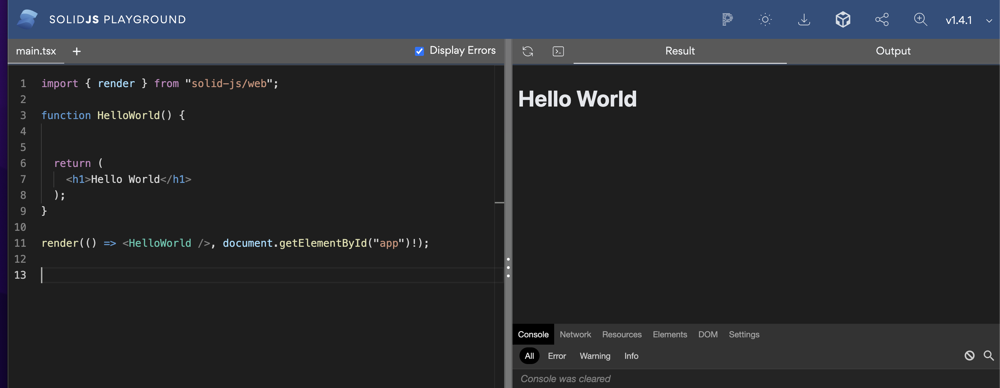

Solid components allow only a single JSX element at the top level. To combat this, you can use special JSX elements called fragments: 

```jsx
    <>
     <h1>Hello World </h1>
     <p>This is my first solid app </p>
    </>
```

#### Nesting Components

Components can be nested inside one another. For instance, here you have a `<Header/>`component:

```jsx

function Header() {
  return (
    <h1>
     Header
    </h1>
  );
}

export default Header;
```

That is rendered inside the main `<App/>`component:

```jsx
import { render } from "solid-js/web";
import Header from './header';

function App() {
 

  return (
    <>
      <Header/>
      <h1>
      Hello World
      </h1>
    </>
  );
}

render(() => <App />, document.getElementById("app")!);

```

That should give you both the components on the DOM like this:

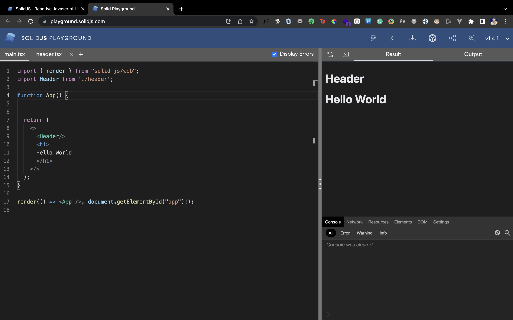

#### Props

Props are data and functions you can pass from one component to another to share data and features between the two components. In the previous example, you can pass a `title` prop to the `<Header/>` component:

```jsx
...
    <Header title="Header"/>
...
```

Then consequently consume this prop inside the child component: 

```jsx
function Header({title}) {
  return (
    <h1>
     {title}
    </h1>
  );
}

export default Header;
```

### Reactivity and Events

Reactivity allows you to create variables that dynamically trigger a DOM update when changed.

SolidJS allows you to create reactive variables called *signals* using the `createSignal` function. This function takes in the initial value of the variable as a parameter. And it returns an array where the first element is the variable itself and the second element is a function that is used to mutate that variable.

[Here's an example](https://playground.solidjs.com/?hash=776620219&version=1.4.1) that changes the reactive variable called `name`:

```jsx
import { render } from "solid-js/web";
import { createSignal } from "solid-js";

function DisplayName() {
  const [name, setName] = createSignal('fuzzysid');
  const changeName = () => setName('siddhant')

  return (
    <>
      <h1> {name} </h1>
      <button onClick={changeName}> Change Name </button>
    </>
  );
}

render(() => <DisplayName />, document.getElementById("app")!);

```

Initially, the name outputs the string 'fuzzysid':

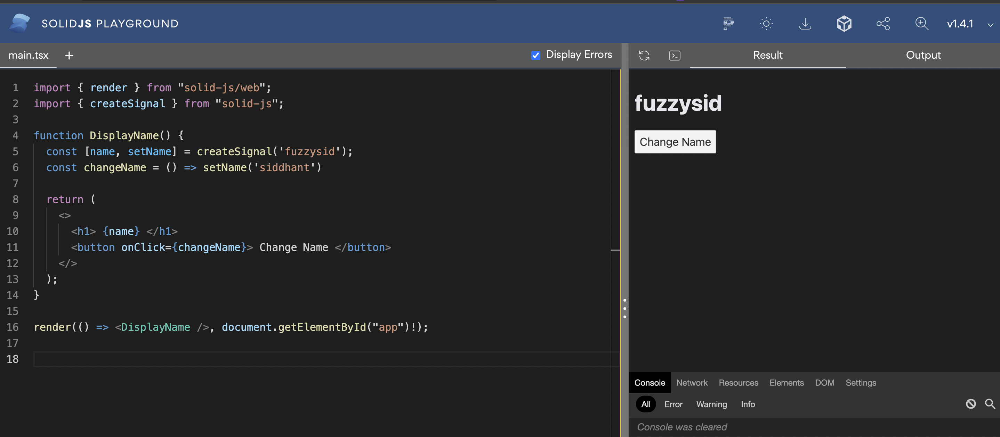

A click event ia used on the button that fires a function called `changeName`. When you press the *Change Name* button, the `changeName` function updates the `name` signal to 'siddhant':

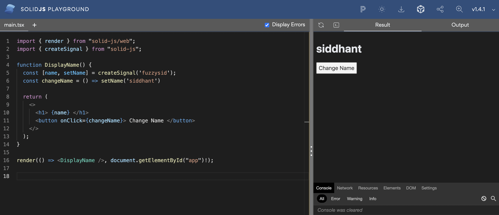

What a `state` is to React components, a `signal` is to Solid components. [Here's another useful and typical example](https://playground.solidjs.com/?hash=-1579873004&version=1.4.1) of reactive variables:

```jsx
import { render } from "solid-js/web";
import { createSignal } from "solid-js";

function Counter() {
  const [count,setCount] = createSignal(0);

  return (
    <>
      <h1> Counter: {count} </h1>
      <button onClick={()=>setCount(count=>count-1)}>  Decrement </button>
      &nbsp;
      <button onClick={()=>setCount(count=>count+1)}>  Increment </button>
    </>
  );
}

render(() => <Counter />, document.getElementById("app")!);
```

You can take the current value of a signal inside the signal's mutation's callback function. The above code used the current value of `count` to increment and decrement it accordingly. 

### Effects

Effects are triggers or watchers that can help you fire a function when a signal updates.

Let's say in the previous example you want to throw an alert when count becomes greater than 5.

You can create an effect using the `createEffect` function to do so. It takes a callback function as a parameter. This callback function is fired whenever a signal invoked inside it changes. 

```jsx
createEffect(()=>{
    if(count()>5) alert('Count is greater than five')
})
```

So now if you click on the *Increment* button, you should get an alert when it becomes greater than 5:

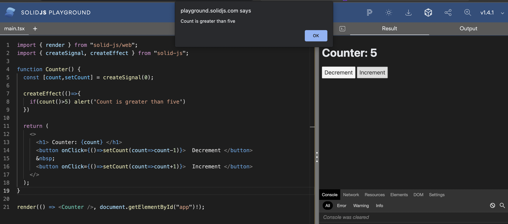

### Conditionals

Solid provides special components called `<Show>` to render a template based on a condition or the value of a signal. [Here's](https://playground.solidjs.com/?hash=1279589651&version=1.4.1) an example of that:

```jsx
import { render } from "solid-js/web";
import { createSignal,Show } from "solid-js";

function Counter() {
  const [count,setCount] = createSignal(0);

  return (
    <>
      <h1> Counter: {count} </h1>
      <button onClick={()=>setCount(count=>count-1)}>  Decrement </button>
      &nbsp;
      <button onClick={()=>setCount(count=>count+1)}>  Increment </button>
      <Show when={count()>5}>
        <p>Count is greater than five </p>
      </Show>
    </>
  );
}

render(() => <Counter />, document.getElementById("app")!);

```

Once the `count` becomes greater than 5, the `<p>` will start showing on the DOM:

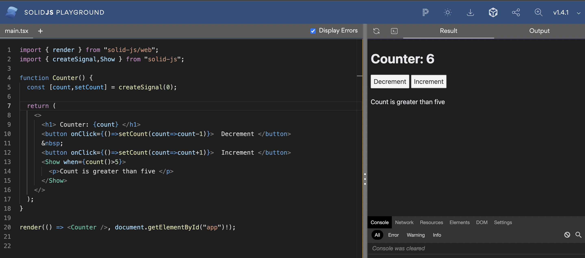

### Loops

Just like `<Show>`, Solid also provides a special component called `<For>` to render a list on the DOM from an array. 

In the [following example](https://playground.solidjs.com/?hash=195732488&version=1.4.1), you use the `<For>` component to render a list of fruits from the `fruits` signal. Inside the opening brackets of the `<For>` component, you specify the variable name that will be used to extract items to loop through using the `each` prop. 

Then, you can take a callback inside which you get the individual item as the first parameter and an optional index of the iteration as a second parameter.

```jsx
import { render } from "solid-js/web";
import { createSignal, For } from "solid-js";

function Counter() {
  const [fruits,setFruits] = createSignal([
    'Mango 🥭',
    'Apple 🍎',
    'Banana 🍌',
    'Melon 🍈',
    'Watermelon 🍉'
  ]);

  return (
    <>
      <h1> Fruits </h1>
      <For each={fruits()}>{(fruit,index)=>
        <div>{index()+1}: {fruit}</div>
      }
      </For>
    </>
  );
}

render(() => <Counter />, document.getElementById("app")!);
```

Here's how the list looks like when rendered in the DOM:

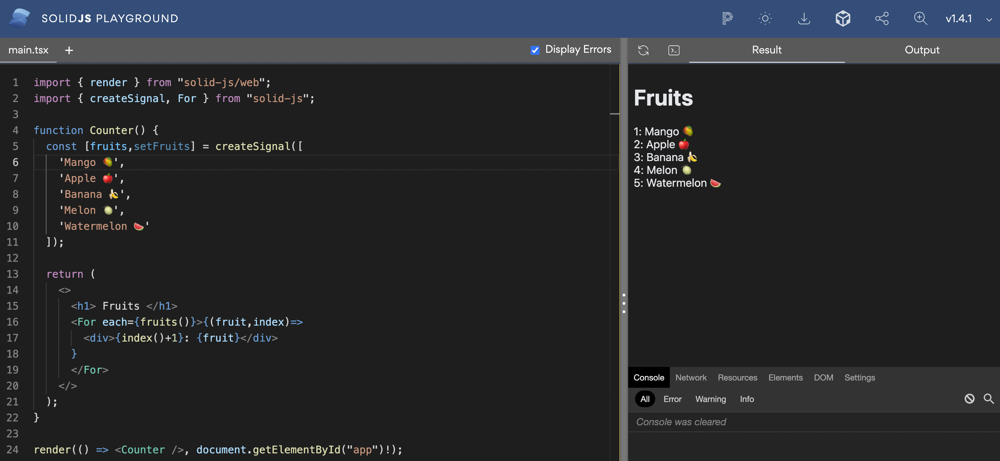

### Lifecycle Methods 

Most frameworks provide a number of lifecycle methods for different purposes. This often leads to a steeper learning curve as well as unnecessary complexity.

Solid stays truly reactive: it gives you the `createEffect` and signals to build whatever interaction you want. However, to simplify things further, it gives you two primary lifecycle methods. 

#### onMount

The `onMount` method is fired just once in the entire lifecycle of a Solid component. It runs only the first time your component mounts on the DOM. It's a good place to make any API calls your application needs.

For instance, consider the [following example](https://playground.solidjs.com/?hash=-1837326429&version=1.4.1) that uses the `onMount` method to fetch and render some data:

```jsx
import { render } from "solid-js/web";
import { createSignal, onMount, For } from "solid-js";

function App() {
  const [posts, setPosts] = createSignal([]);

  onMount(async () => {
    const res = await fetch(`https://jsonplaceholder.typicode.com/posts`);
    setPosts(await res.json());
  });

  return <>
    <h1>Effects: onMount</h1>

    <div>
      <For each={posts()}>{ post =>
          <p>
            {post.body}
          </p>
      }</For>
    </div>
  </>;
}

render(() => <App />, document.getElementById('app'));
```

It renders a list of posts fetched from a dummy API:

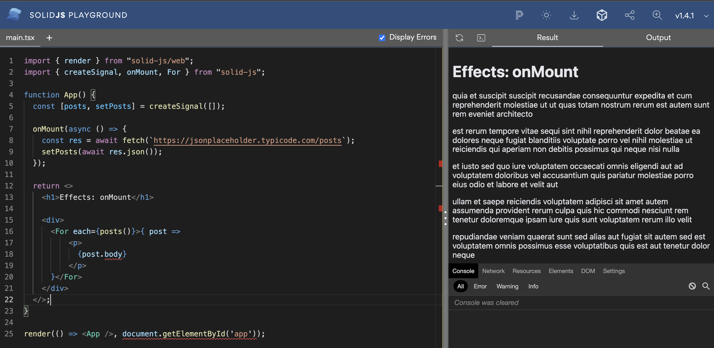

#### onCleanup 

`onCleanup` is the exact opposite of `onMount`. It's fired whenever a component unmounts from the DOM completely. Ideally, you can use this method to clear any event listeners you may have added to your DOM elements. 

Here's an example that does that:

```jsx
import { render } from "solid-js/web";
import {  onMount, onCleanup } from "solid-js";

function App() {

  const handleMouseEnter=()=>{
    console.log('Entered the box')
  }

  onCleanup(()=>{
    const box=document.querySelector('#box');
    box.removeEventListener('mouseenter',handleMouseEnter)
  })

  onMount(async () => {
    const box=document.querySelector('#box');
    const onMouseEnter=box.addEventListener('mouseenter',handleMouseEnter)
  });

  return <>
    <h1>Effects</h1>

    <div id="box" style={{height:'200px',width:'200px',border:'1px solid red'}}>

    </div>
  </>;
}

render(() => <App />, document.getElementById('app'));
```

When you enter the red box, the `mouseenter` event fires and you get a message on the console. As a cleanup, when the component unmounts, we remove this event listener from that `<div>`. 


## Build a Todo App with SolidJS

Let's put all that knowledge together to build a small todo application with Solid.

### Setup

To get started, you'll create a new SolidJS project configured with [Vite](https://vitejs.dev/) by running:

```shell
npx degit solidjs/templates/js my-app
```

That should create a new Solid project for you. Navigate inside this project and open it in a code editor (like VS Code):

```shell
cd my-app && code .
```

Next, install the dependencies by running:

```shell
npm i
```

And finally kickstart the app by running:

```shell
npm run start
```

That should open the project for you at http://localhost:3000. Awesome!

### Architecture & Boilerplate Code

Your initial project structure gives the `<App/>` component by default. This is going to be your entry point component. For starters, clean everything that's inside it:

```jsx
import styles from './App.module.css';


function App() {
 
  return (
    <div class={styles.App}>
      
    </div>
  );
}

export default App;

```

Notice that you also have an `App.module.css` file being imported here. It's then referenced inside the `<div>` container. You'll add all our styles inside this `App.module.css` file and reference it the same way. 

Now let's create some boilerplate files. Here's what the architecture of our Todo app would look like:

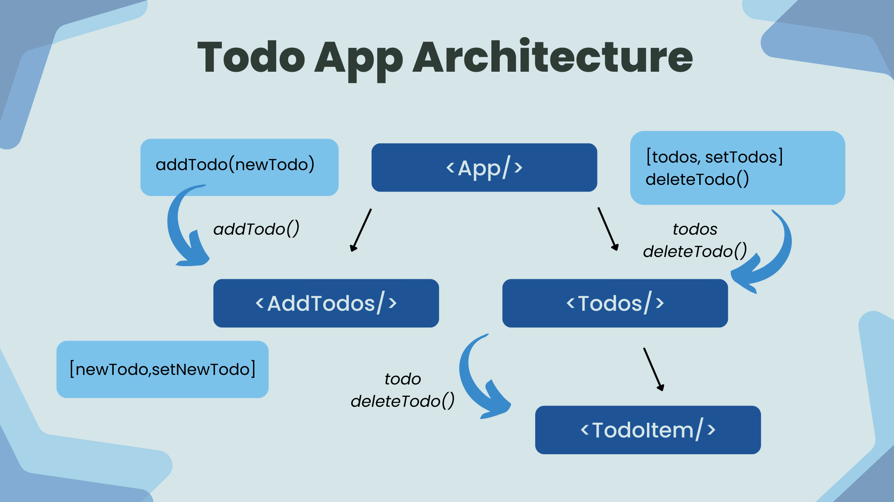

You'll have your top-most parent `<App/>` component that would store the all the todos and the functions to manipulate these todos. This `<App/>` component will have a two child components. 

First, the `<AddTodo>` component which will be responsible for adding a new todo.

Second, the `<Todos/>` component which will be responsible for rendering the list of todos via it's own child — `<TodoItem/>` component. 

Create a JSX file for each of the above components. 

### The `<AddTodo/>` Component

The `<AddTodo/>` component will render an input field and a button. The input field is where the user types a new todo. The button will be used to send this new todo back to a function in the parent `<App/>` component to add this todo to the todos list. This function will be taken as props inside the `<AddTodo/>` component.

To store the `newTodo`, create a signal since you want this property to be reactive based on what user enters in the input. 

```jsx
 const [newTodo,setNewTodo]=createSignal('')
```

Now let's add the template inside the component's JSX:

```jsx
import {createSignal} from 'solid-js'


function AddTodo({addTodo}){

    const [newTodo,setNewTodo]=createSignal('')

    
    return(
        <div>
            <input 
                onChange={handleChange} 
                value={newTodo()} type="text" 
                placeholder="Type a new todo..."
            />
            <button onClick={handleClick}>Add Todo</button>
        </div>
    )
}

export default AddTodo;
```

You bind the input field to the `newTodo` signal. You now need to create the `handleChange` function that updates the `newTodo` signal based on the `onChange` event. 

You also need to create `the handleClick` function that passed the `newTodo` signal to the `addTodo` function prop and clears the input state.

```jsx
 const handleChange=(e)=>setNewTodo(e.target.value)

 const handleClick=()=>{
        addTodo(newTodo)
        setNewTodo('')
 }
```

Here's how the entire `<AddTodo/>` component looks like:

```jsx
import {createSignal} from 'solid-js'


function AddTodo({addTodo}){

    const [newTodo,setNewTodo]=createSignal('')

    const handleChange=(e)=>setNewTodo(e.target.value)

    const handleClick=()=>{
        addTodo(newTodo)
        setNewTodo('')
    }
    
    return(
        <div>
            <input 
                onChange={handleChange} 
                value={newTodo()} type="text" 
                placeholder="Type a new todo..."
            />
            <button onClick={handleClick}>Add Todo</button>
        </div>
    )
}

export default AddTodo;
```

You also need to render this inside the `<App/>` component:

```jsx
import styles from './App.module.css';
import {createSignal} from 'solid-js'
import AddTodo from './AddTodo';

function App() {

  const addTodo=(newTodo)=>{
   
  }

  const deleteTodo=(todo)=>{

  }

  return (
    <div class={styles.App}>
      <h1 class={styles.heading}>Todos</h1>
      <AddTodo addTodo={addTodo}/>
    </div>
  );
}

export default App;

```

Once you do that, you should see an input field with a submit button rendered by the `<AddTodo/>` component on the screen:

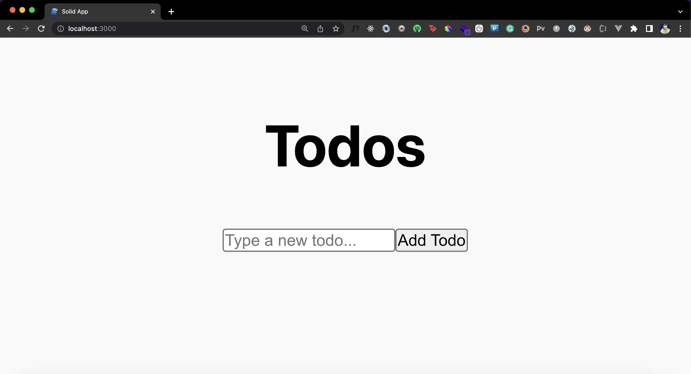

### Rendering Todos

Now let's work on two simple components that are responsible for rendering the todos. First, the `<Todos/>` component. This component takes in two props as you already know — list of todos called the `todos` signal and the `deleteTodo` method. 

```jsx
import { For } from 'solid-js';
import TodoItem from './TodoItem';

function Todos({todos,deleteTodo}){
    console.log(todos())
    return(
        <For each={todos()}>{(todo,ind)=>
           
        }
        </For>
    )

}

export default Todos;
```

You use the `<For/>` component to loop through the list of todos. Now, you need to pass each todo item and the `deleteTodo` method further down to your `<TodoItem/>` component. This component is responsible for rendering each individual list item. 

```jsx
function TodoItem({todo,deleteTodo}){
    const handleDelete=()=>deleteTodo(todo);
    return(
        <p onClick={handleDelete}>{todo}</p>
    )
}

export default TodoItem;
```

When you click on an item, you invoke the `deleteTodo` function and pass the clicked todo item as a parameter. 

Finally, render the `<Todos/>` component inside the root `<App/>` component.

```jsx
import styles from './App.module.css';
import {createSignal} from 'solid-js'
import Todos from './Todos';
import AddTodo from './AddTodo';

function App() {
  const [todos,setTodos]=createSignal([])

  const addTodo=(newTodo)=>{
  }

  const deleteTodo=(todo)=>{
    
  }

  return (
    <div class={styles.App}>
      <h1 class={styles.heading}>Todos</h1>
      <AddTodo addTodo={addTodo}/>
      <Todos deleteTodo={deleteTodo} todos={todos}/>
    </div>
  );
}

export default App;

```

Great! Let's complete out the todo app by writing the logic for adding and deleting a todo.

### Adding and Deleting Todos

To add a new todo, you only need to complete the logic inside the `addTodo` function in the `<App/>` component. This function already takes a `newTodo` parameter, which is the new todo item you need to add. 

```jsx
const addTodo=(newTodo)=>{
    setTodos([newTodo(),...todos()]);
}
```

You'll add the `newTodo` in the `todos` signal that is an array using its setter function `setTodos`. Use JavaScript array destructuring here to ensure to keep the previous todos intact. Let's give this a whirl now:

<video align="center" width="600px" src="./add-todos-demo.mp4"> </video>

Looks like you're able to add todos now. Awesome! 

To delete the todo when they're clicked, populate your `deleteTodo` function:

```jsx
  const deleteTodo=(todo)=>{
    let newTodos=todos;
    newTodos=newTodos().filter(_todo=>_todo!=todo);
    setTodos(newTodos)
  }
```

First, make a copy of the current todos array. Then, filter through this copy to remove the todo you wish to delete. Finally, update your original `todos` signal with this copy using the `setTodos ` setter. Let's test it out now:

<video align="center" width="600px" src="./delete-todos-demo.mov"></video>

You can delete todos as well, cool! 

### Styling the App

Functionally your app is complete, but it surely misses some aesthetics. Let's add some simple yet neat looking styles. You can directly update the styles in our `App.module.css` file:

```css
*{
  margin: 0;
  padding: 0;
}

.App {
  text-align: center;
  height: 100vh;
  background: #F8F8F8;
  padding: 100px;
  display:flex;
  flex-direction: column;
  align-items: center;
}

.heading{
  font-size: 96px;
  margin-bottom: 20px;
}

input{
  border-radius: 12px;
  outline: none;
  border: none;
  padding: 5px 20px;
  margin-right: 20px;
  height: 60px;
  width: 400px;
  font-size: 24px; 
  box-shadow: rgba(0, 0, 0, 0.05) 0px 1px 2px 0px;
}

button{
  height: 65px;
  width: 150px;
  border: none;
  outline: none;
  border-radius: 12px;
  font-size: 24px;
  padding: 5px 15px;
  box-shadow: rgba(0, 0, 0, 0.05) 0px 1px 2px 0px;
  cursor: pointer;
  font-weight: 600;
  background:#2e3136;
  color:#fff;
}

p{
  height: 60px;
  background: white;
  width: 600px;
  text-align: center;
  display: flex;
  align-items: center;
  justify-content: center;
  border-radius: 12px;
  font-size: 24px;
  margin: 20px 0px;
  box-shadow: rgba(0, 0, 0, 0.05) 0px 1px 2px 0px;
}

p:hover{
  background: rgb(232, 169, 146);
  color:#fff;
  cursor: pointer;
}


.header {
  background-color: #282c34;
  min-height: 100vh;
  display: flex;
  flex-direction: column;
  align-items: center;
  justify-content: center;
  font-size: calc(10px + 2vmin);
  color: white;
}
```

And that should give us a much better looking todo app now:

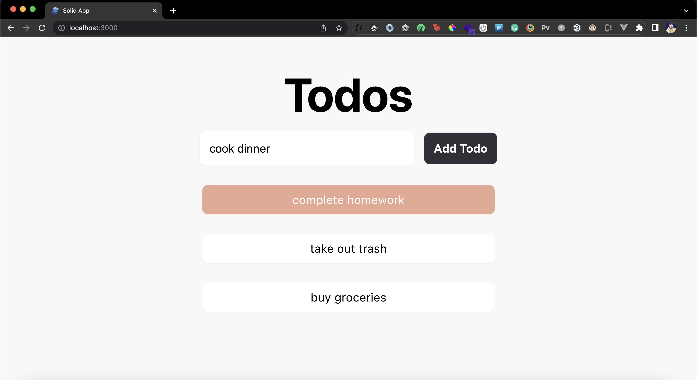

## SolidJS vs. React

If you're coming from a React background, building the todo app must feel like a piece of cake to you! This is because in terms of syntax and architecture, Solid is strikingly similar to React. It uses the same structure of using functional components, returning JSX, fragments, one-way data binding etc. 

Using effects, refs and events is also much similar to React in Solid. So it's safe to say that Solid provides almost the same if not slightly different syntactic sugar like React. Then why do we need another React like framework for building web applications?

Solid differs from React in terms of performance, developer experience, rendering algorithm, and reactivity. Let's skim through the key differences:

### Performance

In the beginning of this tutorial, we talked how Solid doesn't use a virtual DOM. Instead it uses a compiled DOM. This gives it a significant edge over React as well as literally any other framework in terms of run-time performance. It generates a blazingly fast production bundle that is aimed to provide a more rich user experience to your users. 

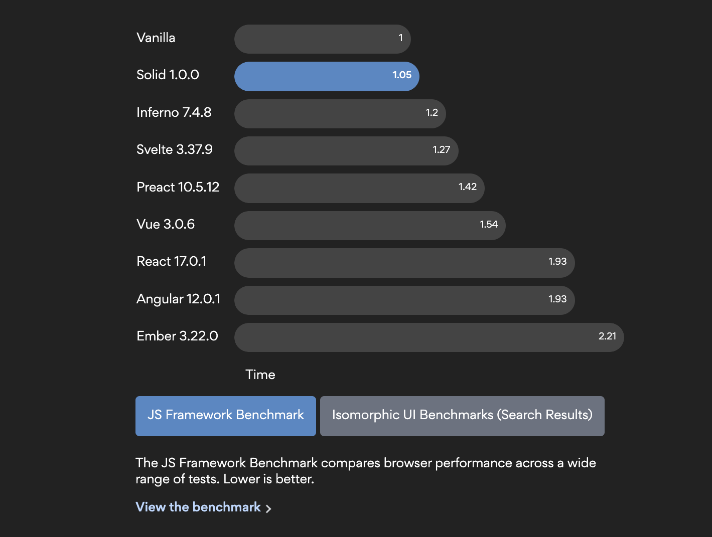 

If you wish to dive deeper into these stats and take a closer look at performance benchmarks, [here's a comparison guide you can refer](https://krausest.github.io/js-framework-benchmark/current.html). 

### Solid is Truly Reactive

Reactivity lies at the heart of SolidJS, which is why you'll never find any unnecessary renders of your Solid components. Only the part of a template that needs to update will re-render.

With React, however, change in a state leads to re-rendering of the entire component. There are ways to combat this, but needs additional efforts in terms of learning these concepts and incorporating them in your applications.

### Community Support, Documentation, and Resources

Even though Solid has a great and extensive documentation, the React community is much larger since it has been around for a longer time. That can be a deal breaker for you if you want to build a scalable web applications quickly. Even third-party libraries are short in number for Solid in comparison to React.

## Conclusion

Solid indeed has an interesting future ahead and is definitely worth a side-project or an MVP for your startup. If you wish to explore Solid in-depth, you can check out an official tutorial by the Solid team [here](https://www.solidjs.com/tutorial/introduction_basics) that walks you through each and every concept in Solid. You can also explore the entire code for the demo in this tutorial here. Until next time!

