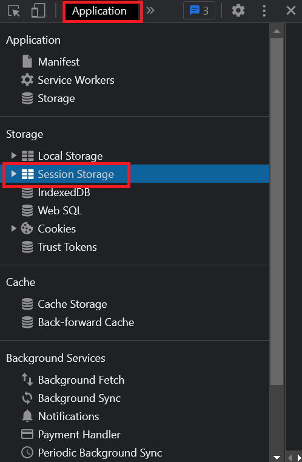
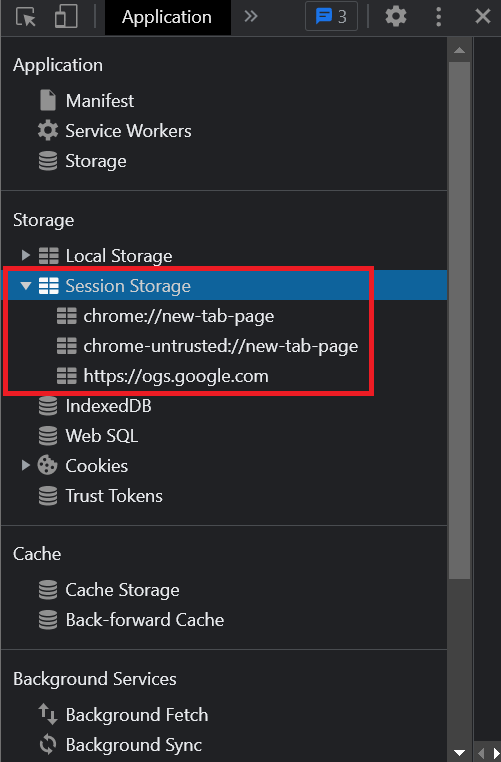
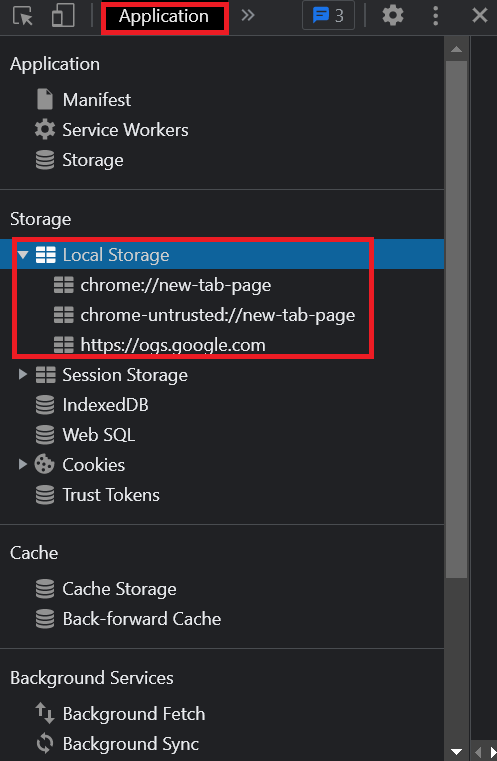
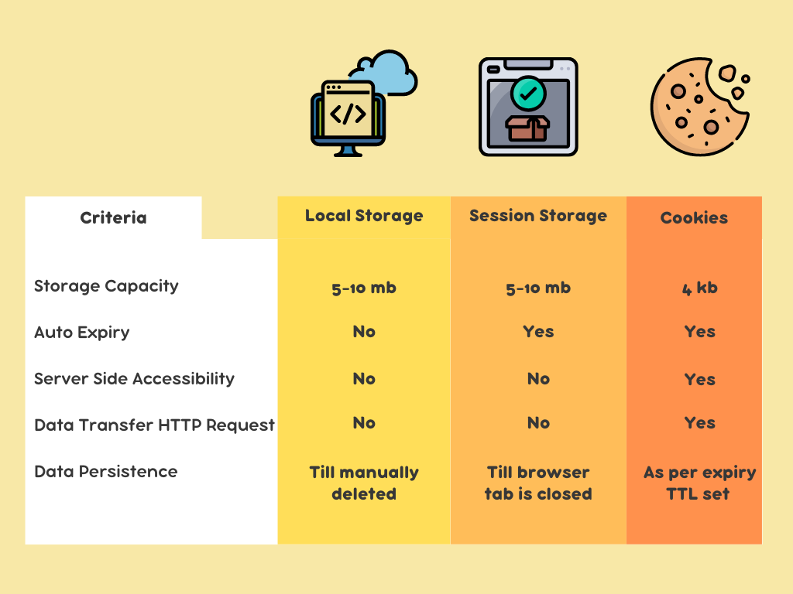

In this post, I’ll talk about how cookies compare to browser storage. You’ll understand why cookies came out, the problem they solve, and their limitations.

Then you’ll explore what browser storage is, and dive deeper into local storage and session storage. You’ll look at their features, where they can be useful, and how to use them via JavaScript.

You’ll then see how you can contrast the features, advantages, and disadvantages of each and also highlight specific use cases of each.

You’ll also look at the best practices or approach to keep in mind while using each of them and the best place to store your JWT or auth tokens.

---

How many times have you seen a popup on a website that says:

> This website is using cookies to store your information.

I'm guessing so often that you've lost the count!

Cookies have been used since time immemorial for storing session related information of a user. This allows websites to provide a unique and engaging experience to their users.

However, cookies can be a bit difficult to use, have limited use-case, and have small data storing capacity. To combat this, modern browsers come with their own storage mechanisms like local storage and session storage.

In this post, I’ll talk about these storage mechanisms. You'll understand how local storage, session storage, and cookies compare against one another and explore common use cases of each. By the end of this post, you'll know exactly when to use which.

## A Brief History of Cookies

Let's have a refresher on the history of cookies.

Back in the day, websites used HTTP protocol which is _stateless_. This meant that they couldn't store user-related information like the user’s session id, the name of the user, etc., in the browser.

As the web advanced and grew more popular, websites started storing user related information in the browser itself. This helped them differentiate what kind of user is interacting with their website and provide a personalized experience to the user.

### Enter Cookies

That's how cookies were born. They presented a mechanism to store lightweight client or server side data on the browser as key value pairs. They also had an expiry timestamp after which they were automatically deleted by the browser.

Also, both browser and the server could set and retrieve cookies from a user’s browser. Moreover, these cookies were sent alongside each HTTP request automatically. This came in handy for server side websites at a time when single page applications weren't a thing. They could easily discern a user's information with each HTTP request that user made.

## The Rise of Browser Storage

Where cookies solved a great problem, it had some limitations. First, they could only store data up to a few kbs. As client-side applications became more complex, there was a need to store more complex data in the browser.

With the onset of HTML5, websites were introduced to browser storage APIs for storing client side information. These APIs were available on browser's window objects globally. Thus, any JavaScript running in the browser could easily access them. The major differentiator was that they had higher data storage capacity and could only be accessed by client-side JavaScript.

Browsers rolled out two storage mechanisms — local storage and session storage. So let's explore and understand them in detail.

## Browser’s Session Storage

Let's first take a peek at where the session storage resides in the browser:

1. Open the developer tools in the browser and head over to the "Application" tab.

   

2. Under the storage section, you'll find a section named "Session Storage".

   

3. Click on it, and you'll be able to see the session storage for that website.

There it is! Now, let's look at the features of browser's session storage.

### Storage Capacity

Session storage can store data ranging between 5mb - 10mb. The exact amount of storage capacity varies as per each browser's implementation, but it's a lot more than 4kb of storage capacity cookies offer!

### Data Persistence

As the name suggests, session storage only persists the data as long as a browser tab is opened. This means that each time you open a new tab or a new browser window, a new session storage is created. So any data you store inside the session storage will automatically get deleted when you close that tab/window.

### Using Session Storage

You can access the session storage in the `window` object:

```javascript
window.sessionStorage
//Storage {length: 0}
```

This would return the length of the session storage along with an object representing the data that's currently present inside. Since it's empty to begin with, the length is 0. Note that you may directly access the `sessionStorage` object as well.

#### Adding Data

Let's add a key-value pair to the session storage using the `setItem` function available in the `sessionStorage` object:

```javascript
sessionStorage.setItem("id", "123")
```

This will set a new item in the session storage with the key `id` and value `123`. If you simply invoke the `sessionStorage` object now:

```javascript
sessionStorage
//Storage {id: '123', length: 1}
```

You now get your recently added data back!

You'll also see this inside the session storage section of the browser's application tab:


#### Inserting Complex JSON Data

Let's add a bit more complex JSON object in the session storage that looks like this:

```javascript
const data = {
  _id: "61c6c1df7cda7d370a9ef601",
  index: 0,
  guid: "13672f0e-f693-4704-a6f9-839ff36e8960",
  isActive: true,
  balance: "$3,602.49",
  picture: "http://placehold.it/32x32",
  age: 25,
  friends: [
    {
      id: 0,
      name: "Adkins Coleman",
    },
    {
      id: 1,
      name: "Howe Douglas",
    },
    {
      id: 2,
      name: "Becky Velez",
    },
  ],
}
```

You'll first need to _stringify_ it since the value against a key can only be a string. Then, you'll store it inside the session storage using the `setItem` method:

```javascript
sessionStorage.setItem("user_data", JSON.stringify(data))
```

It should now appear inside the session storage of the browser's application tab:


Awesome! Let's take a look at retrieving this data.

#### Retrieving Data

You can use the `getItem()` function to retrieve a value stored against a key from the session storage by specifying the key as the first parameter in the function.

```javascript
sessionStorage.getItem("id")
//'123'
```

If you're retrieving an object, you'll need to use `JSON.parse` first to convert the string into a JavaScript object:

```javascript
JSON.parse(sessionStorage.getItem("user_data"))
```

### Usecase

Since data in session storage persists only across a browser tab, there are some unique usecases for session storage.

#### Booking Applications

Session storage can be used in multi-step processes that must be performed in a single instance. This includes booking flights, hotels, movie tickets, train reservations etc. You can store the details of the previous steps in the browser's session storage to prepopulate those forms or inputs.

Since these are critical activities that must be performed in a single go, the data will automatically get deleted when the user jumps to a new tab or a new browser window.

#### Prompting Login/Signups to a User

Blogging websites, newsletters, tutorial websites etc., have tons of visitors who read through the content without creating an account. In such scenarios, you can subtly prompt the user every time they visit the website to create an account. You can track the session of each user in the session storage.

Every time a user reads a blog post or an article on a different tab, you can ask them to create an account. This could be a great way to offer a non-blocking experience for your users whilst effectively converting them to a signed-up user for your website.

## Browser’s Local Storage

Under the application tab where session storage resides, you'll find a section called local storage right underneath it.



That's where you can see everything you store inside the local storage of your browser. Local storage works, appears, and similar to session storage. For instance, just like Session storage, local storage can also store data ranging between 5mb - 10mb depending upon a browser's implementation.

### Data Persistence

Unlike session storage where data is automatically deleted when a browser tab or window is closed, data in local storage has no default expiry. It's only deleted if you manually delete that data from the local storage either directly, via browser settings, or through your JavaScript code.

That means that data in a local storage persists even after a particular tab or browser window is closed.

### Using Local Storage

You can add and retrieve data from local storage in the same way you perform those operations with session storage. The only change is now you'll have to use the `localStorage` object to perform these operations instead.

For instance, you can add an item to the `localStorage`, as follows:

```javascript
localStorage.setItem("id", "123")
```

Consequently, you can retrieve an item using the `getItem()` function:

```javascript
localStorage.getItem("id")
//'123'
```

### Usecase

Local storage has a number of uses due to the fact that data inside it has no default expiry. Think about all those scenarios where you want to store some global data that's accessed often in your application.

#### Generic

For instance, your user's email id, username, full-name, etc. All these data are widely used throughout different pages of your application. Storing this data inside the local storage will help you prevent unwanted API calls to the server to fetch this data. Also, since this data isn't normally changed often, the chances of having inconsistent data across the browser and the server is quite low.

#### Application Specific

You can also use it to store application specific data that is immutable throughout a login session of a user. For instance, if you have an ecommerce site, you can store the preferred payment option of the user, default delivery addresses, etc. You can also store user preferences such as the theme a user prefers for your website (dark or light mode).

## Cookies vs. Browser Storage

Now that you've understand how browser storage works, you can compare them effectively against cookies. However, let's first look at their similarities.

### Similarities

Remember in the beginning I asked you how many times you've seen that cookies popup? Most of these popups also have an option where you can choose not to accept these cookies.

In other words, cookies are _blockable_ by users and so is browser storage. Users can choose not to allow their data to be stored via any of these mechanisms — and hence, your application should never completely rely on these storage mechanisms.

Both cookies and browser storage store key-value pairs as strings and are well supported in all modern browsers. The data inside this can also be easily edited by the user.

### Differences

You know that browser storage has a greater storage capacity than cookies. Hence, browser storage is always a better choice than cookies to store large client-side data.

However, since session storage and local storage have different data persistence, you should carefully choose either of them depending on how long you want the data to persist.

Cookies allow you to automatically set a TTL or expiry time; are transferred with every HTTP request to the server; and, can also be accessed by the server. These features are missing in browser storage. Which brings us to the question — where would cookies be actually more useful than browser storage?



The answer is server side data! If you've dealt with authentication before, you know that at some point you need to store the authentication token or JWT of a user somewhere where it's easily accessible. That's where cookies are helpful. But why can't we use or why shouldn't we use browser storage here?

## Storing Your JWT/Auth Token

Data such as JWT or Auth token should not be stored in browser storage because they can be accessed by any client side JavaScript running in the browser. This means that if your application somehow leaves an XSS vulnerability, your user's authentication token could be easily leaked to the attacker.

The attacker could then make false requests, modify your user's data in the database, and do a lot of damage for your application as well as users. Hence, it's always best to store JWTs in http only cookies. Http only cookies are special cookies that cannot be accessed by client side JavaScript. This way they're secure against XSS attacks.

Also, authentication token is often refreshed on expiry and one can use cookies TTL easily to manage that. For simpler cases, one can also store JWT inside regular cookies by setting a TTL.

But all in all, authentication itself can be a tricky subject. If you're looking for a no-code identity platform that can seamlessly handle authentication for your application, consider using [LoginRadius](https://www.loginradius.com/).

## Wrapping it Up

Now that you understand how powerful browser storage is, don't feel shy to use it in your applications. Use cookies for server side data where you need a TTL, session storage for specific use cases discussed above, and local storage to manage global data in your application.

However, avoid the pattern where your single page application directly interacts with the local storage. For instance, if you're using React with Redux to manage the state in your application, let your reducers take control over what goes and comes out of local storage. Your React components should be abstracted from using local storage directly.

Finally, since local storage data has no default expiry, be vary of when you're clearing this data to avoid data inconsistency between your frontend and backend.
