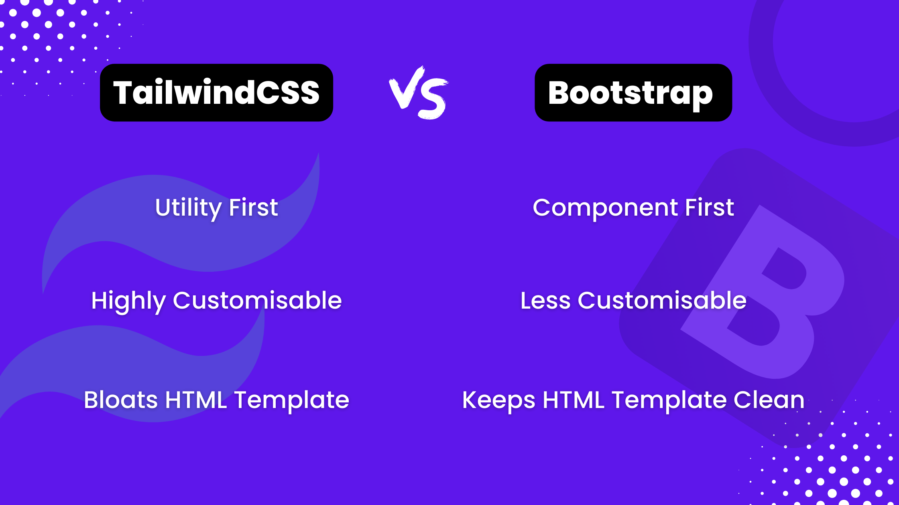
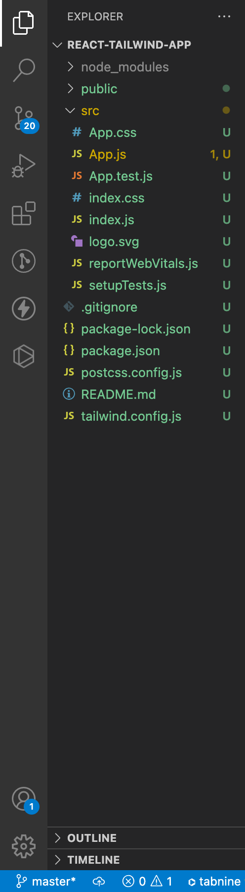
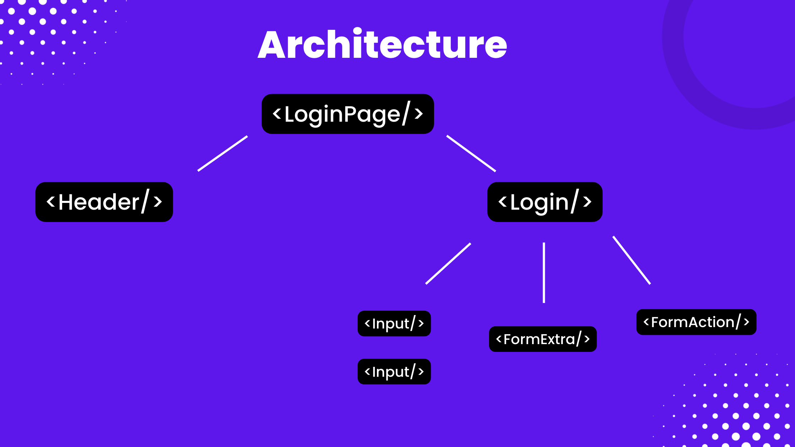
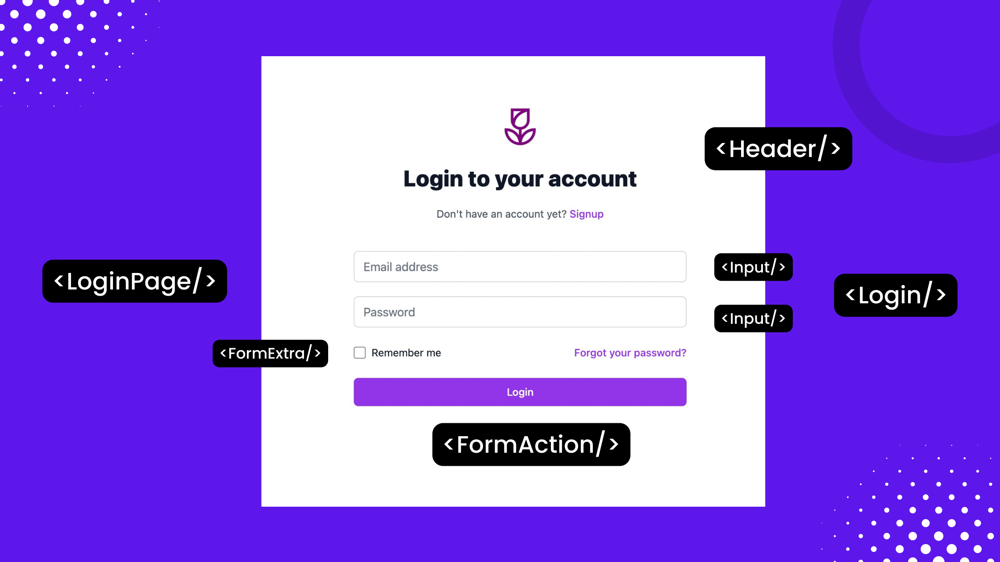
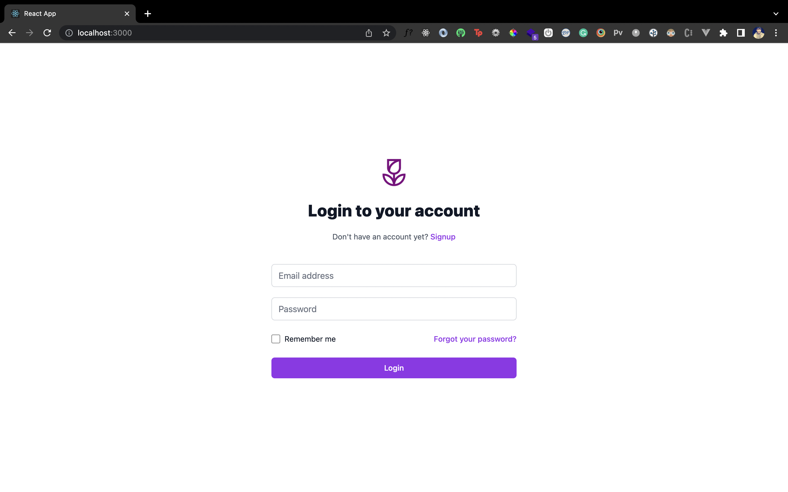
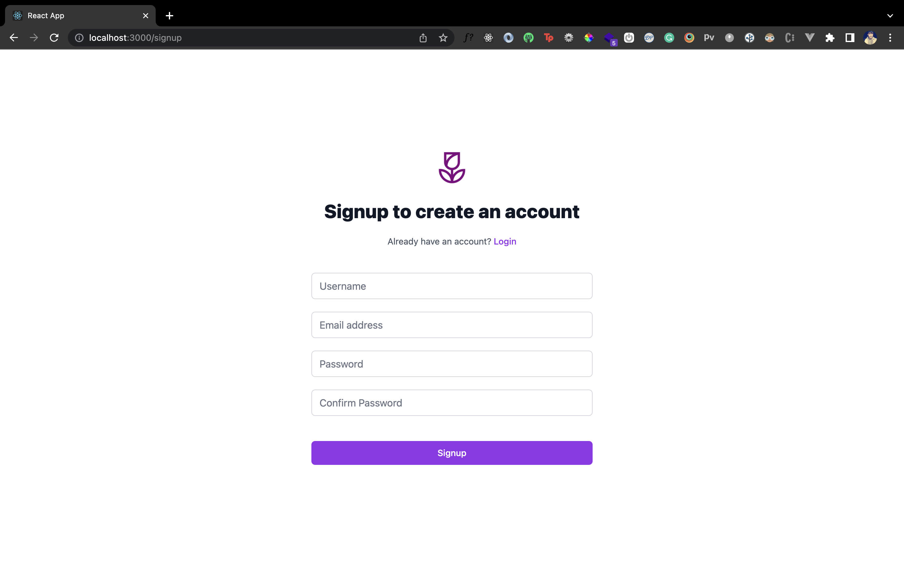

Web design and CSS have come a long way. And today, modern websites have everything you could wish for alongside stunning designs. Then why should your website's login and signup forms look boring?

The web ecosystem has tons of reliable third-party libraries and frameworks to help you build intuitive designs even if you're not a design wizard. Amidst the plethora of libraries comes a utility first CSS framework called [Tailwind CSS](https://tailwindcss.com/).

So in this post, you'll learn:

- what Tailwind CSS is;
- why it's awesome; and,
- how you can use it in a React app.

I'll then walk you through step by step how to use it to create a modern login and signup form with routing in React.

Finally, you'll see how to make these forms functional using [LoginRadius Authentication APIs](https://www.loginradius.com/resource/whitepaper/loginradius-ciam-developers/) docs/references/api/authentication).

## What is Tailwind CSS?

If you've heard of Materialize and Bootstrap, Tailwind CSS is much similar in what it offers. It's a CSS framework that helps developers build layouts, components, themes, and whatnot, without writing all the CSS themselves.

However, unlike Bootstrap and Materialize, it doesn't give you built-in components out of the box. Instead, it gives you a wide range of fully customizable utility classes that you can use to style your pages.



## Why Tailwind CSS Better or Worse Than the Others?

The community loves Tailwind. For most developers, the key takeaway is that it gives you more freedom on how you want your components or elements to look. So in many cases, when developers use component-based CSS frameworks like Bootstrap, they have a hard time changing the way they want their website to look.

Being utility first, it's the most customization-friendly CSS framework! 

Also, it's pretty easy to integrate with modern frontend frameworks like React, NextJS, VueJS, Angular, Svelte, etc. I'll also explore that shortly when we add Tailwind to our React app. 


On the downside, Tailwind might make your HTML bloated with loads of CSS classes for small and specific rules. However, you can control it with a framework like React by building smaller reusable components and using JSX bindings for long class names for more maintainability and readability. 

In fact, we'll take this optimal approach in building our Login form, so you'll understand some best practices you can use to avoid bloated HTML templates in your React app. 


## What You'll Build Today?

We'll create a simple yet modern looking login and signup form that looks like this:

<video controls width="700" align="center" src="./demo.mov"> </video>

It will be interactive using React state, can route to different pages, and we'll also, in the end, talk about how we can make it functional from a backend standpoint. 

Sounds good? Let's start by understanding how we can add TailwindCSS to our React app. 

## Project Setup

Inside a directory of your choice, create a new React project by running:

```shell
npx create-react-app react-tailwind-app
```

Next, move inside the project and install react-router-dom by running:

```shell
cd create-react-app react-tailwind-app && npm i react-router-dom
```

### Install Tailwind CSS

Now, [add Tailwind to your React project by following the steps given here](https://tailwindcss.com/docs/guides/create-react-app). 

First, install Tailwind CSS and its related dependencies by running the following command in the root directory:

```shell
npm install -D tailwindcss postcss autoprefixer
```

Next, generate some configurational files by running the following command in the root directory:

```shell
npx tailwindcss init -p
```

That should generate a ``tailwind.config.js`` file and ``postcss.config.js`` file for you as shown:



Awesome!

### Configuring Tailwind CSS

Now, go ahead and update the ``tailwind.config.js`` file to support templates for your React component files as shown:

```javascript
module.exports = {
  content: [
    "./src/**/*.{js,jsx,ts,tsx}",
  ],
  theme: {
    extend: {},
  },
  plugins: [],
}
```

Almost there! We'll now add some necessary Tailwind directives to your ``index.css`` file present in the root directory:

```css
@tailwind base;
@tailwind components;
@tailwind utilities;

...
```

Each of the above directives represents a layer of Tailwind's utility classes that you can use in your project. Their declaration allows using these utility classes anywhere in your project. 

Finally, we'll kickstart your React project by spinning a local development server:

```shell
npm start
```

You're now ready to start using Tailwind CSS to create some awesome-looking UI for your React app!

## Frontend Architecture and Boilerplate

We'll break down the entire page into small, reusable components to ensure that your code is readable and maintainable and doesn't have bloated HTML templates. 

### Component Architecture

For instance, you can have a `<Header/>` component that takes care of the page's heading and displays a link to navigate to another page. 

Similarly, you can have a reusable custom `<Input/>` component that can be used inside the form. All in all, here's what your frontend architecture would look like:




### Directory Structure

So first, let's go ahead and create these files and folders. You'll develop corresponding files for the Signup page as well. Create the following files and folders inside your root directory:

```shell
.
├── components/
│   ├── FormAction.js
│   ├── FormExtra.js
│   ├── Header.js
│   ├── Input.js
│   ├── Login.js
│   └── Signup.js
├── constants/
│   └── formFields.js
└── pages/
    ├── Login.js
    └── Signup.js
```

For perspective, here's how we'll use those components to build your entire Login Page:



Makes sense? Great! 

### Components Boilerplate Code

While we're at it, let's also create some component boilerplate for all these files except the `/src/constants/formFields.js`.

For the Login.js files (`/src/pages/Login.js`), you can put down the following code:

````jsx
export default function LoginPage(){
    return(
        <>
            
        </>
    )
}
````

Similarly, you can create such boilerplates for the rest of the files. 

### Form Fields Constants

You've created a `formFields.js` file earlier. This file will hold all the input fields related constants like placeholder, value, name, field type, etc. Inside this file, add the following code:

```javascript
const loginFields=[
    {
        labelText:"Email address",
        labelFor:"email-address",
        id:"email-address",
        name:"email",
        type:"email",
        autoComplete:"email",
        isRequired:true,
        placeholder:"Email address"   
    },
    {
        labelText:"Password",
        labelFor:"password",
        id:"password",
        name:"password",
        type:"password",
        autoComplete:"current-password",
        isRequired:true,
        placeholder:"Password"   
    }
]

const signupFields=[
    {
        labelText:"Username",
        labelFor:"username",
        id:"username",
        name:"username",
        type:"text",
        autoComplete:"username",
        isRequired:true,
        placeholder:"Username"   
    },
    {
        labelText:"Email address",
        labelFor:"email-address",
        id:"email-address",
        name:"email",
        type:"email",
        autoComplete:"email",
        isRequired:true,
        placeholder:"Email address"   
    },
    {
        labelText:"Password",
        labelFor:"password",
        id:"password",
        name:"password",
        type:"password",
        autoComplete:"current-password",
        isRequired:true,
        placeholder:"Password"   
    },
    {
        labelText:"Confirm Password",
        labelFor:"confirm-password",
        id:"confirm-password",
        name:"confirm-password",
        type:"password",
        autoComplete:"confirm-password",
        isRequired:true,
        placeholder:"Confirm Password"   
    }
]

export {loginFields,signupFields}
```

The above file has two arrays: one each for your login form fields and signup form fields. Each array contains an object that contains attributes for the input fields.

The field names should be self-explanatory as to what they represent. Here's a quick summary of that:

- `labelText`: The label for an input field
- `labelFor`: The value that associates a label to the input field via an id attribute on the input field
- `id`, `name` , `type`, and `placeholder`: Respective attributes on the input field  
- `isRequired`: If you want to make an input field mandatory, in this case, all our input fields for form submission will be mandatory

Later, we'll use this array to cycle through each input field and render a custom `<Input/>` component that you'll create shortly.

## Set Up Routing

As you already have your components boilerplates in place, let's first set up routing for your app.

By default, when a user opens the app, we'll direct them to a Login page. Then, if the route changes to **/signup**, we'll direct them to a Signup page. 

Head over to your `/src/App.js` file and add the following code:

```jsx
import './App.css';
import {
  BrowserRouter,
  Routes,
  Route,
} from "react-router-dom";
import SignupPage from './pages/Signup';
import LoginPage from './pages/Login';

function App() {
  return (
    <div className="min-h-full h-screen flex items-center justify-center py-12 px-4 sm:px-6 lg:px-8">
    <div className="max-w-md w-full space-y-8">
     <BrowserRouter>
        <Routes>
            <Route path="/" element={<LoginPage/>} />
            <Route path="/signup" element={<SignupPage/>} />
        </Routes>
      </BrowserRouter>
    </div>
  </div>
  );
}

export default App;

```

Notice that you have two containers wrapped around your `<BrowserRouter/>` with some long classnames. 

The first container gives a minimum height of 100% and sets a fixed height of the container to 100vh via the `min-h-full` and `h-screen` classes. Then, it centers everything via `flex`, `items-center` to vertically center all the flex child elements, and `justifty-center` to center them horizontally. 

Finally, we have some padding classes prefixed with `p`. For top and bottom padding, we use the prefix `py-` followed by some value. We also have some responsive padding on small and large screen devices prefixed with `sm:` and `lg:` respectively. You can learn more about these [padding](https://tailwindcss.com/docs/padding) and [margin](https://tailwindcss.com/docs/margin) properties to see other similar classes you can use. 

Similarly, the second container sets some width for its child elements and provides some spacing via the respective Tailwind classes.

## The Header Component

Now, let's create the `<Header/>` component that you can render on both the login and signup pages for quick information and navigation.

Head over to `/src/components/Header.js`, and add the following code:

```jsx
import {Link} from 'react-router-dom';

export default function Header({
    heading,
    paragraph,
    linkName,
    linkUrl="#"
}){
    return(
        <div className="mb-10">
            <div className="flex justify-center">
                
            </div>
            <h2 className="mt-6 text-center text-3xl font-extrabold text-gray-900">
                {heading}
            </h2>
            <p className="mt-2 text-center text-sm text-gray-600 mt-5">
            {paragraph} {' '}
            <Link to={linkUrl} className="font-medium text-purple-600 hover:text-purple-500">
                {linkName}
            </Link>
            </p>
        </div>
    )
}
```

Your `<Header/>` component takes four props:

- a dynamic `heading` that it displays on the top;
- then some additional text as `paragraph`;
- a `linkName` to display which page it will redirect the user to; and,
- its corresponding path as `linkUrl`.

Using the ' justify-center ' class, we place all these elements inside a flexbox container and horizontally center them. There is also an outer container that simply gives the header some bottom margin using the `mb-10` class.

Then, we give our header image some fixed height and width using the `h-14` and `w-14` classes, respectively. 

Finally, our text and links have some typography classes for font-size, font-colour, hover effect, and font-weight.

Let's now go ahead and render the `<Header/>` component with all the props inside the Login page (`/src/pages/Login.js`):

```jsx
import Header from "../components/Header"

export default function LoginPage(){
    return(
        <>
             <Header
                heading="Login to your account"
                paragraph="Don't have an account yet? "
                linkName="Signup"
                linkUrl="/signup"
                />
            
        </>
    )
}
```

Here's what the login page should now look like:


Let's now start building the rest of the Login page form.

## The Input Component

We'll now create our reusable and great looking `<Input/>` component that you'll use to build your Login form.

Head over to the `/src/components/Input.js` file, and add the following code:

```jsx
const fixedInputClass="rounded-md appearance-none relative block w-full px-3 py-2 border border-gray-300 placeholder-gray-500 text-gray-900 focus:outline-none focus:ring-purple-500 focus:border-purple-500 focus:z-10 sm:text-sm"

export default function Input({
    handleChange,
    value,
    labelText,
    labelFor,
    id,
    name,
    type,
    isRequired=false,
    placeholder,
    customClass
}){
    return(
        <div className="my-5">
            <label htmlFor={labelFor} className="sr-only">
              {labelText}
            </label>
            <input
              onChange={handleChange}
              value={value}
              id={id}
              name={name}
              type={type}
              required={isRequired}
              className={fixedInputClass+customClass}
              placeholder={placeholder}
            />
          </div>
    )
}
```

Remember all those fields' key-value pairs you set earlier in your `formFields.js` constants file?

Those are all the props your `<Input/>` component will take. It will also take a `value` and a `handleChange` prop since we want this to be a controlled component linked to some state.

Notice how the HTML markup of this component looks very clean. How is that possible? Are you not using any Tailwind classes here?

As there are a lot of Tailwind classes for styling this input field, we have created a constant for it — called `fixedInputClass`. It contains all the essential styling classes for the input field.

We also take a `customClass` prop that will append any custom Tailwind class you want to pass to the input field for customizations. How cool is that?!

## The Login Component

Next, create the `<Login/>` component inside `/src/components/Login.js`, where the entire Login form will be rendered. This component will also be responsible for owning any state or event handlers passed down as props to other child components.

Based on your `loginFields` from your `formFields` constants, we programmatically generate an initial value for your `loginState`.

Then we have a `handleChange` event handler to update the state whenever an `onChange` event is fired from the nested `<Input/>` component. 

Then we simply loop through the `fields` array and render an `<Input/>` component that you've created in the previous section.

```jsx
import { useState } from 'react';
import { loginFields } from "../constants/formFields";
import Input from "./Input";

const fields=loginFields;
let fieldsState = {};
fields.forEach(field=>fieldsState[field.id]='');

export default function Login(){
    const [loginState,setLoginState]=useState(fieldsState);

    const handleChange=(e)=>{
        setLoginState({...loginState,[e.target.id]:e.target.value})
    }


    return(
        <form className="mt-8 space-y-6">
        <div className="-space-y-px">
            {
                fields.map(field=>
                        <Input
                            key={field.id}
                            handleChange={handleChange}
                            value={loginState[field.id]}
                            labelText={field.labelText}
                            labelFor={field.labelFor}
                            id={field.id}
                            name={field.name}
                            type={field.type}
                            isRequired={field.isRequired}
                            placeholder={field.placeholder}
                    />
                
                )
            }
        </div>

       

      </form>
    )
}
```

Before seeing how the login form looks, you need to render it inside your Login page.

So render the above `<Login/>` component inside `/src/pages/Login.js` file as shown:

```jsx
import Header from "../components/Header"
import Login from "../components/Login"

export default function LoginPage(){
    return(
        <>
             <Header
                heading="Login to your account"
                paragraph="Don't have an account yet? "
                linkName="Signup"
                linkUrl="/signup"
                />
            <Login/>
        </>
    )
}
```

Now, if you go back to your React app, you should see your Login page input fields appear as follows:


Excellent, it looks like you're almost there!

Now add the final pieces to the Login page by writing the `<FormExtra>` and `<FormAction/>` components.

## Wrapping Up the Login Page

The `<FormExtra/>` component holds the template and styles for a simple "Remember me" functionality. 

Inside `/src/components/FormExtra.js` file, add the following code:

```jsx
export default function FormExtra(){
    return(
        <div className="flex items-center justify-between ">
        <div className="flex items-center">
          <input
            id="remember-me"
            name="remember-me"
            type="checkbox"
            className="h-4 w-4 text-purple-600 focus:ring-purple-500 border-gray-300 rounded"
          />
          <label htmlFor="remember-me" className="ml-2 block text-sm text-gray-900">
            Remember me
          </label>
        </div>

        <div className="text-sm">
          <a href="#" className="font-medium text-purple-600 hover:text-purple-500">
            Forgot your password?
          </a>
        </div>
      </div>

    )
}
```

Again here we're using some Tailwind typography and flexbox classes to style and structure the layout of the UI. 

Let's go to the `/src/components/FormAction.js` file and create a submit button for the Login form. 

Add the following code inside this file:

```jsx
export default function FormAction({
    handleSubmit,
    type='Button',
    action='submit',
    text
}){
    return(
        <>
        {
            type==='Button' ?
            <button
                type={action}
                className="group relative w-full flex justify-center py-2 px-4 border border-transparent text-sm font-medium rounded-md text-white bg-purple-600 hover:bg-purple-700 focus:outline-none focus:ring-2 focus:ring-offset-2 focus:ring-purple-500 mt-10"
                onSubmit={handleSubmit}
            >

                {text}
            </button>
            :
            <></>
        }
        </>
    )
}
```

Notice that you also have loads of CSS classes inside our `<button/>` element to style it. It makes our HTML appear bloated and difficult to read. We can follow the same approach of using a constant and a prop against the `className` for the `<button/>` as we previously did to combat this. 

At last, we'll put everything together inside `/src/components/Login.js` file as follows:

```jsx
import { useState } from 'react';
import { loginFields } from "../constants/formFields";
import FormAction from "./FormAction";
import FormExtra from "./FormExtra";
import Input from "./Input";

const fields=loginFields;
let fieldsState = {};
fields.forEach(field=>fieldsState[field.id]='');

export default function Login(){
    const [loginState,setLoginState]=useState(fieldsState);

    const handleChange=(e)=>{
        setLoginState({...loginState,[e.target.id]:e.target.value})
    }

    const handleSubmit=(e)=>{
        e.preventDefault();
        authenticateUser();
    }

    //Handle Login API Integration here
    const authenticateUser = () =>{

    }

    return(
        <form className="mt-8 space-y-6" onSubmit={handleSubmit}>
        <div className="-space-y-px">
            {
                fields.map(field=>
                        <Input
                            key={field.id}
                            handleChange={handleChange}
                            value={loginState[field.id]}
                            labelText={field.labelText}
                            labelFor={field.labelFor}
                            id={field.id}
                            name={field.name}
                            type={field.type}
                            isRequired={field.isRequired}
                            placeholder={field.placeholder}
                    />
                
                )
            }
        </div>

        <FormExtra/>
        <FormAction handleSubmit={handleSubmit} text="Login"/>

      </form>
    )
}
```

And once we do that, we should have a stunning, modern looking login page appear right in front of us:



## The Signup Page

You've created so many reusable components. Now, it's straightforward to use them to build the Signup page further.

Feel free to take this as a challenge and build it yourself based on what you've learned. 

Here's a quick walkthrough of the steps and how you can use the same approach to build the Signup page in minutes. 

First, create a main `<Singup/>` component inside `/src/components/Signup.js` file similar to the `<Login/>` component you've completed in the previous section. It will render the signup form fields and attach state and event handlers to it.

Here's how the entire code looks like:

```jsx
import { useState } from 'react';
import { signupFields } from "../constants/formFields"
import FormAction from "./FormAction";
import Input from "./Input";

const fields=signupFields;
let fieldsState={};

fields.forEach(field => fieldsState[field.id]='');

export default function Signup(){
  const [signupState,setSignupState]=useState(fieldsState);

  const handleChange=(e)=>setSignupState({...signupState,[e.target.id]:e.target.value});

  const handleSubmit=(e)=>{
    e.preventDefault();
    console.log(signupState)
    createAccount()
  }

  //handle Signup API Integration here
  const createAccount=()=>{

  }

    return(
        <form className="mt-8 space-y-6" onSubmit={handleSubmit}>
        <div className="">
        {
                fields.map(field=>
                        <Input
                            key={field.id}
                            handleChange={handleChange}
                            value={signupState[field.id]}
                            labelText={field.labelText}
                            labelFor={field.labelFor}
                            id={field.id}
                            name={field.name}
                            type={field.type}
                            isRequired={field.isRequired}
                            placeholder={field.placeholder}
                    />
                
                )
            }
          <FormAction handleSubmit={handleSubmit} text="Signup" />
        </div>

         

      </form>
    )
}
```

Then, render this component inside `/src/pages/Signup.js` alongside the `<Header/>` components with some modified props for the signup page. 

```jsx
import Header from "../components/Header";
import Signup from "../components/Signup";

export default function SignupPage(){
    return(
        <>
            <Header
              heading="Signup to create an account"
              paragraph="Already have an account? "
              linkName="Login"
              linkUrl="/"
            />
            <Signup/>
        </>
    )
}
```

And that's it! That's all there is to build a great looking signup page that looks as follows:



Don't worry; if you got stuck somewhere, feel free to [refer to the entire codebase for this tutorial here](https://github.com/LoginRadius/engineering-blog-samples/tree/master/React/react-tailwind-app). 

## Use LoginRadius Authentication APIs

You can use [LoginRadius](https://www.loginradius.com/resource/whitepaper/loginradius-ciam-developers/) to quickly set up an authentication backend for your frontend application.

First, [set up an account](https://accounts.loginradius.com/auth.aspx), and get your API key from your Account Dashboard.

Then, you can use their [login endpoint](https://www.loginradius.com/docs/api/v2/single-sign-on/Machine-to-Machine/overview/) to authenticate users. 

The endpoint takes an email and password as parameters and validates them against the correct credentials. If we were to integrate this endpoint in our previously built `<Login/>` component (`/scr/components/Login.js`), here's what the `authenticateUser` method would look like:

```javascript
//Handle Login API Integration here
    const authenticateUser = () =>{
        
       
        const endpoint=`https://api.loginradius.com/identity/v2/auth/login?apikey=${apiKey}`;
         fetch(endpoint,
             {
             method:'POST',
             headers: {
             'Content-Type': 'application/json'
             },
             body:JSON.stringify(loginFields)
             }).then(response=>response.json())
             .then(data=>{
                //API Success from LoginRadius Login API
             })
             .catch(error=>console.log(error))
         
    }
```

Similarly, you can use [the Signup endpoint](https://www.loginradius.com/resource/whitepaper/loginradius-ciam-developers/) to create users without managing a complete backend database yourself.

Curious to learn more?

I did a full-fledged [guide on authenticating Svelte apps with LoginRadius here](https://www.loginradius.com/blog/engineering/guest-post/authenticating-svelte-apps/).

## Conclusion

In this tutorial, you have learned to create beautiful registration and authentication forms for your web app with Tailwind CSS. You also learned the advantages and disadvantages of Tailwind CSS and understood how Tailwind CSS works better with React.