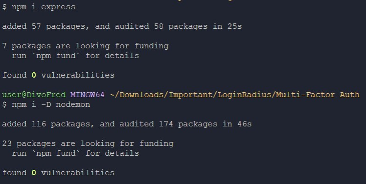
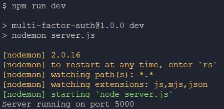
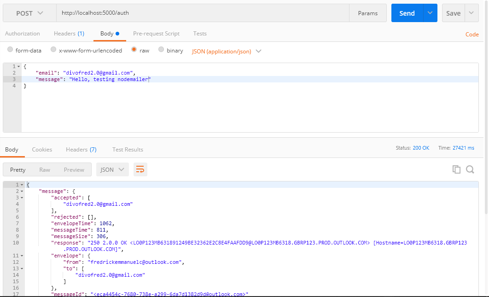
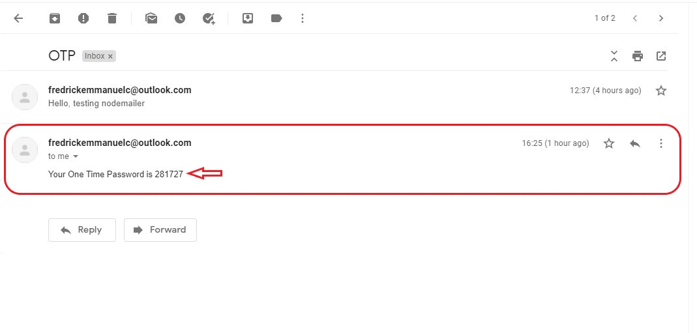
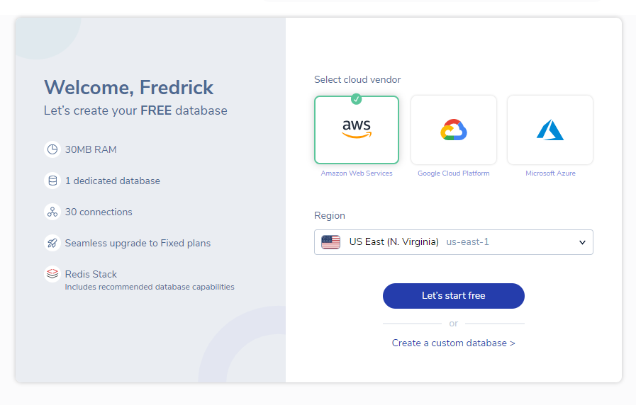
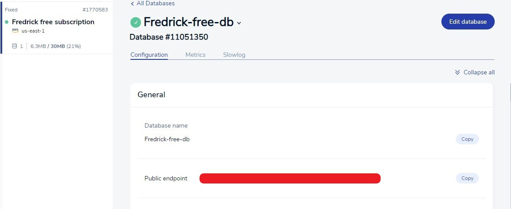
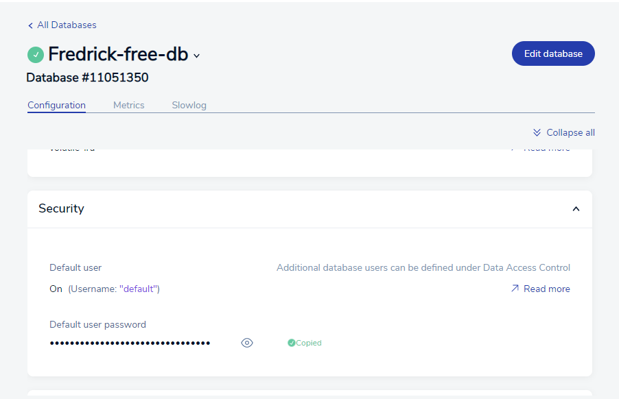
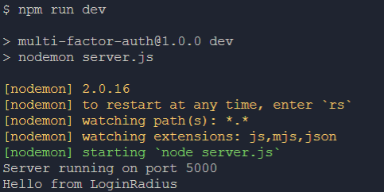
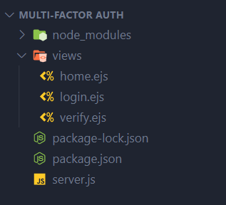

Securing your web applications from unauthorized users is very important. You can increase the security with One Time Password (OTP) authentication in addition to the login credentials. An OTP is sent to the user’s email when they want to log in. This is a form of [multi-factor authentication (MFA)](https://www.loginradius.com/blog/identity/what-is-multi-factor-authentication/).

It is essential to learn how to apply Multi-Factor authentication in real-world applications, and this tutorial got you covered. This tutorial explains how to store users’ sessions in the Redis Store and how to send OTP using [Nodemailer](https://www.npmjs.com/package/nodemailer) for authentication.

## Goal

This tutorial helps you understand:

- What is Redis?
- How to utilize the Redis Store?
- How to set up an SMTP service using Nodemailer?
- How to protect routes?

## Prerequisites

To follow this tutorial, make sure you have:

- [Node Version 16.0+](https://nodejs.org/en/download/)
- Basic knowledge of Node.js
- A Text Editor, preferably [Visual Studio Code](https://code.visualstudio.com/download)

As everything is in place, let’s jump right in.

## Set Up the Server

In this section, you will learn how to start an Express server.

1. Create a new folder and open it in a text editor. In this tutorial, this folder is named `Multi-Factor Auth`, but you can decide to name it anything you want.

2. Open the terminal in the project’s path and run the following code that will install the dependencies needed to start the Express server.

    ```bash
    npm init --y
    npm i express
    npm i -D nodemon
    ```

    The Express dependency will be used to set up the backend server and nodemon, installed as a devDependency, will watch the file system and restart the server when a change is made.

    

3. Create a new file named `server.js` in the project’s directory. For the simplicity, this file will contain all the server code for this application.

4. Add the following codes in the `server.js` file that will set up an Express server to listen on port `5000`.
    
    ```js
    const express = require("express");
    const app = express();
    const PORT = 5000;
    
    app.listen(PORT, () => {
      console.log(`Server running on port ${PORT}`);
    });
    ```
    
5. Open `package.json` and add the following code to start the server.
    
    ```json
    {
      "name": "multi-factor-auth",
      "version": "1.0.0",
      "description": "",
      "main": "server.js",
      "scripts": {
        "start": "node server.js",
        "dev": "nodemon server.js"
      },
      "keywords": [],
      "author": "",
      "license": "ISC",
      "dependencies": {
        "express": "^4.18.1"
      },
      "devDependencies": {
        "nodemon": "^2.0.16"
      }
    }
    ```
    
6. Start the server in development mode by running `npm run dev` in your terminal.

    

## Set Up Nodemailer

[Nodemailer](https://www.npmjs.com/package/nodemailer) is a Node.js module that allows you to send emails using an email service or an [SMTP](https://en.wikipedia.org/wiki/Simple_Mail_Transfer_Protocol) server.

To set up Nodemailer, you need to provide the credentials to your email or SMTP service.

> Google mailing service (Gmail) will not support the use of third-party apps or devices like Nodemailer starting from May 30, 2022.

For this tutorial, we will use Microsoft’s [Outlook Maling Service](https://outlook.live.com/) to send emails.

### Set Up Outlook
1. Navigate to [Outlook’s sign up page](https://outlook.live.com/owa/?nlp=1&signup=1) to register for an Outlook account if you don’t have one.

2. Add your phone number if you are prompted to do so. 
    
    > This step can be skipped.

### Sending Emails

After setting up your Outlook account, the next step is to use your Outlook account’s credential to send emails through Nodemailer.

1. Open your terminal and install the `nodejs-nodemailer-outlook` dependency.

    This module only needs your Outlook account credentials and your message set up to send emails.

    Now, run the code below in your terminal to install the `nodejs-nodemailer-outlook` dependency:
    
    ```bash
    npm i nodejs-nodemailer-outlook
    ```
    
2. Import the `nodejs-nodemailer-outlook` module into `server.js` and add the configurations needed to send emails:
    
    ```js
    const express = require("express");
    const app = express();
    app.use(express.json());//Enabling the body attribute.
    const PORT = 5000;
    
    app.post("/auth", (req, res) => {//Post request to 'http://localhost:3000'
      const nodeoutlook = require("nodejs-nodemailer-outlook");//Importing the module
      nodeoutlook.sendEmail({
        auth: {//Outlook Account Credentials 
          user: "<yourOutlookEmail@outlook.com>",//Email
          pass: "<yourOutlookPassword>",//Password
        },
        from: "<yourOutlookEmail@outlook.com>",
        to: req.body.email,//Getting the email
        subject: "OTP",
        text: req.body.message,//Getting the Message
        onError: (e) => res.status(500).json({ message: `an error occurred ${e}` }),
        onSuccess: (i) => res.status(200).json({ message: i }),
      });
    });
    
    app.listen(PORT, () => {
      console.log(`Server running on port ${PORT}`);
    });
    ```

3. To test the application, use an API testing application like [Postman](https://www.postman.com/) and make a POST request to http://localhost:5000/auth, passing `email` and `message` to the body of the request.

    

## Generate OTPs

In the previous section, you've successfully configured Nodemailer and used it to send emails. This section will show you how to generate a random number and how to add this random number to the message sent to the user.

You can generate this random number using: 

1. `Math.trunc(Math.random() * 1000000)`
2. A NodeJS module like *UUID, shortid, nanoid*, etc.

This tutorial uses the `nanoid` module to generate random numbers.

1. In the terminal, install the `nanoid` module. This module will create a random set of characters as the OTP. Run the following command in your terminal:
    
    ```bash
    npm i nanoid@3.3.4 #Version compartible with Nodejs
    ```
    
2. After installing the `nanoid` module, import it into `server.js` and use it to generate 6 random digits.
    
    ```js
    const nanoid = require("nanoid");//Importing the naonid module
    
    const OTP = nanoid.customAlphabet("1234567890", 6)();//Generating 
    ```
    
3. Add the OTP to the message being sent to the user’s email.
    
    ```js
    const express = require("express");
    
    const nanoid = require("nanoid");
    const app = express();
    
    app.use(express.json());
    const PORT = 5000;
    
    const OTP = nanoid.customAlphabet("1234567890", 6)();
    
    app.post("/auth", (req, res) => {
      const nodeoutlook = require("nodejs-nodemailer-outlook");
    
      nodeoutlook.sendEmail({
        auth: {//Outlook Account Credentials 
          user: "<yourOutlookEmail@outlook.com>",//Email
          pass: "<yourOutlookPassword>",//Password
        },
        from: "<yourOutlookEmail@outlook.com>",
        to: req.body.email,//Getting the email
        subject: "OTP",
        text: `Your One Time Password is ${OTP}`,//Adding the OTP
        onError: (e) => res.status(500).json({ message: `an error occurred ${e}` }),
        onSuccess: (i) => res.status(200).json({ message: i }),
      });
    });
    
    app.listen(PORT, () => {
      console.log(`Server running on port ${PORT}`);
    });
    ```
    
4. Make a POST request to http://localhost:5000/auth, passing only the email address.

    

5. Check the email address for which the OTP is sent.

    

## Redis

Now that the OTP part of the authentication is settled, let’s set up the next part of the authentication. This section covers what Redis is and how to use the Redis Store to cache data.

### What is Redis?

[Redis](https://redis.io), also known as Remote Dictionary Server, is an open-source (BSD licensed), in-memory data structure store. Developers use it as a database, cache, and message broker. It is simply a fast lightweight database that structures data in key-value pairs.

### Redis Cache

Storing and retrieving cached data from Redis is faster than traditional databases as it retrieves and stores data in the main memory (the RAM). The data can be users’ sessions or responses from requests.

The only downside to this is that data can be lost if the computer crashes.

### Setting up Redis

Setting up Redis locally for Linux and Mac computers is simply straightforward.

Follow the official documentation for [Linux](https://redis.io/docs/getting-started/installation/install-redis-on-linux/) and [macOS](https://redis.io/docs/getting-started/installation/install-redis-on-mac-os/)

For [Windows](https://redis.io/docs/getting-started/installation/install-redis-on-windows/), you need to install [Windows Subsystem for Linux](https://docs.microsoft.com/en-us/windows/wsl/wsl%20--install) Version 2 (WSL 2) and a [Linux Distro](https://docs.microsoft.com/en-us/windows/wsl/install-manual#downloading-distributions) on your local machine.

This tutorial uses [Redis Cloud](https://redis.com/) to set up the Redis database. Redis Cloud starts with *Free* a subscription fee that grants 30MB of storage. This is perfect for this simple application.

1. Create a new [Redis Cloud](https://app.redislabs.com/new/) account if you don’t have one.

    

2. Click on **Let’s start free** and let Redis create a cloud database.

3. Click on **Configurations** and copy your **Public endpoint.** This endpoint will be used to set up the Redis application.

    

4. Still on the **Configurations** tab, copy your **Default user password**.
    
    

5. Run `npm i redis` in your terminal. Import the `redis` dependency into `server.js`, and set up the `redisClient` using the **Redis cloud endpoint**.
    
    ```js
    const redis = require("redis");
    
    const redisConnect = async () => {//This function will be removed later in the tutorial
      try {
        const redisClient = redis.createClient({
        url: "redis://redis-12345.c80.us-east-1-2.ec2.cloud.redislabs.com:12345", //This is an incorrect end point, insert your Public endpoint
          port: 12345,//The PORT is the last five digits in the url
          username: "default",
          password: "1234567890ABCDEFGHIJKLMNOPQRSTUV",//Input your Default_user_password
        });
        await redisClient.connect();//Connecting to Redis Cloud
        await redisClient.set("Hello", "Hello from LoginRadius");//key=Hello, value=Hello from LoginRadius
        const Hello = await redisClient.get("Hello");//Getting the value using its key=Hello
        console.log(Hello);
      } catch (error) {
        if (//Running the function again when there is a network error
          error.message ===
            "getaddrinfo ENOTFOUND redis-12345.c80.us-east-1-2.ec2.cloud.redislabs.com:12345" ||
          error.message ===
            "getaddrinfo EAI_AGAIN redis-12345.c80.us-east-1-2.ec2.cloud.redislabs.com"
        ) {
          return redisConnect();
        }
        console.log(error.message);
      }
    };
    ```
    
6. Start up the server in your terminal and view the result.
    
    

## Sessions

Now that Redis has been added to the application, let’s set up users’ sessions using *Express Sessions*.

### Set Up Express Sessions

1. Install the `express-session` and `connect-redis` modules in your terminal.

    The `express-session` module allows you to create [a session in the client’s browser](https://www.loginradius.com/blog/engineering/guest-post/local-storage-vs-session-storage-vs-cookies/). And the `connect-redis` module enables you to set Redis as the session store. Run the following command in your terminal.
    
    ```bash
    npm i express-session connect-redis
    ```
    
2. Import `express-session` and `connect-redis` into `server.js` and configure the session store.
    
    ```js
    const express = require("express");
    const app = express();
    
    const redis = require("redis");
    const session = require("express-session");//Importing express session
    const RedisStore = require("connect-redis")(session);//Importing connect-redis and passing the session
    const redisClient = redis.createClient({
        url: "redis://redis-12345.c80.us-east-1-2.ec2.cloud.redislabs.com:12345", //This is an incorrect end point, insert your Public endpoint
          port: 12345,//The PORT is the last five digits in the url
          username: "default",
          password: "1234567890ABCDEFGHIJKLMNOPQRSTUV",//Input your Default_user_password
          legacyMode: true, //Very important for Redis V4
        });
    redisClient
      .connect()
      .then(() => console.log("connected"))//Logs out connected on successful
      .catch((e) => console.log(e.message));//Logs out the error
    
    app.use(
      session({
        secret: "LoginRadius",//session secret key
        resave: false,
        saveUninitialized: false,
        store: new RedisStore({ client: redisClient }),//Setting the store
      })
    );
    
    //The Rest of the code
    ```

### Storing OTPs

Attributes stored in a session without a database are removed after the server refreshes. With the help of Redis cache, attributes in a session can be retrieved fast and saved even when the server restarts.

The user’s OTP needs to be saved in the session before sending it to the user’s email.

Open your `server.js` file and add the code as follows.

The following code stores the OTP in the session, redirects when the email has been sent, and verifies the OTP provided with the one stored in the session.

```js
app.post("/auth", (req, res) => {
  let OTP = nanoid.customAlphabet("1234567890", 6)();//Changing the OTP
  req.session.OTP = OTP;//Storing the OTP in the 
  const nodeoutlook = require("nodejs-nodemailer-outlook");
  nnodeoutlook.sendEmail({
    auth: {//Outlook Account Credentials 
      user: "<yourOutlookEmail@outlook.com>",//Email
      pass: "<yourOutlookPassword>",//Password
    },
    from: "<yourOutlookEmail@outlook.com>",
    to: req.body.email,//Getting the email
    subject: "OTP",
    text: `Your One Time Password is ${OTP}`,
    onError: (e) => res.status(500).json({ message: `an error occurred ${e}, Please try again` }),
    onSuccess: (i) => res.redirect("/verify"),//Redirecting the user to verify the token
  });
});

app.get("/verify", (req, res) => {
  res.send("Welcome to the verify route");//Welcome Message
  console.log(req.session.OTP);//Logging out the OTP stored in the session.
});

app.post("/verify", (req, res) => {
  const { OTP } = req.body;//Getting the user provided OTP
  const OTPSession = req.session.OTP;//Getting the stored OTP
  if (OTPSession) {//Checking if the OTP exist in the session
    if (OTP === OTPSession) {//Verifying the similarity of the OTP
      req.session.isAuth = true;//Setting auth to true
      return res.status(200).json({ message: "OTP is correct" });
    }
    return res.status(401).json({ message: "Incorrect OTP" });
  }
  return res.status(404).json({ message: "OTP not found" });
});
```

## Protecting Routes

Preventing unauthorized/unauthenticated users from accessing a specific route or a piece important information is essential in various applications. In this section, you'll learn how to create a middleware that will authenticate the users accessing a specific route.

> In this tutorial, the protected route is `/home`

1. Create a `GET` route to `/home` in `server.js` and add the middleware `auth`
    
    ```js
    app.get("/home", auth , (req, res) => {
      res.send("You have Successfully been Authenticated");
    });
    ```
    
2. Now, create the `auth` middleware function and verify if the user is authenticated.

    ```js
    const auth = (req, res, next) => {//auth middleware function
    
      if (req.session.isAuth) {//Checking if `isAuth` = true
        return next();
      }
      return res.redirect("/auth");//Redirecting the Login route
    };
    
    app.get("/auth", (req, res) => {//Login route
      res.send("Login");
    });
    
    app.get("/home", auth, (req, res) => {//The Home route
      res.send("You have Successfully been Authenticated");
    });
    ```

### Logout

To prevent requests from users who are not signed in, the logout route will also be protected using the `auth` middleware.

```js
app.post("/logout", auth, (req, res) => {
  req.session.destroy();//Destroying the session
  res.redirect("/auth");
});
```

## Set Up the Frontend

It’s time to put the backend code into actual functionality. This tutorial makes use of [Embedded JavaScript Template (EJS)](https://ejs.co/) as the frontend of this application.

### Setting up EJS

1. Install the EJS Module
    
    ```bash
    npm i ejs
    ```
    
2. Once the installation is complete, open your `server.js` and use `ejs` as the default view engine
    
    ```js
    app.set("view engine", "ejs")
    ```
    
3. In this application, there are only 3 routes. The *login, verify,* and *home* routes. You need to render an `ejs` file when accessing the routes.

    Modify the `GET` routes using the code as follows:
    
    ```js
    app.get("/auth", (req, res) => {
      res.render("login");//Rendering the login ejs file
    });
    app.get("/verify", (req, res) => {
      res.render("verify");Rendering the verify ejs file
    });
    app.get("/home", auth, (req, res) => {
      res.render("home");Rendering the home ejs file
    });
    ```
    
4. Create a folder named `views`, and inside, create the various `ejs` files inside.

    > When the server is rendering an ejs file, it checks in the views folder for the file. So, this name is not optional.

    

> Style these various routes as you like

### Login Route

Add the following code to `login.ejs` to set up the Login route.

```ejs
<!DOCTYPE html>
<html lang="en">
<head>
  <meta charset="UTF-8">
  <meta http-equiv="X-UA-Compatible" content="IE=edge">
  <meta name="viewport" content="width=device-width, initial-scale=1.0">
  <title>Login</title>
</head>
<body>
  <h1>Login Page</h1>
  <p>Please Sign in</p>
  <form>
    <input type="email" class="email"/><!-- Email input -->
    <input type="submit" value="submit" class="submit"/>
  </form>
  <script>
    const form = document.querySelector('form')//Getting the form
    const email = document.querySelector('.email')//Getting the email

    form.addEventListener('submit', async(e)=> {//Listening for a submit
      e.preventDefault()
      const data = { email: email.value }//Getting the email
      await fetch("/auth", {//Making a POST request to http://localhost:5000/auth
        method: "POST",
        headers: {
          "Content-Type": "application/json",
        },
        redirect: "follow",//Permiting redirects
        body: JSON.stringify(data),//Sending the email
      }).then(res => {
        if(res.redirected) location.href = res.url//Redirecting the user on success
      })
      .catch((e) => {
         email.value = ''
         console.log(e.message);//Logging out error
        });
    })
  </script>
</body>
</html>
```

### Verify Route

Open `verify.ejs` and set up the verify page as follows.

```ejs
<!DOCTYPE html>
<html lang="en">
<head>
  <meta charset="UTF-8">
  <meta http-equiv="X-UA-Compatible" content="IE=edge">
  <meta name="viewport" content="width=device-width, initial-scale=1.0">
  <title>Login</title>
</head>
<body>
  <h1>Verify Page</h1>
  <p class="message">Enter your OTP</p><!-- Message alert -->
  <form>
    <input type="number" class="OTP" /><!-- OTP input -->
    <input type="submit" value="submit" class="submit" />
  </form>

  <script>
    const form = document.querySelector('form')//Getting the form
    const OTP = document.querySelector('.OTP')//Getting the OTP
    const message = document.querySelector('.message')//Getting the message alert

    form.addEventListener('submit', async (e) => {//Listening for a submit
      e.preventDefault()
      const data = { OTP: OTP.value }//Getting the OTP
      await fetch("/verify", {//Making a POST request to http://localhost:5000/verify
        method: "POST",
        headers: {
          "Content-Type": "application/json",
        },
        redirect: "follow",//Permitting redirects
        body: JSON.stringify(data),//Sending the OTP
      }).then(async(res) => {
        if(!res.ok){//Checking for errors
          const data = await res.json()
          OTP.value = ''
          return message.textContent = data.message//Alerting the error
        }
        if (res.redirected) location.href = res.url//Redirecting the user on success
      }).catch((e) => {
          OTP.value = ''
          console.log(e.message)
        });
    })
  </script>
</body>
</html>
```

### Home Route

This is the route that is protected. The page can contain sensitive information that must not be accessible to unauthenticated users.

Open `home.ejs` and configure the home route as follows.

```ejs
<!DOCTYPE html>
<html lang="en">
<head>
  <meta charset="UTF-8">
  <meta http-equiv="X-UA-Compatible" content="IE=edge">
  <meta name="viewport" content="width=device-width, initial-scale=1.0">
  <title>Login</title>
</head>
<body>
 <h1>Home Page</h1>
 <p>Hello authenticated user, This is a secret information for your eyes only😉</p>
 Want to be unauthenticated, <button>Sign Out</button><!-- Sign Out button -->
 <script>
   const button = document.querySelector('button')//Getting the sign out button
   button.addEventListener('click', async()=> {//Listening for a click
     await fetch('/logout', {//Making a POST request to http://localhost:5000/logout
       method: "POST",
       headers: {
         "Content-Type": "application/json",
       },
       redirect: "follow"//Permitting redirects
     }).then((res)=> {
       if (res.redirected) location.href = res.url //Redirecting the user on success
     }).catch(e=> {
       console.log(e.message)
     })
   })
 </script>
</body>
</html>
```

## Conclusion

In this tutorial, you’ve learned how to set up Nodemailer, Redis Cloud, and Multi-Factor Authentication. With these, you've learned to secure your applications from unauthenticated users.

Do you think you can use this to build complex and scalable applications?

# Resources

GitHub Repo

