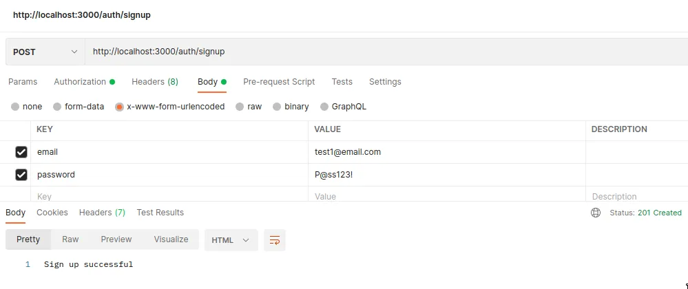
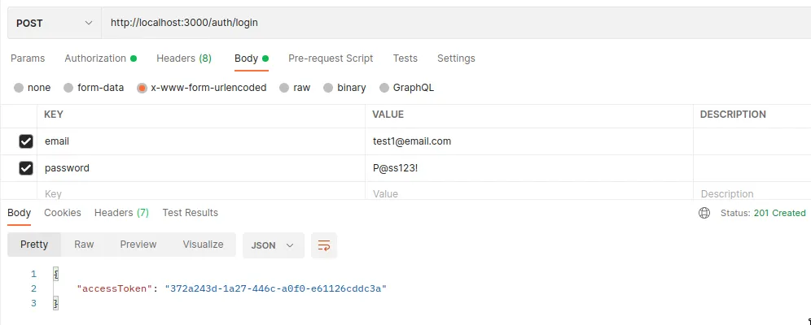
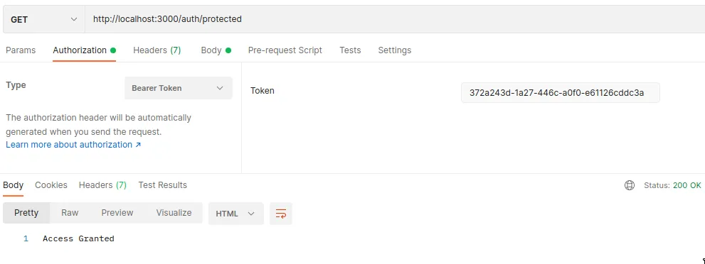

To create secure applications, you need a way to authenticate and authorize your users. In this tutorial, you will learn to authenticate users in your NestJS apps using [LoginRadius Authentication API](https://www.loginradius.com/developers/).

## Authentication vs. Authorization

Authentication and authorization are often seen as similar concepts, but they are not. Authentication is the process of verifying that a user is who they claim to be, while authorization is verifying which resources the user has access to.

Authentication always comes first before authorization since you first need to identify the user before determining what level of access to give them.

You can either choose to implement your own authentication strategy or leverage the benefits of a third-party identity platform. A do-it-yourself solution is prone to security errors, takes up a lot of time, and can increase the complexity of your application.

With a third-party solution, you get access to multiple authentication methods, advanced security features, and you write less code.

## User Authentication with LoginRadius

[LoginRadius](https://www.loginradius.com) is a no-code identity platform offering authentication, authorization, account security, and privacy solutions.

The Authentication API provided by LoginRadius allows you to authenticate a user using an email and a password. Once the user is verified, LoginRadius responds with an access token. The user will, in turn, use the access token to send requests to protected endpoints.

## User Authentication in NestJS

NestJS is a Node.js framework built on Express.js with an Angular-like architectural structure. It is used to build scalable and modern server-side applications. The following sections will guide you in creating a simple NestJS application with authentication.

## Set Up the Project

Create a new NestJS project by running the following commands

```
// Install NestJS CLI
npm i -g @nestjs/cli

// Create a new project
nest new nest-loginradius-auth

cd nest-loginradius-auth
```

## Set Up LoginRadius

To authenticate a user using LoginRadius in NestJS, you need credentials: an API key and an API secret.

Get your account credentials by creating a free [LoginRadius account](https://accounts.loginradius.com/auth.aspx?return_url=https://dashboard.loginradius.com/login&action=register) and head over to the dashboard.

Create an app and select configuration and then [get your app's credentials from the API credentials panel](https://www.loginradius.com/developers/).

## Set Up .env file

Since the API key and API secret from the LoginRadius dashboard are sensitive, you will store them in the `.env` file.

You will need the dotenv module to access the your environment variables. Run the following command to install it.

```bash
npm install dotenv
```

Add the API key, API secret, and [Secure One Time Token(SOTT)](https://www.loginradius.com/developers/) to the.env file.

```
APP_NAME=<your app name>
API_KEY=<your api key>
API_SECRET=<your api secret>
SOTT= <your sott>
```

## Authentication Flow

In this project, you will be authenticating the user using their email and password. The following are the major steps you will be following:

- Create a signup route that will get the user information and create a new user.
- Create a login route that accepts the email and password of the user. This data will be authenticated, and an access token will be sent back in the response.
- Create a protected route that will only accept requests with valid access tokens.

## Create an Authentication Module

Generate an auth module, controller, and service by running the following code.

```bash
nest generate module auth
nest generate controller auth
```

## Create a User

To create a user, you need to create a signup route that will accept the email and password.

Since you are using TypeScript, define the DTO (Data Transfer Object) schema to validate the user data passed in the request body.

In the `auth` folder, add the `dto` folder and create a `UserDTO` class in the `user.dto.ts` file.

```JavaScript
export class UserDto {
  email: string;
  password: string;
}
```

Next, inside the `AuthController`, import the DTO to be used to validate the request body.

```JavaScript
import { Injectable } from '@nestjs/common';
import { UserDto } from './dto/user.dto';

@Injectable()
@Controller('auth')
export class AuthController {
  @Post('signup')
  async signup(@Body() registerUserDto: UserDto) {
    // Register user
  }
}
```

### Generate Auth Service File

A service file is used to abstract the business logic away from the controller. You will be handling the actual authentication and authorization process in this file.

Generate a service for auth by running the following command.

```bash
nest g service auth
```

Next, populate the auth.service file by adding the signup method.

```JavaScript
import { Injectable } from '@nestjs/common';
import { UserDto } from './dto/user.dto';
import * as LRAuthPrrovider from 'loginradius-sdk'

@Injectable()
export class AuthService {
    async signup(registerUserDto: UserDto) {
      console.log('sign up')
    }
}
```

Note that you are also importing the user DTO and the loginradius-sdk at the top of the file.
To execute the signup method in the signup route, inject it in the `auth.controller.ts` file.

```JavaScript
import { Injectable } from '@nestjs/common';
import { UserDto } from './dto/user.dto';
import { AuthService } from './auth.service';

@Injectable()
@Controller('auth')
export class AuthController {
  constructor(private readonly authService: AuthService) { }

  @Post('signup')
  async signup(@Body() registerUserDto: UserDto) {
    let response = await this.authService.signup(registerUserDto)
    return response
  }
}
```

Before registering the user, validate if the email is already in use.
First, install `loginradius-sdk` using the following command.

```bash
npm i loginradius-sdk
```

Next import `loginradius-sdk` and configure it and since you will be using variables from the `.env` file, remember to also configure `dotenv`.

```JavaScript
import * as dotenv from 'dotenv';
dotenv.config()
import * as LRAuthPrrovider from 'loginradius-sdk'

let config = {
    apiDomain: "api.loginradius.com",
    apiKey: process.env.API_KEY,
    apiSecret: process.env.API_SECRET,
    siteName: process.env.APP_NAME,
    apiRequestSigning: false,
    proxy: {
      host: "",
      port: "",
      user: "",
      password: "",
    },
  };
let lrv2 = LRAuthPrrovider(config);

let sott = process.env.SOTT
```

Next, check if the email is already in use.

```JavaScript
@Injectable()
export class AuthService {
  async signup(registerUserDto: UserDto) {
    try {
      const response = await lrv2.authenticationApi
        .checkEmailAvailability(registerUserDto.email)
        if (response.isExist) {
          return "Email already in use"
        }
    catch(error) {
      return error
    }
  }
}
```

If the email is not already in use, register the user.

```JavaScript
@Injectable()
export class AuthService {
    async signup(registerUserDto: UserDto) {
      try {
        // check if email is already in use
        const response = await lrv2.authenticationApi
            .checkEmailAvailability(registerUserDto.email)
          if (response.isExist) {
          return "Email already in use"
          }
          // create registration model
          let authUserRegistrationModel = {
            email: [
              {
                type: "primary",
                value: registerUserDto.email,
              },
            ],
            password: registerUserDto.password,
          };
          // register user
          let user = await lrv2.authenticationApi
          .userRegistrationByEmail(authUserRegistrationModel, sott)
          if(user) {
            return "Sign up successful"
          }
        } catch (error) {
          return error
        }
    }
}
```

In the above code, you register a new user by passing in the user data to the authentication API. The `authUserRegistrationModel` object defines how the email and password will be stored in the database.

## Log In the User

To log in the user, pass in the email and password to the authentication API of LoginRadius.

In `auth.service.ts`, add the login function.

```JavaScript
@Injectable()
export class AuthService {
    async signup(registerUserDto: UserDto) {
        // register user
    }
    async login(loginUserDTO: UserDto) {
        // login user
    }
}
```

Since you are expecting the same type of data from the request body, i.e., the email and password, like in the signup route, you can reuse the user DTO.

Next, add the login functionality.

```JavaScript
@Injectable()
export class AuthService {
    async signup(registerUserDto: UserDto) {
        // register user
    }
    async login(loginUserDTO: UserDto) {
        try {
            let emailAuthenticationModel = {
                email: loginUserDTO.email,
                password: loginUserDTO.password,
              };
            let user = await lrv2.authenticationApi
                .loginByEmail(emailAuthenticationModel)
            return {
                accessToken: user.access_token,
            }
        } catch (error) {
            return error
        }
    }
}
```

In the above code, you are logging in the user through loginradius-sdk. If successful, send back the `accessToken` in the response body. The user will use the access token to access protected routes.

Inject the login method in the `auth.controller.ts` file to use it in the login route.

```JavaScript
import { Injectable } from '@nestjs/common';
import { UserDto } from './dto/user.dto';
import { AuthService } from './auth.service';

@Injectable()
@Controller('auth')
export class AuthController {
  constructor(private readonly authService: AuthService) { }

  @Post('signup')
  async signup(@Body() registerUserDto: UserDto) {
    // register user
  }
  async login(@Body() loginUserDto: UserDto) {
    // login user
  }
}
```

## Access Protected Routes

For protected routes, like accessing a user dashboard, the user will need to send the access token with the request. The access token will then be verified, and if valid, the application will be granted access.

The user will need to store the `accessToken`. In this tutorial, you will be storing the token in the authorization header as a bearer token. Another alternative would be to use HTTP-only cookies.

In NestJS, guards are responsible for handling authorization. They determine whether a request will be handled by the route.

In `auth.guard.ts`, add the following code.

```JavaScript
import {AuthService } from './auth.service';
import { Request } from 'express';

@Injectable()
export class AuthGuard implements CanActivate {

    constructor(
        private readonly authService: AuthService,
    ) {}

    async canActivate(context: ExecutionContext): Promise<boolean> {
        const request: Request = context.switchToHttp().getRequest();

        // Extract the access token from the authorization header
        const authheader = request.header('Authorization');
        const token = authheader && authheader.split(" ")[1];
        try {
            let authorizedMsg = await this.authService.authenticate(token);
            // Attach the authorized message to the request. You could also attach the user information.
            request['isAuthorized'] = "Authorized"
            return true;
        } catch (error) {
            throw new UnauthorizedException();
        }
    }
}
```

In the above code, you define the auth guard that will be used to decorate the protected routes. The token is extracted from the request authorization header and passed to the `authenticate` method defined in `AuthService`. This method will be responsible for verifying the token.

In `auth.service.ts`, create the `authenticate` method. This method will send the access token to LoginRadius for verification.

```JavaScript
import { Injectable, UnauthorizedException } from '@nestjs/common';
import { UserDto } from './dto/user.dto';
import * as LRAuthPrrovider from 'loginradius-sdk'

@Injectable()
export class AuthService {
    async signup(registerUserDto: UserDto) {
      // signup user
    }
    async login(loginUserDTO: UserDto) {
      // login user
    }
    async authenticate(accessToken: string) {
        try {
          const response = await lrv2.authenticationApi
            .authValidateAccessToken(accessToken)
          return response
        } catch (error) {
          throw new UnauthorizedException();
        }
    }
}
```

Now, create a protected route. In `auth.controller.ts`, add the following.

```JavaScript
import { Controller, Get, Body, Post, UseGuards } from '@nestjs/common';
import { UserDto } from './dto/user.dto';
import { AuthService } from './auth.service';
import { AuthGuard } from './auth.guard';

@Controller('auth')
export class AuthController {
  constructor(private readonly authService: AuthService) { }

  @Post('signup')
  async signup(@Body() registerUserDto: UserDto) {
    // signup user
  }
  @Post('login')
  async login(@Body() loginUserDto: UserDto) {
    // login user
  }
  @UseGuards(AuthGuard)
  @Get('protected')
  async protected() {
    return "Access granted"
  }
}
```

Now, every route you add `UseGuards` to will require a valid access token.

## Test with Postman

Use [Postman](https://www.postman.com/) or any other REST client of your choice to test the routes you have created.

First, create a test user by sending a POST request to the signup endpoint. Remember to include the email and password of the user in the request body.

```
POST http://localhost:3000/auth/signup
```

You should receive a "Sign up successful" message if the request is successful.



Next, log in the user by sending the login credentials to the login endpoint of your application.

```
POST http://localhost:3000/auth/login
```

If successful, you should receive the access token.



Finally, use the access token to access the protected route. Add the token to the authorization header.

```
GET http://localhost:3000/auth/protected
```



## Conclusion

In this tutorial, you have learned how to implement NestJS authentication using the LoginRadius Authentication API. You have seen how to log in a user and use an access token to protect specific routes.

You can [find the source code used in this tutorial on Github](https://github.com/LoginRadius/engineering-blog-samples/tree/master/NestJS/nestjs-authentication-loginradius-api).

Learn more about the [LoginRadius Authentication API](https://www.loginradius.com/developers/) from the documentation files. It has more identity management features than discussed in this tutorial. You can use these features to further enhance authentication as you need in your NestJS projects.
