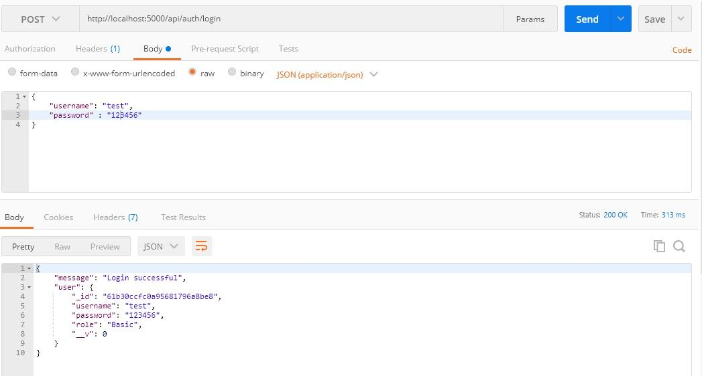
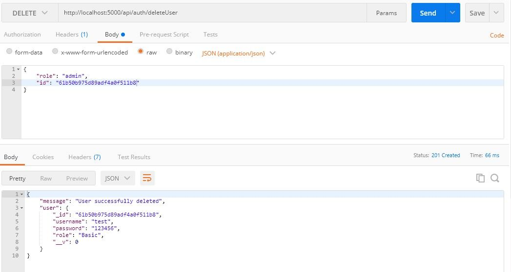

## Introduction

Creating a user registration form employs the management of the registered user. This is where user role authentication comes into play. Role authentication ensures that non-admin users cannot make changes or access exclusive information. It grants administrative privileges to admin users and basic privileges to basic users.

You can build your own authentication functionality with web tokens like JSON Web Token (JWT) or use a trusted third-party customer identity and access management (CIAM) software like [LoginRadius](https://accounts.loginradius.com/auth.aspx?action=register).

## Goal

This tutorial helps you:

- understand the differences between the Admin role and the Basic user role;
- use JWT to authenticate users; and
- learn role-based authentication using JWT in a simple Node.js app.

## Prerequisites

You have installed the following:

- [Node](https://nodejs.org/en/download/)
- [MongoDB](https://www.mongodb.com/try/download/community)
- a [Text Editor](https://code.visualstudio.com/download)

You already understand JavaScript [E56 Syntax](https://www.w3schools.com/js/js_es6.asp).

Now that everything is in place, let's set up your database.

## Set Up a Mongo Database

You'll store all your user data — which includes username, password, and role — in MongoDB.

Install a node package called Mongoose that will connect to MongoDB. Then create a user `schema` for your application.

```js
npm init
npm install mongoose
```

`npm init` sets up your new project and creates a `package.json` file with the credentials.

After installing mongoose, create a new file `db.js` in the project's directory and require `mongoose`.

```js
const Mongoose = require("mongoose")
```

With the help of mongoose, you can connect your application to MongoDB:

```js
// db.js
const Mongoose = require("mongoose")
const localDB = `mongodb://localhost:27017/role_auth`
const connectDB = async () => {
  await Mongoose.connect(localDB, {
    useNewUrlParser: true,
    useUnifiedTopology: true,
  })
  console.log("MongoDB Connected")
}
module.exports = connectDB
```

The code snippet here connects to `mongodb://localhost:27017` and then specifies the name of the database `/role_auth`.

The function `connectDB` awaits for the connection, which contains the `URI` and `options` as a second parameter. If it connects without errors, it will log out `MongoDB Connected`. Error issues will be fixed while connecting to the database. After this, it exported the function for use in the server.

## Set Up the Server

You need to install some dependencies that you'll use in this tutorial.

```js
  npm i express nodemon
```

[Express.js](https://expressjs.com/) is a Node.js framework for building web applications quickly and easily.

[Nodemon](https://www.npmjs.com/package/nodemon) is a tool that watches the file system and automatically restarts the server when there is a change.

You require `express` in your application to listen for a connection on port `5000`. Create a new file `server.js` in the root directory and create the listening event:

```js
const express = require("express")
const app = express()
const PORT = 5000
app.listen(PORT, () => console.log(`Server Connected to port ${PORT}`))
```

The next step is to test your application. Open up your `package.json` file and add the following to `scripts`:

```json
"scripts": {
  "start": "node server.js",
  "dev": "nodemon server.js"
}
```

Open your terminal and run `npm run dev` to start the server.

## Connect to the Database

Earlier, you've created a function that connects to MongoDB and exported that function. Now import that function into your `server.js`:

```js
const connectDB = require("./db");
...
//Connecting the Database
connectDB();
```

You also need to create an error handler that catches every `unhandledRejection` error.

```js
const server = app.listen(PORT, () =>
  console.log(`Server Connected to port ${PORT}`)
)
// Handling Error
process.on("unhandledRejection", err => {
  console.log(`An error occurred: ${err.message}`)
  server.close(() => process.exit(1))
})
```

The listening event is assigned to a constant `server`. If an `unhandledRejection` error occurs, it logs out the error and closes the `server` with an exit code of 1.

## Create User Schema

[Schema](https://en.wikipedia.org/wiki/Database_schema) is like a blueprint that shows how the database will be constructed.

You'll structure a user schema that contains username, password, and role.

Create a new folder `model` in the project's directory, and create a file called `User.js`. Now open `User.js` and create the user schema:

```js
// user.js
const Mongoose = require("mongoose")
const UserSchema = new Mongoose.Schema({
  username: {
    type: String,
    unique: true,
    required: true,
  },
  password: {
    type: String,
    minlength: 6,
    required: true,
  },
  role: {
    type: String,
    default: "Basic",
    required: true,
  },
})
```

In the schema, the `username` will be unique, required, and will accept `strings`.

You've specified the minimum characters(6) the `password` field will accept. The `role` field grants a default value (basic) that you can change if needed.

Now, you need to create a user model and export it:

```js
const User = Mongoose.model("user", UserSchema)
module.exports = User
```

You've created the user model by passing the `UserSchema` as the second argument while the first argument is the name of the model `user`.

## Perform CRUD Operations

You'll create functions that handle:

- adding users;
- getting all users;
- updating the role of users; and,
- deleting users.

### Register Function

As the name implies, this function will handle the registrations of users.

Let's create a new folder named `Auth`. It will contain the Authentication file and the Route set-up file.

After creating the `Auth` folder, add two files — `Auth.js` and `Route.js`.

Now open up our `Auth.js` file and import that `User` model:

```js
const User = require("../model/User")
```

The next step is to create an `async` `express` function that will take the user's data and register it in the database.

You need to use an [Express middleware](https://expressjs.com/en/guide/writing-middleware.html) function that will grant access to the user's data from the body. You'll use this function in the `server.js` file:

```js
const app = express()
app.use(express.json())
```

Let's go back to your `Auth.js` file and create the register function:

```js
// auth.js
exports.register = async (req, res, next) => {
  const { username, password } = req.body
  if (password.length < 6) {
    return res.status(400).json({ message: "Password less than 6 characters" })
  }
  try {
    await User.create({
      username,
      password,
    }).then(user =>
      res.status(200).json({
        message: "User successfully created",
        user,
      })
    )
  } catch (err) {
    res.status(401).json({
      message: "User not successful created",
      error: error.mesage,
    })
  }
}
```

The exported `register` function will be used to set up the routes. You got the username and password from the `req.body` and created a `tryCatch` block that will create the user if successful; else, it returns status code `401` with the error message.

### Set Up Register Route

You'll create a route to `/register` using `express.Router`. Import the `register` function into your `route.js` file, and use it as the route's function:

```js
const express = require("express")
const router = express.Router()
const { register } = require("./auth")
router.route("/register").post(register)
module.exports = router
```

The last step is to import your `route.js` file as middleware in `server.js`:

```js
app.use("/api/auth", require("./Auth/route"))
```

The server will use the `router` middleware function if there is a request to `/api/auth`.

### Test the Register Route

You'll use [Postman](https://www.postman.com/downloads/) to test all the routes.

Open up Postman to send a `POST` request to `http://localhost:5000/api/auth/register` and pass the username and password to the body:


### Login Function

You've created a function that adds registered users to the database. You have to create another function that will authenticate user credentials and check if the user is registered.

Open the `Auth.js` file and create the Login function, as follows:

```js
// auth.js
exports.login = async (req, res, next) => {
  const { username, password } = req.body
  // Check if username and password is provided
  if (!username || !password) {
    return res.status(400).json({
      message: "Username or Password not present",
    })
  }
}
```

The `login` function returns status code `400` if the username and password were not provided. You need to find a user with the provided `username` and `password`:

```js
exports.login = async (req, res, next) => {
  try {
    const user = await User.findOne({ username, password })
    if (!user) {
      res.status(401).json({
        message: "Login not successful",
        error: "User not found",
      })
    } else {
      res.status(200).json({
        message: "Login successful",
        user,
      })
    }
  } catch (error) {
    res.status(400).json({
      message: "An error occurred",
      error: error.message,
    })
  }
}
```

Here, it returns status code `401` when a user isn't found and `200` when a user is found. The code snippet wrapped all this in a `tryCatch` block to detect and output errors, if any.

### Set Up Login Route

To set up the login route, import the `login` function into your `route.js`:

```js
const express = require("express");
const router = express.Router();
const { register, login } = require("./auth");
...
router.route("/login").post(login);
module.exports = router;
```

### Test the Login Route

Make a `POST` request at `http://localhost:5000/api/auth/login` and pass a valid username and password to the body:



### Update Function

This function will be responsibile for updating the role of a basic user to an admin user. Open the `auth.js` file and create the `update` function, as follows:

```js
//auth.js
exports.update = async (req, res, next) => {
  const { role, id } = req.body
  // Verifying if role and id is presnt
  if (role && id) {
    // Verifying if the value of role is admin
    if (role === "admin") {
      await User.findById(id)
    } else {
      res.status(400).json({
        message: "Role is not admin",
      })
    }
  } else {
    res.status(400).json({ message: "Role or Id not present" })
  }
}
```

The first `if` statement verifies if `role` and `id` are present in the request body.

The second `if` statement checks if the value of `role` is admin. You should do this to avoid having over two roles.

After finding a user with that ID, you'll create a third `if` block that will check for the role of the user:

```js
exports.update = async (req, res, next) => {
  const { role, id } = req.body;
  // First - Verifying if role and id is presnt
  if (role && id) {
    // Second - Verifying if the value of role is admin
    if (role === "admin") {
      // Finds the user with the id
      await User.findById(id)
        .then((user) => {
          // Third - Verifies the user is not an admin
          if (user.role !== "admin") {
            user.role = role;
            user.save((err) => {
              //Monogodb error checker
              if (err) {
                res
                  .status("400")
                  .json({ message: "An error occurred", error: err.message });
                process.exit(1);
              }
              res.status("201").json({ message: "Update successful", user });
            });
          } else {
            res.status(400).json({ message: "User is already an Admin" });
          }
        })
        .catch((error) => {
          res
            .status(400)
            .json({ message: "An error occurred", error: error.message });
        });

       ...
```

The third `if` block prevents assigning an admin role to an admin user, while the last `if` block checks if an error occurred when saving the role in the database.

> The numerous `if` statements might be a little bit tricky but understandable. Please read the comments in the above code block for better understanding.

### Set Up Update Route

Import the `update` function in your `route.js`, as follows:

```js
const { register, login, update } = require("./auth");
...
router.route("/update").put(update);
```

### Testing the Update Route

Send a `put` request to `http://localhost:5000/api/auth/update`:


### Delete Function

The `deleteUser` function will remove a specific user from the database. Let's create this function in our `auth.js` file:

```js
exports.deleteUser = async (req, res, next) => {
  const { id } = req.body
  await User.findById(id)
    .then(user => user.remove())
    .then(user =>
      res.status(201).json({ message: "User successfully deleted", user })
    )
    .catch(error =>
      res
        .status(400)
        .json({ message: "An error occurred", error: error.message })
    )
}
```

You remove the user based on the `id` you get from `req.body`.

### Set up the `deleteUser` Route

Open your `route.js` file to create a `delete` request to `/deleteUser`, using the `deleteUser` as its function:

```js
const { register, login, update, deleteUser } = require("./auth");
...
router.route("/deleteUser").delete(deleteUser);
```

### Test the `deleteUser` Route

Send a `delete` request to `http://localhost:5000/api/auth/deleteUser` by passing a valid `id` to the body:



## Hash User Passwords

Saving user passwords in the database in plain text format is reckless. It is preferable to hash your password before storing it.

For instance, it will be tough to decipher the passwords in your database if they are leaked. Hashing passwords is a cautious and reliable practice.

Let's use `bcryptjs` to hash your user passwords.

Lets install `bcryptjs`:

```js
npm i bcryptjs
```

After installing `bcryptjs`, import it into your `auth.js`

```js
const bcrypt = require("bcryptjs")
```

### Refactor Register Function

Instead of sending a plain text format to your database, lets hash the password using `bcrypt`:

```js
exports.register = async (req, res, next) => {
  const { username, password } = req.body;

  ...

  bcrypt.hash(password, 10).then(async (hash) => {
    await User.create({
      username,
      password: hash,
    })
      .then((user) =>
        res.status(200).json({
          message: "User successfully created",
           user,
        })
      )
      .catch((error) =>
        res.status(400).json({
          message: "User not successful created",
          error: error.message,
        })
      );
  });
};
```

`bcrypt` takes in your password as the first argument and the number of times it will hash the password as the second argument. Passing a large number will take `bcrypt` a long time to hash the password, so give a moderate number like 10.

`bcrypt` will return a promise with the hashed password; then, send that hashed password to the database.

### Test the Register Function

Send a `POST` request to `http://localhost:5000/api/auth/register` and pass the username and password to the body:


### Refactor the Login Function

```js
exports.login = async (req, res, next) => {
  const { username, password } = req.body
  // Check if username and password is provided
  if (!username || !password) {
    return res.status(400).json({
      message: "Username or Password not present",
    })
  }
  try {
    const user = await User.findOne({ username })
    if (!user) {
      res.status(400).json({
        message: "Login not successful",
        error: "User not found",
      })
    } else {
      // comparing given password with hashed password
      bcrypt.compare(password, user.password).then(function (result) {
        result
          ? res.status(200).json({
              message: "Login successful",
              user,
            })
          : res.status(400).json({ message: "Login not succesful" })
      })
    }
  } catch (error) {
    res.status(400).json({
      message: "An error occurred",
      error: error.message,
    })
  }
}
```

`bcrypt.compare` checks if the given password and the hashed password in the database are the same.

### Test the Login Function

Send a `POST` request to `http://localhost:5000/api/auth/login` and pass a valid username and password to the body:


## Authenticate Users with JSON Web Token (JWT)

JSON Web Token helps shield a route from an unauthenticated user. Using JWT in your application will prevent unauthenticated users from accessing your users' home page and prevent unauthorized users from accessing your admin page.

JWT creates a token, sends it to the client, and then the client uses the token for making requests. It also helps verify that you're a valid user making those requests.

You've to install JWT before using it in your application:

```js
npm i jsonwebtoken
```

### Refactor the Register Function

When a user registers, you'll send a token to the client using JWT as a cookie. To create this token, you need to set a secret string. You'll use the node's in-built package called `crypto` to create random strings:

```js
node
require("crypto").randomBytes(35).toString("hex")
```

Output:


Storing this secret string in an environment variable is a safe practice. If this secret string is leaked, unauthenticated users can create fake tokens to access the route.

Store your secret string in a variable:

```js
const jwtSecret =
  "4715aed3c946f7b0a38e6b534a9583628d84e96d10fbc04700770d572af3dce43625dd"
```

Once you've created your `jwtSecret`, import `jsonwebtoken` as the token in the `register` function:

```js
...
const jwt = require('jsonwebtoken')
const jwtSecret = '4715aed3c946f7b0a38e6b534a9583628d84e96d10fbc04700770d572af3dce43625dd'
exports.register = async (req, res, next) => {
  const { username, password } = req.body;

  ...

  bcrypt.hash(password, 10).then(async (hash) => {
    await User.create({
      username,
      password: hash,
    })
      .then((user) => {
        const maxAge = 3 * 60 * 60;
        const token = jwt.sign(
          { id: user._id, username, role: user.role },
          jwtSecret,
          {
            expiresIn: maxAge, // 3hrs in sec
          }
        );
        res.cookie("jwt", token, {
          httpOnly: true,
          maxAge: maxAge * 1000, // 3hrs in ms
        });
        res.status(201).json({
          message: "User successfully created",
          user: user._id,
        });
      })
      .catch((error) =>
        res.status(400).json({
          message: "User not successful created",
          error: error.message,
        })
      );
  });
};
```

The code snippet created the token using JWT's `sign` function. This function takes in three parameters:

- the payload is the first parament that you'll pass to the function. This payload holds data concerning the user, and this data should not contain sensitive information like passwords;

- you passed your `jwtSecret` as the second parameter; and,

- how long the token will last as the third parameter.

After passing all these arguments, JWT will generate a token. After the token is generated, send it as a cookie to the client.

### Refactor the Login Function

Also, generate a token for logged in users:

```js
exports.login = async (req, res, next) => {

    ...

      bcrypt.compare(password, user.password).then(function (result) {
        if (result) {
          const maxAge = 3 * 60 * 60;
          const token = jwt.sign(
            { id: user._id, username, role: user.role },
            jwtSecret,
            {
              expiresIn: maxAge, // 3hrs in sec
            }
          );
          res.cookie("jwt", token, {
            httpOnly: true,
            maxAge: maxAge * 1000, // 3hrs in ms
          });
          res.status(201).json({
            message: "User successfully Logged in",
            user: user._id,
          });
        } else {
          res.status(400).json({ message: "Login not succesful" });
        }
      });
    }
  } catch (error) {
    res.status(400).json({
      message: "An error occurred",
      error: error.message,
    });
  }
};
```

### Protect the Routes

To prevent unauthenticated users from accessing the private route, take the token from the cookie, verify the token, and redirect users based on role.

You'll get the token from the client using a node package called `cookie-parser`. Let's install the package before using it:

```js
npm i cookie-parser
```

After installing it, import it into your `server.js` file and use it as a _middleware_:

```js
const cookieParser = require("cookie-parser");
...
app.use(cookieParser());
```

You'll create your middleware that verifies the token and grants access to your private route.

Let's create a new folder in the project's folder named `middleware` and create a file called `auth.js`.

### Admin Authentication

Open the `auth.js` file and create the middleware:

```js
const jwt = require("jsonwebtoken")
const jwtSecret =
  "4715aed3c946f7b0a38e6b534a9583628d84e96d10fbc04700770d572af3dce43625dd"
exports.adminAuth = (req, res, next) => {
  const token = req.cookies.jwt
  if (token) {
    jwt.verify(token, jwtSecret, (err, decodedToken) => {
      if (err) {
        return res.status(401).json({ message: "Not authorized" })
      } else {
        if (decodedToken.role !== "admin") {
          return res.status(401).json({ message: "Not authorized" })
        } else {
          next()
        }
      }
    })
  } else {
    return res
      .status(401)
      .json({ message: "Not authorized, token not available" })
  }
}
```

The code snippet requests a token from the client, checks if a token is available, and verifies that token.

JWT verifies your token with your `jwtSecret` and returns a callback function. This function returns status code `401` if the token fails the authentication test.

When you've created the token, you passed a payload that contained the user's credentials. You'll get the role from the credentials and check if the user's role is admin. If the user is not an admin, you return status code `401`, but you'll call the `next` function if the user is an admin.

### Basic User Authentication

You'll also authenticate basic users before granting them access to the users route. Let's create another middleware in your `auth.js` file that will authenticate basic users:

```js
exports.userAuth = (req, res, next) => {
  const token = req.cookies.jwt
  if (token) {
    jwt.verify(token, jwtSecret, (err, decodedToken) => {
      if (err) {
        return res.status(401).json({ message: "Not authorized" })
      } else {
        if (decodedToken.role !== "Basic") {
          return res.status(401).json({ message: "Not authorized" })
        } else {
          next()
        }
      }
    })
  } else {
    return res
      .status(401)
      .json({ message: "Not authorized, token not available" })
  }
}
```

### Protect the Routes

You'll have two routes: one for the user and the other for the admin. Let's import this middleware into your `server.js` file and protect your routes:

```js
const { adminAuth, userAuth } = require("./middleware/auth.js");
...
app.get("/admin", adminAuth, (req, res) => res.send("Admin Route"));
app.get("/basic", userAuth, (req, res) => res.send("User Route"));
```

Updating user roles and deleting users should be done by an Admin, so you need to import this `auth.js` middleware into your `route.js` file to protect the `update` and `delete` routes.

`route.js`:

```js
const { adminAuth } = require("../middleware/auth")
router.route("/update").put(adminAuth, update)
router.route("/deleteUser").delete(adminAuth, deleteUser)
```

## Populate the Database with Admin User

You need to create an admin user in your database. Open up your terminal, and let's run some [MongoDB methods](https://docs.mongodb.com/manual/reference/method/):

```
mongo
```

After mongo is started, you need to use the `role_auth` database:

```
use role_auth
```

Before adding your admin user to the database, you need to hash the password using `bcrypt` in the `node` terminal. Open node terminal in your project's directory:

```js
const password = require("bcryptjs").hash("admin", 10)
password
```

After you've created the constant `password`, you need to enter `the` `password` in the node terminal to get your hashed password.


You'll use the hashed password to create your admin:

```js
db.users.insert({
  username: "admin",
  password: "$2a$10$mZwU9AbYSyX7E1A6fu/ZO.BDhmCOIK7k6jXvKcuJm93PyYuH2eZ3K",
  role: "admin",
})
```

To check if it was successfully created, run `db.users.find().pretty()` — this will output all users in the database.

## Create the Login Form Using EJS

You'll use Embedded JavaScript (EJS) to create a front-end for your application.

Install the `ejs` package:

```js
    npm i ejs
```

After you've installed `ejs`, you need to set `ejs` as your default _view engine_ in your `server.js` file:

```js
app.set("view engine", "ejs")
```

### Render Embedded JavaScript

When making a `GET` request to specific routes, you'll render an `ejs` file:

```js
app.get("/", (req, res) => res.render("home"))
app.get("/register", (req, res) => res.render("register"))
app.get("/login", (req, res) => res.render("login"))
app.get("/admin", adminAuth, (req, res) => res.render("admin"))
app.get("/basic", userAuth, (req, res) => res.render("user"))
```

### Create EJS Files

By default, your application will look into the `views` folder when rendering an `ejs` file. You need to create the `views` folder in your project's folder and add your `ejs` files to it

### Create a Home Page

Your home page will contain the links to `/login` and `/register` ejs file. Open up `home.ejs` and add these links:

```html
<!DOCTYPE html>
<html lang="en">
  <head>
    <meta charset="UTF-8" />
    <meta name="viewport" content="width=device-width, initial-scale=1.0" />
    <title>Home page</title>
  </head>
  <body>
    <h1>Home Page</h1>
    <a href="/register"> Register</a> <br />
    <a href="/login">Login</a>
  </body>
</html>
```

### Create a Registration Form

Embedded JavaScript (EJS) supports HTML syntax. You'll create the registration form in `register.ejs` using HTML syntax:

```html
<!DOCTYPE html>
<html lang="en">
  <head>
    <meta charset="UTF-8" />
    <meta name="viewport" content="width=device-width, initial-scale=1.0" />
    <title>Register Page</title>
  </head>
  <body>
    <h1>Register Page</h1>
    <form>
      <div class="error" style="background-color: red;"></div>
      <br />
      <label for="username">Username</label><br />
      <input type="text" id="username" required /><br />
      <label for="password">Password</label><br />
      <input type="password" id="password" required /><br />
      <input type="submit" value="register" /><br />
    </form>
    <a href="/login">Already registered? Login</a>
  </body>
</html>
```

### Add POST Request Functionality

You need to get the username and password that the user entered and pass it to the body when making the `POST` request:

```html
...
<script>
  const form = document.querySelector('form')
  const username = document.querySelector('#username')
  const password = document.querySelector('#password')
  const display = document.querySelector('.error')
  form.addEventListener('submit', async (e) => {
     e.preventDefault()
     display.textContent = ''
     try {
       const res = await fetch('/api/auth/register', {
       method: 'POST',
        body: JSON.stringify({ username: username.value, password: password.value }),
       headers: { 'Content-Type': 'application/json' }
       })
       const data = await res.json()
       if(res.status === 400 || res.status === 401){
        return display.textContent = `${data.message}. ${data.error ? data.error : ''}`
       }
       data.role === "admin" ? location.assign('/admin') : location.assign('/basic')
        } catch (err) {
          console.log(err.message)
        }
      })
</script>
</body>
</html>
```

The code snippet uses JavaScript's in-built library called `fetch` to send a POST request to `/api/auth/register`.

After the request has been sent, it stores the response to a constant `res`.

`res.json` will return the JSON you've passed as a response in the API.

When `res.json` returns the data, you store that data in a constant `data`.

If you get an error while making the request, display the error to the user. If an error isn't found, redirect the user based on their role on different routes.

### Create a Login Form

Creating your login form and adding functionality to it will be similar to that of your registration. Open `login.ejs` and create this form:

```html
<!DOCTYPE html>
<html lang="en">
  <head>
    <meta charset="UTF-8" />
    <meta name="viewport" content="width=device-width, initial-scale=1.0" />
    <title>Login Page</title>
  </head>
  <body>
    <h1>Login Page</h1>
    <form>
      <div class="error" style="background-color: red;"></div>
      <br />
      <label for="username">Username</label><br />
      <input type="text" id="username" required /><br />
      <label for="password">Password</label><br />
      <input type="password" id="password" required /><br />
      <input type="submit" value="login" /><br />
    </form>
    <a href="/register">Don't have an accout? Register</a>
  </body>
</html>
```

### Add POST Request Functionality

```html
    <script>
      const form = document.querySelector('form')
      const username = document.querySelector('#username')
      const password = document.querySelector('#password')
      const display = document.querySelector('.error')
      form.addEventListener('submit', async (e) => {
        e.preventDefault()
        display.textContent = ''
        try {
          const res = await fetch('/api/auth/login', {
            method: 'POST',
            body: JSON.stringify({ username: username.value, password: password.value }),
            headers: { 'Content-Type': 'application/json' }
            })
          const data = await res.json()
          if (res.status === 400 || res.status === 401) {
            return display.textContent = `${data.message}. ${data.error ? data.error : ''}`
          }
          data.role === "admin" ? location.assign('/admin') : location.assign('/basic')
        } catch (err) {
            console.log(err.message)
          }

        })
      </script>
    </body>
    </html>
```

## Add Registered Users to the Route

Once you've redirected users based on role to different routes, display all registered users on that route. You need to send a `GET` request to `/getUsers`.

Open `auth.js` file in `Auth` folder:

```js
exports.getUsers = async (req, res, next) => {
  await User.find({})
    .then(users => {
      const userFunction = users.map(user => {
        const container = {}
        container.username = user.username
        container.role = user.role
        return container
      })
      res.status(200).json({ user: userFunction })
    })
    .catch(err =>
      res.status(401).json({ message: "Not successful", error: err.message })
    )
}
```

The `User.find` method returns an array of users. After mapping through this array, it stores the username and role in the constant `container` and returns the `container`.

### Display Registered User in `user` Route

You've rendered `user.ejs` when accessing the `/user` route. Now, you'll display all registered users to that route.

`user.ejs`:

```html
<!DOCTYPE html>
<html lang="en">
  <head>
    <meta charset="UTF-8" />
    <meta http-equiv="X-UA-Compatible" content="IE=edge" />
    <meta name="viewport" content="width=device-width, initial-scale=1.0" />
    <title>User page</title>
  </head>
  <body>
    <h1>Users</h1>
    <ul></ul>
    <script>
      const ul = document.querySelector("ul")
      const getUsers = async () => {
        const res = await fetch("/api/auth/getUsers")
        const data = await res.json()
        data.user.map(mappedUser => {
          if (mappedUser.username !== "admin") {
            let li = `<li> <b>Username</b> => ${mappedUser.username} <br> <b>Role</b> => ${mappedUser.role} </li>`
            ul.innerHTML += li
          } else {
            return null
          }
        })
      }
      getUsers()
    </script>
  </body>
</html>
```

### Add Update and Delete Function to the Admin Route

You'll also display registered users to the admin route but add `update` and `delete` functionality to the route:

`admin.ejs`:

```html
<!DOCTYPE html>
<html lang="en">
  <head>
    <meta charset="UTF-8" />
    <meta http-equiv="X-UA-Compatible" content="IE=edge" />
    <meta name="viewport" content="width=device-width, initial-scale=1.0" />
    <title>Admin page</title>
  </head>
  <body>
    <div class="display" style="background-color: red;"></div>
    <h1>Users</h1>
    <ul></ul>
    <script>
      const ul = document.querySelector("ul")
      const display = document.querySelector(".display")
      const getUsers = async () => {
        const res = await fetch("/api/auth/getUsers")
        const data = await res.json()
        data.user.map(mappedUser => {
          if (mappedUser.username !== "admin") {
            let li = `<li> <b>Username</b> => ${mappedUser.username} <br> <b>Role</b> => ${mappedUser.role} </li> <button class="edit">Edit Role</button> <button class="delete">Delete User</button>`
            ul.innerHTML += li
          } else {
            return null
          }
          const editRole = document.querySelectorAll(".edit")
          const deleteUser = document.querySelector(".delete")
        })
      }
      getUsers()
    </script>
  </body>
</html>
```

### Edit a User's Role

You'll create an event listener that will listen for a click on the `Edit Role` button. When the button is clicked, you'll send a `PUT` request to `/api/auth/update`:

```html
<script>

    ...

    const editRole = document.querySelectorAll('.edit')
    const deleteUser = document.querySelector('.delete')
  editRole.forEach((button, i) => {
    button.addEventListener('click', async() => {
      display.textContent= ''
      const id = data.user[i+1].id
      const res = await fetch('/api/auth/update', {
      method: 'PUT',
      body: JSON.stringify({ role: 'admin', id}),
      headers: { 'Content-Type': 'application/json' }
      })
      const dataUpdate = await res.json()
      if (res.status === 400 || res.status === 401) {
        document.body.scrollTop = 0
        document.documentElement.scrollTop = 0
        return display.textContent = `${dataUpdate.message}. ${dataUpdate.error ? dataUpdate.error : ''}`
      }
      location.assign('/admin')
      })
    });

      ...
</script>
```

### Delete Users

Deleting Users from the database should be the duty of an admin.

`admin.ejs`:

```html
<script>

  ...

  const editRole = document.querySelectorAll('.edit')
  const deleteUser = document.querySelector('.delete')
  deleteUser.forEach((button, i)=> {
   button.addEventListener('click', async ()=> {
   display.textContent =''
   const id = data.user[i+1].id
   const res = await fetch('/api/auth/deleteUser', {
     method: 'DELETE',
     body: JSON.stringify({id}),
     headers: {'Content-Type': 'application/json'}
     })
   const dataDelete = await res.json()
   if (res.status === 401){
     document.body.scrollTop = 0
     document.documentElement.scrollTop = 0
     return display.textContent = `${dataUpdate.message}. ${dataUpdate.error ? dataUpdate.error : ''}`
   }
   location.assign('/admin')
    })
  })

   ...
</script>
```

You've created an event listener that listens for a click on the `Delete User` button. When the button is clicked, you'll send a `DELETE` request to `/api/auth/deleteUser`.

> Please ensure the admin user is first on the list to avoid populating the database with an admin user again.

## Logout Functionality

To log out users, you need to remove the token from the client and redirect the client to the home page.

You'll create a `GET` request to `/logout` in the `server.js` file:

```js
app.get("/logout", (req, res) => {
  res.cookie("jwt", "", { maxAge: "1" })
  res.redirect("/")
})
```

The code snippet replaced the JWT token with an empty string and gave it a lifespan of 1 second.

After creating the `GET` request, add a logout button to the admin's route and user's route:

```html
...
<ul></ul>
<button class="logout"><a href="/logout">Log Out</a></button>
...
```

## Node.js Authentication with LoginRadius

You can simply replace the many steps discussed above using [LoginRadius](https://www.loginradius.com/docs/api/v2/getting-started/introduction/). In turn, it helps you focus more on developing core application features while letting you quickly implement user signup and login and manager users.

In other words, LoginRadius is a SaaS-based customer identity and access management (CIAM) system with features to manage customer identity, privacy, and access. It is a simple, implementable solution for adding user authentication and authorization to your website.

Basically, LoginRadius handles user registration, login, and authentication. Other features of LoginRadius include:

- **Forms**: LoginRadius can automatically pre-create registration and login forms for you.

- [**Authentication and Authorization**](https://www.loginradius.com/developers/): It generates and sends a token to the user when login or signup is successful. Instead of using `JWT`, you can use this token to authenticate users

- **Security**: When using LoginRadius, you automatically have access to an admin console where you can control authentication factors, such as email, phone, and multi-factor auth for your Node.js app.

To get started with LoginRadius, you need to [create an account](https://accounts.loginradius.com/auth.aspx?action=register) with either the free plan or the Developer plan, customize your registration and login forms, and start managing your users.

### How to Authenticate Your Node.js App with LoginRadius

This section briefly covers how authentication works with LoginRadius.

After signing up for [LoginRadius](https://accounts.loginradius.com/auth.aspx?return_url=https://dashboard.loginradius.com/login&action=register), choose a name for your Node.js app.

> 

After completing your LoginRadius signup process, you can get your **App Name**, **API Key**, and **API Secret** from the [`configuration`](https://dashboard.loginradius.com/configuration) link on the sidebar. With these configurations, you can easily link the server-side of our application to LoginRadius.


LoginRadius automatically generates a link that will be used to authenticate users. This link contains the name of your LoginRadius application and a `URL` that authenticated users will be redirected to:

```
https://<LoginRadius-APP-Name>.hub.loginradius.com/auth.aspx?action=login&return_url=<Return-URL>
```

An instance of the link is given below:

```
https://noderoleauth.hub.loginradius.com/auth.aspx?action=login&return_url=http://localhost:5000
```

## Conclusion

You've successfully learned how to perform CRUD operations using MongoDB as a database, hash passwords, authenticate using JWT, and render Embedded JavaScript (EJS). You can put all these together to build more complex applications.

## Resources

- A full, working version of [the code used in this tutorial is available on GitHub](https://github.com/LoginRadius/engineering-blog-samples/tree/master/NodeJs/NodejsAuthenticationGuide)
- [Node.js Authentication with LoginRadius](https://www.loginradius.com/developers/)
