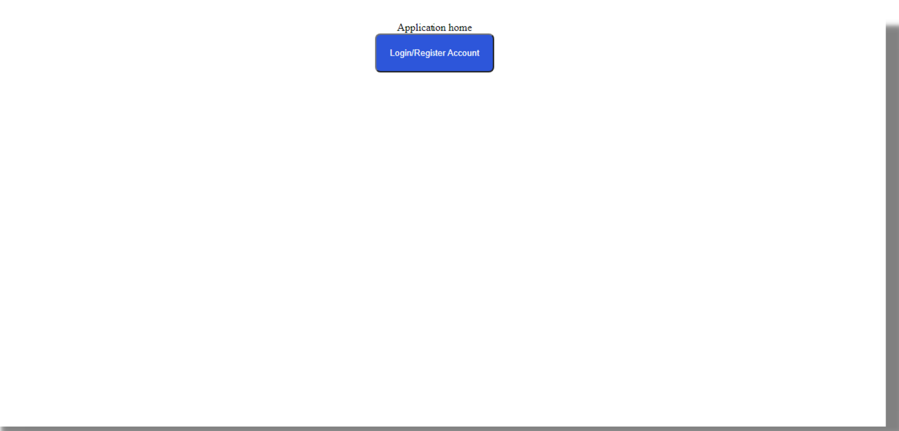
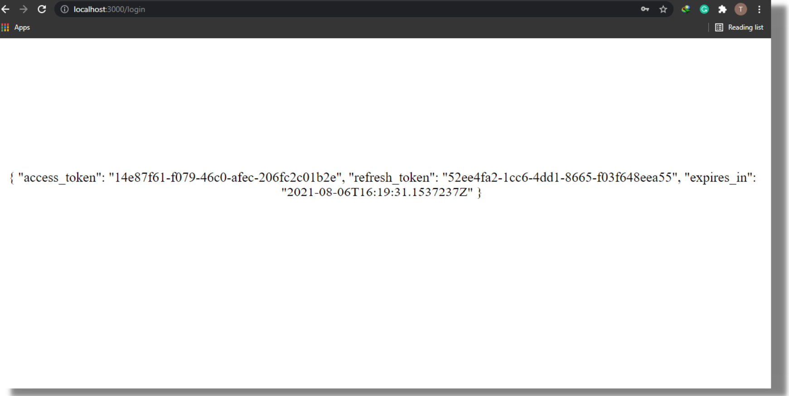
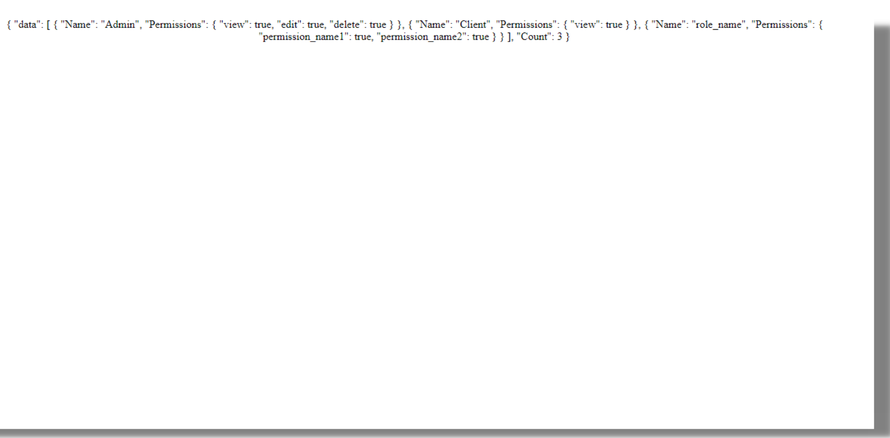
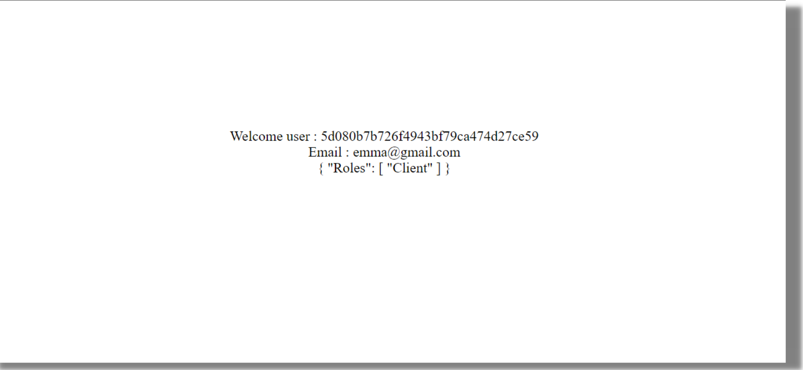

In modern websites that serve different kinds of users, there is a need to create a distinction between users to determine what kind of privileges are assigned to them. You can achieve this with authentication. Through authentication, we validate user-specific credentials to determine if the user is genuine and then assign a specific role, which could be a simple client or administrator access, for example.

React user authentication is usually carried out by using a trusted third-party customer identity and access management (CIAM) software. This tutorial uses LoginRadius API to carry out user authentication with React application. 
## Prerequisites

You should know React to be able to follow this tutorial. Also, you should have the node package manager or yarn installed on your PC.

## Overview

First, you need to install the [LoginRadius React SDK](https://www.npmjs.com/package/loginradius-react). You can then configure it to provide authentication and role assignment for use within your React application.

## Introduction

### What is LoginRadius?
>[LoginRadius](https://www.loginradius.com/docs/api/v2/getting-started/introduction/) is a SaaS-based customer identity and access management (CIAM) system with features to manage customer identity, privacy, and access. It is a simple, implementable solution for adding user authentication and authorization to your website.

LoginRadius has features to add different [login authentication options](https://www.loginradius.com/platforms/authentication-and-registration), including email, phone, and social network logins, such as Google and Facebook. It also provides security on these data. Some security features it offers include:

- **Accessing the Admin Console:** Generally, this is where we can control authentication factors regarding our apps.
- **Using API Secret:** A unique generated key to access our API.
- **[Multi-Factor Authentication](https://www.loginradius.com/platforms/multi-factor-authentication):** This features covers two-factor authentication.
- **SSL Verification**

LoginRadius comes with different SDKs, including reactjs authentication, to support different frameworks. One of them is the [LoginRadius ReactJS SDK](https://github.com/LoginRadius/loginradius-react), which allows you to add authentication within your React app.
## Getting Started
### Creating a LoginRadius Account
First, you need to [create a LoginRadius account](https://accounts.loginradius.com/auth.aspx) with a Developer Pro plan selected instead of the free plan. This is to be able to access role management features, which are only available in the Developer Pro plan. 

You'll get a page requesting you to create a new application. Click on "create a new application". After which, a page comes up where you should enter the name of your app and the URL to your app. Here, Input any name and URL of your choice.


### Auth Page (IDX)
LoginRadius allows you to create a custom login page (an auth page that you can customize from the dashboard), which you can then preview. This is a page provided by LoginRadius that you can easily customize to contain different form contents. Features like user log in, signup, email, and password have been pre-implemented on this page. You'll be using this page for registration and authentication with react application. To learn more on how to customize this page to contain more form contents, refer to [customizing Auth Page.](https://www.loginradius.com/developers/)


To be able to use user roles within your app, you first have to set up these roles and their respective privileges from the dashboard. In this tutorial, you'll set up two roles, namely Admin and Client. 

To set up roles, navigate to your dashboard, click on "user management". 

Click on "manage roles" and click on "add roles". A popup opens in which you add the role name. And in the permission tab, add what permissions that role should have. 

This tutorial has added a "client" role with a permission called "view" and an "admin" role with permissions: "view, edit, delete". Enable "set as default" for the client role to automatically assign the client role to any user in our app by default.


## Integrate LoginRadius into React
### Creating a React Application
To build your application, you'll be using the command-line interface (CLI) with `create-react-app`

For node users:

```powershell
npx create-react-app {project name}
```

Alternatively, if you're using yarn, write:

```powershell
yarn add create-react-app {project name}
```

Next, `cd` into the directory with the command below:

```powershell
cd {project name}
```

### Configuring LoginRadius for React
Next, you'll install the LoginRadius React dependency using the CLI:

For node users:

```powershell
npm install loginradius-react
```

yarn:

```powershell
yarn add loginradius-react
```

To use the react-router components, you need to install `react-router-dom` using CLI. Run the following code to achieve this:

For node:

```powershell
npm install react-router-dom
```

yarn:

```powershell
yarn add react-router-dom
```

Setup a `.env` file in the root directory with the following details:

```powershell
REACT_APP_LR_APP_NAME={app name}
REACT_APP_API_KEY={your app key}
REACT_APP_SECRET={your secret key}
```

You can find the keys required above in your dashboard within react user authentication configuration: API key and secret. 

## Building Login Components
The Auth Page(IDX) is a web page created for you that reflects the configurations you create in our dashboard. You'll utilize this page as the login and signup page within your app and set up routes to route users to a different page based on their roles.

Go to the `index.js` file and add:

```javascript
import React from "react";
import ReactDOM from "react-dom";
import App from "./App";
import { LRAuthProvider } from "loginradius-react";

ReactDOM.render(
<React.StrictMode>
  <LRAuthProvider
    appName={process.env.REACT_APP_LR_APP_NAME || ""}
    apiKey={process.env.REACT_APP_API_KEY || ""}
    redirectUri={window.location.origin}
  >
    <App />
  </LRAuthProvider>
</React.StrictMode>,
document.getElementById("root")
);
```
 
In the above code, you made imports for required modules, set up your `LRAuthProvider` component with parameters `appname` and `apikeys` from your `.env` file, and also created your redirect URI. In this case, it is equal to your current `window.location.origin`, which is the URL of the webpage -- in this case, it is our localhost.

Localhosts are whitelisted by default. If you're building your app using a hosted site, you have to whitelist the URL in your dashboard. The entry component in the code is set to the `App` component.

In the `App.js` component, add the following code:

```javascript
import React from 'react';
import './App.css';
import {
BrowserRouter as Router,
Switch,
Route
} from "react-router-dom";
import Auth from "./Landing";
import CallAPI from './Return';

function App() {
return (
 <Router>
      <div className="App">
        <Switch>
          <Route exact path="/">
            <div>{"Application home"}</div>
            <Auth />
          </Route>
          <Route path="/login">
          <CallAPI />
          </Route>
        </Switch>
      </div>
    </Router>
);
}

export default App;
```

Here, you've set up your routes using `Browser routes`, `Switch`, and `Route` components imported from the `react-router-dom` module. The path to your home page is blank ("/"). It displays the text Application home.  It runs an `Auth` component that was earlier imported. A second route is made for a second page with a path of "/login" that runs the `CallAPI` component on the new page.

You'll then create a page that will serve as the landing page for your site. To do this, create a `Landing.js` file in your `src` folder and input the following code:

 ```javascript
import { useLRAuth } from "loginradius-react";
 
 const Auth = () => {
 
 const {isAuthenticated,loginWithRedirect,logout } =  useLRAuth();
   if (isAuthenticated) {
     return (
       <div>
         <button onClick={() => logout()}>
           Log out
         </button>
       </div>
     );
   } else {
     
     return <button onClick={() => loginWithRedirect("/login")}>Login/Register</button>;
 
   }
 }; 
 
 export default Auth;
```

In the code written above, you've used `loginWithRedirect`, `loginWithPopup`, and `logout` authentication methods from the `useLRAuth` hook in your components to set up the authentication flow within your React application. You can also get access to the authentication state using `isAuthenticated`. The `isAuthenticated` method is used to check if the user is already logged into the app; it true, it returns true and displays a `log out` button that is connected to a logout function. Else, it returns false and displays a `Login/Register` button, which when clicked is set up to redirect to the path `/login`. The `loginWithRedirect()` and `logout()` methods use the Auth Page (IDX), where registration and login functionality is already implemented to perform these tasks.

You can style the button to make it easier to see by adding the following code within your `App.css` file:

```css
//for our login button on our landing page 
button{
  background-color: #2d56da;
  color: #fff;
  padding: 20px;
  border-radius: 8px;
}
//for the output in our login route which we will cover later
span{
  font-size: 24px;
  height: 80vh;
  width: 100%;
  display: flex;
  justify-content: center;
  align-items: center;
  text-align: center;
}
```

## Using the LoginRadius API
As an additional feature, you can use the LoginRadius React SDK to access the API to get parameters that are assigned upon logging in using the login form. You can use this method to check if a user is a client or administrator. Whenever a user creates an account using the form, the user is assigned a unique user-id called `Uid`, which you can view in your dashboard under "manage users". You can reference this user-id to determine your users’ roles. To do this, you need to fetch and return the `Uid` of the current user. The fetch request for the user role requires the `Uid` and your `app secret key` as parameters within the URL.

In your `src` folder, create a file name `return.js`, and populate it with the following code:

```javascript
import React, { useEffect, useState } from "react";
import { useLRAuth, withAuthenticationRequired } from "loginradius-react";

const CallAPI = () => {

  const [resp, setResp] = useState(null);
    const { user } = useLRAuth();
    const uid = user["Uid"];
    

  useEffect(() => {
    (async () => {
      try {
        const response = await fetch(
          ``https://api.loginradius.com/identity/v2/manage/account/${uid}/role?apiKey=${process.env.REACT_APP_API_KEY}&apiSecret=${process.env.REACT_APP_SECRET}`,`
          {}
        );
        setResp(await response.json());
      } catch (e) {
        console.error(e);
      }
    })();
  });

  if (!resp) {
    return <div>Loading...</div>;
  }

  return <span>{JSON.stringify(resp, null, 2)}</span>;
};

export default withAuthenticationRequired(CallAPI, {
  onRedirecting: () => <div>Loading...</div>,
});
```

Here, within your `CallAPI` component, you've used `usestate` hook to create two states `resp` and `setResp` to check if you have received a response from the API. A constant `user` was made to use the `LAuth` method to get the current user data, and then the next line gets the id of the current user. The `useeffect` React hook that runs after the render contains an asynchronous function is used to fetch the role of the current user `uid`. It returns the data and outputs it in JSON form, which value is given to `SetResp`. Else, it throws an error if the fetch request fails.

Since it is an asynchronous function, the code below it runs while fetching and awaiting a response. `resp` is false during this time while waiting for the result of the asynchronous function. Therefore, it outputs "Loading..." on the screen until the async returns the data that it then outputs. 

The last code block: `export` is simply used to show "Loading..." on the screen during redirecting. 

## Running the Code
You can run the present code by `cd` into your parent directory and running:

```powershell
npm start
```

When it successfully starts the server, you would have a similar page as follows:



This is the landing page you've built in the `Auth` component and is your `/` path in your routes within `App.js`. If you click on the "login/register" button, you'll be redirected to your custom Auth Page (IDX) provided by LoginRadius, where you can create a user account and login. You can manage the users who have accounts from your dashboard in "manage users".

After logging in auth react js, with your user, you'll get redirected to the /login route that then runs the CallAPI component and gives you a result similar to the following:


This is the current role of the user. Any user would have the role of client assigned since you've set to assign the client role by default to all our users from your dashboard during the creation of roles.

## Managing User Authentication and Data
### User Authentication
In the above section, you've created a user account with different parameters for the email and password. Upon creation of an account, you get directed to the login page, where you can sign in using the credentials of the created account. Authentication was carried out on the parameters in the input field by the LoginRadius API set up in the Auth Page. 

Your user authentication is carried out by the API. This checks the input details against the registered user details. If any input not matching this is put in the form, you'll get an alert "user does not exist" upon clicking the login button. Upon logging in, your app key and secret are sent by your app to the authentication server. Upon authentication, the server responds with an access token and authorizes the user. To view this token, you can create a new file called `Token.js` and insert the following code into it:

```javascript
import React, { useEffect, useState } from "react";
import { useLRAuth, withAuthenticationRequired } from "loginradius-react";

const CallAPI = () => {
  const { getAccessTokenSilently } = useLRAuth();
  const [resp, setResp] = useState(null);

  useEffect(() => {
    (async () => {
      try {
        const token = await getAccessTokenSilently();
        const response = await fetch(
        ``https://api.loginradius.com/identity/v2/auth/access_token/validate?access_token=${token}&apiKey=${process.env.REACT_APP_API_KEY}`,`
          {}
        );
        setResp(await response.json());
      } catch (e) {
        console.error(e);
      }
    })();
  }, [getAccessTokenSilently]);

  if (!resp) {
    return <div>Loading...</div>;
  }

  return (
    <span>{JSON.stringify(resp, null, 2)}</span>
  );
};

export default withAuthenticationRequired(CallAPI, {
    onRedirecting: () => <div>Loading...</div>, 
    });
```

The code above runs a fetch request for the access token and displays it when the data is returned. To view the output of this code, import the newly created file into your `App.js` file. Since the name of the function component in the code is still `CallAPI`, you don't need to edit the component called in the login route. You just need to comment out the former import for the component from your `return.js` file as shown below:

```javascript
import "./App.css";
import { BrowserRouter as Router, Switch, Route } from "react-router-dom";
import Auth from "./Landing";
// import Login from "./Login";
import React from 'react';
// import CallAPI from './Return';
 import CallAPI from './Token';

function App() {
  return (
    <Router>
      <div className="App">
        <Switch>
          <Route exact path="/">
            <div>{"Application home"}</div>
            <Auth />
          </Route>
          <Route path="/login">
            <CallAPI />
          </Route>
        </Switch>
      </div>
    </Router>
  );
}
export default App;
```

You then need to run the code by starting the server using the `npm start` command. Upon starting the server, when you log in, you'll have your user token displayed on the screen. Your output will be similar to the following:



Here, you can see the access token and its details. You can then return your code to the previous `CallAPI` component imported from `Return.js`.

### User Data 
You can view and manage user accounts from the dashboard. You can find the panel for this under "User management":


Manage users:


Here, you can view the account information of your users, search for a particular user details using the email, Uid, or phone number as the query in the search box. Also, the panel provides an option to reset the password of a user, block users, and delete users as the above image shows. You can create new users by clicking on the "add user" button and filling in the details of the new user.

## Viewing User Permissions
To view all roles and permissions for your app, change the URL in the fetch request to ``https://api.loginradius.com/identity/v2/manage/role`, keeping the rest of the URL the same. That is, it still contains your `appkey` and `appsecret` parameters.`

Reload your page, and you'll have an output similar as follows:



## Adding a Role to the Current User
To add the Admin role to the current user, create objects for this by adding the following code within the parenthesis after your fetch URL:

```json
method: "PUT",
     headers: {
      'Content-Type': 'application/json',
     },
     body: JSON.stringify({
      roles: ["Admin"],
     }),
```

This adds the Admin role to the current logged-in user since it is the `Uid` that is within our URL. `fetch` uses a GET request by default. Since you're making a change to the URL, you're using a PUT method instead. You'll get a result similar to as follows:


The user has both client and admin roles because you've added client roles by default to all our users.

### Assigning Client and Admin roles
To assign specific roles to different people, first you should uncheck the set as default in the "manage roles" section of your dashboard. You can then run an `if block` to check if the users’ logged-in emails are equal to a particular set of emails and then perform the assignment of admin roles to them; else, assign the client roles instead. Modify your `return.js` file as below:

```javascript
import React, { useState } from "react";
import { useLRAuth, withAuthenticationRequired } from "loginradius-react";

const CallAPI = () => {

  const [resp, setResp] = useState(null);
  const { user } = useLRAuth();
  const uid = user["Uid"];
  var response;
  const email = user["Email"];
  var emailmain = email[0].Value;
  
  
  (async () => {
    if (emailmain.toLowerCase() === "admin@example.com"){
      try {
          
        
        response = await fetch(
          ``https://api.loginradius.com/identity/v2/manage/account/${uid}/role?apiKey=${process.env.REACT_APP_API_KEY}&apiSecret=${process.env.REACT_APP_SECRET}`,`
          {
            method: "PUT",
            headers: {
              'Content-Type': 'application/json',
            },
            body: JSON.stringify({
              roles: ["Admin"],
            }),
          }
        );
        setResp(await response.json());
      } catch (e) {
        console.error(e);
      }
    }
    else {
       try {
         response = await fetch(
           ``https://api.loginradius.com/identity/v2/manage/account/${uid}/role?apiKey=${process.env.REACT_APP_API_KEY}&apiSecret=${process.env.REACT_APP_SECRET}`,`
           {
             method: "PUT",
             headers: {
               "Content-Type": "application/json",
             },
             body: JSON.stringify({
               roles: ["Client"],
             }),
           }
         );
         setResp(await response.json());
       } catch (e) {
         console.error(e);
       }
    }
  })();
  

  if (!resp) {
    return <div>Loading...</div>;
  }

   return <span>
    Welcome user : {uid}<br/>
    Email : {emailmain}<br/>
    {JSON.stringify(resp, null, 2)}
  </span>;
};

export default withAuthenticationRequired(CallAPI, {
  onRedirecting: () => <div>Loading...</div>,
});
```

In the code above, you've created a const email that returned an array containing the user email. To get the email specifically, you've created another variable `emailmain` which gets the value at a particular array position containing the user email.

The `async` request block has now been modified to check if the user email being used for logging in is equivalent to a particular email which you've declared. Alternatively, you can have your emails pulled from a database and assign the admin roles to the ones you want. The else block assigns a client role to emails that do not meet the first criteria. When you create a new account with an email similar to what I have in the `if block`, that is admin@example.com; when rerouted to the `/login` path, you'll discover that the role of admin was assigned while any other email will have the client role assigned upon login. The return statement returns the user id of the logged-in user, the email, and then the role in a JSON format. The output would be similar to the following:



## Conclusion
This tutorial covered:

- Setting up LoginRadius with a React app 
- Using the setup to authenticate users and assigning specific roles with different privileges  

These privileges can be used to give users certain permissions as to what they can do on your website.

LoginRadius is a great tool and is easy to implement if you want to implement authentication in your application.

A working version of the code used in this tutorial is available [on Github](https://github.com/Victory-ET/LoginRadius).
