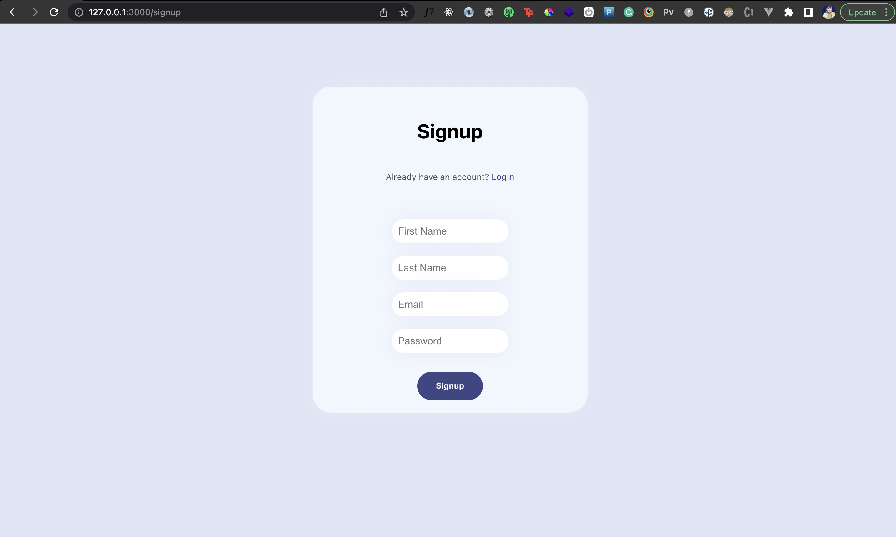
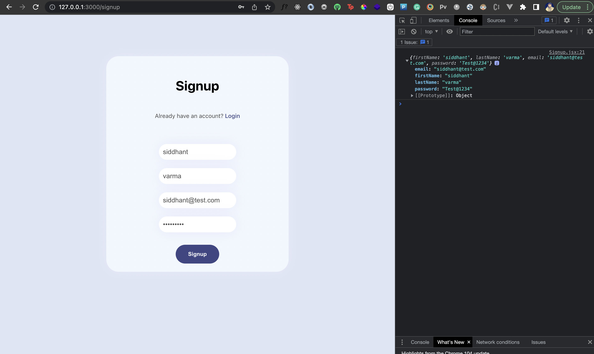
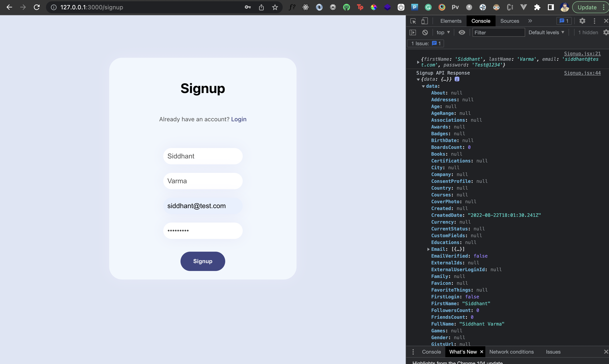
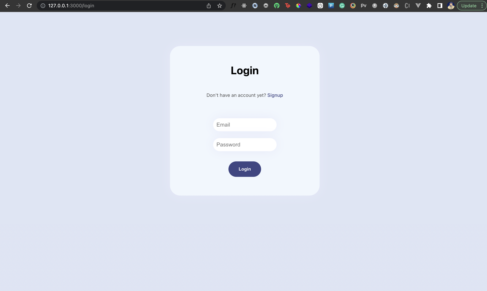

Authenticaiton is an essential feature of any application. However, implementing your own authentication can be a tricky subject especially considering the security aspects of it. Developers often use third party authentication services like [LoginRadius](https://www.loginradius.com/) that offer a complete end-to-end authentication solution right out of the box. Not only it is simple to integrate directly on the frontend of your app, but it's also secure and offers a lot of customization and useful features.  

So in this tutorial, I’ll talk about adding authentication in a SolidJS application using LoginRadius Authentication APIs. You'll understand step by step how to:

- create login and signup forms in Solid;
- add reactivity to it using signals and events;
- configure routing for a Solid app; and,
- setup protected routes for authenticated users.

You'll also learn how to consume REST APIs in a Solid app using Fetch API and programmatically redirect the user based on the authentication flow. 

## Prerequisites 

You must be familiar with the basics of SolidJS before you jump into this tutorial. I have already covered the fundamentals of SolidJS in depth [here](https://www.loginradius.com/blog/engineering/guest-post/introduction-to-solidjs/) so feel free to check that out first. 

Since we’ll use LoginRadius APIs to add authentication in the app, we'll need some initial setup as well. Let's now quickly walk through the steps needed to configure a LoginRadius app, get API credentials and start using those APIs in our Solid app. 

## Setup LoginRadius

First, you need to create a new LoginRadius account. If you've done that already, you can skip this otherwise you can follow the steps below.

### Create LoginRadius Account

Head over to [LoginRadius](https://accounts.loginradius.com/auth.aspx?plan=developer&action=register) and create a new account by filling in the following details:


You'll then see a form with the name of your App, a URL, and a Data Center:


Hit **Next** and LoginRadius will set up an authentication app for you. You can try the pre-built authentication page LoginRadius provides for your app by clicking on **Try Signing Up Now**. At this point you don't really need an authentication page for this tutorial so all you need to do is complete this step. We'll build our own authentication UI and use LoginRadius APIs on top of it. 


### Get LoginRadius API Configurations

Once you're inside your LoginRadius account, head over to the **Configurations** tab from your dashboard. Then expand the **API Credentials** tab of your application.


Inside that, you should see your APP Name, API Key, and API Secret.


These are your API credentials and you'll need to use it in your Solid app to communicate with LoginRadius APIs. 

Great! You're all done with the setup. Let's now take a glimpse at how the authentication workflow is going to look like. 

## Authentication Workflow

We'll have three pages in our Solid app. A signup page where new users can create an account, a login page where an existing user can login via their account details. Finally, we'll have a home page where users will land after they've successfully signed up or logged in. 

LoginRadius will handle all the server side logic and user management for us. Our login/signup forms on the frontend will interact with these APIs. We’ll add route guard for authenticated routes like the home page so that an unauthenticated user cannot access it. 

## Frontend Setup

First, we'll create a new Solid app. Navigate into the directory of your choice and run the following command:

```shell
npx degit solidjs/templates/js solidjs-auth-app
```

That should create a new SolidJS project with a simple starter template. 

Additionally, we need to install [solidjs-router](https://github.com/solidjs/solid-router) package to set up routing in our Solid app:

```shell
npm i @solidjs/router
```

Let's also kickstart the development server by running:

```shell
npm start
```


### Configure Environment Variables

Next, we need to add environment variables in our Solid app to store and use the LoginRadius API Keys and Secrets. Create a file called `.env` inside the root directory and add the LoginRadius app details inside it as follows:

```.env
VITE_LOGINRADIUS_APP_NAME=<your app's name>
VITE_APP_LOGINRADIUS_API_KEY=<your app's API key>
VITE_API_SECRET=<your app's API secret>
```

Make sure you prefix the environment variables with `VITE` otherwise the Solid app won't recognize them. 

### Create Files and Folders

We'll create three components on the Frontend - one for each page. Inside the root directory, create a new folder called `components` with the following files:

- `/components/Login.jsx`
- `/components/Signup.jsx`
- `/components/Home.jsx`

Great! Let's add some styles now.

### Add Project Styles

Update the /index.css file with the following:

```css
body {
  margin: 0;
  font-family: -apple-system, BlinkMacSystemFont, 'Segoe UI', 'Roboto', 'Oxygen',
    'Ubuntu', 'Cantarell', 'Fira Sans', 'Droid Sans', 'Helvetica Neue',
    sans-serif;
  -webkit-font-smoothing: antialiased;
  -moz-osx-font-smoothing: grayscale;
  background:#dde5f4;
}

code {
  font-family: source-code-pro, Menlo, Monaco, Consolas, 'Courier New',
    monospace;
}

.card{
  display:flex;
  flex-direction:column;
  align-items:center;
  margin:100px auto;
  border-radius: 30px;
  box-shadow: 0 0 2em #e6e9f9;
  padding:20px;
  max-width:400px;
  min-height:400px;
  background:#f1f7fe;
}

.card h3.title{
  font-size: 32px;
}

.card p.subtitle{
  font-size: 14px;
  margin-bottom:60px;
  color:#4d4d4d;
}

.card p.subtitle a{
  text-decoration: none;
  color:#3e4684;
  font-weight:500;
}

.card form{
  display:flex;
  flex-direction:column;
  align-items:center;
}

.card form input{
  border:none;
  margin-bottom:20px;
  background: white;
  box-shadow: 0 0 2em #e6e9f9;
  padding: 10px;
  font-size:16px;
  display: flex;
  flex-direction: column;
  border-radius: 20px;
  color: #4d4d4d;
  outline:none;
}

.card form button{
  margin-top:10px;
  padding: 15px 30px;
  background: #3e4684;
  color: white;
  border: none;
  border-radius: 30px;
  font-weight: 600;
  cursor:pointer;
}

.home{
 width:100%;
 text-align:center;
 margin-top: 200px;
  
}

.home p{
  font-size: 20px;
}
```

You'll also notice there is an `App.module.css` file. We'll empty it because we don't need those styles. 


## The Signup Component

Let's create the Signup component and render it on the page. 

### Create and Render Signup Page UI

To get started with, we'll create the HTML template that renders four input fields inside a form - first name, last name, email and password. We'll need these fields to create a new account for the user via the LoginRadius API. 

```jsx
import {  Link } from "@solidjs/router";


export default function Signup(){
    
    return(
        <div className="card">
            <h3 className="title"> Signup </h3>
            <p className="subtitle">Already have an account? 
                <Link href="/login">Login</Link>
             </p>
            <form >
                <input id="firstName" type="text" placeholder="First Name" />
                <input id="lastName" type="text" placeholder="Last Name" />
                <input id="email" type="text" placeholder="Email" />
                <input id="password" type="password" placeholder="Password" />
                <button>Signup </button>
            </form>
        </div>
    )
}


```

Notice that we have a link in the Signup form to the Login page. To create links using SolidJS router, we use the built-in `<Link/>` component from the library. The `href` prop on it specifies the route we want to visit when someone clicks on this link. Of course we haven't created the component or the route yet, but we'll do that in the next section. 

Let's head to the `App.jsx` file and render the `<Signup/>` component we just created:

```jsx
import logo from './logo.svg';
import { Routes, Route } from "@solidjs/router"

import Signup from './components/Signup';

function App() {
  return <>
    <Routes>
      <Route path="/signup" component={Signup} />
    </Routes>
  </>
}

export default App;

```

The `<Routes/>` component is the routing layer wrapper around your routes. Each individual route is specified using the `<Route/>` component. The route URL is passed to this component using the `path` prop and the component that needs to be rendered on this route is specified using the `component` prop. 

If you visit http://127.0.0.1:3000/signup, you should now see the following page:



### Tracking Form Fields using Events

We need to attach some dynamic data to our form fields. In Solid, any dynamic data can be created using signals. We'll create a signal object called `accountDetails` which will have the fields as empty strings. Each key in the signal object will match the `id` attribute in the form field so that we can directly update this key in the signal when there is a change event triggered on any of the input fields. 

We'll create a function `handleChange` that will update the `accountDetails` signal using the `setAccountDetails` mutator function.  We'll tie the `handleChange` method to the `onChange` event on the signup form. Similarly, we'll also attach a `handleSubmit` method to the `onSubmit` event on the signup form. 

```jsx
import {  Link } from "@solidjs/router";
import { createSignal } from "solid-js";

export default function Signup(){
    const [accountDetails, setAccountDetails] = createSignal({
        firstName:'',
        lastName:'',
        email:'',
        password:'',
    });

    const handleChange=(e)=>{
        setAccountDetails({
            ...accountDetails(),
            [e.target.id]:e.target.value
        })
    }
    
    const handleSubmit=(e)=>{
        e.preventDefault();
        console.log(accountDetails());
    }
    return(
        <div className="card">
            <h3 className="title"> Signup </h3>
            <p className="subtitle">Already have an account? 
                <Link href="/login">Login</Link>
             </p>
            <form onChange={handleChange} onSubmit={handleSubmit}>
                <input id="firstName" type="text" placeholder="First Name" />
                <input id="lastName" type="text" placeholder="Last Name" />
                <input id="email" type="text" placeholder="Email" />
                <input id="password" type="password" placeholder="Password" />
                <button>Signup </button>
            </form>
        </div>
    )
}


```

Inside `handleSubmit` we simply print the `accountDetails` object. Let's fill the form and submit it to see if we get the correct details logged on the console:



Looks like our Signup form works fine! We can now use these account details that we've logged on the console to signup the user via LoginRadius Signup API. 

### Integrating LoginRadius Signup API

Now we need to integrate the LoginRadius [manage account endpoint](https://www.loginradius.com/docs/api/v2/customer-identity-api/account/account-create/) that will create a new user account. In the endpoint we pass the API key and secret as query parameters from the environment variable file we created earlier. Then, we use the fetch API to send a POST request to the manage account endpoint. 

In the body, we pass the account information in a specific format that we extract from the `accountDetails` signal. If the API throws an error, we clear the signal state and show the error message using an alert. If the API is successful, we log the response to the console. 

```jsx
const handleSubmit=(e)=>{
        e.preventDefault();
        console.log(accountDetails());
       
        const endpoint=`https://api.loginradius.com/identity/v2/manage/account?apikey=${import.meta.env.VITE_APP_LOGINRADIUS_API_KEY}&apisecret=${import.meta.env.VITE_APP_LOGINRADIUS_API_SECRET}`
        fetch(endpoint,
         {
            method:'POST',
            headers: {
            'Content-Type': 'application/json'
            },
            body:JSON.stringify({
                "FirstName":accountDetails().firstName,
                "LastName":accountDetails().lastName,
                "Email": [
                    {
                      "Type": "Primary",
                      "Value": accountDetails().email
                    }
                ],
                "Password":accountDetails().password
            })
         })
         .then(response=>response.json())
         .then(data=>{
            console.log({data})
            if(data.ErrorCode){
                alert(data.Message);
                setAccountDetails({
                    firstName:'',
                    lastName:'',
                    email:'',
                    password:'',
                })
            }else{
                console.log({data})
            }
         })
    }
```

Let's now check what data we get back from the API when the signup is successful:



As you can see, we get a long list of information about the account that has been created. In the network tab, you can also confirm that the API returns 200 indicating a success. We need the `Uid` field present in the object returned in the API response. We'll store this `Uid` in the local storage and redirect the user to the home page.

```jsx
...
if(data.Uid){
        localStorage.setItem('user_id',data.uid)
        navigate("/", { replace: true });
}
...
```

We'll create the home page shortly. The `Uid` represents an identifier for the account we just created and we can later use it to fetch user related information inside the Home page. 

## The Login Component

We can create the initial template and methods for our `<Login/>` component in a similar way:

```jsx
import {  Link } from "@solidjs/router";
import { createSignal } from "solid-js";


export default function Login(){
    console.log(import.meta.env)
    const [emailPassword, setEmailPassword] = createSignal({
        email:'',
        password:'',
    });

    const [loading,setLoading]=createSignal(false)

    const handleChange=(e)=>{
        setEmailPassword({
            ...emailPassword(),
            [e.target.id]:e.target.value
        })
    }
    
    const handleSubmit=(e)=>{
        e.preventDefault();
        console.log(emailPassword())
       
    }

    return(
        <div className="card">
           <h3 className="title"> Login </h3>
           <p className="subtitle">Don't have an account yet?  <Link href="/signup">Signup</Link> </p>
           <form onSubmit={handleSubmit} onChange={handleChange}>
                <input id="email" type="text" placeholder="Email" />
                <input id="password" type="password" placeholder="Password" />
                <button>Login </button>
           </form>
        </div>
    )
}


```

Thje login form has two input fields for email and password and a submit button. Let's also render it inside `App.jsx`:

```jsx
import logo from './logo.svg';
import styles from './App.module.css';
import { Routes, Route } from "@solidjs/router"
import Login from './components/Login';
import Signup from './components/Signup';


function App() {
  return <>
    <Routes>
      <Route path="/login" component={Login} />
      <Route path="/signup" component={Signup} />
    </Routes>
  </>
}

export default App;

```

If you now visit http://127.0.0.1:3000/login, you should see the following page:




Awesome! That was fast, wasn't it? Let's now integrate the LoginRadius Login API with this form. 

### Integrating LoginRadius Login API

To login an existing user, we can use the [Login endpoint](https://api.loginradius.com/identity/v2/auth/login) from LoginRadius. Here's the complete version of the `handleSubmit` method in the `<Login/>` component:

```jsx
    
    const handleSubmit=(e)=>{
        e.preventDefault();
        console.log(emailPassword())
        const endpoint=`https://api.loginradius.com/identity/v2/auth/login?apikey=${import.meta.env.VITE_APP_LOGINRADIUS_API_KEY}&apisecret=${import.meta.env.VITE_APP_LOGINRADIUS_API_SECRET}`
        fetch(endpoint,
         {
            method:'POST',
            headers: {
            'Content-Type': 'application/json'
            },
            body:JSON.stringify({
                email:emailPassword().email,
                password:emailPassword().password
            })
         })
         .then(response=>response.json())
         .then(data=>{
            if(data.ErrorCode){
                alert(data.Message)
            }else{
                localStorage.setItem('user_id',data.Profile.Uid)
                navigate('/')

            }
         })
    }
```

Similar to signup, we pass the email and password as post parameters to the API. If the login is successful, we redirect the user to the Home page and store their user Id or the `Uid` returned inside the `Profile` object. 

## The Home Component

Let's create our Home component or the page where you'll redirect an user on a successfull login. Inside `/src/components/Home.jsx` file, we'll first get the the user Id we stored in the localStorage. We'll pass that Id to the manage account endpoint but this time, we'll make a GET request instead of a POST one. This will fetch us all the information pertaining to that user Id. We also create a signal called `userData` to store this information and conditionally render it on the DOM using the special `<Show/>` component. 

Since we want this action to happen as soon as the Home page loads, we will call the `getUserDetails` function inside the `createEffect`.  To protect the home page from being accessed by unauthenticated users, we'll add a check inside this function for the user Id. If the user Id does not exist, which will be the case of unauthenticated users, we'll redirect them to the Login page. 

```jsx
import { createEffect, createSignal, Show,  } from "solid-js";
import { useNavigate } from '@solidjs/router';

export default function Home(){
		const navigate=useNavigate()
    const [userData,setUserData]=createSignal(null);

    const getUserDetails=()=>{
        
        const uid=localStorage.getItem('user_id');
        if(!uid) navigate('/login');
        const endpoint=`https://api.loginradius.com/identity/v2/manage/account/${uid}?apikey=${import.meta.env.VITE_APP_LOGINRADIUS_API_KEY}&apisecret=${import.meta.env.VITE_APP_LOGINRADIUS_API_SECRET}`

        fetch(endpoint)
        .then(response=>response.json())
        .then(data=>{
            setUserData(data)
        })

    }


    createEffect(() => {
        getUserDetails()
      });
    return(
        <div className="home">

            <h1>Welcome</h1>
            <Show when={userData()}>
               <p>{userData().Email[0].Value}</p> 
               <p> {userData().FirstName} {userData().LastName}</p>
                
            </Show>
            
        </div>
    )
}


```
We'll also need to render the Home page on the / route in our `App.jsx` file:

```jsx
...
import Home from './components/Home';
...

function App() {
  return <>
    <Routes>
      <Route path="/" component={Home} />
      <Route path="/login" component={Login} />
      <Route path="/signup" component={Signup} />
    </Routes>
  </>
}

export default App;

```

Let's now login and check how the Home page looks like:


As you can see, the details around the user's name and email is fetched from the manage account endpoint. 

If you delete the `user_id` stored in the local storage and refresh the page, that should automatically redirect you to the Login page. This represents the unauthenticated state for your user. Even if you try to visit the home page via the URL without logging in, you'll be redirected back to the Login page. This is because inside the `getUserDetails` function, after we get the user Id from local storage we check if it exists or not. If it doesn't, we navigate the user programmatically to the Login page. The following line of code acts like the route guard for our protected home page route:

```jsx
if(!uid) navigate('/login');
```


## Conclusion

We've seen how to authenticate SolidJS apps. You've also learnt how routing works using the Solid router and how to guard your protected routes. There's still a lot you can do from this point. How about you try to implement the logout functionality in the demo app? We've already discussed a possible solution in the previous section. You can also use the [Solid store](https://www.solidjs.com/tutorial/stores_createstore) for managing the user related data after authentication. 

You can also explore [LoginRadius](https://accounts.loginradius.com/auth.aspx?plan=developer&action=register) further to add forgot password functionality or social signups with Facebook and Google. You can [refer to the entire source code for this tutorial here]().
