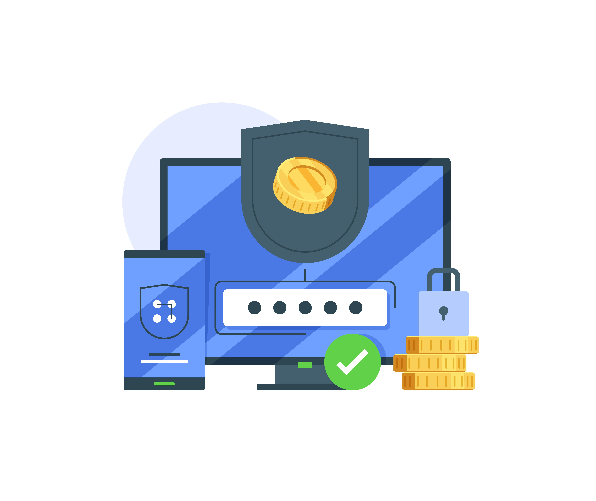
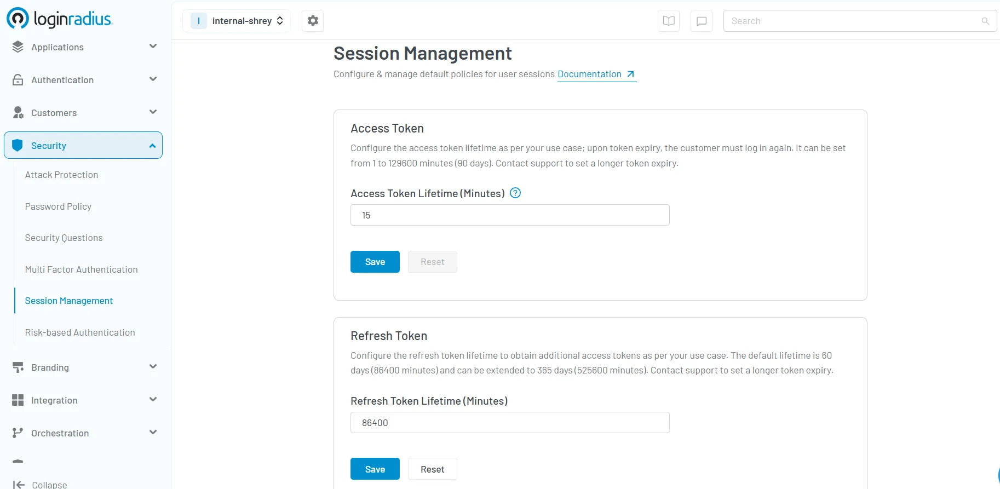

## Introduction

Have you ever logged into a website by clicking “Login with Google” or “Sign in with Facebook,” without entering your password? Or used a web app that keeps you logged in even after closing your browser? 

These seamless experiences often rely on JSON Web Tokens (JWTs) — a way to authorize users after they have been authenticated.

In today’s digital landscape, securing user identity and managing access is critical. JWT is a compact and secure method for transmitting claims between parties, typically used after authentication to handle authorization, session management, and secure API access.

But what exactly is a JWT, how does it work, and why is it important? This blog offers a comprehensive explanation.

## What are Tokens and Why Are They Needed?

Tokens are digital artifacts used in authentication systems to represent user identity. Instead of maintaining session state on the server, modern applications issue tokens to clients. These tokens are sent along with each request to authorize access to protected resources.

When a user makes an authenticated request, the token is included in the request header. The server verifies the token’s validity—typically by checking its signature and expiration time. If the token is valid, access is granted. This approach supports stateless and scalable systems, compared to traditional session-based models.

## What is JWT (JSON Web Token)?

[A JWT (JSON Web Token)](https://www.loginradius.com/blog/engineering/jwt/) is a compact, self-contained token used to securely transmit claims between parties. JWTs are digitally signed using a secret (with HMAC) or a public/private key pair (with RSA or ECDSA).

One of the main advantages of JWT authentication is that it doesn't require storing session data on the server—making it ideal for distributed applications.

## Types of JWT

There are two main types of JWT based on how the payload is protected- JWS and JWE. Let’s learn more about them. 

### JWS (JSON Web Signature)

JWS is a type of JWT where the payload (data) is digitally signed, ensuring integrity and authenticity of the token.

* The payload is Base64URL encoded and signed using a secret or private key. 

* It is not encrypted, meaning the contents can be read by anyone who has the token. 

* Commonly used in authentication and authorization scenarios like OAuth 2.0 access tokens. 

**Use Case:** Verifying that the data has not been tampered with.

### JWE (JSON Web Encryption)?

JWE is a type of JWT where the payload is encrypted, ensuring confidentiality in addition to integrity.

* The entire payload is encrypted using a public key or shared secret. 

* Only the intended recipient can decrypt and read the token contents. 

* Less common than JWS, but ideal for sensitive data transmission. 

**Use Case:** Protecting personal or confidential information during transit.

## JWT vs JWS vs JWE – Comparison Table

<table>
  <tr>
   <td><strong>Feature</strong>
   </td>
   <td><strong>JWT (General)</strong>
   </td>
   <td><strong>JWS (Signed JWT)</strong>
   </td>
   <td><strong>JWE (Encrypted JWT)</strong>
   </td>
  </tr>
  <tr>
   <td><strong>Security Focus</strong>
   </td>
   <td>Token Format
   </td>
   <td>Integrity, authenticity
   </td>
   <td>Confidentiality + integrity
   </td>
  </tr>
  <tr>
   <td><strong>Payload</strong>
   </td>
   <td>Not specified
   </td>
   <td>Base64URL encoded (readable)
   </td>
   <td>Encrypted (not readable)
   </td>
  </tr>
  <tr>
   <td><strong>Signature</strong>
   </td>
   <td>Optional
   </td>
   <td>Required
   </td>
   <td>Encrypted along with payload
   </td>
  </tr>
  <tr>
   <td><strong>Encryption</strong>
   </td>
   <td>Optional
   </td>
   <td>Not encrypted
   </td>
   <td>Fully encrypted
   </td>
  </tr>
  <tr>
   <td><strong>Use Case</strong>
   </td>
   <td>ID and Access Tokens
   </td>
   <td>OAuth 2.0, OpenID Connect
   </td>
   <td>Highly sensitive information
   </td>
  </tr>
</table>

Note: JWT is the umbrella format. JWS and JWE are implementation types. The most commonly used JWTs in web apps are of the JWS type.

## Structure of JWT

A JWT is composed of three parts:

1. **Header**
2. **Payload**
3. **Signature**

Each part is Base64URL encoded and separated by a period (.).

**Example:**

php-template

CopyEdit

&lt;Header>.&lt;Payload>.&lt;Signature>

### 1. Header

The header typically includes the token type and the signing algorithm being used.

json

CopyEdit

{

  "alg": "HS256",

  "typ": "JWT"

}

### 2. Payload

The payload contains the **claims**—statements about an entity (usually the user) and additional metadata.

json

CopyEdit

{

  "iss": "https://lrSiteName.hub.loginradius.com/",

  "sub": "{uid}",

  "jti": "unique string",

  "iat": 1573849217,

  "nbf": 1573849217,

  "exp": 1573849817,

  "Key1": "value1",

  "Key2": "value2"

}

#### **Standard JWT Claims**

* **iss (Issuer):** Identifies the token issuer (e.g., your LoginRadius domain). 

* **sub (Subject):** Identifies the user or entity to whom the token refers. 

* **jti (JWT ID):** Unique identifier for the token, often used to prevent replay attacks. 

* **iat (Issued At):** Timestamp of when the token was issued. 

* **nbf (Not Before):** Specifies the time before which the token must not be accepted. 

* **exp (Expiration):** Sets token expiration—once expired, access is denied. 

Note: The payload is not encrypted by default, and can be decoded by anyone. Do not include sensitive information unless using an encrypted JWT (JWE).

### 3. Signature

The signature ensures the token has not been altered. It is created by signing the encoded header and payload using a secret or private key.

text

CopyEdit

HMACSHA256(

  base64UrlEncode(header) + "." +

  base64UrlEncode(payload),

  secret)

This helps validate the token’s integrity and authenticity.

## How Does JWT Work?

JWT-based authentication typically follows this flow:

1. **User Logs In**

The user provides login credentials (e.g., username and password). 

2. **Server Verifies Credentials** 

The server validates the credentials against its data store. 

3. **JWT is Issued** 

Upon successful login, the server issues a JWT signed with a secret/private key (post authentication). 

4. **Client Stores JWT** 

The client stores the token (e.g., in localStorage, sessionStorage, or a secure cookie). 

5. **Token Sent on Requests** 

The client attaches the token to the Authorization header (Bearer &lt;token>) in future authorization/authentication API requests.

6. **Server Validates JWT** 

The server checks the token's signature, expiry, and validity. 

7. **Access is Granted** 

If valid, the user is granted access to protected resources.

This stateless model makes JWT ideal for scalable web and mobile apps.

## How to Use OAuth 2.0 with JWT

[OAuth 2.0](https://www.loginradius.com/blog/engineering/what-is-oauth2-0/) is an industry-standard protocol for authorization. It enables users to grant third-party apps access to their resources without sharing their credentials.

When integrated with JWT, OAuth 2.0 uses JWTs as access tokens to represent the user's authorization.

JWTs are commonly used as OAuth 2.0 access tokens—but not required by the specification. Some providers use opaque tokens instead.

### Why JWTs in OAuth 2.0?

* JWTs are **self-contained**, carrying all claims. 

* They are **digitally signed**, allowing recipients to verify them without contacting the issuer. 

* They improve performance by **eliminating database lookups** during request processing. 

## Implementation of JWT using LoginRadius APIs

To implement JWT with LoginRadius:

### **Step 1: Configure a JWT App**

Set up a JWT app in your [LoginRadius Admin Console](https://accounts.loginradius.com/auth.aspx?return_url=https://console.loginradius.com/login&action=register). Follow the JWT Admin Console Configuration guide.

### **Step 2: Use APIs to Retrieve JWT**

If you are directly implementing your Login forms or already have an access token or want to generate a JWT based on email/username/Phone number or a password, you can leverage the following APIs:

* [JWT Token](https://www.loginradius.com/docs/api/v2/single-sign-on/federated-sso/jwt-login/jwt-token-by-access-token/): This GET API is used to exchange access tokens with your JWT.

* [JWT Token by Email](https://www.loginradius.com/docs/api/v2/single-sign-on/federated-sso/jwt-login/jwt-token-by-email-and-password/): This API is used to get a JWT by Email and Password.

* [JWT Token by Username](https://www.loginradius.com/docs/api/v2/single-sign-on/federated-sso/jwt-login/jwt-token-by-username-and-password/): This API is used to get JWT by Username and password.

* [JWT Token by Phone](https://www.loginradius.com/docs/api/v2/single-sign-on/federated-sso/jwt-login/jwt-token-by-phone-and-password/): This API is used to get JWT by Phone and password.

**API Response Example:**

json

CopyEdit

{

  "signature": "&lt;JWTresponse>"

}

These tokens can then be used in your client app for authenticated requests.

## Best Practices for Secure JWT Authentication

To implement JWT securely, follow these key practices:

1. **Keep Signing Keys Secure** 

Private keys or secrets used to sign JWTs must be stored securely. 

2. **Avoid Sensitive Data in Payload** 

Payload is only base64 encoded—not encrypted. Do not include passwords, PII, or credentials unless using encrypted JWT (JWE).

3. **Limit Token Claims** 

Include only essential claims in the token to reduce size and exposure.

4. **Use HTTPS** 

Always transmit JWTs over HTTPS to prevent man-in-the-middle attacks.

5. **Set Short Expiry Times** 

Use short exp durations and implement refresh tokens to reduce impact if a token is compromised.

6. **Implement Token Revocation** 

Use jti with a blacklist or maintain a revocation strategy for enhanced control.

## Why Are JWTs Important for Authentication and Security?

JWTs offer numerous benefits in authentication systems:

* **Stateless Authentication** – No need to maintain session state on the server. 

* **Scalability** – Suitable for microservices and distributed systems. 

* **Tamper Resistance** – Digitally signed tokens ensure data integrity. 

* **Performance** – Reduces server load and database dependencies. 

* **Cross-Platform Support** – Easily used across web, mobile, and API ecosystems.

* **Enhanced Security** – Signed tokens ensure authenticity and tamper-proof data. 

* **Developer Convenience** – Simplifies session management. 

JWTs are widely adopted in OAuth 2.0, OpenID Connect, and API security implementations.

## Conclusion

JWT authentication is a robust, efficient, and secure method for protecting web and mobile applications. By understanding its structure, use cases, and best practices, you can confidently implement JWTs in modern authentication systems.

Looking to implement JWT in your application? Check out the [developer documentation](https://www.loginradius.com/docs/single-sign-on/federated-sso/jwt-login/overview/?q=jwt+) to get started with seamless JWT integration using LoginRadius.

## **FAQ’s**

### **1.** What is the expiration time of JWT, and what is the measurement of time in JWT?

**A:** By default, the expiry time of a JWT is 600 seconds (10 Minutes). It is shown in the form of seconds in the JWT configuration. The expiry time can be set from 1 second to 2592000 seconds (30 days) as per your use case.

### **2.** What is the difference between OAuth and JWT?

**A:** OAuth is an authorization framework, that allows third-party apps to access user data without exposing their credentials.JWT is used at the end of authentication to securely transmit user info (identity and authorization). Use OAuth for delegated access; use JWT for stateless authentication and API authorization (verifying within your own system).

### **3.** How many types of JWT are there?

**A:** JWTs mainly come in two types, with one being JSON Web Signature (JWS) and JSON Web Encryption (JWE). In JWS, the token’s content is digitally signed to protect it from tampering during transmission between sender and receiver. While the data is secure from modification, its contents (claims) can still be visible to others. 