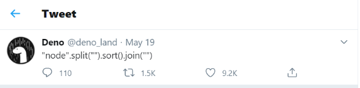
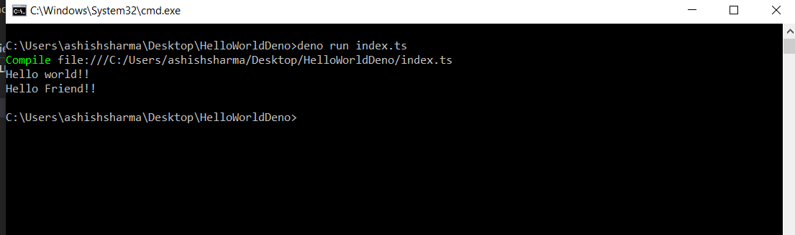

### Hello, Deno

Deno is a new platform for writing applications using JavaScript and TypeScript. It is based on the V8 JavaScript engine and the Rust.

Deno’s lowest level binding layer to the system is tied to promises (called **ops**). Deno is secure by default, provides first-class TypeScript support, has built-in utilities like a dependency inspector, and supports third-party modules such as **lodash** .


Btw, this is the best damn geeky one-liner code to explain what is Deno. Totally cool.





### Installation

Deno works on macOS, Linux, and Windows. Deno is a single binary executable and it has no external dependencies.

See all [installation](https://docs.deno.com/runtime/getting_started/installation/).

#### **Install Deno on Windows 10/8/7**

Launch **Windows PowerShell** and run the following command to install Deno on **Windows 10/8/7**


```
iwr https://deno.land/x/install/install.ps1 -useb | iex
```


#### **Install Deno on Linux and macOS**

Launch terminal and run the following command to install Deno on Linux and Mac


```
curl -fsSL https://deno.land/x/install/install.sh | sh
```


Open a new terminal and run `deno`. You should get a `>` prompt. Type `exit`.

After installing deno on your system we just need to create a simple **Hello World** program by using the following steps :

Step 1. Create a Folder as per your project name by using command prompt


```
mkdir HelloWorldDeno
```


Step 2. Create a typeScript file and name it **index.ts.**

Step 3. Add the following code in **index.ts.**


```ts

const helloWorld = (name: string = "world") => {
  console.log(`Hello ${name}!!`);
}

helloWorld();

helloWorld("Friend");

```


Step 4. Run the following project by using the following command


```
deno run index.ts
```

You can check the result here





Yupppp it works this is your first Deno program !!
