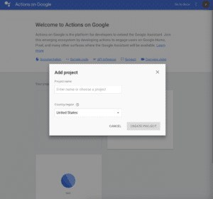
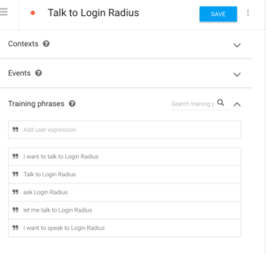
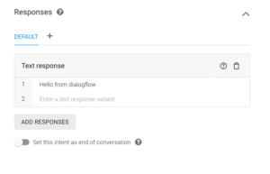

**Time Required :** less than 10 minutes.

**Technologies :** None.

**Prerequisites :** None.

This tutorial will go over how to configure the ‘Actions on Google’ console so that it can be used for your Google Assistant actions/events that can be accessed anywhere the Google Assistant is available from phones to Google Home products.

### **Steps**

1. Create an Actions project and a Dialogflow agent [here](https://console.actions.google.com/u/0/).
    1. Add/import project.
    

    2. Click on Skip(in the upper right corner) choosing a category and click Build -> Actions in the left nav to add your first actions.         
    
2. Configuration for your action intent in the dialogflow console.
    1. In the Intent section, enter your training phrases. Start with “talk to”, “speak to”, “ask” and etc, learn more [here.](https://developers.google.com/actions/localization/languages-locales)
    

    2. Enter the default text response. This will be the default response for your action until you link your account with LoginRadius and build your customized response. (This will return errors if you leave this empty, even if you handle the response in your code.)

By then, you should have finished the setup for google assistant.
