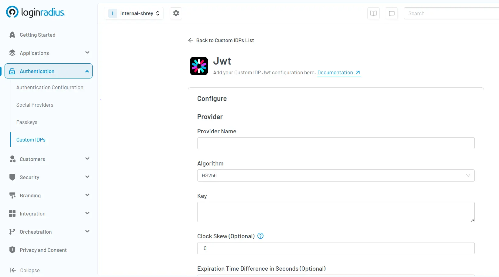

## Introduction

Ever wondered how apps like Spotify, Netflix, or Slack manage seamless login experiences across devices? Many of them use JWT, or JSON Web Tokens, a compact, stateless method for securely transmitting user identity and session data across services.

With JWT token authentication, identity information is embedded in a signed token, allowing you to maintain user sessions without server-side storage. This approach is highly scalable and ideal for modern architectures like SPAs, mobile apps, and microservices.

In this blog, we’ll walk you through what is JWT, why use it, and how to implement JWT authentication using LoginRadius. 

You’ll learn what JWT is, why it’s effective, and how it works in real-world applications. We'll cover both integration methods (IDX and Direct API), generating your signing key, managing sessions, storing the JWT token securely, and applying best practices throughout.

Whether you're a developer, product manager, or IAM architect, this guide offers a complete foundation for implementing JWT token authentication into your application stack.

## What is JWT?

[JSON Web Token (JWT)](https://www.loginradius.com/blog/engineering/jwt/) is an open standard (RFC 7519) used to transmit information securely between parties as a JSON object. It’s compact, self-contained, and digitally signed, making it a reliable format for authentication and authorization across modern applications.

A JWT consists of three parts:

1. **Header –** Contains metadata like the type of token and signing algorithm (e.g., HS256).

2. **Payload –** Stores the actual data or “claims,” such as user ID, roles, and token expiry.

3. **Signature –** A cryptographic hash that ensures the token hasn’t been tampered with.

*Example of a token structure:*

&lt;base64Header>.&lt;base64Payload>.&lt;signature>

## Why Use JWT?

* **Stateless Authentication**: No server-side session storage is needed — the token holds all necessary user info. 

* **Portable**: Works seamlessly across domains, services, and APIs. 

* **Scalable**: Ideal for microservices, SPAs, mobile apps, and serverless functions. 

* **Interoperable**: JWTs are supported across many languages and frameworks.

## How JWT Works?

1. A user logs in with credentials. 

2. Your app (or identity provider like LoginRadius) issues a signed JWT. 

3. The client stores the token and sends it with each request (usually in the Authorization header). 

4. The server validates the token’s signature and claims. 

5. If valid, access is granted — without any session stored on the backend.

JWT simplifies identity verification, especially when you're building apps that talk to APIs or need to scale without centralized session storage.

## JWT Authentication with LoginRadius: Overview 

LoginRadius provides robust support for JWT (JSON Web Token) authentication, which allows for flexible and secure access control across different digital platforms. Whether you're building a fully custom identity flow or using a pre-built interface, the platform supports various integration approaches depending on your architecture.

If you're looking to understand how to implement JWT token authentication effectively, LoginRadius offers two primary implementation models that cater to different levels of customization and control:

### 1. IDX Implementation – JWT through a Hosted Login Page

The IDX-hosted login approach enables secure, standards-compliant, JWT-based authentication without requiring you to build a custom login interface. This is a strategic option for fast, compliant, and user-friendly deployments.

* The Identity Experience Framework (IDX) comes with a fully custom branded hosted login page.

* Once the user logs in and gets enrolled, the user’s JWTs are automatically generated and issued. These tokens can be utilized for managing user sessions and accessing the APIs.

* This approach simplifies deployment without compromising on user experience and security standards.

### **Configuration Steps:**

1. Enable JWT Login

* Go to [authentication configuration settings](https://console.loginradius.com/authentication/authentication-configuration) and enable JWT Login in the Admin Console.

2. Specify your signing algorithm and expiry policy, and define your JWT Secret Key.

* Input a secure JWT signing key.

* Specify token expiry duration (e.g., 15–60 minutes)

* Select the desired algorithm —HS256 for symmetric signing (same key signs and verifies)

* RS256 for asymmetric signing, where LoginRadius securely stores the private key used to sign the JWT.

* Your app or backend service uses the public key to validate the token signature.

* LoginRadius provides a JWKS (JSON Web Key Set) endpoint to dynamically fetch and rotate public keys, ensuring trust without key exposure.

3. Update IDX Template for Callback

* Modify your IDX login page template to retrieve the JWT post-login. You can access the token via redirect URL parameters or secure JavaScript callbacks.

### Example Response:

{

  "access_token": "eyJhbGciOiJIUzI1NiIsInR...",

  "expires_in": 1800

}

This integration approach works best for all teams that want effective identity workflows without the complexity of building proprietary login screens, something that is crucial for customer portals, onboarding of mobile applications, and even managing access for business partners.

### 2. Direct API Implementation – Self Managed Login

If you’re building a custom login UI or working in a headless environment, LoginRadius lets you generate and handle JWTs directly through its [Authentication APIs](https://www.loginradius.com/docs/api/v2/customer-identity-api/). Here’s how you can programmatically perform token authentication using the classic method:

* For custom front-end applications, LR offers an API to authenticate users and issue JWT tokens.

* In response to the login request, the developers are provided with signed tokens that can be validated on the client’s side or by downstream services.

* This method is best fit for enterprise applications that have complex custom workflows or are designed to be embedded into other applications.

### **Configuration Steps:**

#### Step 1: Authenticate via API:

* Send a POST login request to the LR Authentication URL: 

    POST /identity/v2/auth/login

Include the user’s credentials (email + password) in the request body.

#### Step 2: Get JWT in Response

* If the user credentials are authentic, then the JWT token will be available in response.

{

 "access_token": "eyJhbGciOiJIUzI1NiIsInR5cCI6IkpXVCJ9...",

 "expires_in": 3600

}

#### Step 3: JWT Decoding and Validation

* Use any JWT library (e.g., jsonwebtoken for Node.js or pyjwt for Python) to decode the token.

* Validate the signature using your configured secret key.

* Confirm claims like exp, iat, aud, and iss.

#### Step 4: Set Custom Claims (Optional)

With LoginRadius, it is possible to customize the payload to include user roles and/or any additional metadata. You can set custom JWT claims on the Admin Console.

With this method, you have complete customization over login flows while using LoginRadius to issue signed JWTs for user session management.

**NOTE-** With either method, LoginRadius ensures that JWTs are securely signed, optionally short-lived, and compatible with standard token validation libraries, making integration seamless for everyone.

To get started with JWT implementation, you can[ read our complete developer documentation](https://www.loginradius.com/docs/single-sign-on/federated-sso/jwt-login/jwt-implementation-guide/). 

## Hosted Login vs Direct API

## What is Session Management and How It Works with JWT

[Session management ](https://www.loginradius.com/blog/identity/user-session-management/)is how your app keeps track of a user after they log in so they don’t have to prove who they are with every request.

In traditional apps, sessions are stored on the server using session IDs. Every time a request comes in, the server checks that session ID to verify the user.

In modern apps, especially SPAs and APIs, JWTs are used to manage sessions without needing server-side storage; this is called stateless session management. The token itself carries the user’s identity, roles, and expiration details. As long as the token is valid, the user stays logged in.

Good session management ensures:

*  Security against session hijacking

*  Fast user validation without hitting a database

*  Smooth experiences with token refresh strategies

## How LoginRadius Handles Session Management with JWT:

1. User Logs In 

    * LoginRadius returns an access token (JWT) and, optionally, a refresh token.
2. Client Stores the Token 

    * Access tokens are stored in memory, sessionStorage, or secure cookies. 

    * They’re sent on every request via the Authorization: Bearer header. 

3. Access Token Expiry 

    * These tokens are short-lived by design (e.g., 15–30 minutes). 

    * Once expired, the client can use the refresh token to request a new access token. 

4. Token Renewal 

    * LoginRadius validates the refresh token and issues a new JWT, i.e., no user re-authentication is needed. 

    * Refresh tokens can be revoked at any time.
5. Logout and Token Revocation Strategy

When the user logs out, both the access token and refresh token should be cleared from client storage.

* The refresh token can be explicitly revoked via the LoginRadius API, terminating the ability to renew sessions. 

* However, access tokens are stateless and cannot be revoked mid-lifecycle unless: 

    * You maintain a blacklist of token IDs (jti claims) and check them on each request. 

    * You use short-lived access tokens to limit exposure naturally. 

    * Or, you rotate your JWT signing key, invalidating all previously issued tokens. 

Combining these strategies gives you greater control over token misuse and enables a robust, enterprise-grade logout flow. 

## How to Store JWT Tokens?

When you implement JWT-based authentication, the client (browser or mobile app) needs a way to store the access token and, optionally, the refresh token after they are issued by the authentication server. This stored token is then attached to every subsequent request to prove the user's identity.

Choosing where to store the JWT is a crucial security decision. The most common storage options are:

* localStorage

* sessionStorage

* HTTP-only cookies

Each option has trade-offs between security, accessibility, and persistence, and the right choice depends on your application's architecture and threat model.

#### Recommended Storage Strategy

* Access Tokens 

    * For SPAs: store in memory or sessionStorage for short-term access 

    * If stored in the browser, protect against XSS 

* Refresh Tokens
    * Always store the JWT refresh token in HTTP-only secure cookies to prevent JavaScript access. This adds a critical layer of protection against XSS attacks.

    *  Combine with SameSite=Strict or SameSite=Lax attributes to mitigate CSRF risks and ensure the JWT refresh token is only sent in intended contexts.

## Best Practices for Storing JWTs

1. Never store sensitive tokens (like refresh tokens) in localStorage or sessionStorage.

2. Use Secure and HttpOnly flags with cookies to prevent JavaScript access and ensure transmission only over HTTPS.

3. Set the SameSite=Strict or Lax attribute on cookies to protect against CSRF.

4. Use short-lived access tokens and rotate refresh tokens regularly.

5. Implement CSP (Content Security Policy) to reduce XSS risk.

6. Avoid storing any tokens in frontend code (e.g., hardcoded in JS files).

## Conclusion

JWT authentication with LoginRadius offers a modern, stateless approach to managing sessions across distributed systems. The IDX integration is ideal for rapid deployment, while the Direct API model is best for organizations needing deep customization and integration flexibility.

With robust token signing, refresh capabilities, and centralized control, LoginRadius provides a future-ready foundation for secure, scalable identity architecture. [Contact us](https://www.loginradius.com/contact-us?utm_source=blog&utm_medium=web&utm_campaign=how-to-integrate-jwt) to know more about JWT authentication and implementation guide. 

## FAQs

### 1. What is JWT authentication used for?
**A:** JWT authentication securely verifies user identities, enabling stateless session management across web, mobile apps, and microservices without server-side session storage.

### 2. How does LoginRadius simplify JWT integration?
**A:** LoginRadius simplifies JWT integration by offering hosted [IDX login pages ](https://www.loginradius.com/docs/single-sign-on/federated-sso/jwt-login/jwt-implementation-guide/)and direct API-based authentication methods, enabling rapid deployment and deep customization.

### 3. Is JWT authentication secure?
**A:** Yes, JWT authentication is secure when implemented with best practices like short-lived tokens, secure storage methods, signature validation, and refresh token rotation.

### 4. Can JWT tokens be revoked with LoginRadius?
**A:** Yes, LoginRadius allows[ revocation of JWT](https://www.loginradius.com/docs/api/v2/customer-identity-api/refresh-token/revoke-refresh-token/?q=revoke+jwt) refresh tokens explicitly, and supports strategies like short-lived tokens and key rotation to manage token lifecycles securely.