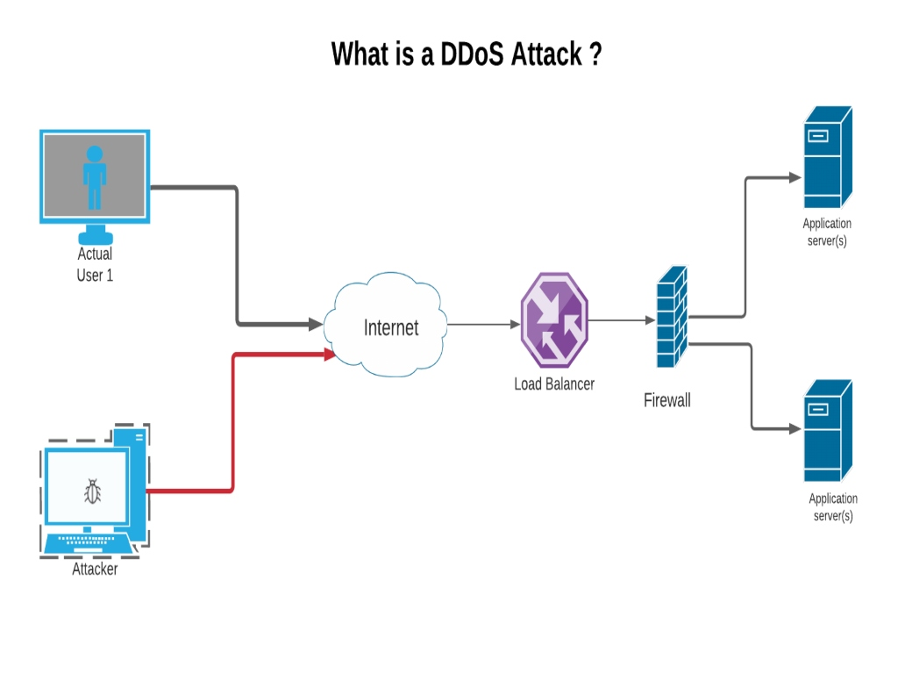
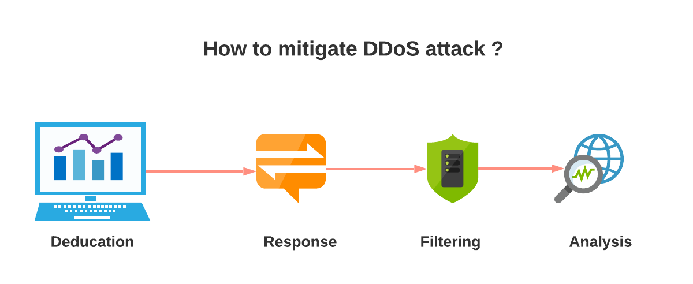

Did you know that in only a few minutes, a DDoS attack can bring your website down? Hackers are targeting your site and overloading your network and your server. Your website becomes unresponsive, unavailable and can even go entirely offline. We'll show you how DDoS attacks can be avoided.

## What is DDoS Attack?



A Distributed Denial of Service (DDoS) is a targeted [cyber attack on a website](https://www.loginradius.com/blog/identity/2019/10/cybersecurity-attacks-business/) or device where a malicious attacker's flood of traffic is sent from single or multiple sources. The primary purpose of DDoS is to make a machine or network resource unavailable to its genuine users by temporarily or disrupting the services of a host connected to the Internet. If we do not use appropriate security practices or tools, it makes your application into a non-functional situation.

The malicious attacker uses multiple compromised computer systems or devices or IoT devices for the attack. These all compromised devices make the DDoS attacks more effective.

## What is DDoS mitigation?
DDoS mitigation is a process in which we have used a set of techniques or tools for minimizing or mitigating the impact of distributed denial-of-service (DDoS) attacks on the targeted servers or networks. 


## Types of DDoS Attacks

### 1. Volume Based Attacks
The Volume Based Attack DDoS attack is the most common DDoS attack. An attacker uses multiple methods to generate massive traffic volumes to overwhelms a machine's network bandwidth because of creating massive volume traffic that makes it impossible for legitimate traffic to flow into or out of the targeted site. The machine continually has to check the malicious data requests and has no room to accept legitimate traffic. We can detect this type of attack easily.

### 2. Protocol Attacks 
The Protocol attacks target Layer 3 and Layer 4. Attackers use malicious connection requests for consuming the processing capacity of network infrastructure resources like servers, firewalls, and load balancers.

An SYN flood (half-open attack) is the most common way; in this attack, the attacker sends repeated initial connection requests and overwhelms all available ports on a targeted server machine or device.

### 3. Application Layer Attacks

The Application attacks target Layer 7, which is the topmost layer in the OSI network model. This layer is closest to the end-user, which means both the OSI application layer and the user interact directly with the software application. These attacks are typically small in volume compared to the other layers attacks, so these attacks are not easy to catch, i.e., a small number of HTTP requests on a login page.

## DDoS attack examples

1. In September 2016 - An attack on the Internet of Things (IoT) devices by Mirai malware impacted Internet platforms and services (Brian Krebs, DNS solution provider Dyn, etc.). 
Here is the list of [sites or services](https://en.wikipedia.org/wiki/2016_Dyn_cyberattack#Affected_services) (Github, Twitter, etc.) were unavailable in Europe and North America.

2. In Feb 2014 - According to a report on Gigaom, Cloudflare datacenters hit by the world's largest distributed denial-of-service attack (DDoS) in Europe and the U.S. This DDoS attack estimated at approximately 400 gigabits per second of traffic.

4. In February 2018 - A most potent distributed denial-of-service attack (DDoS) on the Developers platform GitHub. This DDoS attack estimated approx [1.35 terabits](https://www.wired.com/story/github-ddos-memcached/) per second and lasted for roughly 20 minutes.

4. In February 2020 - Amazon Web Services was hit by a powerful gigantic DDoS attack. The attack was running for three days and was estimated at approximately 2.3 terabytes per second.


## Best Practices for Preventing DDoS attacks



### 1. Traffic Monitoring 
Application traffic monitoring is essential. We can identify most of the attacks using the proper monitoring. Commonly DDoS attacks are made with high volume traffic but DDoS attacks could be possible with a single vulnerable HTTP endpoint. 

Whenever traffic exceeds a defined threshold, then you should get some alert or notification. The best practice is to have the proper configuration for the alerting in your monitoring tools. It helps you identify the DDoS attack as early as possible and mitigate damage.

### 2. Organize a DDoS Attack Response Plan

According to organizations size and policies, multiple teams have different responsibilities in infrastructure management. The DDoS attacks happen suddenly and should document the steps that need to follow.

During the DDoS attack, first, you need to think about minimizing the impact on your application. Team responsibilities for key team members to ensure the organized reaction to the attack should be clear and the first step is defining how it will end.

**Create a checklist**: Define all the processes and steps in a list, like what tools you will use, who is the right person for contact.

**Communication**: You should correctly organize all communications and well-defined. 

**Responsibility**: Documente all the team member's responsibilities and their reaction. 

### 3. Activate a WAF
A Web Application Firewall (WAF) is a set of rules or policies that helps protect web applications or APIs from malicious traffic. WAF sits between an application and the HTTP traffic and filters the common web exploits that can affect availability.

There are various WAF solutions available, but you need to analyze which WAF solution is suitable for your application.


### 4. Rate Limit
Attackers can make so many [repeated calls on the APIs](https://www.loginradius.com/blog/engineering/best-practice-guide-for-rest-api-security/). It can make resources unavailable to its genuine users. A rate limit is the number of API calls or requests that a user can make within a given time frame. When this limit is exceeded, block API access temporarily and return the 429 (too many requests) HTTP error code.

I m adding node js examples to implement the rate limit. multiple npm packages are available for node js

 **NodeJs**

```javascript

import rateLimit from 'express-rate-limit';

export const apiRatelimit = rateLimit({
  windowMs: 60 * 60 * 1000, // 1 hrs in milliseconds
  max: 100,
  message: 'You have exceeded the 100 requests in 1 hrs limit!', 
  headers: true, // it will add X-RateLimit-Limit , X-RateLimit-Remaining and Retry-After Headers in the request 
});

//  you can add this in the middleware. it will apply a rate limit for all requests 
app.use(API rate limit);
```


### 5. Passive cache
Active cache means if the service first attempts to read from the cache backend and falls back to reading from the actual source. The service is not dependent on requesting the data from the real upstream server. A cache backend is a key-value store (e.g., Redis) or In-Memory cache, and the actual source of data is SQL, MongoDB, etc.

Passive cache architecture ensures high volume traffic never hits to actual server or service.

I m adding node js examples to implement the passive cache. multiple npm packages are available for node js

 **NodeJs**

```javascript

import nodeCache from "node-cache";

const myCache = new nodeCache();
ap
// set object in the cache 

obj = { userid: 909887, name: "example" };

success = myCache.set( "userKey", obj, 600 ); // ttl is 600 seconds 


//read object from the cache 
value = myCache.get( "userKey" );
if ( value == undefined ){
  // handle miss!
}

```

### 6. Cloud-Based DDoS Mitigation

Several vendors provide DDoS mitigation services as software as a service model. They have charged a license fee the first time then charge according to service usages. 

The Cloud-based DDoS mitigation solution has a lot of advantages. They have dedicated staff, better reaction time, High network bandwidth than private networks to perform better in case of volume-based DDoS attack. Multi cross-region availability with auto replica or backup so you can switch to your application load next available region without impacting your actual users, updated policies or rule set, a better experience for handling DDoS attacks.


## Conclusion

The DDoS attacks are increasing day by day. Organizations need to prepare for any attack. If the organization does not prepare in advance and any attack happens, that case damage control can take months and impact the organization's reputation. 

LoginRadius has all processes and policies well defined, 24X7 monitoring by delegating security team. Please see [Security Overview](https://www.loginradius.com/docs/security/overview/) document for more information.
