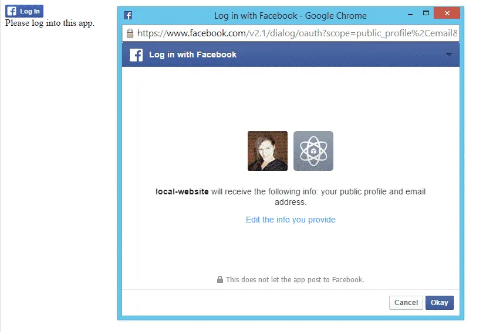

In this post I will show you how easy it is to implement Facebook social login to a web page using Facebook’s JavaScript SDK. The nice thing about Facebook social login is the great documentation and instructions already provided at  [Facebook Login for the Web](https://developers.facebook.com/docs/facebook-login/login-flow-for-web/v2.2). There is also a code snippet that is provided to you by Facebook to implement their login system. I have gone ahead and customized this code and have provided a codepen [here](http://codepen.io/zoie-loginradius/pen/JoLYrJ) which I will explain.

The first thing you’ll need to do is create a Facebook app since an app Id is required to implement login using Facebook. You can create a facebook app by going to  [http://developers.facebook.com](http://developers.facebook.com/). You'll notice in the codepen nothing is displayed since I have not added a app Id. You'll need to remember to replace this placeholder with your own Facebook app Id once you have created your Facebook app.

Next, we’ll implement login using Facebook. All we need to do is copy and paste the code provided to us by Facebook to create the Facebook social login and replace the placeholder with your own Facebook app id. I will be explaining the same code with my customization provided in the codepen below.

Let's add the Facebook login interface. You'll want to place this code in the body section of your html code.

```js
<!--


-->
```

Next, you'll notice this section of code at the end of the JavaScript section. This code snippet loads the Facebook SDK JavaScript asynchronously. It also provides the JavaScript library which is used to render your Facebook login interface.

```javascript
// Load the SDK asynchronously
(function(d, s, id) {
    var js, fjs = d.getElementsByTagName(s)[0];
    if (d.getElementById(id)) return;
    js = d.createElement(s); js.id = id;
    js.src = "//connect.facebook.net/en_US/sdk.js";
    fjs.parentNode.insertBefore(js, fjs);
}(document, 'script', 'facebook-jssdk'));
```

Now we just need to replace the app id placeholder with the app id of your app you created in the beginning. You’ll find the placeholder in this line appId : '{your-app-id}'. This function is just above loading JavaScript asynchronously.

```javascript
window.fbAsyncInit = function() {
    FB.init({
        appId : '{your-app-id}',
        cookie : true, // enable cookies to allow the server to access the session
        xfbml : true, // parse social plugins on this page
        version : 'v2.1' // use version 2.1
    });

    // Now that we've initialized the JavaScript SDK, we call FB.getLoginStatus().
    // This function gets the state of the person visiting this page.
    FB.getLoginStatus(function(response) {
        statusChangeCallback(response);
    });
};
```
Next we'll add the function that handles the response and alters the page contents based on the type of response. I have this function located at the very top of the scripts section.

```javascript
// This is called with the results from from FB.getLoginStatus().
function statusChangeCallback(response) {
    // The response object is returned with a status field that Let's the app know the current login status of the person.
    if (response.status === 'connected') {
        console.log('Welcome! Fetching your information.... ');
        FB.api('/me', function(response) {
            console.log('Successful login for: ' + response.name);
            document.getElementById('status').innerHTML = 'Thanks for logging in, ' + response.name + '!';
        });
    } else if (response.status === 'not_authorized') {
        // The person is logged into Facebook, but not your app.
        document.getElementById('status').innerHTML = 'Please log ' + 'into this app.';
    } else {
       // The person is not logged into Facebook, so we're not sure if they are logged into this app or not.
       document.getElementById('status').innerHTML = 'Please log ' + 'into Facebook.';
    }
}
```

As you can see, the above function receives a response variable and checks it's status. If it is connected it fetches the logged in users info and outputs this information in the console of your browser, that area is where you could build more onto this script to handle the data. You'll also notice the not\_authorized status. When the login is not authorized, this function changed the html on your page to ask you to log in. But how does this function get used? In this next function this is handled when someone clicked on the Facebook button on the page. Notice the onlogin="checkLoginState(); in your body html code for the Facebook button.

```javascript
// This function is called when someone finishes with the Login Button.
function checkLoginState() {
    FB.getLoginStatus(function(response) {
        statusChangeCallback(response);
    });
}
```

Now if you save this page as index.html and open it in a browser you should see the Facebook Login button. You can use the code provided by facebook at the link listed above or you can used the codepen code that I have altered to make it a bit shorter for explanation.

**Facebook Page example**



Log In and look at the console output. You’ll now see some basic info including id, email, first\_name, gender, last\_name, link, locale, name, timezone, updated\_time, verified

That is all there is to it. Of course, there are many more scopes you can use which allow you to collect more data currently this script has a scope of public\_profile and email, features and API calls you can play with to create your desired app just explore the Facebook documentation to discover all these features.

Want to extend your social systems with additional provider functionality check out these posts on [LinkedIn social login](/integrate-linkedin-social-login-website/ "Integrating LinkedIn Social Login on a Website") and [Twitter social login](/integrating-twitter-social-login/ "Integrating Twitter Social Login").
