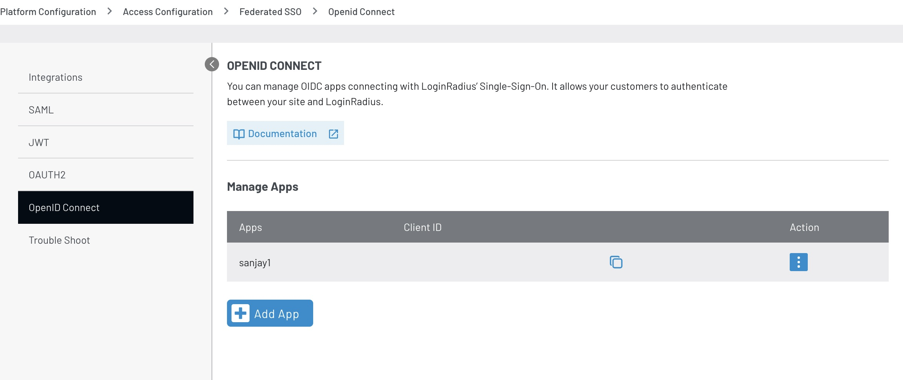
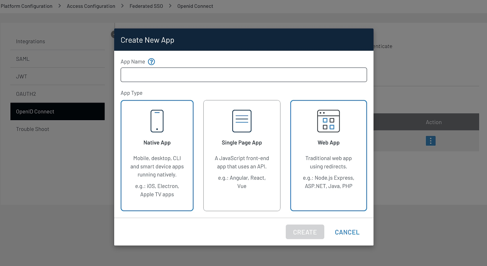
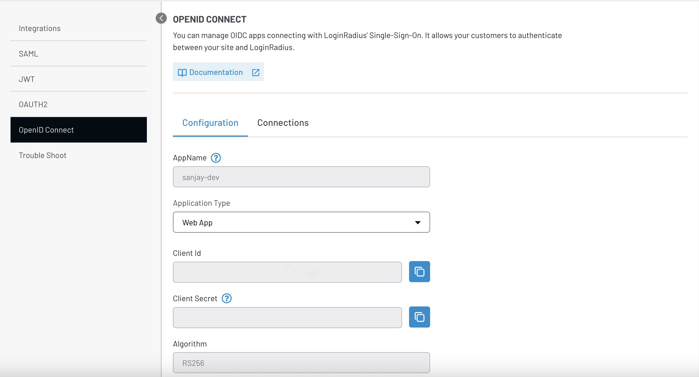
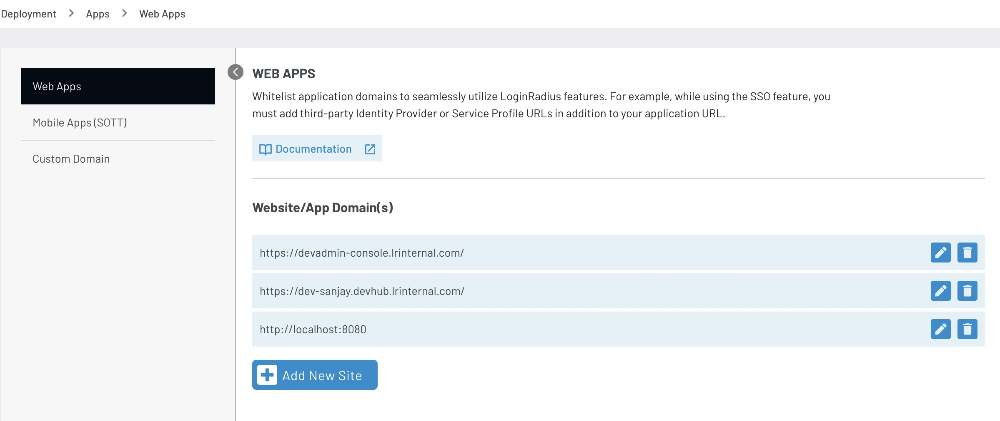

First, let's understand:

- What is SSO, and why should you use it?
- What is OIDC, and why is it used for authentication?
- How can you leverage LoginRadius as an identity provider?

__SSO stands for Single Sign-On__. It's an authentication process that allows a user to access multiple applications or systems with one set of login credentials (username and password). Instead of requiring users to log in separately to each application, SSO enables them to log in once and gain access to all the connected systems without needing to re-enter their credentials.

__OpenID Connect (OIDC)__ is a protocol that builds on OAuth 2.0 to ensure secure user authentication and authorization. It adds an identity layer to OAuth 2.0, allowing applications to confirm a user's identity and gather basic profile information. OIDC utilizes JSON Web Tokens (JWTs) for these functions, aligning with OAuth 2.0's token acquisition methods. This integration enables seamless user authentication across different platforms, supporting features like single sign-on, where users can access multiple applications with one set of credentials managed by an identity provider.

## What is LoginRadius CIAM?

LoginRadius is a high-performance, scalable identity and access management platform focused on customer-facing use cases. It offers comprehensive features and capabilities to help you implement user authentication and authorization and manage user data with built-in workflows and security controls. 

On these lines, LoginRadius offers built-in support for OIDC and the use of OIDC to implement SSO.

First, you need to create an OIDC application in LoginRadius to tailor user claim fields effortlessly. You can fine-tune these customizable user claims through LoginRadius' user-friendly interface. Subsequently, you can seamlessly integrate these claims into the token, enabling streamlined extraction and utilization within the application ecosystem.

In essence, LoginRadius facilitates the setup of OIDC applications and offers customization capabilities through its intuitive interface. This ensures efficient management of user claims, ultimately contributing to a more personalized and secure authentication experience.

After setting up the OIDC app from the LoginRadius dashboard, you'll use the [`go-oidc` library](https://github.com/coreos/go-oidc) to configure our provider further and configure the oidc connect.

## Setting Up OIDC Application in LoginRadius

Go to [OIDC Application Configuration](https://adminconsole.loginradius.com/platform-configuration/access-configuration/federated-sso/openid-connect) and click on **Add App button**



Enter the **App name** and click one of the following:

**Native App**, **Single page App** or **Web App** according to your application.




After clicking the **Create** button, you'll get the OIDC application configuration page. This page contains details like your application's **Client ID** and **Client Secret**, which are necessary for setting up the OIDC provider and configuration when you code in Golang.



#### Upon reaching the configuration page for your OIDC Application, you'll encounter a variety of fields ripe for customization:

1) **Algorithm**: Presently, we offer support for **rs256**.
2) **Grant Type**: Options include authorization code, implicit, password creds, etc.
3) You can tailor settings for **Token Expiry**, **Refresh Token**, and **TTL** to suit your needs.
4) **Data Mapping**: Define fields or properties to be included in the data response.
5) **Metadata**: Incorporate static, non-profile values into the data response.
6) Define the Scope for Management API.
   
This array of configurable options empowers you to fine-tune your OIDC Application according to your specific requirements.

## Whitelisting the Domain of Your Application

To ensure seamless redirection of requests and successful callbacks to your endpoint, add your application's domain to the whitelist. This will authorize the redirection process and prevent failures when calling the callback endpoint.
 
#### To access Web Apps in Deployment, follow these steps:

1) Navigate to the Deployment section from the Dashboard.
2) Once in Deployment, select the Apps tab.
3) From there, choose Web Apps.

#### Now, to add a new site:

1) Click on the __Add New Site__ button.
2) Enter the domain name of the website (example: "`https://localhost:8080`").




### Whitelisting Domain from OIDC Application Configuration

LoginRadius lets you uniquely identify the redirect URLs for individual OIDC applications:

* When setting the configuration of the OIDC Application, you can specify the redirect URL of your backend,
and it will be whitelisted.
* The field name is **Login Redirect URL**.

## Setting Up the Provider Object and the OAuthconfig with the Loginradius OIDC App Credentials

```js
provider, err := oidc.NewProvider(ctx, "`https://api.loginradius.com/{oidcappname}")`
if err != nil {
    // handle error
}

// Configure an OpenID Connect aware OAuth2 client.
oauth2Config := oauth2.Config{
    ClientID:     your-oidc-clientID,
    ClientSecret: your-oidc-clientSecret
    RedirectURL:  redirectURL,

    // Discovery returns the OAuth2 endpoints.
    Endpoint: provider.Endpoint(),

    // "openid" is a required scope for OpenID Connect flows.
    Scopes: []string{oidc.ScopeOpenID, "profile", "email"},
}
```

When setting up a new provider, you'll need to input the LoginRadius OIDC App URL, typically in this format: `https://{siteUrl}/service/oidc/{OidcAppName}`

To seamlessly integrate this with your Go backend, create two essential APIs for setting up and configuring `go-oidc`:

1) **Login Endpoint**: This endpoint initiates the authentication process and redirects to the callback endpoint with the authorization code.

2) **Callback Endpoint**: Here, the authorization code received from the login endpoint is exchanged for an access token. Additionally, this endpoint extracts user claims from the access token.

By establishing these APIs, your Go backend efficiently handles the authentication flow, ensuring a smooth user experience while securely managing user identity and access.

## Handle the Callback Hit 

Handle the callback hit that exchanged the authorization token for the access token:

```js
var verifier = provider.Verifier(&oidc.Config{ClientID: clientID})

func handleOAuth2Callback(ctx *gin.context) {
    // Verify state and errors.
    authCode := ctx.query("code")

    oauth2Token, err := oauth2Config.Exchange(ctx, authCode)
    if err != nil {
        // handle error
    }

    // Extract the ID Token from the OAuth2 token.
    rawIDToken, ok := oauth2Token.Extra("id_token").(string)
    if !ok {
        // handle missing token
    }

    // Parse and verify ID Token payload.
    idToken, err := verifier.Verify(ctx, rawIDToken)
    if err != nil {
        // handle error
    }

    // Extract custom claims
    var claims struct {
        Email    string `json:"email"`
        Verified bool   `json:"email_verified"`
    }
    if err := idToken.Claims(&claims); err != nil {
        // handle error
    }
}
```

For both endpoints, let's review a sample backend server with implementation in [Gin Golang](https://github.com/gin-gonic/gin).

## Gin Golang Code 

For OIDC integration with the Go backend, you'll implement it using the [coreos/go-oidc](https://github.com/coreos/go-oidc) library (feel free to check it out). This library provides comprehensive support for OIDC, allowing to easily verify tokens, extract user claims, and validate ID tokens. Its features ensure secure authentication and seamless integration with various OIDC providers.

With the `go-oidc` library, you can efficiently implement OIDC authentication in the Go backend, guaranteeing users a smooth and secure authentication process.

```bash
go get github.com/coreos/go-oidc/v3/oidc
```

```javascript
package main

import (
	"encoding/json"
	"fmt"
	"io"
	"log"
	"net/http"
	"os"

	"github.com/coreos/go-oidc/v3/oidc"
	"github.com/gin-gonic/gin"
	"golang.org/x/oauth2"
)

// Define global OAuth2 configuration and OIDC provider.
var (
	oauthConfig = &oauth2.Config{
		ClientID:     "your-client-id", // Replace with your LoginRadius Client ID
		RedirectURL:  "http://localhost:8080/api/callback",
		ClientSecret: "your-client-secret", // Replace with your LoginRadius Client Secret
		Scopes:       []string{"user"},
	}
	globalProvider   *oidc.Provider
	globalOuthConfig *oauth2.Config
)

// Server struct holds interfaces like HTTP server, DBHelper, ServerProvider, MongoDB client, etc.
type Server struct {

}

// InitializeOAuthConfig sets up the global OAuth2 configuration and OIDC provider.
func InitializeOAuthConfig() {
	// Create a new OIDC provider using the OAuth2 endpoint and OIDC provider URL.
	provider, err := oidc.NewProvider(context.Background(), "https://<siteUrl>/service/oidc/<OidcAppName>") // Replace with your OIDC Provider URL
	if err!= nil {
		log.Fatalf("Failed to create new provider: %v", err)
	}
	globalProvider = provider

	// Set up the OAuth2 configuration with the client ID, secret, redirect URL, and scopes.
	oauth2Config := &oauth2.Config{
		ClientID:     oauthConfig.ClientID,
		ClientSecret: oauthConfig.ClientSecret,
		RedirectURL:  oauthConfig.RedirectURL,
		Endpoint:     provider.Endpoint(),
		Scopes:       []string{oidc.ScopeOpenID, "profile", "email"},
	}
	globalOuthConfig = oauth2Config
}

// StartLoginProcess initiates the login process by redirecting the user to the OIDC provider.
func StartLoginProcess(ctx *gin.Context) {
	// Generate the authorization URL for the OIDC provider.
	authURL := globalOuthConfig.AuthCodeURL("state", oidc.Nonce(""))
	// Redirect the user to the OIDC provider for authentication.
	http.Redirect(ctx.Writer, ctx.Request, authURL, http.StatusFound)
}

// HandleCallback processes the callback from the OIDC provider after the user has authenticated.
func HandleCallback(ctx *gin.Context) {
	// Retrieve the authorization code from the query parameters.
	code := ctx.Query("code")

	// Exchange the authorization code for an access token.
	oauth2Token, err := globalOuthConfig.Exchange(ctx, code)
	if err!= nil {
		log.Printf("Error exchanging code for token: %v", err)
		return
	}

	// Extract the ID token from the OAuth2 token.
	rawIDToken, ok := oauth2Token.Extra("id_token").(string)
	if!ok {
		log.Println("Missing ID token")
		return
	}

	// Verify the ID token using the OIDC provider.
	var verifier = globalProvider.Verifier(&oidc.Config{ClientID: globalOuthConfig.ClientID, SkipClientIDCheck: true})

	idToken, err := verifier.Verify(ctx, rawIDToken)
	if err!= nil {
		log.Printf("Error verifying ID token: %v", err)
		return
	}

	// Extract claims from the verified ID token.
	var claims interface{}
	if err := idToken.Claims(&claims); err!= nil {
		log.Printf("Error extracting claims: %v", err)
		return
	}

	// Respond with a success message.
	ctx.JSON(http.StatusOK, gin.H{"message": "success"})
}

// InjectRoutes sets up the routes for the application, including login and callback endpoints.
func (srv *Server) InjectRoutes() *gin.Engine {
	router := gin.Default()

	api := router.Group("/api")
	{
		// Define the login route that redirects users to the OIDC provider for authentication.
		api.GET("/login", StartLoginProcess)
		// Define the callback route that handles the callback from the OIDC provider.
		api.GET("/callback", HandleCallback)
	}

	return router
}

func main() {
	// Initialize the OAuth2 configuration and OIDC provider.
	InitializeOAuthConfig()
	// Create a new server instance.
	server := &Server{}
	// Inject routes into the Gin engine.
	router := server.InjectRoutes()
	// Start the HTTP server.
	log.Fatal(http.ListenAndServe(":8080", router))
}
```

The process described involves several key steps in setting up an OAuth2 flow with OpenID Connect (OIDC) for user authentication.

Here's a brief overview of what was done in the code:

### Initialization of OIDC Provider and OAuth2 Configuration

* The OIDC provider is initialized using the `oidc.NewProvider` function, which requires the OAuth2 endpoint and the OIDC provider's URL. This step is crucial for establishing a connection with the OIDC provider, enabling the application to authenticate users through the provider.

* The OAuth2 configuration (`oauthConfig`) is set up with essential details such as the client ID, client secret, redirect URL, and scopes. These credentials are specific to the OIDC application registered with the provider (e.g., LoginRadius). The redirect URL is where the provider will send the user after authentication, and the scopes define the permissions requested from the user.

### Setting Up the Callback Endpoint

* A callback endpoint is defined in the application, typically as `/api/callback`. This endpoint handles the callback from the OIDC provider after the user has been authenticated.
* When the user authenticates successfully, the OIDC provider redirects the user back to the application with an authorization code included in the query parameters.
* The application then exchanges this authorization code for an access token by calling the exchange method on the OAuth2 configuration object. This exchange process is handled securely by the OAuth2 library, ensuring that the application receives a valid access token.

### Verifying the Access Token and Extracting User Claims
* Once the access token is obtained, the application extracts the ID token from it. The ID token contains claims about the authenticated user, such as their name, email, and roles.
* The ID token is then verified using the OIDC provider's verifier. This step ensures that the token is valid and has not been tampered with. Verification involves checking the token's signature and possibly other claims to ensure it matches the expected values.
* After verification, the application extracts the claims from the ID token. These claims can be used to identify the user within the application, personalize the user experience, or enforce access control based on the user's roles or permissions.

This process leverages the security and standardization provided by OIDC and OAuth2 to implement a secure authentication flow. By following these steps, the application can authenticate users through LoginRadius OIDC provider, ensuring that user credentials are managed securely and that the application can trust authenticated users' identities.

## Conclusion

In this tutorial, you have learned how to implement OIDC SSO with LoginRadius as the Identity Provider. You have also built a simple Golang backend with Gin to understand the implementation.