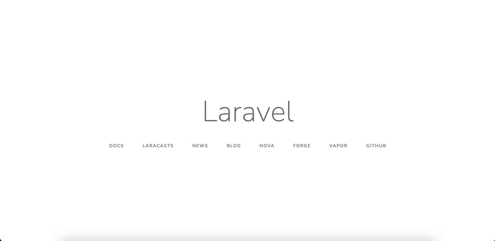
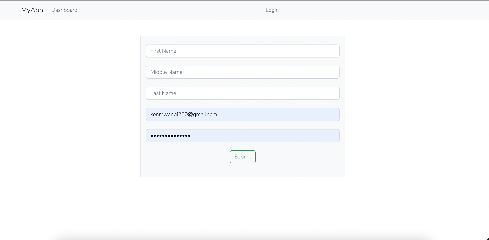
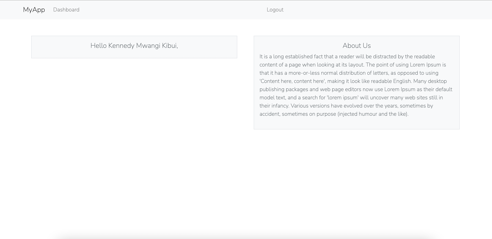

In this article, we will implement LoginRadius on a Laravel project. You can jump ahead and get the code used to create this guide on this [GitHub repository](https://github.com/Rose-stack/Laravel-User-Authentication-with-LoginRadius-API).

## Prerequisites

To continue in this article, it is helpful to have the following:

- [PHP](https://www.php.net/manual/en/install.php) Installed on your computer.
- [Composer](https://getcomposer.org/download/) installed on your computer.
- Basic knowledge of working with Laravel.
- Basic knowledge of sending CURL requests in PHP.

## Overview

- [Prerequisites](#prerequisites)
- [Overview](#overview)
- [Setting up a LoginRadius account](#setting-up-a-loginradius-account)
- [Setting up Laravel project](#setting-up-laravel-project)
- [Installing LoginRadius package for Laravel](#installing-loginradius-package-for-laravel)
- [Implementing signup via LoginRadius](#implementing-signup-via-loginradius)
  - [Create Signup routes](#create-signup-routes)
  - [Create SignUp View](#create-signup-view)
  - [Set up the Signin AuthController](#set-up-the-signin-authcontroller)
  - [Create Redirect Dashboard Page](#create-redirect-dashboard-page)
  - [Create logout funtionality](#create-logout-funtionality)
  - [Testing the SignIn endpoint](#testing-the-signin-endpoint)
- [Implementing login via LoginRadius](#implementing-login-via-loginradius)
  - [Adding the login AuthController](#adding-the-login-authcontroller)
  - [Testing login route](#testing-login-route)
- [References](#references)

## Setting up a LoginRadius account

To use LoginRadius with Laravel, you need LoginRadius credentials, such as an API key and an API secret. To get this information proceed to the LoginRadius authentication [page](https://accounts.loginradius.com/auth.aspx) and [create an account](https://accounts.loginradius.com/auth.aspx?return_url=https://dashboard.loginradius.com/login) with LoginRadius.

Once authenticated, you will be directed to the LoginRadius dashboard:

- Create a new app from [here](https://dashboard.loginradius.com/apps).

- Enter an application name, and ensure that it is specific.

- For the URL, enter `http://localhost`.

- Select the nearest region from where you are based on the options. Then submit.

- Once the account has been created, you will be able to access your `APP NAME`, `API KEY`, `API SECRET` from [here](https://dashboard.loginradius.com/configuration). The *APP NAME* *API KEY*, *API SECRET* will be needed in later steps.

## Setting up Laravel project

Let's dive in and use LoginRadius with Laravel. Proceed to your preferred working directory. Then download the Laravel installer using composer:

```bash
composer global require "laravel/installer"
```

Run the following command from your terminal to bootstrap the application:

```bash
laravel new login_radius_auth
```

Change directory to the newly created folder:

```bash
cd login_radius_auth
```

After the installation has been done, start the development server by running:

```bash
php artisan serve
```

On the default port *, i.e. 8000*, the below default page will be loaded:



The server is ready to execute the Laravel authentication code.

## Installing LoginRadius package for Laravel

The LoginRadius package will be useful in creating SOTT (Secure One Time Token) using Laravel.

To install it, open a new tab on the terminal, ensure you are on the project directory and run the below command:

```bash
composer require loginradius/php-sdk:11.4.0
```

## Implementing signup via LoginRadius

### Create Signup routes

Navigate to the `routes/web.php` file and add a route for the `register` endpoint as below:

```php
Route::get('/register',function () {
    return view('register');
});
```

Create a post handler for registering users inside the `routes/web.php` file:

```php
Route::post('/register','AuthController@register');
```

### Create SignUp View

Inside the *resources/views/register.blade.php* file, create a view for signup:

```html
<!DOCTYPE html>
<html lang="{{ str_replace('_', '-', app()->getLocale()) }}">

<head>
    <meta charset="utf-8">
    <meta name="viewport" content="width=device-width, initial-scale=1">

    <title>Register</title>

    <!-- Fonts -->
    <link href="https://fonts.googleapis.com/css2?family=Nunito:wght@200;600&display=swap" rel="stylesheet">
    <link href="https://cdn.jsdelivr.net/npm/bootstrap@5.2.1/dist/css/bootstrap.min.css" rel="stylesheet"
        integrity="sha384-iYQeCzEYFbKjA/T2uDLTpkwGzCiq6soy8tYaI1GyVh/UjpbCx/TYkiZhlZB6+fzT" crossorigin="anonymous">
    <!-- Styles -->
    <style>
        html,
        body {
            background-color: #fff;
            color: #636b6f;
            font-family: 'Nunito', sans-serif;
            font-weight: 200;
            height: 100vh;
            margin: 0;
        }
    </style>
</head>

<body>
    <nav class="navbar navbar-expand-lg navbar-light bg-light">
        <div class="container">
            <a class="navbar-brand" href="#">MyApp</a>
            <div class="collapse navbar-collapse" id="navbarSupportedContent">
                <ul class="navbar-nav mr-auto">
                    <li class="nav-item active">
                        <a class="nav-link" href="/">Dashboard</a>
                    </li>
                </ul>
                <ul class="navbar-nav mx-auto">
                    <li class="nav-item">
                        <a class="nav-link" href="/login">Login</a>
                    </li>
                </ul>
            </div>
        </div>
    </nav>

    <div class="container">
        @if (isset($status))
        <div class="alert alert-info">
            {{ $status ?? ''}}
        </div>
        @endif
        <div class="px-4 mt-5 mb-5">
            <div class="row gx-5">
                <div class="mx-auto" style="width:50%">
                    @if (isset($validation_error))
                    <div class="alert alert-danger">
                        {{ $validation_error ?? ''}}
                    </div>
                    @endif
                    <div class="p-3 border bg-light text-center">
                        <form action="{{url('register')}}" method="post">
                            @csrf
                            <div class="form-group mb-4 mt-2">
                                <input type="text" name="first_name" placeholder="First Name" class="form-control" />
                            </div>
                            <div class="form-group mb-4 mt-2">
                                <input type="text" name="middle_name" placeholder="Middle Name" class="form-control" />
                            </div>
                            <div class="form-group mb-4 mt-2">
                                <input type="text" name="last_name" placeholder="Last Name" class="form-control" />
                            </div>
                            <div class="form-group mb-4 mt-2">
                                <input type="email" name="email" placeholder="Your Email" class="form-control" />
                            </div>
                            <div class="form-group mb-4 mt-2">
                                <input type="password" name="password" placeholder="Your password"
                                    class="form-control" />
                            </div>
                            <div class="form-group mb-4 mt-2">
                                <button type="submit" class="btn btn-outline-success btn-block">Submit</button>
                            </div>
                        </form>
                    </div>
                </div>
            </div>
        </div>
    </div>
    </div>
</body>

</html>
```

From the above, you have a signup form with *first name*, *last name*, *middle name*, *email*, and *password* fields.

### Set up the Signin AuthController

Create the `AuthController` in the `app/Http/Controllers/AuthController.php` file as follows:

```php
<?php
namespace App\Http\Controllers;

use App\Http\Controllers\Controller;
use Illuminate\Http\Request;

// loginradius.
use \LoginRadiusSDK\Utility\SOTT;
use \LoginRadiusSDK\CustomerRegistration\Account\SottAPI;


// defining global variables.
define('APP_NAME', 'your_app_name'); // replace with your app name
define('LR_API_KEY', 'your_api_key'); //replace with your api key
define('LR_API_SECRET', 'your_api_secret'); // replace with your api secret

define('API_REQUEST_SIGNING', TRUE); 

class AuthController extends Controller {

}
```

Inside the *AuthController* :

- Define a function for generating SOTT(Secure One Time Token):

```php
public function generateSott(){
    $timeDifference ='';
    $getLRserverTime=false;
    $apiKey="your_api_key"; 
    $apiSecret="your_api_secret";
    $sottObj = new SOTT();
    $sott = $sottObj->encrypt($timeDifference,$getLRserverTime,$apiKey,$apiSecret);
    return $sott;
}
```

- Define the function for handling the signup:

```php
public function register(Request $request){
    $sott = $this->generateSott();
    $apiKey = "your_api_key";
    $full_name = $request->first_name.' '.$request->middle_name.' '.$request->last_name;
    $postfields = '{
        "FirstName": "'.$request->first_name.'",
        "MiddleName": "'.$request->middle_name.'",
        "LastName": "'.$request->last_name.'",
        "FullName": "'.$full_name.'",
        "Email": [
        {
            "Type": "Primary",
            "Value": "'.$request->email.'"
        }
        ],
        "Password": "'.$request->password.'"
    }';
    $url = "https://api.loginradius.com/identity/v2/auth/register?apikey=".$apiKey;
    $ch = curl_init();
    curl_setopt($ch,CURLOPT_URL,$url);
    curl_setopt($ch,CURLOPT_POST, true );
    curl_setopt($ch,CURLOPT_RETURNTRANSFER,true);
    curl_setopt($ch,CURLOPT_SSL_VERIFYPEER,0);
    curl_setopt($ch,CURLOPT_HTTPHEADER, array('Content-Type: application/json','X-LoginRadius-Sott: '.$sott));
    curl_setopt($ch,CURLOPT_POSTFIELDS, $postfields);
    $err = curl_error($ch);
    $status_code = curl_getinfo($ch, CURLINFO_HTTP_CODE);
    $output=curl_exec($ch);
    curl_close($ch);
    if($err){
        // redirect to register with the error...
        return view('register')->with('validation_error',$err);
    }else{
        $res = json_decode($output);
        if($res){
            // check status code.
            if(!isset($res->ErrorCode)){
                // set the access token and the user.
                session([
                    'access_token' => $res->Data->access_token,
                    'logged_in_user' => $res->Data->Profile
                ]);
                // redirect to the dashboard page.
                return redirect('dashboard')->with('status', 'Account created successfully');
            }else{
                // redirect to register with the error...
                return view('register')->with('validation_error',$res->Message);
            }
        }else{
            // redirect to register with the error...
            return view('register')->with('validation_error','Could not decode message from server');
        }
    }
}
```

From above, you are:

- Getting the data from the form.
- Sending a registration request to LoginRadius using its API endpoint.
- Error check. If there is no error, redirect to the dashboard page, and send the error to the registration page. Therefore, create a Dashboard in the next step

### Create Redirect Dashboard Page

Once a user is successfully registered, they can access information on the application. In this example, an authenticated user will be redirected to a dashboard page. To create this page, first, create a dashboard page route. This will form a protected path that only authenticated users can access. Inside the `routes/web.php`, create this route as follows:

```php
Route::get('/dashboard',function () {
    $loggedInUser = session('logged_in_user');
    if($loggedInUser){
        $user = array(
            'name' => $loggedInUser->FullName
        );
        return view('dashboard')->with('user',$user);
    }else{
        return redirect('login')->with('status', 'You must be logged in.');
    }
});
```

Then create the dashboard page view inside the `resources/views/dashboard.blade.php` file:

```html
<!DOCTYPE html>
<html lang="{{ str_replace('_', '-', app()->getLocale()) }}">

<head>
    <meta charset="utf-8">
    <meta name="viewport" content="width=device-width, initial-scale=1">

    <title>Dashboard</title>

    <!-- Fonts -->
    <link href="https://fonts.googleapis.com/css2?family=Nunito:wght@200;600&display=swap" rel="stylesheet">

    <!-- Styles -->
    <!-- CSS only -->
    <link href="https://cdn.jsdelivr.net/npm/bootstrap@5.2.1/dist/css/bootstrap.min.css" rel="stylesheet"
        integrity="sha384-iYQeCzEYFbKjA/T2uDLTpkwGzCiq6soy8tYaI1GyVh/UjpbCx/TYkiZhlZB6+fzT" crossorigin="anonymous">
    <style>
        html,
        body {
            background-color: #fff;
            color: #636b6f;
            font-family: 'Nunito', sans-serif;
            font-weight: 200;
            height: 100vh;
            margin: 0;
        }
    </style>
</head>

<body>
    <nav class="navbar navbar-expand-lg navbar-light bg-light">
        <div class="container">
            <a class="navbar-brand" href="#">MyApp</a>
            <div class="collapse navbar-collapse" id="navbarSupportedContent">
                <ul class="navbar-nav mr-auto">
                    <li class="nav-item active">
                        <a class="nav-link" href="/">Dashboard</a>
                    </li>
                </ul>
                <ul class="navbar-nav mx-auto">
                    <li class="nav-item">
                        <a class="nav-link" href="/logout">Logout</a>
                    </li>
                </ul>
            </div>
        </div>
    </nav>
    <div class="container">
        @if (isset($status))
        <div class="alert alert-info">
            {{ $status ?? ''}}
        </div>
        @endif

        <div class="px-4 mt-5 mb-5">
            <div class="row gx-5">
                <div class="col">
                    <div class="p-3 border bg-light text-center">
                        <h5>Hello {{$user['name']}},</h5>
                    </div>
                </div>
                <div class="col">
                    <div class="p-3 border bg-light">
                        <h5 class="text-center">About Us</h5>
                        <p class="text-left">
                            It is a long established fact that a reader will be distracted by the readable content of a
                            page when looking at its layout. The point of using Lorem Ipsum is that it has a
                            more-or-less normal distribution of letters, as opposed to using 'Content here, content
                            here', making it look like readable English. Many desktop publishing packages and web page
                            editors now use Lorem Ipsum as their default model text, and a search for 'lorem ipsum' will
                            uncover many web sites still in their infancy. Various versions have evolved over the years,
                            sometimes by accident, sometimes on purpose (injected humour and the like).
                        </p>
                    </div>
                </div>
            </div>
        </div>
    </div>
</body>

</html>
```

From above, you are showing the logged-in user's name and some dummy text. This is the route that an authenticated user can access.

### Create logout funtionality

Once a user has access to expected routes, you can add logout functionality to signout out the user. Create a logout page route from `routes/web.php`:

```php
Route::get('/logout',function(){
// clear the session...
    session([
        'access_token' => null,
        'logged_in_user' => null
    ]);
    // redirect to login page...
    return redirect('login');
});
```

Once a user signs out, the app should redirect to a login page that will allow the user to sign again.

### Testing the SignIn endpoint

To test the functionality, go to `http://localhost:8000/register`. You will be presented with such a view:



Fill in the form and click submit.

In case there are any form errors, they will be shown, else you will be directed to the dashboard page:



At this time, if you click logout, you will get a URL not found error because we have not worked on the login route. Let's do that in the next step.

## Implementing login via LoginRadius

Define the login routes for both GET and POST in the `routes/web.php` file:

```php
Route::get('/login',function () {
    return view('login');
});

Route::post('/login','AuthController@login');
```

Create the login view inside the `resources/views/login.blade.php` file:

```html
<!DOCTYPE html>
<html lang="{{ str_replace('_', '-', app()->getLocale()) }}">

<head>
    <meta charset="utf-8">
    <meta name="viewport" content="width=device-width, initial-scale=1">

    <title>Login</title>

    <!-- Fonts -->
    <link href="https://fonts.googleapis.com/css2?family=Nunito:wght@200;600&display=swap" rel="stylesheet">
    <link href="https://cdn.jsdelivr.net/npm/bootstrap@5.2.1/dist/css/bootstrap.min.css" rel="stylesheet"
        integrity="sha384-iYQeCzEYFbKjA/T2uDLTpkwGzCiq6soy8tYaI1GyVh/UjpbCx/TYkiZhlZB6+fzT" crossorigin="anonymous">
    <!-- Styles -->
    <style>
        html,
        body {
            background-color: #fff;
            color: #636b6f;
            font-family: 'Nunito', sans-serif;
            font-weight: 200;
            height: 100vh;
            margin: 0;
        }
    </style>
</head>

<body>
    <nav class="navbar navbar-expand-lg navbar-light bg-light">
        <div class="container">
            <a class="navbar-brand" href="#">MyApp</a>
            <div class="collapse navbar-collapse" id="navbarSupportedContent">
                <ul class="navbar-nav mr-auto">
                    <li class="nav-item active">
                        <a class="nav-link" href="/">Dashboard</a>
                    </li>
                </ul>
                <ul class="navbar-nav mx-auto">
                    <li class="nav-item">
                        <a class="nav-link" href="/register">Register</a>
                    </li>
                </ul>
            </div>
        </div>
    </nav>

    <div class="container">
        @if (isset($status))
        <div class="alert alert-info">
            {{ $status ?? ''}}
        </div>
        @endif
        <div class="px-4 mt-5 mb-5">
            <div class="row gx-5">
                <div class="mx-auto" style="width:50%">
                    @if (isset($validation_error))
                    <div class="alert alert-danger">
                        {{ $validation_error ?? ''}}
                    </div>
                    @endif
                    <div class="p-3 border bg-light text-center">
                        <form action="{{url('login')}}" method="post">
                            @csrf
                            <div class="form-group mb-4 mt-2">
                                <input type="email" name="email" placeholder="Your email" class="form-control" />
                            </div>
                            <div class="form-group mb-4 mt-2">
                                <input type="password" name="password" placeholder="Your password"
                                    class="form-control" />
                            </div>
                            <div class="form-group mb-4 mt-2">
                                <button type="submit" class="btn btn-outline-success btn-block">Submit</button>
                            </div>
                        </form>
                    </div>
                </div>
            </div>
        </div>
    </div>
    </div>
</body>

</html>
```

From above, we are presenting a form with the *email* and *password* fields.

### Adding the login AuthController

Implement the login handler from the *AuthController* as follows:

```php
public function login(Request $request){
    // send curl request.
    $apiKey = "cac62d1b-e996-439f-97dc-21ba17c19582";
    $postfields = json_encode(array(
        'email' => $request->email,
        'password' => $request->password
    ));
    $url = "https://api.loginradius.com/identity/v2/auth/login?apikey=".$apiKey;
    $ch = curl_init();
    curl_setopt($ch,CURLOPT_URL,$url);
    curl_setopt($ch,CURLOPT_POST, true );
    curl_setopt($ch,CURLOPT_RETURNTRANSFER,true);
    curl_setopt($ch,CURLOPT_SSL_VERIFYPEER,0);
    curl_setopt($ch,CURLOPT_HTTPHEADER, array('Content-Type: application/json'));
    curl_setopt($ch,CURLOPT_POSTFIELDS, $postfields);

    $err = curl_error($ch);
    $status_code = curl_getinfo($ch, CURLINFO_HTTP_CODE);
    $output=curl_exec($ch);
    curl_close($ch);

    if($err){
        // set an error,,,
        return view('login')->with('validation_error',$err);
        }else{
        $res = json_decode($output);
        if($res){
            // check status code.
            if($status_code == 0){
                // set the access token and the user.
                session([
                    'access_token' => $res->access_token,
                    'logged_in_user' => $res->Profile
                ]);
                // redirect to the dashboard page.
                return redirect('dashboard')->with('status','Logged in successfully');
            }else{
                // set the error.
                return view('login')->with('validation_error',$res->Message);
                }
            }
        else{
            return view('login')->with('validation_error',$res->Message);
        }
    }

}
```

From above, we are:

- Getting the data from the form.
- Sending a request to the LoginRadius API for login.
- Error check. If any error results, it is shown on the login form, else the user is redirected to the dashboard page.

### Testing login route

To test the functionality, go to `http://localhost:8000/login`. You will be presented with such a view:


After successfully logging in, you will be presented to the dashboard page as in the previous step.

You can manage the users from your [LoginRadius dashboard page](https://dashboard.loginradius.com/user-management).

## References

- [LoginRadius Customer Identity API](https://www.loginradius.com/docs/api/v2/customer-identity-api/overview/)
- [Laravel docs](https://laravel.com/docs)
- [cURL functions](https://www.php.net/manual/en/ref.curl.php)