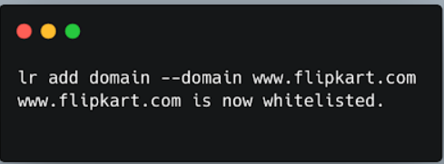
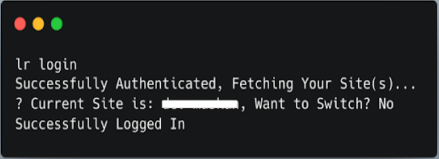
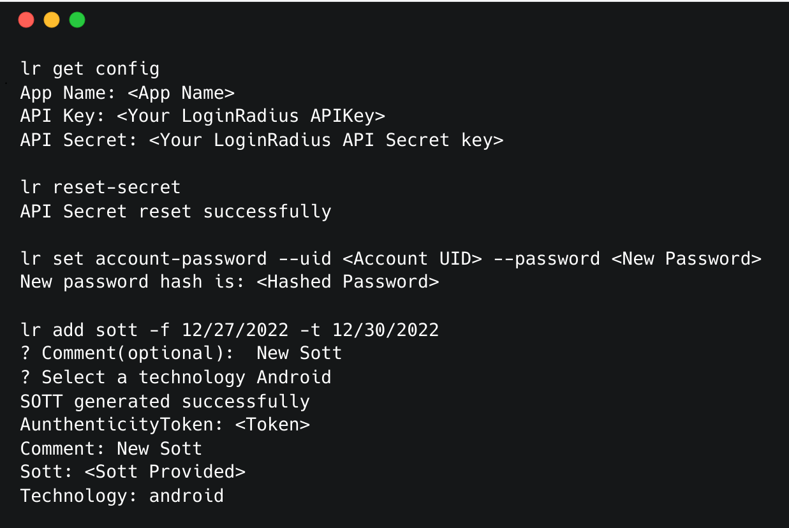
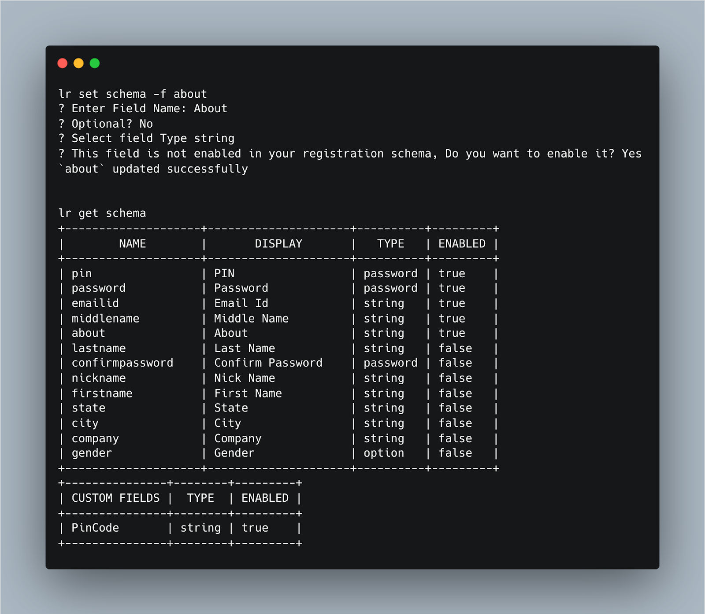
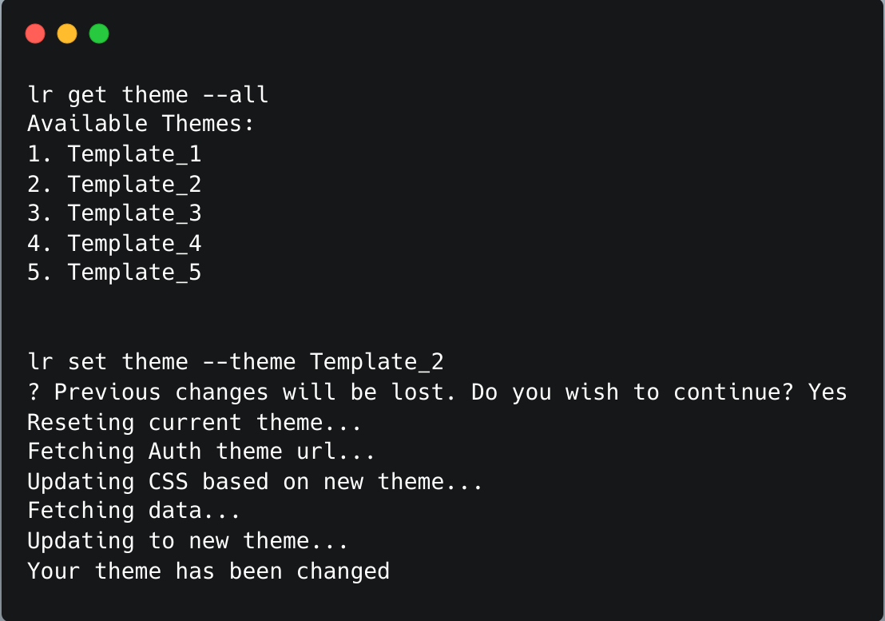

## Introduction 

As a developer, I like to work on the terminal. Many developers are the same way. Instead of scrolling, clicking the mouse, they prefer working with only keywords (through commands or shortcuts). The command-line interface (CLI) is a great tool for them.

So, LoginRadius has launched a CLI for its enterprise dashboard. The CLI makes it easier by using some commands to perform different operations and manage the flow of the LoginRadius Enterprise dashboard.

## The Idea Behind LoginRadius CLI

We always look for ways to eliminate resistance from the process of working with LoginRadius. Therefore, we have taken this step to introduce LoginRadius CLI for a better developer experience.

In the 1970s and 1980s, most users preferred to use command-line interfaces. As time passed, we shifted to graphical user interfaces. GUIs are user-friendly; however, CLIs are faster than GUIs. Here is an example of adding domain via Admin Console v/s CLI :

To add a domain through LoginRadius Admin Console, you need to:  \

1. Navigate it to Web Apps in LoginRadius Admin Console
2. Click on Add 
3. Enter the domain 
4. Click on Save

On the flip side, you can do this by running a single command:

**Here are some more of LoginRadius CLI Enterprise's commands:**

**1. Login/Logout to your LoginRadius Dashboard**

This command (_lr login_) will help you to login to your LoginRadius Enterprise Dashboard. Once logged in, you can perform other operations and configure your LoginRadius Application through CLI.

**2. Manage Application Credentials**

You can get our App Credentials, reset Secret key, update account password and generate SOTT through LoginRadius CLI.

**Set Schema for Your LoginRadius Application**

This command will help you set the schema for your application. We can get all the basic fields via _lr get schema_ we can update the schema via lr set schema. 

**Theme Management (LoginRadius Page)**

You can update the LoginRadius IDX Page(Hosted Page) from the available themes through LoginRadius CLI commands.  

**Learn More LoginRadius CLI Enterprise Commands**

Run  lr – help for available commands. For more details about commands please check out the [documentation](https://opensource.loginradius.com/cli/manual/).

## Try It Out  

The LoginRadius CLI is available for Windows, Linux, and MacOS. [Check out the installation instructions for your Operating System on our README Page](https://github.com/LoginRadius/lr-cli/tree/main#readme).

We hope you will love trying LoginRadius CLI for Enterprise Dashboard. We will add and explore more features in the future. Needless to say, for developers who like working with terminals and prefer to type commands, LoginRadius CLI will be a great experience.

We are eager to know your feedback, test cases and also what we can bring up next in our CLI. If you have any suggestions, please create an issue on our [open source github repository](https://github.com/LoginRadius/lr-cli/issues).

